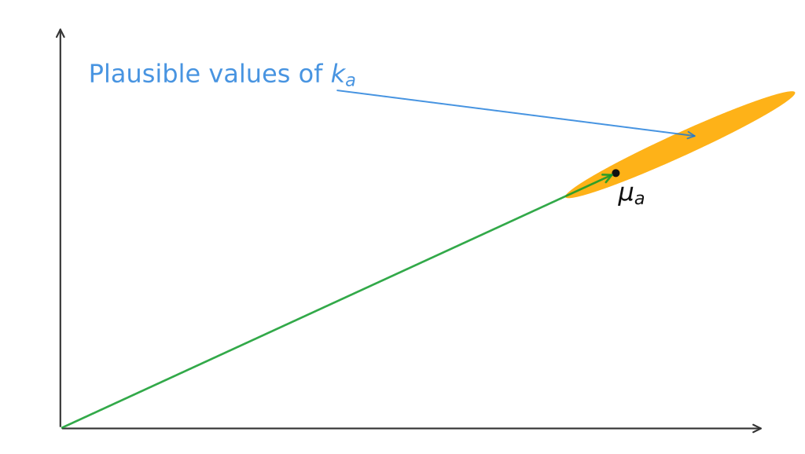

本次作业将探究 Transformer —— 当前前沿大语言模型（LLM）中占主导地位的架构。

本次作业包含三个问题：

- 第一部分中，你将建立对 Transformer 中自注意力机制如何工作的直觉；
- 第二部分中，你将推导位置编码（Positional Encoding）的一些性质；
- 第三部分中，你将从零开始编写一个 Transformer，并在本地训练它。

## 1. 注意力机制探索

多头自注意力（Multi-Head Self-Attention）是 Transformer 的核心建模组件。在本题中，我们将练习使用自注意力的相关公式，并说明为什么多头自注意力相比单头自注意力可能更有优势。

回顾一下，注意力机制可以看作是对以下对象执行的一种运算：

- 一个 query 向量：$q \in \mathbb{R}^d$；
- 一组 key 向量：$\{k_1, \ldots, k_n\}$，其中 $k_i \in \mathbb{R}^d$。
- 一组 value 向量：$\{v_1, \ldots, v_n\}$，其中 $v_i \in \mathbb{R}^d$；

多头自注意力的输出是一个向量 $c \in \mathbb{R}^d$，它是对值向量的加权平均：

$$
\begin{align}
c &= \sum_{i=1}^{n} v_i \alpha_i \\
\alpha_i &= \frac{\exp(k_i^\top q)}{\sum_{j=1}^{n} \exp(k_j^\top q)}
\end{align}
$$

其中，$\alpha = \{\alpha_1, \ldots, \alpha_n\}$ 被称为注意力权重（attention weights）。注意，输出 $c \in \mathbb{R}^d$ 是对各个值向量进行的加权平均，而权重由 $\alpha$ 决定。

### 1.1 注意力中的复制

注意力机制的一个优点是：把某个值向量复制到输出 $c$ 中尤其容易。本题将说明为什么会这样。

::: {.callout-caution}
# Question 1.1.1 (2 pts)

在注意力机制中，分布 $\alpha$ 通常比较分散，也就是说，概率质量会分布在许多不同的 $\alpha_i$ 上。不过情况并非总是如此。请用一句话说明：当类别分布 $\alpha$ 把几乎全部权重都放到某个 $\alpha_j$ 上，即

$$
\alpha_j \gg \sum_{i \ne j} \alpha_i, \quad \forall i, \exists j \in \{1, 2, \ldots, n\}
$$

时，查询向量 $q$ 和键向量 $\{k_1, \ldots, k_n\}$ 必须满足什么条件？
:::

::: {.callout-tip}
# Answer 1.1.1

必须满足 $q$ 和某个 $k_j$ 的点积显著大于和其他 $k_i$ 的点积。
:::

::: {.callout-caution}
# Question 1.1.2 (1 pt)

请描述输出 $c$ 会是什么样子。
:::

::: {.callout-tip}
# Answer 1.1.2

在刚才那个条件下，

$$
\alpha_j \approx 1, \quad \alpha_i \approx 0, \quad \forall i \ne j
$$

而输出是

$$
c = \sum_{i=1}^{n} v_i \alpha_i \approx v_j
$$

也就是说，输出 $c$ 会非常接近值向量 $v_j$。
:::

### 1.2 两个向量的平均

Transformer 模型不一定只关注一个向量 $v_j$，它也可能希望同时整合多个源向量中的信息。

::: {.callout-caution}
# Question 1.2 (2 pts)

考虑这样一种情况：我们希望同时整合两个向量 $v_a$ 和 $v_b$ 的信息，它们对应的键向量分别为 $k_a$ 和 $k_b$。

假设：

1. 所有键向量两两正交，即对于所有 $i \ne j$，都有 $k_i^\top k_j = 0$；
2. 所有键向量的范数都为 1。

请找出查询向量 $q$ 的一个表达式，使得

$$
c \approx \frac{1}{2}(v_a + v_b)
$$

并说明你的答案为什么成立。
:::

::: {.callout-tip}
# Answer 1.2

可以取

$$
q = \lambda(k_a + k_b)
$$

其中，$\lambda$ 是一个很大的正数。

由于所有 $k_i$ 两两正交，且 $\|k_i\| = 1$，所以：

$$
k_a^\top q = \lambda k_a^\top (k_a + k_b) = \lambda
$$

同理，

$$
k_b^\top q = \lambda k_b^\top (k_a + k_b) = \lambda
$$

而对于任意 $i \ne a, b$，我们有：

$$
k_i^\top q = \lambda k_i^\top (k_a + k_b) = 0
$$

于是 softmax 的分数大致是：

$$
\alpha_a = \alpha_b = \frac{e^{\lambda}}{2e^{\lambda} + (n-2)}
$$

其他位置则是：

$$
\alpha_i = \frac{1}{2e^{\lambda} + (n-2)}
$$

当 $\lambda$ 很大时，

$$
\alpha_a \approx \alpha_b \approx \frac{1}{2}, \quad \alpha_i \approx 0, \quad \forall i \ne a, b
$$

因此

$$
c = \sum_{i=1}^{n} v_i \alpha_i \approx \frac{1}{2}(v_a + v_b)
$$
:::

### 1.3 单头注意力的缺点

在上一部分中，我们看到，单头注意力可以同时等量关注两个值向量。同样的思想也很容易推广到任意一个值向量子集。不过，在本题中我们将看到，实际使用这种方法并不理想。

考虑一组键向量 $\{k_1, \ldots, k_n\}$。现在这些键向量是随机采样得到的：

$$
k_i \sim \mathcal{N}(\mu_i, \Sigma_i)
$$

其中，均值 $\mu_i \in \mathbb{R}^d$ 是已知的，但协方差矩阵 $\Sigma_i$ 是未知的。

进一步假设所有均值向量 $\mu_i$ 两两正交，即当 $i \ne j$ 时，

$$
\mu_i^\top \mu_j = 0
$$

并且它们都是单位向量：

$$
\|\mu_i\| = 1
$$

::: {.callout-caution}
# Question 1.3.1 (2 pts)

假设所有协方差矩阵均为

$$
\Sigma_i = \alpha I, \quad \forall i \in \{1, 2, \ldots, n\}
$$

其中，$\alpha$ 趋近于 0。

请用 $\mu_i$ 表示并设计一个查询向量 $q$，使得和之前一样：

$$
c \approx \frac{1}{2}(v_a + v_b)
$$

并简要说明为什么它有效。
:::

::: {.callout-tip}
# Answer 1.3.1

可以取

$$
q = \lambda(k_a + k_b)
$$

其中，$\lambda$ 是一个很大的正数。

因为 $\alpha \to 0$，所以

$$
k_i \sim \mathcal{N}(\mu_i, \alpha I) \approx \mathcal{N}(\mu_i, 0) = \mu_i
$$

意味着 $k_i \approx \mu_i$。

其余部分同上题 1.2 的推导，最终得到：

$$
c \approx \frac{1}{2}(v_a + v_b)
$$
:::

::: {.callout-caution}
# Question 1.3.2 (3 pts)

虽然单头注意力能够抵抗键向量的小幅扰动，但某些较大的扰动可能会带来更严重的问题。在某些情况下，某个键向量 $k_a$ 的范数可能比其他键更大或更小，但它仍然大致沿着与 $\mu_a$ 相同的方向。

例如，考虑第 $a$ 个元素具有如下协方差矩阵：

$$
\Sigma_a = \alpha I + \frac{1}{2}(\mu_a \mu_a^\top)
$$

其中，$\alpha$ 趋近于 0 。这会使 $k_a$ 大致指向与 $\mu_a$ 相同的方向，但其长度会有较大的方差。

{width=50%}

进一步，令所有 $i \ne a$ 的键向量满足：

$$
\Sigma_i = \alpha I
$$

当你多次采样 $\{k_1, \ldots, k_n\}$，并使用你在 Question 1.3.1 中定义的查询向量 $q$ 时，对于不同的采样结果，你预期向量 $c$ 从定性上看会是什么样子？

请思考它与 Question 1.3.1 中的情况有何不同，以及 $c$ 的方差会受到什么影响。
:::

::: {.callout-tip}
# Answer 1.3.2

由于：

$$
\Sigma_a = \alpha I + \frac{1}{2} \mu_a\mu_a^\top
$$

$k_a$ 会主要沿着 $\mu_a$ 的方向波动，并且其长度具有较大的方差；而其他 $k_i$ 仍然因为 $\Sigma_i = \alpha I$ 且 $\alpha \to 0$ 而非常接近对应的 $\mu_i$。

继续使用上一问中的

$$
q = \lambda(\mu_a+\mu_b)
$$

则 $k_b^\top q$ 仍然大约为 $\lambda$，比较稳定；但是 $k_a^\top q$ 会随着 $k_a$ 的长度变化而产生较大的波动。

因此，在不同的 key 采样下，softmax 分配给 $a$ 和 $b$ 的注意力权重可能发生明显变化。当 $k_a$ 的长度较大时，注意力会更多集中在 $v_a$ 上；当 $k_a$ 的长度较小时，则会更多集中在 $v_b$ 上。因此，输出

$$
c = \sum_i\alpha_i v_i
$$

不再稳定地接近

$$
\frac{1}{2}(v_a+v_b)
$$

而会在不同样本之间产生更大的变化，即 $c$ 的方差会比上一问明显增大。
:::

### 1.4 多头注意力的优点

现在我们来看看多头注意力的一些优势。

我们考虑一个简化版的多头注意力。它与前面介绍的单头自注意力基本相同，区别在于：现在定义两个查询向量 $q_1$ 和 $q_2$，从而得到两个向量 $c_1$ 和 $c_2$。每个 $c_i$ 都是使用对应查询向量进行一次单头注意力后得到的输出。

多头注意力最终的输出是二者的平均：

$$
\frac{1}{2}(c_1 + c_2)
$$

与 Question 1.3 一样，考虑一组随机采样的键向量

$$
\{k_1, \ldots, k_n\}, \qquad k_i \sim \mathcal{N}(\mu_i, \Sigma_i)
$$

其中，均值 $\mu_i$ 已知，但协方差 $\Sigma_i$ 未知。

同样假设所有均值向量 $\mu_i$ 两两正交，即当 $i \ne j$ 时：

$$
\mu_i^\top \mu_j = 0
$$

并且均为单位范数：

$$
\|\mu_i\| = 1
$$

::: {.callout-caution}
# Question 1.4.1 (1 pt)

假设所有协方差矩阵均为

$$
\Sigma_i = \alpha I
$$

其中，$\alpha$ 趋近于 0。

请用 $\mu_i$ 表示并设计 $q_1$ 和 $q_2$，使得 $c$ 近似等于

$$
\frac{1}{2}(v_a + v_b)
$$

注意，$q_1$ 和 $q_2$ 应当具有不同的表达式。
:::

::: {.callout-tip}
# Answer 1.4.1

可以取

$$
q_1 = \lambda\mu_a, \qquad q_2 = \lambda\mu_b
$$

其中，$\lambda$ 是一个很大的正数。

由于 $\alpha \to 0$，有：

$$
k_i \approx \mu_i
$$

因此，第一个 attention head 会将几乎全部注意力放在 $v_a$ 上，从而得到

$$
c_1\approx v_a
$$

第二个 attention head 会将几乎全部注意力放在 $v_b$ 上，从而得到

$$
c_2\approx v_b
$$

最终输出为：

$$
c = \frac{1}{2}(c_1+c_2) \approx \frac{1}{2}(v_a + v_b)
$$
:::

::: {.callout-caution}
# Question 1.4.2 (2 pts)

假设

$$
\Sigma_a = \alpha I + \frac{1}{2}(\mu_a\mu_a^\top)
$$

其中，$\alpha$ 趋近于 0，并且对于所有 $i \ne a$，均有：

$$
\Sigma_i = \alpha I
$$

使用你在 Question 1.4.1 中设计的查询向量 $q_1$ 和 $q_2$。对于不同的键向量采样结果，你从定性上预期输出 $c$ 会是什么样子？请从 $c_1$ 和 $c_2$ 的方差角度简要解释。你可以忽略 $k_a^\top q_i < 0$ 的情况。
:::

::: {.callout-tip}
# Answer 1.4.2

仍然使用

$$
q_1 = \lambda\mu_a, \qquad q_2 = \lambda\mu_b
$$

虽然 $k_a$ 在 $\mu_a$ 方向上的长度具有较大的方差，但只要忽略 $k_a^\top q_1<0$ 的情况，第一个 head 仍然会主要关注 $v_a$，因此

$$
c_1\approx v_a
$$

其输出方差较小。

对于第二个 head，由于

$$
\mu_a^\top \mu_b = 0
$$

$k_a$ 沿 $\mu_a$ 方向的长度变化几乎不会影响 $k_a^\top q_2$，因此第二个 head 仍然稳定地关注 $v_b$，得到

$$
c_2\approx v_b
$$

其方差也很小。

因此，对于不同的 key 采样，最终输出

$$
c = \frac{1}{2}(c_1 + c_2)
$$

仍然会稳定地接近

$$
\frac{1}{2}(v_a + v_b)
$$

其方差比单头注意力中的情况小得多。

至于为什么要忽略 $k_a^\top q_i < 0$ 的情况，因为如果 $k_a^\top q_i < 0$，这时 $a$ 的 attention score 反而可能比那些接近 0 的其他 key 还低，于是 softmax 就不会选 $a$ 了，导致

$$
c_1 \not\approx v_a
$$

这样一来，题目就不再只是讨论 key 的长度波动会不会让 multi-head 的输出方差变大，而会混入一个更严重的问题：

> **这个 head 直接选错目标了。**

也就是说，我们假设 $k_a$ 仍然朝大致正确的方向，只讨论它的 magnitude 变化，而不讨论方向翻转导致 attention 完全失效的极端情况。
:::

### 1.5 多头注意力的优势总结

::: {.callout-caution}
# Question 1.5 (1 pt)

基于 Question 1.4，请简要总结：多头注意力是如何克服你在 Question 1.3 中发现的单头注意力缺点的？
:::

::: {.callout-tip}
# Answer 1.5

单头注意力需要用一个查询向量同时维持多个 key 之间的注意力权重平衡，因此当某个 key 的长度发生较大波动时，softmax 权重可能明显偏向其中一个 value，使输出具有较大的方差。

多头注意力则可以让不同的 head 分别关注不同的 value，例如令 $q_1$ 主要关注 $v_a$，令 $q_2$ 主要关注 $v_b$，再对各个 head 的输出进行平均。这样就不需要依赖单个 softmax 在多个 key 之间精确维持平衡，因此对 key 的长度扰动更加稳定，最终输出的方差也更小。
:::

## 2. 位置嵌入探索

**位置嵌入（Position Embedding）**是 Transformer 架构中的重要组成部分，它使模型能够根据 token 在序列中的位置来区分不同 token。在本题中，我们将探讨 Transformer 为什么需要位置嵌入，以及位置嵌入可以如何设计。

回顾一下，Transformer 架构中的关键组件包括自注意力层（self-attention layer）和前馈神经网络层（feed-forward neural network layer）。

给定输入张量 $X \in \mathbb{R}^{T \times d}$，$T$ 为序列长度，$d$ 为隐藏维度，自注意力层执行以下计算：

$$
Q = XW_Q, \qquad K = XW_K, \qquad V = XW_V
$$

$$
H = \operatorname{softmax}\left(\frac{QK^\top}{\sqrt{d}}\right)V
$$

其中，$W_Q, W_K, W_V \in \mathbb{R}^{d \times d}$ 为权重矩阵，且 $H \in \mathbb{R}^{T \times d}$ 为输出。

接下来，前馈层应用如下变换：

$$
Z = \operatorname{ReLU}(HW_1 + \mathbf{1}\cdot b_1)W_2 + \mathbf{1}\cdot b_2
$$

其中，

$$
\begin{align}
W_1, W_2 &\in \mathbb{R}^{d \times d} \\
b_1, b_2 &\in \mathbb{R}^{1 \times d}
\end{align}
$$

分别为权重和偏置；$\mathbf{1} \in \mathbb{R}^{T \times 1}$ 是一个全 1 向量；$Z \in \mathbb{R}^{T \times d}$ 为最终输出。

### 2.1 对输入进行置换

::: {.callout-caution}
# Question 2.1.1 (3 pts)

假设我们对输入序列 $X$ 进行置换，使 token 的顺序被随机打乱。这可以表示为左乘一个置换矩阵 $P \in \mathbb{R}^{T \times T}$：

$$
X_{\text{perm}} = PX
$$

证明：对于置换后的输入 $X_{\text{perm}}$，其输出 $Z_{\text{perm}}$ 满足

$$
Z_{\text{perm}} = PZ
$$

已知对于任意置换矩阵 $P$ 和任意矩阵 $A$，都有：

$$
\operatorname{softmax}(PAP^\top) = P\operatorname{softmax}(A)P^\top
$$

以及

$$
\operatorname{ReLU}(PA) = P\operatorname{ReLU}(A)
$$
:::

::: {.callout-tip}
# Answer 2.1.1

这道题其实就是需要证明，先置换输入，再过 Transformer，等于先过 Transformer，再对输出做同样的置换。也就是 Transformer 的 **置换等变性（permutation equivariance）**。

**Self-Attention 部分**

原始输入对应的 query、key 和 value 为

$$
Q = XW_Q,\qquad K = XW_K,\qquad V = XW_V
$$

置换后的输入为 $X_{\text{perm}} = PX$，因此

$$
Q_{\text{perm}} = X_{\text{perm}}W_Q = PXW_Q = PQ
$$

类似地，

$$
\begin{align}
K_{\text{perm}} = X_{\text{perm}}W_K = PXW_K = PK \\
V_{\text{perm}} = X_{\text{perm}}W_V = PXW_V = PV
\end{align}
$$

因此，置换后的 attention 输出为

$$
H_{\text{perm}} = \operatorname{softmax}
\left( \frac{Q_{\text{perm}}K_{\text{perm}}^\top}{\sqrt d} \right)
V_{\text{perm}}
$$

代入 $Q_{\text{perm}} = PQ$、$K_{\text{perm}} = PK$ 和 $V_{\text{perm}} = PV$：

$$
H_{\text{perm}} = \operatorname{softmax}
\left( \frac{(PQ)(PK)^\top}{\sqrt d} \right) PV
$$

由于

$$
(PK)^\top=K^\top P^\top
$$

所以

$$
H_{\text{perm}} = \operatorname{softmax}
\left( P\frac{QK^\top}{\sqrt d}P^\top \right) PV
$$

利用题目给出的性质

$$
\operatorname{softmax}(PAP^\top) = P\operatorname{softmax}(A)P^\top
$$

得到

$$
H_{\text{perm}} = P\operatorname{softmax}
\left( \frac{QK^\top}{\sqrt d} \right) P^\top PV
$$

又因为置换矩阵满足

$$
P^\top P = I
$$

因此

$$
H_{\text{perm}} = P\operatorname{softmax}
\left(\frac{QK^\top}{\sqrt d} \right)V
$$

而原始 attention 输出为

$$
H = \operatorname{softmax} \left( \frac{QK^\top}{\sqrt d} \right)V
$$

所以

$$
H_{\text{perm}} = PH
$$

**Feed-Forward Network 部分**

原始 FFN 输出为

$$
Z = \operatorname{ReLU}(HW_1 + \mathbf{1}b_1)W_2 + \mathbf{1}b_2
$$

置换后的输出为

$$
Z_{\text{perm}} = \operatorname{ReLU}
(H_{\text{perm}}W_1 + \mathbf{1}b_1)W_2 + \mathbf{1}b_2
$$

由于 $H_{\text{perm}} = PH$，并且置换全 1 向量不会改变它，即

$$
P\mathbf{1} = \mathbf{1}
$$

因此

$$
H_{\text{perm}}W_1 + \mathbf{1}b_1 = PHW_1+P\mathbf{1}b_1 = P(HW_1+\mathbf{1}b_1)
$$

于是

$$
Z_{\text{perm}} = \operatorname{ReLU}
\left(P(HW_1 + \mathbf{1}b_1) \right)W_2 + \mathbf{1}b_2
$$

利用题目给出的性质

$$
\operatorname{ReLU}(PA)=P\operatorname{ReLU}(A)
$$

可得

$$
Z_{\text{perm}} = P\operatorname{ReLU}(HW_1 + \mathbf{1}b_1)W_2 + \mathbf{1}b_2
$$

又因为 $\mathbf{1} = P\mathbf{1}$，所以

$$
Z_{\text{perm}} =
P\left[\operatorname{ReLU}(HW_1 + \mathbf{1}b_1)W_2 + \mathbf{1}b_2 \right]
$$

因此最终有

$$
Z_{\text{perm}} = PZ
$$

这说明，在没有位置编码的情况下，如果输入 token 按某种方式被置换，那么 Transformer 的输出只会按照相同的方式被置换。因此，Transformer 对输入 token 的顺序是**不敏感的**，也就是说它无法区分不同的 token 顺序。
:::

::: {.callout-caution}
# Question 2.1.2 (1 pt)

思考你在 Question 2.1.1 中推导出的结果意味着什么。请解释：为什么 Transformer 模型的这一性质在处理文本时可能会造成问题？
:::

::: {.callout-tip}
# Answer 2.1.2

Transformer 在没有位置编码时具有置换等变性，即输入 token 的顺序发生置换后，输出只会按照相同方式置换。这在处理文本时会造成问题，因为自然语言的语义通常依赖 token 的顺序。对于**词相同但顺序不同，导致含义却不同**的句子，例如 man bites dog 和 dog bites man，模型缺少表示其位置差异的机制，因此难以区分它们不同的语义。
:::

### 2.2 位置嵌入

位置嵌入是用于编码序列中每个 token 所处位置的向量。在将输入送入 Transformer 之前，会先把位置嵌入加到输入 token 上。位置嵌入的其中一种方法是：使用位置以及嵌入维度的固定函数来生成位置嵌入。

例如，如果输入词嵌入为

$$
X \in \mathbb{R}^{T \times d}
$$

则位置嵌入 $\Phi \in \mathbb{R}^{T \times d}$ 可以按如下方式生成：

$$
\begin{align}
\Phi_{(t,2i)} &= \sin\left(t / 10000^{2i/d}\right) \\
\Phi_{(t,2i+1)} &= \cos\left(t / 10000^{2i/d}\right)
\end{align}
$$

其中，$t \in \{0, 1, \ldots, T-1\}$，$i \in \{0, 1, \ldots, d/2-1\}$。

然后，将位置嵌入加到输入词嵌入上：

$$
X_{\text{pos}} = X + \Phi
$$

::: {.callout-caution}
# Question 2.2.1 (1 pt)

你认为位置嵌入能解决你在 Question 2.1 中发现的问题吗？如果能，请解释为什么；如果不能，也请解释原因。
:::

::: {.callout-tip}
# Answer 2.2.1

能。位置嵌入会为不同位置的 token 加入不同的位置信息，因此即使输入包含相同的 token，只要它们的顺序不同，加入位置嵌入后的表示也会不同。这样 Transformer 就能够区分 token 的位置和顺序，从而缓解没有位置编码时由置换等变性带来的问题。
:::

::: {.callout-caution}
# Question 2.2.2 (1 pt)

输入序列中两个不同 token 的位置嵌入是否可能完全相同？如果可以，请给出一个例子；如果不可以，请解释为什么。
:::

::: {.callout-tip}
# Answer 2.2.2

不可以。关键看位置嵌入的前两个维度就够了。

题目定义：

$$
\begin{align}
\Phi_{(t,2i)} &= \sin\left(t / 10000^{2i/d}\right) \\
\Phi_{(t,2i+1)} &= \cos\left(t / 10000^{2i/d}\right)
\end{align}
$$

当 $i = 0$ 时：

$$
\Phi(t,0) = \sin(t), \quad \Phi(t,1) = \cos(t)
$$

假设两个不同位置 $t_1\neq t_2$ 的位置嵌入完全相同，那么至少前两个维度必须相同：

$$
\begin{align}
\sin(t_1) &= \sin(t_2) \\
\cos(t_1) &= \cos(t_2)
\end{align}
$$

这要求

$$
t_1 - t_2 = 2k\pi, \quad k \in \mathbb{Z}
$$

但是题目中的位置 $t_1, t_2$ 都是整数，所以 $t_1 - t_2$ 是整数。而对于 $k \neq 0$，$2\pi k$ 不可能是整数。因此只能有 $k = 0$，从而 $t_1 = t_2$，这与假设矛盾。

所以不同位置不可能拥有完全相同的位置嵌入：

$$
\Phi(t_1) \neq \Phi(t_2), \quad \forall t_1 \neq t_2
$$
:::

## 3. 从零开始编写 Transformer

在本题中，你将补全代码，实现一个仅包含解码器（decoder-only）的 GPT-2 风格 Transformer，以及一个简单的训练循环。

对于 3.1，我们为每个小题都提供了可以直接在你的笔记本电脑上本地运行的单元测试。如果你通过某个小题对应的单元测试，就可以获得该小题的全部分数。

在完成这部分作业时，下面这些建议可能会有所帮助：

- 添加 `assert` 语句，检查张量形状是否与你预期的一致；
- 可以考虑使用 `jaxtyping` 包，通过类型标注来标记张量的形状；
- 可以考虑使用 `einops` 包来操作张量（其中 `einops.rearrange` 尤其有用）。

这些做法不仅能帮助你减少代码中的 bug，也能显著提升代码的可读性。

### 3.1 实现一个 Transformer

在本题这一部分中，我们将在 `model.py` 文件中实现一个 Transformer。该文件包含多个需要你实现的类。最终，你将得到一个完整的 Transformer 类实现，其中 `forward` 和 `generate` 方法都可以正常工作。

在 3.2 中，我们将开始训练你实现的 Transformer。

#### **3.1.1 实现 GPT2MLP (1 pt)**

实现 `GPT2MLP`。检查你是否通过对应的测试。

```{.python filename="GPT2MLP.py"}
class GPT2MLP(nn.Module):
    """Creates a feedforward neural network (MLP) for the GPT-2 model."""

    def __init__(self, config: GPT2Config):
        super().__init__()
        self.fc1 = dnn.Linear(config.d_model, 4 * config.d_model)
        self.fc2 = dnn.Linear(4 * config.d_model, config.d_model)
        self.gelu = dnn.GELU()

    def forward(self, x: Tensor) -> Tensor:
        x = self.fc1(x)
        x = self.gelu(x)
        x = self.fc2(x)
        return x
```

#### **3.1.2 实现 GPT2SelfAttention (6 pts)**

实现 `GPT2SelfAttention`。检查你是否通过对应的测试。

```{.python filename="GPT2SelfAttention.py"}
class GPT2SelfAttention(nn.Module):
    """Creates a self-attention layer for the GPT-2 model."""

    def __init__(self, config: GPT2Config):
        super().__init__()
        self.attn = dnn.MultiheadAttention(
            config.d_model,
            config.n_heads,
            fast=config.fast,
        )

    def forward(self, x: Tensor) -> Tensor:
        attn_output, _ = self.attn(x, x, x, is_causal=True)
        return attn_output
```

#### **3.1.3 实现 GPT2Block (2 pts)**

实现 `GPT2Block`。检查你是否通过对应的测试。

```{.python filename="GPT2Block.py"}
class GPT2Block(nn.Module):
    """Creates a single block of the GPT-2 model, consisting of self-attention
    and feedforward layers.
    """

    def __init__(self, config: GPT2Config):
        super().__init__()
        self.norm1 = dnn.LayerNorm(config.d_model)
        self.attn = GPT2SelfAttention(config)
        self.norm2 = dnn.LayerNorm(config.d_model)
        self.mlp = GPT2MLP(config)

    def forward(self, x: Tensor) -> Tensor:
        x = x + self.attn(self.norm1(x))
        x = x + self.mlp(self.norm2(x))
        return x
```

#### **3.1.4 实现 GPT2Model.forward (6 pts)**

实现 `GPT2Model.forward`。检查你是否通过对应的测试。

```{.python filename="GPT2Model.forward.py"}
class GPT2Model(nn.Module):
    """Creates the GPT-2 model for language modeling."""

    def __init__(self, config: GPT2Config):
        super().__init__()
        self.config = config

        self.tok_embed = dnn.Embedding(config.vocab_size, config.d_model)
        self.pos_embed = dnn.Embedding(config.context_length, config.d_model)

        self.backbone = nn.ModuleList(
            [GPT2Block(config) for _ in range(config.n_layers)]
        )

        self.final_norm = dnn.LayerNorm(config.d_model)
        self.lm_head = dnn.Linear(config.d_model, config.vocab_size, bias=False)

        self.reset_parameters()

        if config.weight_tying:
            self.lm_head.weight = self.tok_embed.weight
            assert self.lm_head.weight is self.tok_embed.weight

    def reset_parameters(self):
        """Reset the parameters of the model using the initialization scheme from
        the original GPT-2 paper.
        """
        for module in self.modules():
            if isinstance(module, dnn.Linear):
                nn.init.normal_(module.weight, mean=0.0, std=0.02)
                if module.bias is not None:
                    nn.init.zeros_(module.bias)
            elif isinstance(module, dnn.Embedding):
                nn.init.normal_(module.weight, mean=0.0, std=0.02)
            elif isinstance(module, dnn.LayerNorm):
                if module.weight is not None:
                    nn.init.ones_(module.weight)
                if module.bias is not None:
                    nn.init.zeros_(module.bias)

        for name, param in self.named_parameters():
            if name.endswith(('mlp.fc2.weight', 'attn.out_proj.weight')):
                nn.init.normal_(
                    param, mean=0.0, std=0.02 / math.sqrt(2 * self.config.n_layers)
                )

    def forward(self, x: Tensor) -> Tensor:
        if x.size(1) > self.config.context_length:
            raise AssertionError(
                f'Input sequence length {x.size(1)} exceeds context length '
                f'{self.config.context_length}.'
            )

        T = x.size(1)
        pos = torch.arange(T, device=x.device)
        x = self.tok_embed(x) + self.pos_embed(pos)

        for block in self.backbone:
            x = block(x)

        x = self.final_norm(x)
        logits = self.lm_head(x)
        return logits
```

#### **3.1.5 实现 GPT2Model.generate (5 pts)**

实现 `GPT2Model.generate`。检查你是否通过对应的测试。注意：该函数中应实现**贪心解码（greedy decoding）**。

```{.python filename="GPT2Model.generate.py"}
@torch.inference_mode()
def generate(
    self,
    x: Tensor,
    max_new_token: int,
    greedy: bool = False,
) -> Tensor:
    """Generate new tokens given a prompt `x`.

    Args:
        x (Tensor): Prompt token IDs with shape `(batch_size, sequence_length)`.
        max_new_token (int): Number of tokens to generate.
        greedy (bool, default: False): Whether to select the most likely token
            instead of sampling from the predicted distribution.

    Returns:
        Tensor: The prompt followed by the generated token IDs.
    """
    for _ in range(max_new_token):
        logits = self(x)
        logits = logits[:, -1, :]

        if greedy:
            next_token = logits.argmax(dim=-1, keepdim=True)
        else:
            probs = dF.softmax(logits, dim=-1)
            next_token = probs.multinomial(num_samples=1)

        x = torch.concat([x, next_token], dim=1)

    return x
```

### 3.2 训练一个 Transformer

完成 3.1 部分后，你现在已经拥有一个可以正常工作的 Transformer 模型。

如果查看 `GPT2Model` 源代码，你会看到，当我们在创建 `GPT2Model` 类的实例时，我们会根据 `reset_parameters` 方法，使用随机权重初始化模型。

在本题这一部分中，你将实现一个训练循环，并开始在本地训练一个小型模型。

#### **3.2.1 实现 `GPT2Model.loss` (7 pts)**

首先，实现 `GPT2Model.loss`。这个函数会把一批 token 映射为一个标量损失值。我们会在 `train.py` 中使用该函数计算一个 batch 上的 loss。

检查你是否通过对应的测试。

```{.python filename="GPT2Model.loss.py"}
def loss(self, input_ids: Tensor, targets: Tensor) -> Tensor:
    """Compute the cross-entropy loss for language modeling."""
    logits = self(input_ids)
    logits = logits.reshape(-1, logits.size(-1))
    loss = dF.cross_entropy_loss(logits, targets.reshape(-1))
    return loss
```

#### **3.2.2 运行 Training Loop (3 pts)**

运行：

```bash
python -m src.train.py
```

这会使用你的 `GPT2Model.loss`，在 100 个 batch 的数据上训练模型。注意，训练使用 `wandb` 记录训练过程中的 loss 和梯度范数，你可能需要首先登录你的 `wandb` 账户。

如果一切实现正确，你应该能看到一条逐渐下降的 loss 曲线。

### 3.3 加快模型学习过程

在这个可选的加分题中，你的目标是加快模型的学习过程。

我们会把梯度更新步数固定为 100 步，不过你可以修改 `train.py` 或 `model.py` 中的其他任何内容，以加快训练。如果在 100 步训练结束后，你修改后的 loss 低于你在 3.2.2 中报告的基线，我们就认为这个修改取得了成功。

每一种能够带来加速效果的不同修改都会获得 **3 分**。因此，如果想拿满分，你需要对训练文件做出 3 种不同类型的修改，并且每种修改都需要带来加速效果。这些修改应当能够逐步叠加。

例如：

- 你可以先修改学习率，使 loss 降得更低；
- 然后保留这个更好的学习率，再加入第二项修改（例如改变优化器或模型架构），使 loss 进一步降低。

注意：把学习率分别改成三个不同的值，仍然只算作**一种思路**。我们希望看到的是三种不同类型的思路。
