[](https://colab.research.google.com/github/jshn9515/dnnl-notebooks/blob/main/en/ch11-gpt2-from-scratch/ch11.2-minigpt.ipynb){fig-align="left"}

In the previous section, we started from next-token prediction and clarified the training objective of a language model: given the previous tokens, predict the next token.

From the perspective of the original Transformer, GPT can be understood as a **decoder-only** architecture. It no longer uses an encoder or the cross-attention in the decoder that reads encoder outputs. It keeps only:

- Causal self-attention;
- MLP;
- LayerNorm;
- Residual connection.

These components make up a GPT block. Adding token embedding, positional embedding, and an LM head to multiple GPT blocks gives us a complete GPT language model.

This section will not re-derive self-attention, Pre-LN, or residual connections; they were introduced in detail in Chapter 8. The real question here is:

> **How do we connect the Transformer components learned in Chapter 8 to obtain a GPT that can receive token ids, output vocabulary logits, and compute the next-token prediction loss?**

In this section, we will first implement a scaled-down version of GPT-2, MiniGPT [@nanoGPT]. The overall data flow of MiniGPT is as follows:

{height=500px}

```{python}
from typing import cast

import dnnlpy
import dnnlpy.nn as dnn
import dnnlpy.nn.functional as dF
import torch
import torch.nn as nn
from torch import Tensor

print('PyTorch version:', torch.__version__)
```

## 11.2.1 From the Transformer Decoder to MiniGPT

The original Transformer decoder block mainly contains three sublayers:

- Masked self-attention;
- Cross-attention;
- Feed-forward network.

Cross-attention is used to read the encoder's output memory. GPT has no encoder, so there is no second sequence to read. After removing cross-attention, the block becomes:

- Causal self-attention;
- MLP.

Modern GPT-like models generally use a Pre-LN structure:

$$
\begin{align}
H &= X + \operatorname{CausalSelfAttention}(\operatorname{LayerNorm}(X)) \\
Y &= H + \operatorname{MLP}(\operatorname{LayerNorm}(H))
\end{align}
$$

In code, this is:

```python
x = x + self.attn(self.norm1(x))
x = x + self.mlp(self.norm2(x))
```

This structure was already covered in Chapter 8. What needs special emphasis here is **causal**: position $t$ can read only positions $1,2,\dots,t$ and cannot read future tokens to its right.

Therefore, a MiniGPT block receives and outputs hidden states with the same shape:

$$
(B,T,D) \rightarrow (B,T,D)
$$

However, the output at position $t$ has already incorporated the left-side context that it can see:

$$
h_t = f(x_1,x_2,\dots,x_t)
$$

## 11.2.2 Causal Self-Attention: Parallel During Training, but Unable to See the Future

When training a language model, we usually send the entire sequence into the model at once rather than computing one token at a time. For example, given the input:

```text
Deep learning is fun
```

The model completes all of the following predictions at the same time:

```text
Deep              -> learning
Deep learning     -> is
Deep learning is  -> fun
```

Although these positions are computed in parallel, the context visible to each position is different:

```text
position 0 -> 只能看 position 0
position 1 -> 可以看 position 0, 1
position 2 -> 可以看 position 0, 1, 2
position 3 -> 可以看 position 0, 1, 2, 3
```

This is the role of the causal mask.

PyTorch's SDPA can use a lower-triangular causal mask directly through `is_causal=True`. Here, we directly use the `MultiheadAttention` implemented in Chapter 8 and pass `is_causal=True` during the forward pass.

```{python}
class MiniGPTCausalSelfAttention(nn.Module):
    """Causal self-attention module for MiniGPT block."""

    def __init__(
        self,
        embed_dim: int = 128,
        num_heads: int = 4,
        bias: bool = True,
        dropout: float = 0.0,
    ):
        super().__init__()
        self.attn = dnn.MultiheadAttention(
            embed_dim, num_heads, bias=bias, dropout=dropout
        )

    def forward(self, x: Tensor) -> Tensor:
        attn_output, _ = self.attn(x, x, x, is_causal=True, need_weights=False)
        return attn_output
```

Test the input and output shapes:

```{python}
B, T, D = 2, 6, 32
x = torch.randn(B, T, D)

attn = MiniGPTCausalSelfAttention(embed_dim=D, num_heads=4)
y = attn(x)

print('Input shape:', x.shape)
print('Output shape:', y.shape)
```

As we can see, causal self-attention does not change the tensor shape:

$$
(B,T,D) \rightarrow (B,T,D)
$$

What it changes is the information contained in the hidden state at each position.

## 11.2.3 Implementing the MiniGPT Block

Once we have causal self-attention, we can construct a MiniGPT block.

First, let us implement the MLP. In a MiniGPT block, the MLP usually consists of two linear layers with an activation function between them. The hidden dimension is generally expanded to several times its original size. A common form is:

$$
D \rightarrow 4D \rightarrow D
$$

That is, we first project each token representation into a higher-dimensional space and then project it back to the original hidden size.

```{python}
class MiniGPTMLP(nn.Module):
    """MLP module for MiniGPT block."""

    def __init__(
        self,
        embed_dim: int = 128,
        hidden_dim: int = 512,
        bias: bool = True,
        dropout: float = 0.0,
    ):
        super().__init__()
        self.net = nn.Sequential(
            dnn.Linear(embed_dim, hidden_dim, bias=bias),
            dnn.GELU(),
            dnn.Linear(hidden_dim, embed_dim, bias=bias),
            dnn.Dropout(dropout),
        )

    def forward(self, x: Tensor) -> Tensor:
        return self.net(x)
```

Next, implement the MiniGPT block:

```{python}
class MiniGPTBlock(nn.Module):
    """A single block of MiniGPT, consisting of causal self-attention and MLP."""

    def __init__(
        self,
        embed_dim: int = 128,
        num_heads: int = 4,
        hidden_dim: int = 512,
        bias: bool = True,
        dropout: float = 0.0,
    ):
        super().__init__()
        self.norm1 = dnn.LayerNorm(embed_dim, bias=bias)
        self.attn = MiniGPTCausalSelfAttention(
            embed_dim, num_heads, bias=bias, dropout=dropout
        )
        self.norm2 = dnn.LayerNorm(embed_dim, bias=bias)
        self.mlp = MiniGPTMLP(embed_dim, hidden_dim, bias=bias, dropout=dropout)

    def forward(self, x: Tensor) -> Tensor:
        x = x + self.attn(self.norm1(x))
        x = x + self.mlp(self.norm2(x))
        return x
```

Test the input and output shapes:

```{python}
block = MiniGPTBlock(embed_dim=D, num_heads=4)
y = block(x)

print('Input shape:', x.shape)
print('Output shape:', y.shape)
```

Because a MiniGPT block always maintains `(B, T, D)`, we can stack multiple MiniGPT blocks:

```{python}
num_blocks = 3
minigpt_blocks = nn.Sequential(
    *[MiniGPTBlock(embed_dim=D, num_heads=4) for _ in range(num_blocks)]
)

y = minigpt_blocks(x)
print(f'After {num_blocks} GPT blocks:', y.shape)
```

However, the MiniGPT block itself is not yet a language model. It receives hidden states and still outputs hidden states. A complete language model must also perform:

$$
(B,T) \rightarrow (B,T,V)
$$

That is, it must convert token ids into prediction logits over the entire vocabulary at every position.

## 11.2.4 From Token IDs to Hidden States

What a language model actually receives is token ids:

$$
\text{input\_ids} \in \mathbb{N}^{B \times T}
$$

For example:

```text
[[10, 25, 31,  7],
 [42, 18,  9, 13]]
```

These integers are only indices in the vocabulary; the numerical differences between their ids have no continuous meaning. The model first uses token embedding lookup to turn each token id into a $D$-dimensional vector:

$$
E_{\text{token}} \in \mathbb{R}^{V \times D}
$$

Thus:

$$
(B,T) \rightarrow (B,T,D)
$$

```{python}
vocab_size = 100
embed_dim = 32
block_size = 8

input_ids = torch.randint(vocab_size, (2, 5))
token_embed = nn.Embedding(vocab_size, embed_dim)
x_tok = token_embed(input_ids)

print('input_ids.shape:', input_ids.shape)
print('x_tok.shape:', x_tok.shape)
```

Self-attention itself contains no ordering information, so we also need positional embedding:

$$
E_{\text{pos}} \in \mathbb{R}^{T_{\max} \times D}
$$

For an input of length $T$, take the first $T$ position vectors and add them to the token embeddings:

$$
X = E_{\text{token}}(\text{input\_ids}) + E_{\text{pos}}(0,1,\dots,T-1)
$$

```{python}
pos_embed = nn.Embedding(block_size, embed_dim)

B, T = input_ids.size()
pos = torch.arange(T)
x_pos = pos_embed(pos)
x = x_tok + x_pos

print('Positions:', pos)
print('x_tok.shape:', x_tok.shape)
print('x_pos.shape:', x_pos.shape)
print('x.shape:', x.shape)
```

Here, the shape of `x_tok` is `(B, T, D)`, and the shape of `x_pos` is `(T, D)`. During addition, the position vectors are automatically broadcast across the batch dimension.

The positional encoding used here is the easiest to understand: learned absolute positional embedding. Other positional encoding methods were introduced in Chapter 8; we will see this design again when reproducing GPT-2 later.

## 11.2.5 From Hidden States to Vocabulary Logits

Multiple MiniGPT blocks output:

$$
H \in \mathbb{R}^{B \times T \times D}
$$

But a language model must predict the next token at every position, so it must also map the hidden size to the vocabulary size:

$$
\operatorname{LMHead}: \mathbb{R}^{D} \rightarrow \mathbb{R}^{V}
$$

The final result is:

$$
\text{logits} \in \mathbb{R}^{B \times T \times V}
$$

```{python}
final_norm = nn.LayerNorm(embed_dim)
lm_head = dnn.Linear(embed_dim, vocab_size)

h = final_norm(x)
logits = lm_head(h)

print('Hidden states shape:', h.shape)
print('Logits shape:', logits.shape)
```

Here, `logits[b, t]` is a vector of length `vocab_size` representing the prediction score assigned to the next token by sample `b` at position `t`:

$$
\text{logits}_{b,t,:} \quad \longleftrightarrow \quad p(x_{t+1}\mid x_{\le t})
$$

Strictly speaking, these logits are not yet probabilities. During training, we do not need to apply softmax manually; we pass the logits directly to cross entropy. During generation, we use the logits for greedy decoding or sampling.

## 11.2.6 Combining All Components into MiniGPT

Now assemble the complete data flow:

```text
input_ids: (B, T)
      ↓ Token Embedding + Positional Embedding
hidden states: (B, T, D)
      ↓ MiniGPT blocks
contextual hidden states: (B, T, D)
      ↓ final LayerNorm + LM head
logits: (B, T, V)
```

```{python}
class MiniGPT(nn.Module):
    """A mini GPT-2 style language model."""

    def __init__(
        self,
        vocab_size: int,
        block_size: int,  # or context window
        embed_dim: int = 128,
        num_layers: int = 4,
        num_heads: int = 4,
        hidden_dim: int = 512,
        bias: bool = True,
        dropout: float = 0.0,
        weight_tying: bool = True,
    ):
        super().__init__()
        self.vocab_size = vocab_size
        self.block_size = block_size
        self.weight_tying = weight_tying

        self.token_embed = dnn.Embedding(vocab_size, embed_dim)
        self.pos_embed = dnn.Embedding(block_size, embed_dim)
        self.embed_dropout = dnn.Dropout(dropout)

        self.blocks = nn.Sequential(
            *[
                MiniGPTBlock(
                    embed_dim=embed_dim,
                    num_heads=num_heads,
                    hidden_dim=hidden_dim,
                    bias=bias,
                    dropout=dropout,
                )
                for _ in range(num_layers)
            ]
        )

        self.final_norm = dnn.LayerNorm(embed_dim, bias=bias)
        self.lm_head = dnn.Linear(embed_dim, vocab_size, bias=bias)

        if weight_tying:
            self.lm_head.weight = cast(nn.Parameter, self.token_embed.weight)
            assert self.lm_head.weight is self.token_embed.weight

        self.reset_parameters()

    def reset_parameters(self):
        """Initialize the model parameters."""
        for module in self.modules():
            if isinstance(module, dnn.Embedding):
                nn.init.normal_(module.weight, mean=0.0, std=0.02)

            elif isinstance(module, dnn.Linear):
                nn.init.normal_(module.weight, mean=0.0, std=0.02)
                if module.bias is not None:
                    nn.init.zeros_(module.bias)

            elif isinstance(module, dnn.LayerNorm):
                nn.init.ones_(module.weight)
                if module.bias is not None:
                    nn.init.zeros_(module.bias)

    def forward(self, input_ids: Tensor) -> Tensor:
        """Compute the logits for a batch of input sequences."""
        if input_ids.ndim != 2:
            raise AssertionError('`input_ids` must have shape (B, T).')

        T = input_ids.size(1)
        if T > self.block_size:
            raise AssertionError(
                f'Sequence length {T} exceeds block_size {self.block_size}.'
            )

        pos = torch.arange(T, device=input_ids.device)
        x_tok = self.token_embed(input_ids)
        x_pos = self.pos_embed(pos)
        x = self.embed_dropout(x_tok + x_pos)

        x = self.blocks(x)
        x = self.final_norm(x)
        logits = self.lm_head(x)
        return logits

    def loss(self, input_ids: Tensor, targets: Tensor | None = None) -> Tensor:
        """Compute the cross-entropy loss for a batch of input sequences."""
        if targets is not None and targets.ndim != 2:
            raise AssertionError('`targets` must have shape (B, T).')

        logits = self(input_ids)

        if targets is None:
            logits = logits[:, :-1, :]
            targets = input_ids[:, 1:]

        return dF.cross_entropy_loss(
            logits.reshape(-1, self.vocab_size),
            targets.reshape(-1),
        )
```

Although this model is small, it already contains the core structure of GPT:

- Token embedding;
- Positional embedding;
- Multi-layer causal GPT blocks;
- Final LayerNorm;
- LM head;
- Next-token prediction loss.

Let us test it by constructing a small model:

```{python}
model = MiniGPT(
    vocab_size=100,
    block_size=8,
    embed_dim=32,
    weight_tying=False,
)
```

As discussed in the previous section, the input and supervision signal for next-token prediction come from the same token sequence, shifted by one position.

For example:

```text
tokens: [10, 25, 31, 7, 42, 18]
input:  [10, 25, 31, 7, 42]
label:  [25, 31, 7, 42, 18]
```

Apply the same split to every sequence in the batch:

```{python}
token_ids = torch.tensor(
    [
        [10, 25, 31, 7, 42, 18],
        [3, 14, 15, 92, 65, 35],
    ]
)

input_ids = token_ids[:, :-1]
labels = token_ids[:, 1:]

print('Input_ids:', input_ids, sep='\n')
print()
print('Labels:', labels, sep='\n')
```

Send them into the model:

```{python}
logits = model(input_ids)
loss = model.loss(input_ids, labels)

print('input_ids.shape:', input_ids.shape)
print('labels.shape:', labels.shape)
print('logits.shape:', logits.shape)
print('loss:', loss.item())
```

Here:

```text
input_ids: (B, T)
labels:    (B, T)
logits:    (B, T, V)
```

For every position of every sample in the batch, the model outputs a prediction vector of length $V$. For example, `logits[0, 2]` represents the prediction for the next token after the model has seen the prefix `input_ids[0, :3]` in sample 0.

```{python}
b = 0
t = 2

print('Prefix token ids:', input_ids[b, : t + 1].tolist())
print('Target token id:', labels[b, t].item())
print('Logits vector shape:', logits[b, t].shape)
```

## 11.2.7 Why All Positions Are Computed in Parallel During Training

The causal mask ensures that each position can see only the context to its left. Therefore, an input of length $T$ can produce $T$ training examples simultaneously:

$$
\begin{align}
x_1 &\rightarrow x_2, \\
x_1,x_2 &\rightarrow x_3, \\
&\vdots \\
x_1,\dots,x_T &\rightarrow x_{T+1}
\end{align}
$$

The model outputs:

$$
\text{logits} \in \mathbb{R}^{B \times T \times V}
$$

The shape of the labels is:

$$
\text{labels} \in \mathbb{N}^{B \times T}
$$

To pass them to `F.cross_entropy`, the code flattens the first two dimensions:

$$
(B,T,V) \rightarrow (BT,V)
$$

The labels are flattened at the same time:

$$
(B,T) \rightarrow (BT)
$$

Thus, the loss can be understood as the average next-token prediction loss over all positions in the batch:

$$
\mathcal{L} = -\frac{1}{BT}
\sum_{b=1}^{B} \sum_{t=1}^{T} \log p_\theta(x_{b,t+1}\mid x_{b,\le t})
$$

This is exactly where causal language modeling becomes efficient:

> **One forward pass trains not only the final position, but all positions in the sequence in parallel.**

## 11.2.8 Why Only the Last Position Is Used During Generation

During training, we need logits for every position because each position provides a supervision signal. Generation is different. Given an existing prefix, we only need to predict one new token after it, so we take the logits from the last position:

```{python}
prefix = torch.tensor([[10, 25, 31]])
logits = model(prefix)

next_token_logits = logits[:, -1, :]
next_token = next_token_logits.argmax(dim=-1).item()

print('Prefix:', prefix)
print('All logits shape:', logits.shape)
print('Next token logits shape:', next_token_logits.shape)
print('Next token:', next_token)
```

At this point, we have completed the full data flow from token ids to logits:

{height=500px}

When we discuss generation later, we will add temperature, top-k, and top-p sampling on this basis.

## 11.2.9 Where Are MiniGPT's Parameters?

We can simply count the model parameters:

```{python}
params = dnnlpy.count_params(model)
print(f'Total parameters: {params:,}.')
```

View the parameters by top-level module:

```{python}
for name, module in model.named_children():
    print(f'{name}: {dnnlpy.count_params(module):,}')
```

The parameters of MiniGPT mainly come from:

1. Token embedding;
2. Positional embedding;
3. QKV projection and output projection in attention;
4. The two linear layers in the MLP;
5. LM head.

For language models with a large vocabulary, token embedding and the LM head may both consume a large number of parameters. When we discuss embedding, the LM head, and weight tying separately later, we will further analyze why the input embedding and output projection can share weights.

## 11.2.10 Summary

In this section, we combined the causal GPT block and the complete MiniGPT into one continuous data flow.

The MiniGPT block performs:

$$
(B,T,D) \rightarrow (B,T,D)
$$

The complete MiniGPT performs:

$$
(B,T) \rightarrow (B,T,V)
$$

The causal mask ensures that position $t$ depends only on the current position and tokens to its left, so the model can safely train all positions in parallel in a single forward pass. During generation, since we only need to predict the next token, we take the logits from the last position each time.

At this point, we have obtained a structurally complete small decoder-only language model. It can already:

- Receive token ids;
- Construct token and positional representations;
- Model left-side context through multiple GPT blocks;
- Output vocabulary logits for every position;
- Compute the next-token prediction loss;
- Provide the logits at the last position for autoregressive generation.

However, the token ids here are still artificially constructed integers. In the next section, we will begin discussing tokenizers: how real text is split into tokens, and how character-level tokenizers, BPE, and vocabularies are related.
