[](https://colab.research.google.com/github/jshn9515/dnnl-notebooks/blob/main/en/ch11-gpt2-from-scratch/ch11.3-tokenizer.ipynb){fig-align="left"}

In the previous sections, we built the main body of MiniGPT:

{height=450px}

But an important question is hidden here:

> **Where do token ids come from?**

A neural network cannot read strings directly. For example:

```text
Deep learning is fun.
```

Before being sent into MiniGPT, the text must first become a sequence of integers:

```text
[12, 45, 9, 102, 7, ...]
```

The component that converts between text and integer sequences is a **tokenizer**.

Language models appear to predict text, but during training they actually predict:

$$
p(x_{t+1} \mid x_{\le t})
$$

where each $x_t$ is a token id rather than the original character itself.

Therefore, the tokenizer determines a fundamental question:

> **What units does the model actually split text into and predict?**

In this section, rather than immediately expanding MiniGPT further, we will first clarify tokenization. Starting here, the model will no longer face manually written toy token ids, but token ids encoded from real text.

```{python}
import itertools as it
from collections import Counter
from pprint import pprint
from typing import Self, override

import dnnlpy.models.gpt as gpt
import dnnlpy.tokenizers as dltk
import torch
from torch import Tensor

type Corpus = dict[tuple[str, ...], int]
type Symbols = tuple[str, ...]
type Pair = tuple[str, str]

print('PyTorch version:', torch.__version__)
```

## 11.3.1 What Does a Tokenizer Do?

A tokenizer must perform at least two operations:

1. **Encode**: convert a string into token ids;
2. **Decode**: convert token ids back into a string.

Written as functions:

$$
\begin{align}
\operatorname{encode}(\text{text}) &= [x_1, x_2, \dots, x_T] \\
\operatorname{decode}([x_1, x_2, \dots, x_T]) &= \text{text}
\end{align}
$$

For a language model, the result of `encode` is the actual input that enters the model:

```text
raw text -> tokenizer.encode -> token ids -> MiniGPT
```

What the model generates is also not a string, but a sequence of new token ids:

```text
MiniGPT -> generated token ids -> tokenizer.decode -> text
```

Thus, the tokenizer sits at the boundary between the world of text and the world of the model.

Let us begin with the simplest tokenizer: a character-level tokenizer.

## 11.3.2 Character-level Tokenizer: The Easiest Version to Understand

The idea behind a character-level tokenizer is very direct:

> **Treat every character as a token.**

For example:

```text
"hello" -> ['h', 'e', 'l', 'l', 'o']
```

As long as we assign an id to every character, we can convert a string into an integer sequence.

```{python}
class CharacterTokenizer(dltk.TraditionalTokenizer):
    """A simple character-level tokenizer."""

    def __init__(
        self,
        vocab: dict[str, int] | None = None,
        unk_token: str = '<unk>',
    ):
        super().__init__(vocab, unk_token)

    @override
    def train(self, text: str | list[str], unk_token: str = '<unk>') -> Self:
        if isinstance(text, str):
            text = [text]

        vocab_tokens = {ch for line in text for ch in line}
        vocab_tokens = [unk_token] + sorted(vocab_tokens - {unk_token})
        vocab = {token: idx for idx, token in enumerate(vocab_tokens)}

        self.vocab = vocab
        self.unk_token = unk_token
        self.special_tokens = [unk_token]

        return self

    @override
    def encode(self, text: str) -> list[int]:
        return [self.token_to_id(ch) for ch in text]

    @override
    def decode(self, ids: list[int], skip_special_tokens: bool = True) -> str:
        if skip_special_tokens:
            special_tokens = set(self.special_tokens)
        else:
            special_tokens = set()

        tokens = []
        for i in ids:
            token = self.id_to_token(i)
            if token not in special_tokens:
                tokens.append(token)

        return ''.join(tokens)
```

Let us test it:

```{python}
text = 'hello world'
tokenizer = CharacterTokenizer()
tokenizer.train(text)

ids = tokenizer.encode('hello')
recovered = tokenizer.decode(ids)

print('Vocab:', tokenizer.vocab)
print('Ids:', ids)
print('Decoded:', recovered)
print('Vocab size:', tokenizer.vocab_size)
```

Character-level tokenizers have one major advantage: simplicity. They do not require complex algorithms and rarely encounter unknown words. As long as a character appeared in the training corpus, it can be encoded later. However, they also have an obvious disadvantage: sequences become longer.

For example, if the word `learning` is split into characters, it becomes 8 tokens:

```text
l e a r n i n g
```

The computational cost of a language model is closely related to context length. The longer the sequence, the more expensive both training and inference become. This is why modern large language models generally do not use only character-level tokenizers.

## 11.3.3 Word-level Tokenizer: Natural-looking, but with More Problems

Another intuitive approach is to treat every word as a token:

```text
"deep learning is fun" -> ["deep", "learning", "is", "fun"]
```

This makes the sequence shorter, but it also introduces two problems.

First, the vocabulary becomes very large. Natural language contains many word forms, for example:

```text
learn
learning
learned
learner
learners
```

If every word is treated as an independent token, the vocabulary will grow rapidly.

Second, we encounter out-of-vocabulary words, meaning words not seen during training. For example, if the tokenizer did not see `MiniGPT` during training, it does not know which id to map that word to.

```{python}
class WordTokenizer(dltk.TraditionalTokenizer):
    """A simple word-level tokenizer."""

    def __init__(
        self,
        vocab: dict[str, int] | None = None,
        unk_token: str = '<unk>',
    ):
        super().__init__(vocab, unk_token)

    @override
    def train(self, text: str | list[str], unk_token: str = '<unk>') -> Self:
        if isinstance(text, str):
            text = [text]

        vocab_tokens = {word for line in text for word in line.split()}
        vocab_tokens = [unk_token] + sorted(vocab_tokens - {unk_token})
        vocab = {token: idx for idx, token in enumerate(vocab_tokens)}

        self.vocab = vocab
        self.unk_token = unk_token
        self.special_tokens = [unk_token]

        return self

    @override
    def encode(self, text: str) -> list[int]:
        return [self.token_to_id(word) for word in text.split()]

    @override
    def decode(self, ids: list[int], skip_special_tokens: bool = True) -> str:
        if skip_special_tokens:
            special_tokens = set(self.special_tokens)
        else:
            special_tokens = set()

        tokens = []
        for i in ids:
            token = self.id_to_token(i)
            if token not in special_tokens:
                tokens.append(token)

        return ' '.join(tokens)
```

```{python}
text = 'deep learning is fun deep learning is useful'
tokenizer = WordTokenizer()
tokenizer.train(text)

print('Vocab:', tokenizer.vocab)
print('Encode known words:', tokenizer.encode('deep learning is fun'))
print('Encode unknown word:', tokenizer.encode('MiniGPT is fun'))
```

`MiniGPT` does not appear in the training text, so it is mapped to `<unk>`. This is not ideal for a language model. Once it becomes `<unk>`, the model loses the information in the original word. Therefore, we want a tokenizer to satisfy both of these goals:

1. Do not split the sequence as finely as a character-level tokenizer;
2. Do not encounter unknown words as easily as a word-level tokenizer.

This leads to the **subword tokenizer**, which is common in modern language models.

## 11.3.4 Subword Tokenizer: Between Characters and Words

The core idea of a subword tokenizer is:

> **Common words can be one token, while uncommon words are split into smaller pieces.**

For example:

```text
learning -> learn ing
MiniGPT  -> Mini GPT
unhappy  -> un happy
```

In this way, common pieces can be reused, and unknown words can still be represented by splitting them. A word does not need to appear in its entirety in the vocabulary; it only needs to be decomposable into subwords already in the vocabulary. This is the shared goal of tokenizers such as BPE, WordPiece, and Unigram. GPT models commonly use a BPE-style tokenizer.

### 11.3.4.1 BPE: A Simple Greedy Merging Algorithm

BPE stands for Byte Pair Encoding. In a tokenizer, it can be understood as a simple greedy merging algorithm:

> **Starting from very small basic units, repeatedly merge adjacent token pairs that occur together most often.**

The original BPE operates on byte-level tokens. For convenience, we will first demonstrate it from characters rather than bytes.

Suppose the training corpus contains these words:

```text
low lower lowest
```

Initially, split them into characters:

```text
l o w
l o w e r
l o w e s t
```

If `(l, o)` frequently occurs together, merge it into `lo`:

```text
lo w
lo w e r
lo w e s t
```

If `(lo, w)` also frequently occurs together, merge it into `low`:

```text
low
low e r
low e s t
```

In this way, common pieces gradually become longer tokens.

Next, let us write a very simplified BPE training function to demonstrate the process.

First, add a special symbol `</w>` to the end of every word to mark the end of the word. This prevents merges from crossing word boundaries.

```{python}
def word2symbols(word: str) -> Symbols:
    """Convert a word into a tuple of symbols."""
    return tuple(word) + ('</w>',)
```

Then count the frequency of every adjacent token pair in the corpus:

```{python}
def get_pair_counts(corpus: Corpus) -> Counter[Pair]:
    """Count the frequency of adjacent symbol pairs in the corpus."""
    counts = Counter()
    for symbols, freq in corpus.items():
        for pair in it.pairwise(symbols):
            counts[pair] += freq
    return counts
```

For example, suppose we have this corpus:

```{python}
corpus = {
    word2symbols('low'): 1,
    word2symbols('lower'): 1,
    word2symbols('lowest'): 1,
}
pprint(corpus)
```

The resulting pair counts are:

```{python}
pair_counts = get_pair_counts(corpus)
pprint(pair_counts)
```

Once we find the most frequent pair, we can merge it into a new token:

```{python}
def merge_pair(symbols: Symbols, pair: Pair) -> Symbols:
    """Merge a pair of symbols into one."""
    merged = []
    i = 0
    while i < len(symbols):
        if i < len(symbols) - 1 and (symbols[i], symbols[i + 1]) == pair:
            merged.append(symbols[i] + symbols[i + 1])
            i += 2
        else:
            merged.append(symbols[i])
            i += 1
    return tuple(merged)
```

Suppose we want to merge `('l', 'o')`. Then `word_to_symbols('lower')` becomes:

```{python}
symbols = word2symbols('lower')
merged_symbols = merge_pair(symbols, ('l', 'o'))
print('Before merge:', symbols)
print('After merge:', merged_symbols)
```

Now we can put this process into a loop to train BPE. If every highest-frequency pair appears only once, we stop merging.

```{python}
def train_bpe(corpus: Corpus, num_merges: int, min_frequency: int = 2) -> list[Pair]:
    """Train BPE by merging the most frequent pairs."""
    corpus = dict(corpus)
    merges = []

    for _ in range(num_merges):
        pair_counts = get_pair_counts(corpus)
        if not pair_counts:
            break

        best_pair, freq = pair_counts.most_common(1)[0]
        if freq < min_frequency:
            break

        merges.append(best_pair)

        new_corpus = Counter()
        for symbols, count in corpus.items():
            new_symbols = merge_pair(symbols, best_pair)
            new_corpus[new_symbols] = count
        corpus = new_corpus

    return merges
```

Train several merges:

```{python}
words = 'low lower lowest low lower newest'.split()
words_freq = Counter(words)
corpus = {word2symbols(w): f for w, f in words_freq.items()}
merges = train_bpe(corpus, num_merges=10)

print('Learned merges:')
for i, pair in enumerate(merges, start=1):
    print(f'{i:2d}. {pair} -> {pair[0] + pair[1]}')
```

Note that this is only an educational BPE implementation, intended to demonstrate the core idea of frequent pair merging. A real GPT tokenizer handles many more details, including bytes, Unicode, spaces, special tokens, and regular-expression pre-tokenization.

### 11.3.4.2 Encoding New Words with Learned Merges

After BPE training, we obtain a sequence of merge rules. When encoding a new word, we start from its characters and repeatedly merge them according to the order of the merges learned during training.

```{python}
def merge_word(word: str, merges: list[Pair]) -> Symbols:
    """Merge a word into subword tokens using learned merges."""
    symbols = word2symbols(word)
    for pair in merges:
        symbols = merge_pair(symbols, pair)
    return symbols
```

Consider a few examples:

```{python}
words = ['low', 'lower', 'lowest', 'newest', 'newer']
n = max(len(word) for word in words)
for word in words:
    print(f'{word:<{n}} -> {merge_word(word, merges)}')
```

As we can see, BPE does not require a word to appear in its entirety in the vocabulary. As long as it can be split into existing pieces, it can be encoded. This is the biggest difference from a word-level tokenizer: when a word-level tokenizer encounters an unknown word, it can only fall back to `<unk>`, while BPE can split it into smaller known pieces. Therefore, BPE is better suited to open-vocabulary natural-language modeling.

### 11.3.4.3 What Is a Vocabulary?

The result of training a tokenizer is not only a set of merge rules, but also a **vocabulary**.

A vocabulary is a mapping between tokens and ids:

$$
\text{token} \leftrightarrow \text{id}
$$

For example:

```text
"the"   ->  123
"ing"   ->  456
"GPT"   ->  789
"."     ->   13
```

The `vocab_size` in the model comes from the size of the tokenizer's vocabulary.

The MiniGPT in the previous section had a parameter:

```python
vocab_size = 100
```

We can now explain what it means:

> **The size of the final dimension output by the LM head must equal the tokenizer's vocabulary size.**

If the tokenizer's vocabulary has $V$ tokens, the model must output $V$ logits at every position:

$$
\text{logits} \in \mathbb{R}^{B \times T \times V}
$$

Each logit corresponds to one possible next token.

Next, construct a small vocabulary based on the BPE results.

```{python}
def build_bpe_vocab(
    alphabet: set[str],
    merges: list[Pair],
    special_tokens: list[str],
) -> dict[str, int]:
    """Build a BPE vocabulary from the alphabet, merges, and special tokens."""
    tokens = set(alphabet)
    tokens.update(a + b for a, b in merges)

    vocab_tokens = special_tokens + sorted(tokens - set(special_tokens))
    return {token: i for i, token in enumerate(vocab_tokens)}


alphabet = {sym for word in words for sym in word2symbols(word)}
special_tokens = ['<pad>', '<bos>', '<eos>', '<unk>']
vocab = build_bpe_vocab(alphabet, merges, special_tokens)
id_to_token = {i: token for token, i in vocab.items()}

print(vocab)
print('Vocab size:', len(vocab))
```

Here we add several common special tokens:

- `<pad>`: Used to pad sequences of different lengths to the same length;
- `<bos>`: Beginning of sequence;
- `<eos>`: End of sequence;
- `<unk>`: Unknown token.

However, note that different GPT tokenizers do not have exactly the same special-token design. Some decoder-only LMs use `<eos>` as the padding token as well, while others define a separate pad token. For now, it is enough to understand the concept.

### 11.3.4.4 A Minimal BPE Tokenizer

Now wrap the preceding functions into a minimal usable BPE tokenizer.

It is still an educational implementation:

- Split words by spaces;
- Perform toy BPE within each word;
- Use `</w>` to represent the end of a word;
- Do not handle the byte-level details of a real GPT tokenizer.

```{python}
class BPETokenizer(dltk.TraditionalTokenizer):
    """A simple character-level tokenizer with BPE."""

    def __init__(
        self,
        vocab: dict[str, int] | None = None,
        merges: list[Pair] | None = None,
        unk_token: str = '<unk>',
    ):
        self.merges = merges or []
        super().__init__(vocab, unk_token)

    @override
    def train(
        self,
        text: str | list[str],
        vocab_size: int = 100,
        min_frequency: int = 2,
        unk_token: str = '<unk>',
    ) -> Self:
        if isinstance(text, str):
            text = [text]

        word_freqs = Counter(word for line in text for word in line.split())
        corpus = {word2symbols(w): f for w, f in word_freqs.items()}

        alphabet = {sym for symbols in corpus for sym in symbols}
        num_merges = max(0, vocab_size - len(alphabet) - 1)
        merges = train_bpe(corpus, num_merges, min_frequency)

        vocab = build_bpe_vocab(alphabet, merges, [unk_token])

        self.vocab = vocab
        self.merges = merges
        self.unk_token = unk_token
        self.special_tokens = [unk_token]

        return self

    @override
    def encode(self, text: str) -> list[int]:
        unk_id = self.vocab[self.unk_token]

        ids = []
        for word in text.split():
            for piece in merge_word(word, self.merges):
                ids.append(self.vocab.get(piece, unk_id))

        return ids

    @override
    def decode(self, ids: list[int], skip_special_tokens: bool = True) -> str:
        if skip_special_tokens:
            special_tokens = set(self.special_tokens)
        else:
            special_tokens = set()

        tokens = []
        for i in ids:
            if self.id_to_token(i) not in special_tokens:
                tokens.append(self.id_to_token(i))

        return ''.join(tokens).replace('</w>', ' ').strip()
```

Test it:

```{python}
text = 'low lower lowest low lower newest deep learning deep learner'
tokenizer = BPETokenizer()
tokenizer.train(text, vocab_size=20)

sample = 'lower newest learner'
ids = tokenizer.encode(sample)
decoded = tokenizer.decode(ids)

print('Sample:', sample)
print('Ids:', ids)
print('Tokens:', tokenizer.lookup_tokens(ids))
print('Decoded:', decoded)
print('Vocab size:', tokenizer.vocab_size)
```

This tokenizer can already connect to MiniGPT:

```text
text -> tokenizer.encode -> token ids -> MiniGPT
```

However, because it is an educational implementation, it is not suitable for complex real-world text. Real GPT tokenizers generally use byte-level BPE to avoid many Unicode and unknown-character problems.

## 11.3.5 Byte-level BPE: Why GPT Does Not Split Only by Character

Real text contains many troublesome elements:

```text
English, 中文, emoji 😊, 换行符, 标点, 代码里的空格缩进...
```

If we build a vocabulary directly from Unicode characters, we encounter many edge cases. One important idea in GPT-family tokenizers is to start from **bytes**.

Text can naturally be encoded as bytes in a computer. For example, UTF-8 converts a string into bytes:

```{python}
examples = ['hello', '你好', '😊']

for s in examples:
    b = s.encode('utf-8')
    print(f'{repr(s)} -> {list(b)} | {len(b)} bytes')
```

The advantage of a byte-level tokenizer is:

> **As long as text can be encoded as bytes, it can be represented.**

Therefore, we need only 256 byte tokens to cover any UTF-8 text. BPE can then merge common byte pairs into longer subword tokens. This is also why GPT tokenizers generally do not need many `<unk>` tokens: they can fall back to a byte-level representation for any text.

However, a complete byte-level BPE implementation is rather cumbersome and is not the focus of this section. We only need to remember the intuition:

- Character tokenizer: starts from characters
- Word tokenizer: starts from words
- Byte-level BPE: starts from bytes and gradually merges common byte/subword pairs

## 11.3.6 How Tokenization Affects Language Models

Tokenization is a very important preprocessing step. It directly affects language-model training and inference.

```{python}
text = 'Here is a simple example of tokenization.'

char_tokenizer = CharacterTokenizer()
char_tokenizer.train(text)

word_tokenizer = WordTokenizer()
word_tokenizer.train(text)

bpe_tokenizer = BPETokenizer()
bpe_tokenizer.train(text, vocab_size=20)

print('Character vocab size:', char_tokenizer.vocab_size)
print('Word vocab size:', word_tokenizer.vocab_size)
print('BPE vocab size:', bpe_tokenizer.vocab_size)
```

#### **1. Sequence Length**

The number of tokens can differ greatly when the same text is encoded with different tokenizers.

```{python}
text = "I don't like tokenization."
char_ids = char_tokenizer.encode(text)
word_ids = word_tokenizer.encode(text)
bpe_ids = bpe_tokenizer.encode(text)

print('Character tokens:', len(char_ids))
print('Word tokens:', len(word_ids))
print('BPE tokens:', len(bpe_ids))
```

The context length of a language model is measured in tokens, not characters or words. Therefore, when we say a model's context length is 1024, it means that the model can take at most 1024 tokens as input—not 1024 Chinese characters or 1024 English words.

#### **2. Model Compute**

By changing the sequence length, a tokenizer directly affects the model's computational cost.

Let the sequence length be $T$. Self-attention needs to compute a $T \times T$ attention matrix, so its computational cost grows roughly as $T^2$. The longer the sequence, the slower training and inference generally become. For example, when the number of tokens increases from 100 to 200, this part of the attention computation becomes approximately four times as expensive.

However, fewer tokens are not always better. A larger vocabulary can produce shorter sequences, but it also increases the computational cost of the LM head and softmax. Therefore, a tokenizer must balance sequence length and vocabulary size.

#### **3. Vocabulary Size**

The larger the vocabulary, the larger the output dimension of the LM head.

$$
\text{lm\_head}: \mathbb{R}^D \rightarrow \mathbb{R}^V
$$

If $V$ is large, the parameters in the final layer and the cross-entropy computation both increase. But if $V$ is too small, the text is split into very small pieces and the sequence becomes longer.

Thus, tokenization is essentially a trade-off:

- Larger vocab -> shorter sequences, larger output layer
- Smaller vocab -> longer sequences, smaller output layer

## 11.3.7 From Tokenizer to Training Examples

We can now connect the next-token prediction from Section 11.1 with the tokenizer from this section.

Given a piece of raw text:

```{python}
text = """
Machine learning models learn patterns from data. A language model reads a sequence
of tokens and predicts what token is likely to appear next. During training, the model
gradually improves its predictions by comparing them with the correct answers.
Tokenization is an important step because it determines how raw text is divided into
smaller units. Some tokenizers use characters, some use complete words, and modern
language models often use subword tokens to balance vocabulary size and sequence length.
"""
text = text.replace('\n', ' ').strip()
tokenizer = BPETokenizer()
tokenizer.train(text, vocab_size=100)

token_ids = tokenizer.encode(text)
print('Token ids:', token_ids[:10], '...')
print('Num tokens:', len(token_ids))
```

During language-model training, we do not train directly on the entire string. We first obtain a token stream:

$$
x_1, x_2, x_3, \dots, x_N
$$

Then we cut out segments of length `block_size + 1` and shift them by one position to obtain `input_ids` and `labels`:

```{python}
def ids_to_tokens(
    tokenizer: dltk.TraditionalTokenizer, batch_ids: Tensor
) -> list[list[str]]:
    return [
        [tokenizer.id_to_token(token_id) for token_id in row]
        for row in batch_ids.tolist()
    ]


block_size = 6
batch_size = 3
token_ids = torch.tensor(token_ids, dtype=torch.long)
x, y = gpt.get_batch(token_ids, block_size, batch_size)

print('x:', x.tolist())
print('y:', y.tolist())
print('x tokens:', ids_to_tokens(tokenizer, x))
print('y tokens:', ids_to_tokens(tokenizer, y))
```

Then send these `input_ids` and `labels` into the model:

```{python}
model = gpt.MiniGPT(
    vocab_size=tokenizer.vocab_size,
    block_size=block_size,
    embed_dim=16,
    num_heads=2,
    hidden_dim=64,
    num_layers=2,
)
logits = model(x)
loss = model.loss(x, y)
print('Logits shape:', logits.shape)
print('Loss:', loss.item())
```

## 11.3.8 Summary

This section introduced the basic concepts of tokenizers and three common approaches: character-level, word-level, and subword tokenization.

Character-level tokenizers are simplest to implement and almost never encounter unknown characters, but they usually produce long sequences. Word-level tokenizers can significantly shorten sequences, but are vulnerable to unknown words and vocabulary growth. Subword tokenizers achieve a better balance between the two and have therefore become the mainstream choice for modern language models. GPT-family models generally use byte-level BPE, allowing the tokenizer to cover arbitrary text while maintaining a reasonable sequence length.

The key points of this section are:

1. The tokenizer defines the token units that the model predicts: a language model does not directly predict strings, but token ids.
2. Character-level tokenizers are simple but produce long sequences: they are suitable for teaching and small experiments.
3. Word-level tokenizers produce short sequences but easily encounter unknown words: they are less robust for open-text settings.
4. BPE lies between the two: common words or pieces can be represented as a whole, while uncommon words can be split apart.
5. Vocabulary size affects the model architecture: `vocab_size` determines the sizes of the embedding table and LM head.
6. Training examples come from a token stream: tokenize first, cut chunks next, and then construct `input_ids` and `labels` shifted by one position.

In the next section, we will return to the inside of the model and focus on three components closely related to the vocabulary:

- Embedding: maps token ids to vectors;
- LM Head: maps hidden states back to token logits;
- Weight Tying: shares the weights of the embedding and LM head.

Through these components, we will see how token ids enter the model and how they become predictions for the next token again at the output.
