[](https://colab.research.google.com/github/jshn9515/dnnl-notebooks/blob/main/en/ch11-gpt2-from-scratch/ch11.5-training-minigpt.ipynb){fig-align="left"}

In the previous sections, we completed a decoder-only `MiniGPT`: it receives token ids, passes them through token embedding, positional embedding, and a series of causal GPT blocks, and finally outputs logits over the entire vocabulary.

In this section, we will actually train it on a small text dataset. We choose [TinyStories](https://huggingface.co/datasets/roneneldan/TinyStories), which consists of many short children's stories with relatively simple vocabulary and sentence structures. It is well suited for observing how a small model gradually learns to generate basically coherent text from random outputs.

The complete workflow is:

{height=650px}

The goal here is to complete a MiniGPT pretraining experiment that is small enough to control and real enough to run.

```{python}
import math
import random
from collections.abc import Iterable, Iterator

import dnnlpy
import dnnlpy.models.gpt as gpt
import dnnlpy.nn.functional as dF
import dnnlpy.optim as dopt
import IPython.display as ipy
import tokenizers as tk
import tokenizers.decoders as tkd
import tokenizers.implementations as tki
import tokenizers.models as tkm
import tokenizers.normalizers as tkn
import tokenizers.pre_tokenizers as tkpt
import tokenizers.processors as tkp
import torch
import torch.nn as nn
from datasets import load_dataset
from torch import Tensor

print('PyTorch version:', torch.__version__)
```

```{python}
dnnlpy.set_seed(42)
device = dnnlpy.get_default_device()
print('Using device:', device)
```

## 11.5.1 Why Choose TinyStories?

Using text from the web directly is not a good fit for training this small model. Web HTML contains many rare words, code, formulas, templates, and multiple languages. A model with very few parameters and a limited number of training steps would have difficulty producing an intuitive result in a short time.

TinyStories has almost the opposite characteristics:

- Every sample is a relatively short story;
- The sentence structures and vocabulary are relatively simple;
- The text is still genuine natural language rather than artificially designed numerical patterns;
- Even after limited training, a small model may generate text with a basic story structure.

Therefore, it is well suited to answering the question this section actually cares about:

> **How do we turn raw documents into next-token prediction samples that MiniGPT can learn from?**

We use streaming mode and take only a small portion of the data at a time. This avoids downloading the entire dataset locally first and makes it convenient to control the experiment size through configuration.

::: {.callout-note}
Here we set `NUM_TRAIN_STORIES` to 10000, which is about 0.5% of the TinyStories training set. The TinyStories training set contains 2,141,709 stories in total. If resources allow, try increasing the training-set size and observe the model's behavior with more training data.
:::

```{python}
NUM_TRAIN_STORIES = 10000
NUM_VALID_STORIES = 1000

train_ds = load_dataset(
    'roneneldan/TinyStories',
    split='train',
    streaming=True,
)
valid_ds = load_dataset(
    'roneneldan/TinyStories',
    split='validation',
    streaming=True,
)
ipy.clear_output()

train_texts = [ds['text'] for ds in train_ds.take(NUM_TRAIN_STORIES)]
valid_texts = [ds['text'] for ds in valid_ds.take(NUM_VALID_STORIES)]
idx = random.randrange(len(train_texts))

print('Num training stories:', len(train_texts))
print('Num validation stories:', len(valid_texts))
print('\nExample story:')
print(train_texts[idx][:500])
```

The training and validation sets here are splits from the original dataset, rather than random samples from a token stream. This makes it easier to observe whether the model is memorizing the training corpus or learning more general language patterns.

## 11.5.2 Introduction to the Hugging Face Tokenizers Library

Before training the model, we need to convert text into token ids. The Hugging Face Tokenizers [@Tokenizers] library provides high-performance tokenizer implementations, supports several pretrained tokenizer architectures, and also allows us to train a small tokenizer from scratch that suits the current corpus.

{height=550px}

Let us look at what each component is responsible for.

### 11.5.2.1 Normalizer: Unifying Different Forms of the Same Text

The `normalizer` normalizes the raw string before it is actually split. For example, it can perform:

- Unicode normalization: NFC, NFD, NFKC, and NFKD;
- Lowercasing;
- Removing diacritics;
- Replacing or deleting certain characters.

For example, the full-width characters `Ｈｅｌｌｏ` and the ordinary ASCII characters `Hello` appear to express the same content, but their underlying Unicode code points differ. NFKC can normalize them into a more uniform form:

```{python}
normalizer = tkn.NFKC()
print(normalizer.normalize_str('Ｈｅｌｌｏ　Ｗｏｒｌｄ'))
```

The normalizer directly affects vocabulary statistics. If we lowercase text during training but do not perform the same operation during inference, the token distribution seen by the model changes. Therefore, the normalization rules are part of the tokenizer itself.

However, normalization can also lose information. For example, lowercasing makes `Apple` and `apple` the same string. GPT-style tokenizers generally try to preserve the original text as much as possible, so it is also possible to omit the normalizer entirely.

In the current TinyStories experiment, we use only `NFKC` to normalize a small number of Unicode compatibility characters; we do not lowercase:

```{python}
tokenizer = tk.Tokenizer(tkm.BPE(unk_token='[UNK]'))
tokenizer.normalizer = tkn.NFKC()
```

### 11.5.2.2 Pre-tokenizer: Defining Which Boundaries BPE Cannot Cross

The `pre_tokenizer` first splits the normalized string into several pre-tokens. BPE can then continue splitting or merging only within each pre-token; it cannot cross a pre-token boundary.

For example, the simplest whitespace pre-tokenizer might first produce:

```text
"A little cat." -> ["A", "little", "cat", "."]
```

Then BPE could process `little` as:

```text
["lit", "tle"]
```

But it would not merge the end of `A` with the beginning of `little` into one token.

A byte-level tokenizer first maps UTF-8 bytes to a set of visible Unicode characters. This means that the underlying model only needs to handle a fixed set of 256 basic byte symbols, and in principle any UTF-8 text can be represented.

```{python}
tokenizer.pre_tokenizer = tkpt.ByteLevel(add_prefix_space=False)
```

Here, `add_prefix_space` controls whether a space is automatically added at the beginning of a sentence. When set to `True`, `Hello` at the beginning of a sentence is treated the same as ` Hello` inside a sentence. Here we set it to `False`.

We can inspect the result of the pre-tokenizer separately:

```{python}
pre_tokenizer = tkpt.ByteLevel(add_prefix_space=False)
print(pre_tokenizer.pre_tokenize_str('Once upon a time!'))
```

The `Ġ` characters in the result are not actually present in the original text. They are special symbols used by `ByteLevel` to visualize space bytes.

### 11.5.2.3 Model: Actually Learning the Vocabulary and Splitting Rules

The `model` is the component that implements what we usually call the BPE, WordPiece, or Unigram algorithm. Here:

```{python}
tokenizer.model = tkm.BPE(unk_token='[UNK]')
```

During BPE training, the model counts the frequencies of adjacent symbols within each pre-token and repeatedly merges high-frequency pairs. Once training is complete, the model stores two types of core information:

- Vocabulary: the mapping between token strings and token ids;
- Merges: BPE merge rules and their priorities.

Therefore, the pre-tokenizer and BPE model have different responsibilities. The pre-tokenizer first defines boundaries and determines which positions may never be crossed; the BPE model then learns how to merge within those boundaries.

### 11.5.2.4 Post-processor: Organizing the Encoding After Tokenization

The `post_processor` runs after the model has generated tokens. Its main responsibilities include:

- Adding special tokens such as `[CLS]`, `[SEP]`, and `[EOS]`;
- Handling a pair of input sequences;
- Generating or adjusting `type_ids`;
- Adjusting the offsets corresponding to tokens in the original text.

It is still part of the encode path; it is not used to restore tokens to text. For example, a BERT tokenizer can use a post-processor to turn:

```text
hello world
```

into:

```text
[CLS] hello world [SEP]
```

For the current causal language model, we want to automatically append `[EOS]` to the end of every story. However, we must train the tokenizer first and obtain the id of `[EOS]` before we can create this post-processor. Therefore, we will configure this step later.

`ByteLevel(trim_offsets=True)` is another type of post-processor. It mainly corrects the offsets of byte-level tokens so that leading spaces are not counted as part of the corresponding original-text range:

```{python}
tokenizer.post_processor = tkp.ByteLevel(trim_offsets=True)
```

It usually does not change token ids; it only affects alignment information such as `Encoding.offsets`. The current language-model training uses only ids, so the most important post-processing operation is appending `[EOS]`.

### 11.5.2.5 Decoder: Restoring Internal Token Representations to Readable Strings

The `decoder` is used by `tokenizer.decode(...)`. Because the ByteLevel pre-tokenizer maps original bytes to special visible characters, the corresponding ByteLevel decoder is needed to perform the inverse mapping:

```{python}
tokenizer.decoder = tkd.ByteLevel()
```

For example, internal tokens might look like:

```text
["Once", "Ġupon", "Ġa", "Ġtime"]
```

The ByteLevel decoder restores the spaces represented by `Ġ`, eventually producing:

```text
"Once upon a time"
```

It is important to note:

- The post-processor handles organization and adjustment during encoding;
- The decoder handles restoration and conversion during decoding.

They solve different problems in the two directions.

## 11.5.3 Training a Small BPE on the Training Corpus

MiniGPT cannot read strings directly; it can only receive integer token ids. Therefore, before training the language model, we first train a small byte-level BPE tokenizer on a subset of the TinyStories training data.

Here, we set the vocabulary size to 4096. A smaller vocabulary has two direct benefits:

1. `nn.Embedding` and the LM head have fewer parameters;
2. Computing logits over the entire vocabulary at each step is cheaper.

The cost is that the same text is usually split into more tokens. There is no single optimal vocabulary size; here we choose a suitable trade-off.

```{python}
def text_iterator(texts: Iterable[str]) -> Iterator[str]:
    yield from texts


VOCAB_SIZE = 4096
SPECIAL_TOKENS = ['[UNK]', '[EOS]']

tokenizer = tki.ByteLevelBPETokenizer()
tokenizer.train_from_iterator(
    text_iterator(train_texts),
    vocab_size=VOCAB_SIZE,
    min_frequency=2,
    special_tokens=SPECIAL_TOKENS,
    length=len(train_texts),
)
tokenizer.save('models/tokenizer.json')

unk_id = tokenizer.token_to_id('[UNK]')
eos_id = tokenizer.token_to_id('[EOS]')

assert unk_id is not None
assert eos_id is not None

print('Actual vocab size:', tokenizer.get_vocab_size())
print('UNK id:', unk_id)
print('EOS id:', eos_id)
```

Check one encode/decode cycle:

```{python}
text = train_texts[idx][:150]
encoding = tokenizer.encode(text)

print('Text:')
print(text)
print('\nToken ids:')
print(encoding.ids[:40])
print('\nTokens:')
print(encoding.tokens[:40])
print('\nDecoded:')
print(tokenizer.decode(encoding.ids))
```

This section places tokenizer training and language-model training in the same notebook so that the complete data flow is visible. In a larger project, the tokenizer is usually trained once and then saved for reuse by all subsequent model training and inference.

## 11.5.4 From Documents to a Token Stream

Each TinyStories sample is a document. Language-model training first requires encoding every story into token ids and appending `[EOS]` at the end of each story:

```text
story 1 tokens, [EOS], story 2 tokens, [EOS], story 3 tokens, [EOS], ...
```

`[EOS]` tells the model where a story ends. Although different stories are concatenated into the same token stream, the boundary information has not completely disappeared.

```{python}
def encode_documents(
    texts: Iterable[str],
    tokenizer: tk.Tokenizer,
    eos_id: int,
) -> Tensor:
    """Encode documents and concatenate them into one 1D token stream."""
    token_ids = []

    for encoding in tokenizer.encode_batch(list(texts)):
        token_ids.extend(encoding.ids)
        token_ids.append(eos_id)

    return torch.tensor(token_ids, dtype=torch.long)


train_tokens = encode_documents(train_texts, tokenizer, eos_id)
valid_tokens = encode_documents(valid_texts, tokenizer, eos_id)

print('Training tokens:', f'{len(train_tokens):,}')
print('Validation tokens:', f'{len(valid_tokens):,}')
print('First token ids:', train_tokens[:30].tolist())
```

Here we use the easiest-to-understand pretraining data format: concatenate multiple documents into one long token stream and sample fixed-length windows from it. A more complete data system would also need to consider packing, document-boundary masks, data deduplication, shuffling, and distributed sampling. These belong to later chapters on LLM data and training engineering. For the current experiment, a continuous token stream is enough to observe how the model learns language patterns.

## 11.5.5 Training MiniGPT

Next, we train the `MiniGPT` implemented earlier.

```{python}
model = gpt.MiniGPT(
    vocab_size=tokenizer.get_vocab_size(),
    block_size=128,
    embed_dim=256,
    num_layers=4,
    num_heads=4,
    dropout=0.1,
).to(device)

num_parameters = sum(p.numel() for p in model.parameters())
print('Num parameters:', f'{num_parameters:,}')
```

The `block_size` here is the `context_length` mentioned earlier. It determines how much context the model can see at one time. Increasing `block_size` allows the model to learn longer-range dependencies, but also increases the computation required at every training step.

During training, we periodically compute the train loss and validation loss. The evaluation function uses the average over multiple random batches to avoid excessive fluctuations from any single batch. We do not compute the loss over the entire dataset in order to save time and memory.

```{python}
@torch.inference_mode()
def estimate_loss(
    model: gpt.MiniGPT,
    train_tokens: Tensor,
    valid_tokens: Tensor,
    block_size: int,
    batch_size: int,
    device: torch.device,
    eval_batches: int = 20,
) -> dict[str, float]:
    """Estimate the average loss on the training and validation token streams."""
    was_training = model.training
    model.eval()
    result = {}

    for split, token_ids in {
        'train': train_tokens,
        'valid': valid_tokens,
    }.items():
        losses = []

        for _ in range(eval_batches):
            x, y = gpt.get_batch(
                token_ids,
                block_size=block_size,
                batch_size=batch_size,
                device=device,
            )
            loss = model.loss(x, y)
            losses.append(loss.item())

        result[split] = sum(losses) / len(losses)

    model.train(was_training)
    return result


initial_loss = estimate_loss(
    model,
    train_tokens,
    valid_tokens,
    batch_size=32,
    block_size=128,
    device=device,
)
print('Initial loss:', initial_loss)
print('Random baseline log(V):', math.log(tokenizer.get_vocab_size()))
```

When the model is randomly initialized and assigns approximately uniform probabilities to all tokens, the cross entropy is approximately:

$$
\mathcal{L} \approx \log V
$$

Therefore, it is usually reasonable for the initial loss to be close to `log(vocab_size)`.

```{python}
num_steps = 2000
eval_interval = 200

optimizer = dopt.AdamW(
    model.parameters(),
    lr=3e-4,
    betas=(0.9, 0.95),
    weight_decay=0.1,
)

history = []
model.train()

for step in range(1, num_steps + 1):
    x, y = gpt.get_batch(
        train_tokens,
        block_size=128,
        batch_size=32,
        device=device,
    )

    with torch.autocast(device.type, dtype=torch.bfloat16):
        loss = model.loss(x, y)

    loss.backward()
    nn.utils.clip_grad_norm_(model.parameters(), 1.0)

    if step % eval_interval == 0:
        result = estimate_loss(
            model,
            train_tokens,
            valid_tokens,
            block_size=128,
            batch_size=32,
            device=device,
        )
        history.append({'step': step, **result})

        n = len(str(num_steps))
        print(
            f'Step [{step:{n}d}/{num_steps:{n}d}] '
            f'| loss: {result["train"]:.4f} '
            f'| val_loss: {result["valid"]:.4f} '
        )

    optimizer.step()
    optimizer.zero_grad()

model.eval()
torch.save(model.state_dict(), 'models/minigpt.pt')
```

Here we add gradient clipping to limit the global gradient norm to around 1.0. This simple numerical-stability measure can reduce the risk of occasional large gradients disrupting training. See the earlier chapters for more details.

The current notebook does not yet include learning-rate warmup, cosine decay, gradient accumulation, checkpoints, or distributed training. These topics will be developed separately in Chapter 17.

## 11.5.6 Generating Stories from the Trained Model

During training, the model predicts the next token at every position for efficiency. During generation, we take only the logits from the last position, sample a new token, and append it to the end of the input.

Below, we first implement basic temperature sampling. Top-k and top-p will be explained separately in the next section.

```{python}
@torch.inference_mode()
def generate(
    model: gpt.MiniGPT,
    input_ids: Tensor,
    max_new_tokens: int,
    temperature: float = 1.0,
    eos_id: int | None = None,
) -> Tensor:
    model.eval()

    for _ in range(max_new_tokens):
        model_input = input_ids[:, -model.block_size :]
        logits = model(model_input)

        next_token_logits = logits[:, -1, :] / temperature
        probs = dF.softmax(next_token_logits, dim=-1)
        next_token = probs.multinomial(num_samples=1)

        input_ids = torch.concat([input_ids, next_token], dim=1)
        if eos_id is not None and torch.all(next_token == eos_id):
            break

    return input_ids


prompt = 'Once upon a time, there was a little girl'
prompt_ids = tokenizer.encode(prompt).ids

input_ids = torch.tensor([prompt_ids], dtype=torch.long, device=device)
output_ids = generate(
    model,
    input_ids,
    max_new_tokens=150,
    temperature=0.8,
    eos_id=eos_id,
)

generated_text = tokenizer.decode(output_ids[0].tolist())
print(generated_text)
```

After only a few hundred steps, the result may still be repetitive, grammatically unstable, or even close to gibberish. This does not mean that the training loop failed; it is because the number of tokens seen by the model and the number of completed optimization steps are still very limited.

The approximate number of tokens processed in one training run is:

$$
\text{trained tokens} = \text{steps} \times B \times T
$$

## 11.5.7 How to Gradually Scale Up the Experiment

Once you have confirmed that the default configuration runs correctly, change only one factor at a time:

- More training data: increase the number of training stories;
- Longer training: increase `max_steps`;
- A larger model: increase `embed_dim`, `num_layers`, or `num_heads`;
- Longer context: increase the context length;
- A larger effective batch: increase the batch size or use the gradient accumulation introduced later.

The recommended order is to first confirm that the train and validation losses decrease normally, then increase the number of training steps, and only afterward gradually expand the model. Increasing all dimensions at once makes out-of-memory errors, slow training, and numerical problems harder to diagnose. Also note that model size, tokenizer, data volume, and the number of training tokens are coupled. A larger model trained on very few tokens may not outperform a smaller one; a larger vocabulary also enlarges the embedding and LM head without guaranteeing that it suits the current corpus.

This chapter first builds experimental intuition. Later chapters on scaling laws, LLM data, and training engineering will discuss these trade-offs more systematically.

## 11.5.8 Summary

In this section, we turned MiniGPT from a structural example into a genuinely trainable language model:

```text
TinyStories
    -> BPE tokenizer
    -> Train / validation token streams
    -> Random context windows
    -> Shifted next-token labels
    -> MiniGPT
    -> Cross entropy over B × T positions
    -> AdamW updates
    -> Sampled story
```

The key points to remember include:

- The raw training data starts as documents and becomes token ids only after tokenization;
- Insert `[EOS]` between stories, then concatenate them into a continuous token stream;
- `input_ids` and `labels` come from the same window, shifted by one token;
- `batch_size` determines how many windows are processed in parallel, while `block_size` determines the length of each window;
- Logits have shape `(B, T, V)`, and training computes the loss over all $B \times T$ positions;
- During generation, use only the logits from the last position and repeatedly append the sampled result to the context.

At this point, we have completed the real pretraining loop for a small GPT. In the next section, we will continue by studying generation strategies after the logits: why temperature, top-k, and top-p change the model's output.
