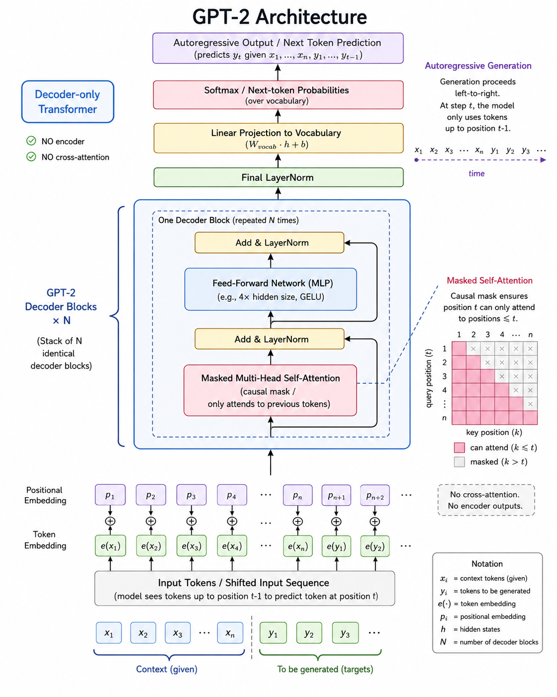

[](https://colab.research.google.com/github/jshn9515/dnnl-notebooks/blob/main/en/ch11-gpt2-from-scratch/ch11.7-gpt2-vs-minigpt.ipynb){fig-align="left"}

In the previous sections, we implemented MiniGPT from scratch and successfully trained it on a small corpus.

When people see the name GPT-2, they may think that we need to learn an entirely new model architecture. In fact, that is not the case. MiniGPT and GPT-2 use the same decoder-only Transformer architecture. The main difference is not a new module, but a larger standard configuration and pretraining on a large-scale corpus.

Therefore, this section will not reimplement causal self-attention, the MLP, or the GPT block. We will discuss four things:

1. The relationship between MiniGPT and GPT-2;
2. The different model configurations in the GPT-2 family;
3. GPT-2 parameter initialization and residual scaling;
4. How to use a pretrained GPT-2 from Hugging Face directly to generate text.

```{python}
import math

import dnnlpy
import IPython.display as ipy
import torch
import torch.nn as nn

print('PyTorch version:', torch.__version__)
```

```{python}
dnnlpy.set_seed(42)
device = dnnlpy.get_default_device()
print('Using device:', device)
```

## 11.7.1 MiniGPT and GPT-2 Are the Same Kind of Model

The goal of MiniGPT is not to invent a model different from GPT-2, but to reproduce the core structure of a GPT-style language model using smaller, clearer code.

{width=70%}

From the perspective of the computation flow, both can be written as:

$$
\begin{align}
H^{(0)} &= E_{\text{token}}(X) + E_{\text{position}}(X) \\
H^{(l+1)} &= \operatorname{GPTBlock}^{(l)}(H^{(l)}) \\
Z &= \operatorname{LMHead}(\operatorname{LayerNorm}(H^{(L)}))
\end{align}
$$

Each GPT block consists of causal self-attention, an MLP, LayerNorm, and residual connections:

$$
\begin{align}
H &= X + \operatorname{Attention}(\operatorname{LayerNorm}(X)) \\
Y &= H + \operatorname{MLP}(\operatorname{LayerNorm}(H))
\end{align}
$$

Therefore, MiniGPT and GPT-2 agree on the following core designs. What really determines model size are several hyperparameters in the configuration:

- `vocab_size`: Vocabulary size;
- `block_size`: Maximum context length the model can process;
- `embed_dim`: Hidden dimension of each token;
- `num_heads`: Number of attention heads in each layer;
- `num_layers`: Number of stacked GPT blocks.

For example, the MiniGPT used earlier for teaching may have only 4 layers, a 128-dimensional hidden state, and 4 attention heads, while GPT-2 Small uses 12 layers, a 768-dimensional hidden state, and 12 attention heads.

Going from MiniGPT to GPT-2 does not fundamentally change the structure. More precisely:

> **MiniGPT is a GPT-2-style language model with a small configuration, while GPT-2 is a real model with a standardized configuration and large-scale pretraining.**

Of course, simply increasing the number of layers and the hidden dimension of MiniGPT does not automatically give it GPT-2's capabilities. Model capabilities result from the combined effects of architecture, data, compute, and training.

## 11.7.2 Different Configurations in the GPT-2 Family

GPT-2 is not a single model, but a family of models with the same architecture and different scale configurations. They all have a vocabulary size of 50257 and a maximum context length of 1024. The main changes are in the number of layers, hidden dimension, and number of attention heads.

::: {.list-table}
Table 11.7.2 GPT-2 Family Configurations

- - Model
  - Parameters
  - Layers $L$
  - Hidden size
  - Num heads
  - Head dimension
  - Context length

- - GPT-2 Small
  - About 124M
  - 12
  - 768
  - 12
  - 64
  - 1024

- - GPT-2 Medium
  - About 355M
  - 24
  - 1024
  - 16
  - 64
  - 1024

- - GPT-2 Large
  - About 774M
  - 36
  - 1280
  - 20
  - 64
  - 1024

- - GPT-2 XL
  - About 1.5B
  - 48
  - 1600
  - 25
  - 64
  - 1024
:::

Notice that all four models maintain:

$$
D_{\text{head}} = \frac{D}{H} = 64
$$

In other words, GPT-2 does not increase the dimension of each attention head as the model grows. Instead, it increases the hidden dimension and the number of heads at the same time.

It is important to note that, for a GPT block, most parameters come from attention and the MLP:

$$
\underbrace{4D^2}_{\text{QKV and Projection}} +
\underbrace{8D^2}_{\text{MLP}} \approx 12D^2
$$

After stacking $L$ layers, the parameter count of the Transformer blocks is approximately:

$$
12LD^2
$$

Therefore, increasing the hidden dimension is very expensive because the parameter count grows approximately as $D^2$.

## 11.7.3 Parameter Initialization and Residual Scaling

For very small models, the default PyTorch initialization can usually train successfully. But as more Transformer layers are stacked, parameter initialization has a significant effect on training stability.

GPT-2 initializes the weights of embeddings and linear layers with a normal distribution whose mean is 0 and standard deviation is 0.02:

$$
W \sim \mathcal{N}(0, 0.02^2)
$$

Biases are usually initialized to 0.

The scale and bias parameters of LayerNorm are initialized as:

$$
\gamma = 1, \qquad \beta = 0.
$$

This can be written as the following initialization function:

```{python}
def reset_parameters(module: nn.Module) -> None:
    """Apply the basic GPT-2 initialization to one module."""
    if isinstance(module, nn.Embedding):
        nn.init.normal_(module.weight, mean=0.0, std=0.02)

    elif isinstance(module, nn.Linear):
        nn.init.normal_(module.weight, mean=0.0, std=0.02)
        if module.bias is not None:
            nn.init.zeros_(module.bias)

    elif isinstance(module, nn.LayerNorm):
        nn.init.ones_(module.weight)
        if module.bias is not None:
            nn.init.zeros_(module.bias)
```

We can then apply it recursively to the entire model:

```python
model.apply(reset_parameters)
```

However, GPT-2 has another detail that is even more worth noting: **the output projections of the residual branches need additional scaling.**

A GPT block has two residual branches:

```text
x + attn(...)
x + mlp(...)
```

When many layers are stacked, every layer adds a new output to the residual stream. If all residual outputs use exactly the same initialization scale, the variance of the residual stream may continue accumulating with depth.

GPT-2 addresses this by reducing the initialization scale of the output layers in residual branches according to the model depth. Following the common implementation in nanoGPT, the output projections of attention and the MLP can use:

$$
\operatorname{std}_{\text{residual}} = \frac{0.02}{\sqrt{2L}}
$$

Here, $L$ is the number of GPT blocks, and the factor 2 comes from the two residual branches in each block.

For example, GPT-2 Small has 12 layers:

```{python}
num_layers = 12
residual_std = 0.02 / math.sqrt(2 * num_layers)
print(f'Residual projection std: {residual_std:.6f}')
```

This produces an initialization standard deviation smaller than 0.02.

Suppose the attention output projection and MLP output projection in the model are both called `out_proj`. After completing the ordinary initialization, we can reinitialize these residual output layers separately:

```python
for name, parameter in model.named_parameters():
    if name.endswith('out_proj.weight'):
        nn.init.normal_(
            parameter,
            mean=0.0,
            std=0.02 / math.sqrt(2 * num_layers),
        )
```

This scaling does not change the model's forward structure or add new parameters. It simply gives a deep Transformer a more suitable numerical scale at the start of training. Of course, module names may differ between implementations, so the condition in `name.endswith()` must be adjusted to the actual model.

Therefore, an important engineering detail in GPT-2 compared with the educational MiniGPT is:

> **It is not enough to decide which layers a model has; we must also decide what numerical scale those layers have at the start of training.**

## 11.7.4 Generating Text with a Hugging Face GPT-2

Since training a complete GPT-2 from scratch requires substantial computational resources, we usually use a model that has already been trained. Hugging Face provides converted GPT-2 configurations, tokenizers, and pretrained weights. We can load `openai-community/gpt2` directly:

```{python}
from transformers import AutoModelForCausalLM, AutoTokenizer

model_id = 'openai-community/gpt2'
tokenizer = AutoTokenizer.from_pretrained(model_id)
model = AutoModelForCausalLM.from_pretrained(model_id, device_map=device)
model.eval()
ipy.clear_output()
```

Here, `from_pretrained()` does more than create the model structure: it also downloads and loads the already-trained parameters.

Give the model an English opening:

```{python}
prompt = 'Once upon a time, there was a little girl'
inputs = tokenizer(prompt, return_tensors='pt').to(device)
```

GPT-2 is a causal language model, so it can predict subsequent tokens step by step from the existing tokens. Below, use sampling to generate text. We set `repetition_penalty=1.1` to reduce the tendency to generate the same content repeatedly.

```{python}
with torch.inference_mode():
    output_ids = model.generate(
        **inputs,
        max_new_tokens=150,
        do_sample=True,
        temperature=0.8,
        top_k=50,
        top_p=0.95,
        repetition_penalty=1.1,
        pad_token_id=tokenizer.eos_token_id,
    )
```

Finally, decode the token ids back into text:

```{python}
generated_text = tokenizer.decode(
    output_ids[0],
    skip_special_tokens=True,
)
print(generated_text)
```

Because sampling is enabled here, the same prompt may produce different results with different random seeds.

The main generation parameters control:

- `max_new_tokens`: Maximum number of new tokens to generate;
- `do_sample=True`: Sample from the probability distribution instead of selecting the highest-probability token every time;
- `temperature`: Adjust the smoothness of the probability distribution;
- `top_k`: Sample only among the $k$ highest-probability tokens;
- `top_p`: Sample only from the candidate set whose cumulative probability reaches $p$;
- `repetition_penalty`: Reduce the tendency to generate the same content repeatedly.

These generation methods were introduced in detail earlier, so we will not repeat them here.

We can also inspect the model configuration directly:

```{python}
print('vocab_size:', model.config.vocab_size)
print('n_positions:', model.config.n_positions)
print('n_embed:', model.config.n_embd)
print('n_layer:', model.config.n_layer)
print('n_head:', model.config.n_head)
```

These parameters correspond to the values in the configuration table above.

## 11.7.5 Summary

This section did not reimplement GPT-2 because the MiniGPT from the previous sections already implements its core structure.

MiniGPT and GPT-2 are both decoder-only Transformers. Both use causal self-attention, pre-LN GPT blocks, learned positional embeddings, and next-token prediction. The most direct difference between them is their configuration and training scale.

The GPT-2 family forms four main model sizes, from 124M to 1.5B parameters, by increasing the number of layers, hidden dimension, and attention heads. As the network becomes deeper, initialization also becomes more important. GPT-2 uses normal initialization with a standard deviation of 0.02 and reduces the initialization scale of residual-branch output projections to control the numerical growth of the deep residual stream.

Finally, we used the Hugging Face Transformers library to load the tokenizer, model structure, and pretrained weights of GPT-2 Small directly, and generated text through the `generate()` function.

Thus, going from MiniGPT to GPT-2 is not a jump from one architecture to another. It is the following transition:

> **From a small implementation for understanding the underlying principles to a real language model with a standard configuration, stable initialization, and pretrained parameters.**
