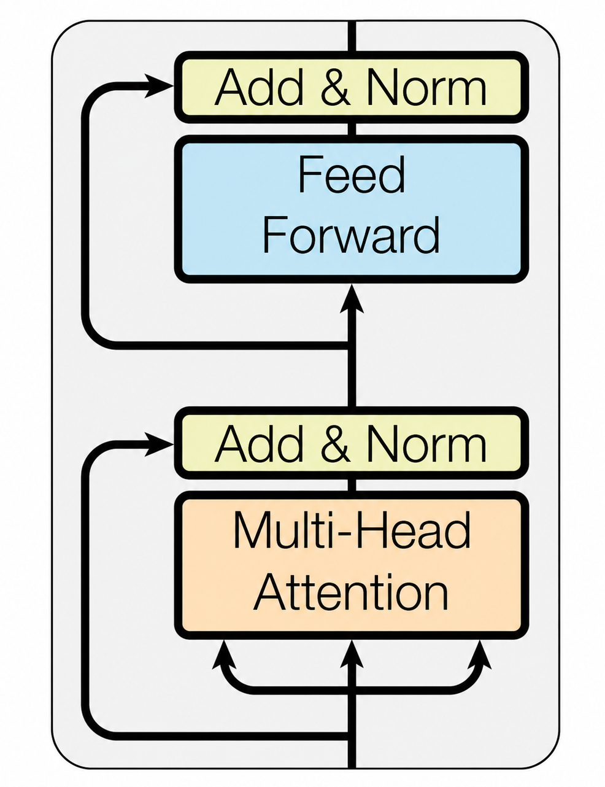
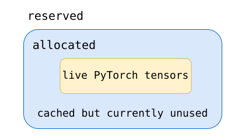

[](https://colab.research.google.com/github/jshn9515/dnnl-notebooks/blob/main/zh/ch12-llm-training-engineering/ch12.1-memory-ledger.ipynb){fig-align="left"}

In Chapter 11, we built a MiniGPT from scratch and walked through next-token prediction, batches, loss, backpropagation, and parameter updates.

As a model grows from a few million parameters to several billion or even tens of billions, its basic training procedure does not fundamentally change. What changes is the scale of the resources behind each step.

For a model with a few million parameters, we usually only need to ask:

> **Is the model implemented correctly? Can the loss decrease?**

In LLM training, however, the questions gradually become:

- Can the model parameters fit on the GPU?
- Can the forward pass finish?
- Will the backward pass run out of memory (OOM)?
- Will Optimizer.step() run out of memory again?
- How do we scale to multiple GPUs when a single GPU cannot hold the model?

Starting with this chapter, we therefore move beyond viewing training as a collection of PyTorch APIs and begin to understand it in terms of **computation, GPU memory, and hardware resources**.

This section first establishes the most important ledger:

> **Where does GPU memory actually go when training an LLM?**

```{python}
import dnnlpy
import IPython.display as ipy
import pandas as pd
import torch
import torch.accelerator as accl
import torch.nn as nn
import torch.optim as optim
from dnnlpy.models.gpt import MiniGPT

print('PyTorch version:', torch.__version__)
```

```{python}
device = dnnlpy.get_default_device()
print('Using device:', device)
```

## 12.1.1 Where Does Training Memory Go?

Suppose we download a 7B model. If its parameters use BF16, storing the weights alone requires approximately:

$$
7\times10^9\times2\ \text{bytes} \approx 13.0\ \text{GiB}
$$

A natural thought is then:

> Since the model is only 13 GiB, a 24 GiB GPU should be able to train it, right?

In practice, this is not the case. The 13 GiB accounts only for **the parameters themselves**. During training, in addition to parameters, we encounter at least:

- **Gradients**: the gradient `param.grad` corresponding to each trainable parameter after backpropagation;
- **Optimizer states**: additional data the optimizer saves to update parameters;
- **Saved activations**: intermediate tensors produced by the forward pass and retained for gradient computation during the backward pass;
- **Temporary buffers**: workspace allocated temporarily by certain operators during execution, such as intermediate memory used internally by matrix multiplication, attention, convolution, sorting, or communication. These buffers are usually not retained long term and can be reused or released after the operation finishes, but they may cause high peak memory at a particular instant.

Distributed training may also involve:

- **Communication buffers**: memory prepared temporarily for communication between GPUs. For example, the NCCL communication library needs input / output buffers for `all_reduce`, `all_gather`, and `reduce_scatter`;
- **Gradient buckets**: DDP combines the gradients of many small parameters into larger contiguous buffers and performs `all_reduce` on them together, rather than communicating separately for each parameter;
- **Parameter buffers**: usually contiguous buffers that hold parameters for computation or communication. They are particularly common in FSDP and ZeRO.

At a broad level, we can therefore divide training memory into three parts:

```text
training memory
│
├── model states
│   ├── parameters
│   ├── gradients
│   └── optimizer states
│
├── saved activations
│   └── forward intermediate results needed for backward
│
└── runtime memory
    ├── temporary buffers
    ├── kernel workspace
    ├── communication buffers
    └── allocator overhead / fragmentation
```

The most important point here is:

> **These three categories of memory grow in different ways.**

Model states are mainly determined by **parameter count**; activations are mainly determined by $B,\ T,\ D,\ L$. Here, $B$ is the micro-batch size, $T$ is the sequence length, $D$ is the hidden size, and $L$ is the number of Transformer layers. Runtime memory depends on the specific kernels, parallelism strategy, PyTorch allocator, and operator implementations.

If we classify memory by lifetime, we can also divide training memory into two parts.

The first consists of model states that persist over time:

```text
parameters
gradients
optimizer states
```

They usually span many training steps. For example, model parameters exist at the start of training and remain until training ends. Once Adam's first and second moments have been created, they are continually updated in subsequent optimizer steps.

The second consists of tensors that exist temporarily within a single forward / backward pass:

```text
saved activations
temporary tensors
kernel workspace
```

These tensors have much shorter lifetimes.

Therefore, before analyzing LLM memory usage, we should stop using:

$$
\text{num\_params} \times \text{bytes\_per\_param}
$$

as a measure of total training memory. At most, it tells us how large the model weights themselves are; it does not tell us where memory goes during training.

## 12.1.2 Model States: How Much Memory Is Behind Each Parameter?

We have classified training memory into model states, saved activations, and runtime memory. We will begin with model states, which are the easiest to estimate.

Suppose the model has $N$ parameters in total. During training, its memory usage usually includes more than the parameters themselves: it may also include their gradients and optimizer states. We can therefore write model states as:

$$
M_{\text{states}} ​= M_{\text{param}} ​+ M_{\text{grad}} ​+ M_{\text{optim}}
$$

Let us examine these three parts separately.

### 12.1.2.1 Parameters

If each parameter element occupies $b_p$ bytes, then:

$$
M_{\text{param}} = Nb_p
$$

The theoretical storage sizes of common dtypes are:

| data type |   size   |
| :-------: | :------: |
|   FP32    | 4 bytes  |
|   FP16    | 2 bytes  |
|   BF16    | 2 bytes  |
|   INT8    |  1 byte  |
|   INT4    | 0.5 byte |

: Table 12.1.2 Theoretical storage sizes of common dtypes

The parameters of a BF16 7B model therefore occupy approximately:

$$
7\times10^9\times2 = 14\times10^9\ \text{bytes}
$$

Converted to GiB:

$$
\frac{14\times10^9}{1024^3} \approx 13.0\ \text{GiB}
$$

Note that `GB` and `GiB` are not exactly the same. Hardware specifications and model parameter counts commonly use decimal units:

$$
1\ \text{GB}=10^9\ \text{bytes}
$$

Operating systems and many GPU memory statistics use binary units:

$$
1\ \text{GiB}=2^{30}\ \text{bytes}
$$

Therefore, `14 GB ≈ 13.0 GiB`.

### 12.1.2.2 Gradients

During training, each trainable parameter usually also receives a corresponding gradient. Thus:

$$
M_{\text{grad}} = Nb_g
$$

If the gradients use BF16:

$$
M_{\text{grad}} = 2N
$$

If they use FP32:

$$
M_{\text{grad}} = 4N
$$

Note that BF16 parameters do not automatically imply BF16 gradients. The actual dtype depends on the mixed precision strategy and framework implementation. For example, in PyTorch AMP, gradients are usually retained in FP32 to avoid numerical instability.

### 12.1.2.3 AdamW Optimizer States

Unlike SGD, which needs only the gradient to update parameters, AdamW maintains two additional states for each parameter.

The first is the first moment:

$$
m_t = \beta_1 m_{t-1} + (1-\beta_1) g_t
$$

The second is the second moment:

$$
v_t = \beta_2 v_{t-1} + (1-\beta_2) g_t^2
$$

For each parameter, we therefore also need to store `m` and `v`.

If both use FP32:

```text
first moment:  4 bytes
second moment: 4 bytes
```

Together, they occupy:

$$
M_{\text{Adam states}} = 8N
$$

### 12.1.2.4 FP32 Master Weights

Some mixed precision training schemes also retain an FP32 copy of the parameters. They first update the FP32 master weights at high precision, then convert them to low-precision weights. If this parameter copy exists:

$$
M_{\text{master}} = 4N
$$

A fairly general model-state ledger can therefore be written as:

$$
M_{\text{states}} = N(b_p + b_g + b_m + b_{m_1} + b_{m_2})
$$

Here:

- $b_p$: parameter bytes;
- $b_g$: gradient bytes;
- $b_m$: master weight bytes;
- $b_{m_1}$: Adam first moment;
- $b_{m_2}$: Adam second moment.

### 12.1.2.5 Estimating Memory for Large Models

Consider a simplified configuration:

```text
BF16 parameters
BF16 gradients
FP32 Adam first moment
FP32 Adam second moment
```

Each parameter then requires:

|        Item        | bytes / parameter |
| :----------------: | :---------------: |
|   BF16 parameter   |         2         |
|   BF16 gradient    |         2         |
| FP32 first moment  |         4         |
| FP32 second moment |         4         |
|       total        |      **12**       |

: Table 12.1.2.1 Per-parameter memory ledger for AdamW training

Therefore:

$$
M_{\text{states}} = 12N
$$

If FP32 master weights are also retained:

|        Item        | bytes / parameter |
| :----------------: | :---------------: |
|   BF16 parameter   |         2         |
|   BF16 gradient    |         2         |
| FP32 master weight |         4         |
| FP32 first moment  |         4         |
| FP32 second moment |         4         |
|       total        |      **16**       |

: Table 12.1.2.2 Per-parameter memory ledger for AdamW training with FP32 master weights

We obtain:

$$
M_{\text{states}} = 16N
$$

This is where the frequently cited `12 bytes/param` and `16 bytes/param` come from.

The key is to avoid assuming that AdamW always requires 12 bytes or 16 bytes. A more accurate approach is:

> **First list the states that training actually retains, then calculate their sizes from each state's dtype.**

We can write a small function directly:

```{python}
def model_state_breakdown(
    num_params: int,
    param_bytes: int = 2,
    grad_bytes: int = 2,
    master_weight_bytes: int = 0,
    first_moment_bytes: int = 4,
    second_moment_bytes: int = 4,
) -> pd.DataFrame:
    """Calculate model state memory breakdown for a given number of parameters
    and their respective byte sizes.
    """
    items = {
        'parameters': num_params * param_bytes,
        'gradients': num_params * grad_bytes,
        'master weights': num_params * master_weight_bytes,
        'Adam first moment': num_params * first_moment_bytes,
        'Adam second moment': num_params * second_moment_bytes,
    }

    rows = [
        {'Item': name, 'Memory (GiB)': dnnlpy.bytes_to_gib(num_bytes)}
        for name, num_bytes in items.items()
        if num_bytes > 0
    ]
    totel_mem = dnnlpy.bytes_to_gib(sum(items.values()))
    rows.append({'Item': 'total', 'Memory (GiB)': totel_mem})

    df = pd.DataFrame(rows)
    df.index = list(range(1, len(df) + 1))
    return df
```

### 12.1.2.6 A 7B Model: Why 13 GiB of Weights Still Do Not Fit

Let us now apply this ledger to a 7B model.

Assume:

```text
parameters: BF16
gradients:  BF16
Adam m:     FP32
Adam v:     FP32
```

Then:

```{python}
df = model_state_breakdown(num_params=7e9)
styler = df.style.set_table_styles(
    [{'selector': 'th', 'props': [('text-align', 'center')]}]
)
ipy.display(styler)
```

Note that we have calculated only the model states. This does not yet include:

```text
saved activations
attention temporary tensors
MLP intermediates
kernel workspace
communication buffers
```

If FP32 master weights are also retained:

$$
7\times10^9\times4 \approx 26.1\ \text{GiB}
$$

The model states alone then become:

$$
78.2 + 26.1 \approx 104.3\ \text{GiB}
$$

We can now understand why a 7B model has approximately 13 GiB of BF16 weights, yet training may require far more than 24 GiB. The first number answers how large the weights are; the second question asks which states must be retained simultaneously to train the model. These are two completely different questions.

This also helps explain why ZeRO and FSDP are so important. If a single GPU must store the complete:

```text
parameters
gradients
optimizer states
```

it will quickly run out of room. One of the core ideas behind ZeRO and FSDP is:

> **Do not make every GPU store all model states.**

We will discuss this in detail later when covering multi-GPU training.

## 12.1.3 Activation Memory: What Must the Forward Pass Save?

Consider a simplified Transformer block:

{height="350px"}

The forward pass produces many intermediate tensors. Autograd must save some of them for the backward pass.

### 12.1.3.1 Query, Key, and Value

Self-attention first computes:

$$
\begin{align}
Q &= X W_Q \\
K &= X W_K \\
V &= X W_V
\end{align}
$$

They usually each have the same total number of elements as the hidden states, namely $BTD$. Together, the three contain approximately $3BTD$ elements.

Assume $B=1$, $T=4096$, $D=4096$, and BF16. The combined size of Q, K, and V is approximately:

$$
3\times32 = 96\ \text{MiB}
$$

Note that this is only **one layer**. For a model with 32 layers, an order-of-magnitude estimate gives:

$$
96\times32 \approx 3\ \text{GiB}
$$

Of course, actual autograd implementations do not necessarily retain all these tensors simultaneously. The aim here is to build an intuition for their scale.

### 12.1.3.2 Attention Matrix

Multi-head attention usually splits the hidden dimension into:

$$
D = H d_h
$$

Here, $H$ is the number of heads and $d_h$ is the head dimension.

We know that attention scores have shape $(B,H,T,T)$, containing $BHT^2$ elements. The $T^2$ term is particularly important. If $B=1$, $H=32$, and $T=4096$, the attention matrix contains:

$$
1\times 32\times 4096\times 4096
$$

For BF16:

$$
1\times 32\times 4096^2\times 2 \approx 1\ \text{GiB}
$$

In other words:

> **A single BF16 tensor of shape $(B,H,T,T)$ already approaches 1 GiB.**

Again, this is only **one layer**. If a naive attention implementation needs to retain several intermediate results of a similar size, such as scores or softmax probabilities, memory usage grows rapidly. This is why ordinary attention can become particularly risky with long contexts.

For example, increasing $T$ from 4096 to 8192 does not double the attention matrix size; it increases it by a factor of 4:

$$
T^2 \rightarrow (2T)^2 = 4T^2
$$

This is also one of the most important motivations for FlashAttention, which we discussed in Chapter 10. FlashAttention does not change the computational cost of $QK^\top$, which is mathematically $O(T^2)$. What it changes is:

> **The full $T\times T$ attention matrix no longer needs to be repeatedly read from and stored in HBM.**

Computational complexity and memory complexity are therefore different things.

### 12.1.3.3 MLP Intermediate

Another major component of a Transformer block is its MLP. A simplified FFN can be written as:

$$
D \rightarrow rD \rightarrow D
$$

Here, $r$ is the expansion ratio.

If $r=4$, the MLP's intermediate activation has shape $(B,T,4D)$ and contains $4BTD$ elements. As before, with $B=1$, $T=4096$, and $D=4096$, the intermediate MLP activation occupies approximately:

$$
128\ \text{MiB}
$$

The 128 MiB for one layer may not seem enormous. But if the model has 32 layers:

$$
128\times 32 = 4096\ \text{MiB} = 4\ \text{GiB}
$$

Structures such as SwiGLU also use different intermediate tensor layouts. Even without considering the $T^2$ attention matrix, the MLP and QKV themselves already produce substantial activations.

### 12.1.3.4 Why Activation Memory Is Difficult to Estimate Exactly

At this point, we may want to write a formula:

$$
M_{\text{activation}} = f(\ldots)
$$

However, unlike parameter count, activation memory is difficult to determine with absolute accuracy from the model configuration alone. The backward pass does not require every tensor that appeared during the forward pass to be saved. For example, PyTorch autograd saves only what the backward pass actually needs. Exactly what is saved depends on each operator's backward implementation.

An operator's backward pass may need its `input`, its `output`, or only certain statistics. If several operators are fused into one kernel, the intermediate results that must be saved may change again. For attention, therefore, different kernel implementations can require different activation memory despite using the same mathematical formula. An **order-of-magnitude model** is more appropriate:

$$
M_{\text{activation}} \approx c_1BTDL + c_2BTrDL + c_3BHT^2L
$$

Here, $c_1,c_2,c_3$ are not fixed constants; they depend on the specific implementation.

What this formula really expresses is the scaling relationship:

```text
B ↑ → activations increase approximately linearly
T ↑ → hidden / MLP activations increase linearly
T ↑ → naive attention matrix grows quadratically
D ↑ → hidden / QKV / MLP grow
L ↑ → activations from more layers must be saved
```

These scaling relationships are more useful in engineering than a memory estimate that appears precise but is actually unreliable.

## 12.1.4 Runtime Memory: Why Theory and Measurements Differ

So far, we have:

$$
M_{\text{model states}}, \qquad M_{\text{activations}}
$$

Does adding them necessarily give actual memory usage? Still no.

Real GPU training also involves various types of runtime memory, for example:

```text
temporary tensors
kernel workspace
cuBLAS workspace
communication buffers
gradient buckets
CUDA graph pools
allocator bookkeeping
```

A matrix multiplication kernel may need extra workspace to improve speed; DDP creates gradient buckets for all-reduce; FSDP may temporarily gather certain parameters; and overlapping tensor lifetimes may prevent memory allocations from packing perfectly.

A more reasonable conceptual model is therefore:

$$
M_{\text{total}} \approx M_{\text{model states}} +
M_{\text{saved activations}} + M_{\text{runtime}}
$$

Even this should not be understood as a static formula that directly yields an exact number. What actually determines whether training can run is:

$$
M_{\text{peak}} = \max_t M(t)
$$

That is, the **peak**.

There is another easily confused distinction in PyTorch. Calling:

```{python}
#| eval: false
x = torch.randn(1000, 1000, 1000, device=device)
mem = accl.memory_allocated()
print(f'Allocated memory: {dnnlpy.bytes_to_mib(mem):6.4f} MiB.')
```

```code
Allocated memory: 3814.6973 MiB.
```

gives the memory currently occupied by tensors.

However, PyTorch uses a CUDA caching allocator. When a tensor is released, its memory is not necessarily returned to the CUDA driver immediately. PyTorch may retain it for quick reuse next time.

There is therefore also:

```{python}
#| eval: false
mem = accl.memory_reserved()
print(f'Reserved memory: {dnnlpy.bytes_to_mib(mem):6.4f} MiB.')
```

```code
Reserved memory: 3816.0000 MiB.
```

We can understand the distinction simply as:

{width=50%}

We therefore often observe:

$$
M_{\text{reserved}} > M_{\text{allocated}}
$$

This does not necessarily indicate a memory leak.

Similarly, the memory shown by `nvidia-smi` cannot be equated directly with:

```python
accl.memory_allocated()
```

The two observe memory state at different levels. The profiling section will examine these issues specifically.

## 12.1.5 Peak Memory: What Actually Determines OOM?

We have examined model states, saved activations, and runtime memory separately. One final question remains: they are not all present simultaneously throughout a training step. What matters is therefore not the sum of every tensor that might appear during training, but how many tensors are still alive at a particular instant.

In other words, we actually care about:

$$
M_{\text{peak}} = \max_t M(t)
$$

Here, $M(t)$ is the memory occupied at a particular point during training. This is **peak memory**.

The distinction is crucial because OOM during LLM training is almost always determined by peak memory.

```{python}
#| eval: false
accl.reset_peak_memory_stats()
mem = accl.max_memory_allocated()
print(f'Peak memory: {dnnlpy.bytes_to_mib(mem):6.4f} MiB.')
```

```code
Peak memory: 3814.6973 MiB.
```

## 12.1.6 Following Memory Lifetimes Through a Training Step

Let us set distributed training aside and examine an ordinary single-GPU training step:

```python
optimizer.zero_grad()

logits = model(x)
loss = loss_fn(logits, y)

loss.backward()

optimizer.step()
```

It looks like only five lines of code, but memory state changes throughout.

#### **Before the Forward Pass**

Once training has started, the GPU usually already holds:

```text
parameters
optimizer states
```

Gradients may also be present if those from the previous iteration have not been released.

At this point, $M$ can be approximated as:

$$
M \approx M_{\text{param}} + M_{\text{optimizer}}
$$

#### **During the Forward Pass**

The model computes from its first layer to its last. For the backward pass, autograd cannot immediately discard all intermediate results. Some tensors produced during the forward pass must be retained. Thus:

```text
parameters
optimizer states
saved activations ↑
```

As computation advances through the network, saved activations usually increase. Near the end of the forward pass, we may already have retained the information needed for the backward passes of many layers.

#### **During the Backward Pass**

After `loss.backward()` is called, the computation graph propagates backward from the last layer. Two things happen at this point.

On one hand, parameter gradients begin to appear:

```text
gradients ↑
```

On the other hand, a layer's saved activations may no longer be needed once its backward pass finishes:

```text
saved activations ↓
```

The backward pass therefore does not simply accumulate:

```text
forward memory + gradients
```

and keep all of them permanently.

More accurately, it is a process of **continually consuming activations and producing gradients**. Peak memory may therefore occur near the end of the forward pass or somewhere during the backward pass. Its exact location depends on the model architecture and implementation.

#### **Optimizer Step**

Finally, `optimizer.step()` updates parameters using AdamW's:

```text
gradient
first moment
second moment
```

Some implementations may also produce temporary buffers.

Another easily overlooked issue is:

> **Many PyTorch optimizers initialize their states lazily.**

In other words, simply creating:

```python
optimizer = optim.AdamW(model.parameters())
```

does not mean that all Adam states have immediately been allocated. They are usually created when a parameter first actually participates in `optimizer.step()`.

We therefore often observe:

```text
Forward succeeds
Backward succeeds
First optimizer.step() OOM
```

This is unsurprising, because the first two steps only show that:

```text
parameters + activations + gradients
```

can fit in memory.

The first `optimizer.step()` may suddenly add:

```text
Adam first moment
Adam second moment
```

This is why a successful forward pass alone cannot tell us whether a model can be trained.

## 12.1.7 Observing Memory Usage with PyTorch

The theoretical ledger should ultimately agree with the actual program. We can write a simple function to observe memory at different stages of a training step.

```{python}
def memory_snapshot(name: str) -> None:
    allocated = accl.memory_allocated()
    reserved = accl.memory_reserved()
    peak = accl.max_memory_allocated()

    print(
        f'{name:<20}: '
        f'allocated={dnnlpy.bytes_to_mib(allocated):6.2f} MiB | '
        f'reserved={dnnlpy.bytes_to_mib(reserved):6.2f} MiB | '
        f'peak={dnnlpy.bytes_to_mib(peak):6.2f} MiB'
    )
```

During training, we can observe:

```{python}
#| eval: false
accl.reset_peak_memory_stats()

model = MiniGPT(vocab_size=1000, block_size=32).to(device)
loss_fn = nn.CrossEntropyLoss()
optimizer = optim.AdamW(model.parameters(), lr=1e-3)

x = torch.randint(0, 1000, (4, 32), device=device)
y = torch.randint(0, 1000, (4, 32), device=device)

optimizer.zero_grad()
memory_snapshot('After `zero_grad()`')

logits = model(x)
loss = loss_fn(
    logits.reshape(-1, logits.size(-1)),  # (B*T, V)
    y.reshape(-1),  # (B*T,)
)
memory_snapshot('After `forward()`')

loss.backward()
memory_snapshot('After `backward()`')

optimizer.step()
memory_snapshot('After `step()`')
```

```code
After `zero_grad()` : allocated=  3.53 MiB | reserved=3820.00 MiB | peak=3818.23 MiB
After `forward()`   : allocated= 12.29 MiB | reserved=3830.00 MiB | peak=3818.23 MiB
After `backward()`  : allocated=  7.55 MiB | reserved=3830.00 MiB | peak=3818.23 MiB
After `step()`      : allocated= 14.61 MiB | reserved=3836.00 MiB | peak=3818.23 MiB
```

These results reflect the actual training process more closely than simply calculating `param_count × bytes`.

One detail matters in actual testing: with AdamW, it is best to complete a warm-up step first.

The first:

```python
optimizer.step()
```

may create optimizer states.

If we measure the first step directly, we are actually measuring:

```text
steady-state training memory + optimizer initialization
```

In subsequent steps, the Adam states already exist.

More reasonable profiling therefore usually warms up for a few steps, resets the statistics, and then measures a steady-state step. We will encounter this idea repeatedly when analyzing training performance.

## 12.1.8 Identifying Memory Bottlenecks from Where OOM Occurs

With this ledger, we can classify common OOM errors by the stage at which they occur.

#### **OOM While Loading the Model**

If:

```python
model.to('cuda')
```

already fails, the first issue is the model parameters. In this case:

```text
Reduce batch size
gradient accumulation
activation checkpointing
```

are essentially unhelpful because the forward pass has not even started. We need to reduce the model states stored on a single GPU directly, for example by lowering parameter precision or using distributed training methods such as Tensor Parallelism, Pipeline Parallelism, FSDP, or ZeRO to spread parameters or other model states across multiple GPUs.

#### **Forward OOM**

If the model loads but OOM occurs during:

```python
output = model(x)
```

the likely causes include:

```text
activations
attention intermediates
temporary buffers
```

We can first check the micro-batch size, sequence length, and attention implementation.

#### **Backward OOM**

If the forward pass finishes but OOM occurs during:

```python
loss.backward()
```

we should examine:

```text
saved activations
gradients
backward temporary tensors
```

Activation checkpointing and a smaller micro-batch are usually more relevant here.

#### **OOM on the First optimizer.step()**

If there is still no problem after:

```python
loss.backward()
```

finishes, but the first:

```python
optimizer.step()
```

fails, optimizer states are well worth inspecting. AdamW's `m` and `v`, in particular, may be allocated for the first time at this point.

#### **OOM After Increasing Context Length**

If the model trains normally at context length $T = 2048$ but suddenly runs out of memory after increasing it to $T = 8192$, activation memory should be checked first.

A longer context requires more intermediate activations to be saved. Naive attention, in particular, explicitly stores attention scores of shape $(B,H,T,T)$, whose memory usage is proportional to $T^2$.

In this situation, using a fused operator directly, such as switching to FlashAttention or cuDNN, is usually a more direct approach than addressing parameter memory.

## 12.1.9 Connecting the Memory Ledger to Training Optimizations

Viewed this way, the training optimizations later in Chapter 17 are no longer isolated memory-saving tricks. They all modify the ledger we have established, but affect different entries.

::: {.list-table}
Table 12.1.9 How training optimizations relate to the memory ledger

- - Technique
  - Main effect
  - Core idea

- - Mixed Precision
  - states + activations + compute
  - Reduce bytes/element and improve low-precision throughput

- - Gradient Accumulation
  - activations
  - Reduce the micro-batch size and accumulate gradients

- - Activation Checkpointing
  - saved activations
  - Save fewer activations and recompute during the backward pass

- - FlashAttention
  - attention intermediates / IO
  - Avoid materializing the full attention matrix

- - DDP
  - throughput
  - Replicate the model and split the data

- - ZeRO / FSDP
  - model states
  - Shard model states across GPUs

- - Quantized Optimizer
  - optimizer states
  - Store optimizer states at lower precision

- - Sequence Parallelism
  - activations
  - Shard some activations along the sequence dimension
:::

When encountering OOM, we should therefore first identify:

> **Which memory entry is too large?**

The mixed precision, gradient accumulation, activation checkpointing, FlashAttention, DDP, ZeRO, and FSDP techniques that follow can all be understood through this memory ledger.

## 12.1.10 Chapter Summary

In this section, we established the most important memory ledger for LLM training before beginning to optimize the model.

Training memory can first be divided into:

```text
model states + saved activations + runtime memory
```

Here, model states include:

$$
\text{parameters} + \text{gradients} + \text{optimizer states}
$$

For:

```text
BF16 parameters
BF16 gradients
FP32 Adam first moment
FP32 Adam second moment
```

each parameter corresponds to approximately:

$$
2+2+4+4 = 12\ \text{bytes}
$$

If FP32 master weights are also retained, this becomes:

$$
16\ \text{bytes}
$$

A 7B model with only about 13 GiB of BF16 weights may therefore require approximately 78.2 GiB or more for its complete training model states.

Activation memory, on the other hand, is not mainly determined by parameter count; it is closely related to $B,\ T,\ D,\ L$.

In a Transformer, hidden states, QKV, and MLP intermediate results usually grow linearly with sequence length, while the $(B,H,T,T)$ attention scores in naive attention grow quadratically with sequence length.

Finally, remember an even more important engineering concept:

> **Training memory is a collection of tensors with different lifetimes, rather than a static table.**

The forward pass continually produces saved activations, the backward pass consumes them and produces gradients, and the optimizer step accesses or even creates optimizer states for the first time.

What actually determines whether training can run is therefore:

$$
M_{\text{peak}} = \max_t M(t)
$$

rather than the size of the model weight file.

Starting from this section, the training optimizations that follow can be understood together as:

> **Reducing an entry in this ledger, shortening certain tensor lifetimes, or sharding them across more devices.**

The next section examines another equally important issue: memory is only part of the cost of training. A model fitting on the GPU does not imply that it runs quickly. To understand training speed, we also need to distinguish FLOPs, memory bandwidth, and arithmetic intensity.
