[](https://colab.research.google.com/github/jshn9515/dnnl-notebooks/blob/main/zh/ch12-llm-training-engineering/ch12.10-large-model-checkpoint.ipynb){fig-align="left"}

Chapter 2 introduced basic checkpoints: save `model.state_dict()` and `optimizer.state_dict()`, then reconstruct the objects and restore their states in a new training process.

This principle remains unchanged in large-model training. What becomes more complex is:

> **Training states are distributed across ranks, with different layouts under different parallelism strategies.**

DDP stores a complete model replica on each rank, while FSDP shards parameters, gradients, and optimizer states. Checkpointing therefore involves more than deciding which dictionaries to save:

- Which states are replicated;
- Which states are rank-local;
- Which states are sharded;
- Whether saving requires gathering;
- How to map states to a new distributed layout when restoring.

This section focuses on checkpointing differences between DDP and FSDP and how PyTorch Distributed Checkpoint handles sharded states.

```{python}
import os
import random
from typing import Any

import dnnlpy
import numpy as np
import torch
import torch.accelerator as accl
import torch.distributed as dist
import torch.distributed.checkpoint as dcp
import torch.distributed.checkpoint.state_dict as state
import torch.distributed.fsdp as fsdp
import torch.nn as nn
import torch.optim as optim
import torch.optim.lr_scheduler as lr
from torch.distributed.checkpoint.stateful import Stateful
from torch.nn.parallel import DistributedDataParallel

rng = np.random.default_rng(42)

print('PyTorch version:', torch.__version__)
```

```{python}
device = dnnlpy.get_default_device()
print('Using device:', device)
```

## 12.10.1 Review: Single-GPU Training Checkpoints

A fairly complete training checkpoint includes at least several categories of state.

The first is **model state**:

```python
model.state_dict()
```

It usually contains parameters and registered buffers.

The second is **optimizer state**:

```python
optimizer.state_dict()
```

For AdamW, this includes moving averages for each parameter, along with learning rate, weight decay, and other information in the parameter groups.

The third is **training control state**, such as:

- Global step;
- Current epoch;
- Tokens seen;
- Learning rate scheduler;
- Gradient scaler.

The fourth is **random state and data state**. With dropout, random sampling, or shuffling, RNG state and data position at restart affect the next data seen and random masks generated.

Start with the single-GPU case. Suppose we have a simple model:

```{python}
model = nn.Sequential(
    nn.Linear(16, 64),
    nn.GELU(),
    nn.Linear(64, 4),
)
optimizer = optim.AdamW(model.parameters(), lr=3e-4)
lr_scheduler = lr.CosineAnnealingLR(optimizer, T_max=1000)
```

FP16 mixed precision may also use `GradScaler`. BF16 training usually does not need loss scaling, so we treat the scaler as optional state here.

We can organize a checkpoint as an ordinary dictionary:

```{python}
def save_checkpoint(
    path: str | os.PathLike[str],
    *,
    model: nn.Module,
    optimizer: optim.Optimizer,
    lr_scheduler: lr.LRScheduler,
    scaler: torch.GradScaler | None = None,
    global_step: int | None = None,
    current_epoch: int | None = None,
    num_tokens_seen: int | None = None,
):
    checkpoint = {
        'model': model.state_dict(),
        'optimizer': optimizer.state_dict(),
        'lr_scheduler': lr_scheduler.state_dict(),
        'scaler': scaler.state_dict() if scaler is not None else None,
        'global_step': global_step,
        'current_epoch': current_epoch,
        'num_tokens_seen': num_tokens_seen,
        'rng_states': {
            'python': random.getstate(),
            'numpy': rng.bit_generator.state,
            'torch.cpu': torch.get_rng_state(),
        },
    }

    if accl.is_available():
        checkpoint['rng_states']['torch.accl'] = accl.random.get_rng_state()

    torch.save(checkpoint, path)
```

Then save it:

```{python}
save_checkpoint(
    'checkpoint.pt',
    model=model,
    optimizer=optimizer,
    lr_scheduler=lr_scheduler,
    global_step=int(5e4),
    current_epoch=3,
    num_tokens_seen=int(8e9),
)
```

When resuming training, the first step is usually to reconstruct a model, optimizer, and scheduler with **the same structure**, rather than read the file:

```python
model = nn.Transformer(...)
optimizer = optim.AdamW(model.parameters(), lr=...)
lr_scheduler = lr.CosineAnnealingLR(optimizer, T_max=...)
```

Then load their states.

A typical procedure is:

```{python}
def load_checkpoint(
    path: str | os.PathLike[str],
    *,
    model: nn.Module,
    optimizer: optim.Optimizer,
    lr_scheduler: lr.LRScheduler,
    scaler: torch.GradScaler | None = None,
):
    checkpoint = torch.load(path, map_location='cpu', weights_only=True)
    model.load_state_dict(checkpoint['model'])

    # Scheduler should already be constructed before optimizer state is loaded.
    optimizer.load_state_dict(checkpoint['optimizer'])
    lr_scheduler.load_state_dict(checkpoint['lr_scheduler'])

    if scaler is not None and 'scaler' in checkpoint:
        scaler.load_state_dict(checkpoint['scaler'])

    rng_states = checkpoint['rng_states']
    random.setstate(rng_states['python'])
    rng.bit_generator.state = rng_states['numpy']
    torch.set_rng_state(rng_states['torch.cpu'])

    # TODO: torch.accelerator.random.set_rng_state()
    device = accl.current_accelerator(check_available=True)
    if device is not None and rng_states['torch.accl'] is not None:
        backend = torch.get_device_module(device)
        backend.set_rng_state(rng_states['torch.accl'])

    return {
        'global_step': checkpoint['global_step'],
        'current_epoch': checkpoint['current_epoch'],
        'num_tokens_seen': checkpoint['num_tokens_seen'],
    }
```

Load the previously saved checkpoint:

```{python}
model = nn.Sequential(
    nn.Linear(16, 64),
    nn.GELU(),
    nn.Linear(64, 4),
).to(device)
optimizer = optim.AdamW(model.parameters(), lr=3e-4)
lr_scheduler = lr.CosineAnnealingLR(optimizer, T_max=1000)

checkpoint = load_checkpoint(
    'checkpoint.pt',
    model=model,
    optimizer=optimizer,
    lr_scheduler=lr_scheduler,
)
print(checkpoint)
```

Several details deserve explanation.

First, we use `map_location='cpu'` to load the checkpoint onto the CPU initially. For large checkpoints, this avoids the extra GPU memory peak caused by `torch.load()` restoring many tensors directly to their original GPU locations. The training code should decide the model's final device.

Second, construct the scheduler before loading optimizer state. PyTorch's optimizer documentation explicitly warns that constructing the scheduler after loading optimizer state may overwrite the restored learning rate. The recommended order is therefore to construct the optimizer and scheduler first, then load their states in order.

Finally, save each device's RNG state. Single-machine training usually needs only CPU and current-GPU RNG states. In multi-node training, each rank may have multiple GPUs, so every GPU's RNG state must be saved. PyTorch 2.14 introduced `get_rng_state_all()` and `set_rng_state_all()` to get and set all accelerator RNG states at once.

The discussion above mainly concerns a single machine with one GPU. Distributed training makes checkpoint design more complex. One key is to distinguish:

- Replicated state: every rank holds a complete copy;
- Sharded state: every rank holds only part.

DDP mainly uses the former and FSDP mainly the latter. Understanding this distinction makes distributed checkpoint saving, loading, and resharding clearer.

## 12.10.2 DDP Checkpoints: The Model Is Replicated

DDP has a relatively simple structure. With world size 4, every rank holds a complete model:

```text
Rank 0: full model
Rank 1: full model
Rank 2: full model
Rank 3: full model
```

DDP synchronizes gradients during backward, so model parameters remain identical across ranks after an optimizer step. With matching optimizer configurations and updates, optimizer states are usually replicated too.

From the perspective of model $(M)$ and optimizer state $(O)$:

```text
Rank 0: M + O
Rank 1: M + O
Rank 2: M + O
Rank 3: M + O
```

Here, $M$ and $O$ are redundant copies.

The most common approach is therefore to let only rank 0 write the checkpoint:

```{python}
def save_ddp_checkpoint(
    path: str | os.PathLike[str],
    *,
    model: DistributedDataParallel,
    optimizer: optim.Optimizer,
    lr_scheduler: lr.LRScheduler,
    scaler: torch.GradScaler | None = None,
    global_step: int | None = None,
    current_epoch: int | None = None,
    num_tokens_seen: int | None = None,
):
    rank = dist.get_rank()
    world_size = dist.get_world_size()

    local_rng_state = {
        'python': random.getstate(),
        'numpy': rng.bit_generator.state,
        'torch.cpu': torch.get_rng_state(),
        'torch.accl': accl.random.get_rng_state() if accl.is_available() else None,
    }
    global_rng_states = [None] * world_size if rank == 0 else None
    dist.gather_object(local_rng_state, global_rng_states, dst=0)

    if rank == 0:
        checkpoint = {
            'model': model.module.state_dict(),
            'optimizer': optimizer.state_dict(),
            'lr_scheduler': lr_scheduler.state_dict(),
            'scaler': scaler.state_dict() if scaler is not None else None,
            'global_step': global_step,
            'current_epoch': current_epoch,
            'num_tokens_seen': num_tokens_seen,
            'rng_states': global_rng_states,
        }
        torch.save(checkpoint, path)

    dist.barrier()  # Sync all ranks before continuing
```

We use `model.module.state_dict()` because `DistributedDataParallel` is a wrapper around the original model. Calling `model.state_dict()` directly adds a `module.` prefix to parameter names, which then do not directly match the unwrapped model. Saving `model.module.state_dict()` keeps the checkpoint closer to the original model structure and makes loading outside DDP easier.

One point matters:

> **Replicated model state does not imply that all distributed states are replicated.**

For example:

- RNG states may differ across ranks;
- `DistributedSampler` local data positions may differ;
- Each rank may maintain its own dataloader worker state;
- Custom metrics / caches may be rank-local.

Saving on rank 0 is usually sufficient to restore the same model parameters and continue training. To restore the complete distributed job as precisely as possible, these rank-local states need additional handling.

## 12.10.3 DDP Resume: Why Do Replicas Remain Consistent?

The DDP restore procedure usually follows:

{height=550px}

A common approach is for every rank to read the same checkpoint:

```{python}
def load_ddp_checkpoint_v1(
    path: str | os.PathLike[str],
    *,
    model: DistributedDataParallel,
    optimizer: optim.Optimizer,
    lr_scheduler: lr.LRScheduler,
    scaler: torch.GradScaler | None = None,
):
    rank = dist.get_rank()
    checkpoint = torch.load(path, map_location='cpu', weights_only=True)

    model.module.load_state_dict(checkpoint['model'])
    optimizer.load_state_dict(checkpoint['optimizer'])
    lr_scheduler.load_state_dict(checkpoint['lr_scheduler'])

    if scaler is not None:
        scaler.load_state_dict(checkpoint['scaler'])

    local_rng_state = checkpoint['rng_states'][rank]

    random.setstate(local_rng_state['python'])
    rng.bit_generator.state = local_rng_state['numpy']
    torch.set_rng_state(local_rng_state['torch.cpu'])

    # TODO: torch.accelerator.random.set_rng_state()
    device = accl.current_accelerator()
    if device is not None and local_rng_state['torch.accl'] is not None:
        backend = torch.get_device_module(device)
        backend.set_rng_state(local_rng_state['torch.accl'])

    return {
        'global_step': checkpoint['global_step'],
        'current_epoch': checkpoint['current_epoch'],
        'num_tokens_seen': checkpoint['num_tokens_seen'],
    }
```

All ranks load the same model and optimizer states, so their restored starting points match. Subsequent backward passes continue synchronizing gradients, keeping the replicas consistent.

Alternatively, rank 0 alone can read the checkpoint and broadcast it to other ranks:

```{python}
def load_ddp_checkpoint_v2(
    path: str | os.PathLike[str],
    *,
    model: DistributedDataParallel,
    optimizer: optim.Optimizer,
    lr_scheduler: lr.LRScheduler,
    scaler: torch.GradScaler | None = None,
):
    rank = dist.get_rank()

    if rank == 0:
        checkpoint = torch.load(path, map_location='cpu', weights_only=True)
    else:
        checkpoint = None

    objects = [checkpoint]
    dist.broadcast_object_list(objects, src=0)

    checkpoint = objects[0]

    model.module.load_state_dict(checkpoint['model'])
    optimizer.load_state_dict(checkpoint['optimizer'])
    lr_scheduler.load_state_dict(checkpoint['lr_scheduler'])

    if scaler is not None:
        scaler.load_state_dict(checkpoint['scaler'])

    local_rng_state = checkpoint['rng_states'][rank]

    random.setstate(local_rng_state['python'])
    rng.bit_generator.state = local_rng_state['numpy']
    torch.set_rng_state(local_rng_state['torch.cpu'])

    # TODO: torch.accelerator.random.set_rng_state()
    device = accl.current_accelerator()
    if device is not None and local_rng_state['torch.accl'] is not None:
        backend = torch.get_device_module(device)
        backend.set_rng_state(local_rng_state['torch.accl'])

    return {
        'global_step': checkpoint['global_step'],
        'current_epoch': checkpoint['current_epoch'],
        'num_tokens_seen': checkpoint['num_tokens_seen'],
    }
```

For ordinary DDP checkpoints, having every rank read the same file from shared storage is usually simple enough. Whether rank 0 should read and broadcast depends mainly on storage performance and checkpoint size. `broadcast_object_list()` serializes and deserializes Python objects; for large checkpoints, this overhead may offset the benefit of fewer disk reads.

The **sampler** also matters. With `DistributedSampler`, the epoch / seed / offset must match training progress after restoration. Otherwise, the model resumes at the correct step but data starts again from 0, so it is no longer strictly the original training trajectory.

DDP checkpointing's main difficulty is therefore usually:

> **Replicated model state is straightforward; rank-local runtime state is easily overlooked.**

## 12.10.4 Why FSDP Checkpoints Are Different

One goal of FSDP2 is to avoid retaining full model states on every rank long term.

Suppose a parameter is split into 4 shards:

```text
Rank 0: P0
Rank 1: P1
Rank 2: P2
Rank 3: P3
```

Gradients and optimizer states may follow the same sharded layout:

```text
Rank 0: P0 | G0 | O0
Rank 1: P1 | G1 | O1
Rank 2: P2 | G2 | O2
Rank 3: P3 | G3 | O3
```

We can no longer simply say:

```python
if rank == 0:
    torch.save(...)
```

because rank 0 lacks the complete states corresponding to P1, P2, and P3.

The most direct solution is to gather all parameters into full tensors before saving. This produces an ordinary full state dict that is convenient to load or publish. Its drawback is clear:

> **Reconstructing full parameters and optimizer states for a checkpoint produces a large memory peak and concentrates I/O on a few ranks.**

FSDP checkpointing therefore generally uses one of two approaches:

1. Full State Dict: gather full states before saving;
2. Sharded State Dict: retain shards and save cooperatively across ranks.

The former is convenient for interoperability with ordinary PyTorch models; the latter is better suited to restoring large-scale training.

Saving a **full state dict** follows:

{height=330px}

The resulting checkpoint resembles an ordinary `model.state_dict()`.

It is easy to process offline, convert to an inference checkpoint, and read with a non-distributed model, independent of the original sharding layout. However, gathering requires extra memory, and optimizer states may exceed model parameters in size, making it unsuitable for some large-scale training runs.

With a **sharded state dict**, each rank saves its own shard directly:

```text
Rank 0 → P0 / O0
Rank 1 → P1 / O1
Rank 2 → P2 / O2
Rank 3 → P3 / O3
```

No rank needs to reconstruct the entire model state, improving memory and I/O scalability. Restoring introduces another question:

> **How do old shards map to new shards if the world size or sharding layout changes?**

This is a central problem addressed by PyTorch DCP.

## 12.10.5 Distributed Checkpoint: Treating Shards as More Than Ordinary Files

PyTorch provides `torch.distributed.checkpoint`, usually abbreviated **DCP**.

Its central idea is to let the checkpoint system understand:

> **These tensors are different shards of one logical distributed state.**

The procedure is:

{height=430px}

Here:

- `get_state_dict()`: converts model / optimizer states into a unified distributed state-dict representation;
- Planner: decides which tensor chunks a rank should save or read;
- StorageWriter / StorageReader: perform the actual storage I/O;
- Metadata: describes tensors, shapes, chunks, and logical keys in the checkpoint;
- `set_state_dict()`: writes loaded states back to the current model / optimizer.

The key is to separate **logical state** from **physical shard files**.

The application should not depend on:

```text
rank0.pt
rank1.pt
rank2.pt
```

such a physical file layout. Instead, it should depend on:

```text
model.layers.7.mlp.up_proj.weight
```

logical parameter names like these.

## 12.10.7 Stateful: Unifying Distributed Model and Optimizer Representations

Handling `state_dict` directly under FSDP is cumbersome because layouts differ. PyTorch provides:

```python
from torch.distributed.checkpoint.state_dict import get_state_dict, set_state_dict
```

`get_state_dict()` converts model and optimizer states into a more uniform representation and identifies parameters by **canonical FQNs (Fully Qualified Names)** from the original model structure, such as:

```text
transformer.blocks.7.attn.q_proj.weight
```

This matters because optimizer states should not permanently depend on parameter IDs from a particular Python process or be tightly bound to one wrapper's parameter names.

A common approach wraps the model and optimizer in a `Stateful` object:

```{python}
class TrainingState(Stateful):
    def __init__(self, model: nn.Module, optimizer: optim.Optimizer):
        self.model = model
        self.optimizer = optimizer

    def state_dict(self) -> dict[str, Any]:
        model_state, optim_state = state.get_state_dict(self.model, self.optimizer)
        return {'model': model_state, 'optimizer': optim_state}

    def load_state_dict(self, state_dict: dict[str, Any]) -> None:
        state.set_state_dict(
            self.model,
            self.optimizer,
            model_state_dict=state_dict['model'],
            optim_state_dict=state_dict['optimizer'],
        )
```

`get_state_dict()` and `set_state_dict()` are unified state interfaces provided by PyTorch for distributed training.

`get_state_dict()` exports savable states from the current model and optimizer, consistently handling parameter naming, identity, and optimizer-state mappings under parallelism strategies such as DDP and FSDP. `set_state_dict()` performs the reverse operation, writing loaded states back into the current model and optimizer.

Note:

> **`get_state_dict()` does not gather every shard into a full tensor.**

For sharded models, exported states can remain distributed. The interface mainly unifies state-dict semantics and parameter mappings rather than forcing sharding to be removed. DCP can then save and restore training states uniformly across distributed configurations.

To save, all relevant ranks call:

```python
state_dict = {'train': TrainingState(model, optimizer)}
dcp.save(state_dict, checkpoint_id='checkpoints/step_50000')
```

DCP generates each rank's save plan from the distributed state and coordinates writes of shards and metadata.

## 12.10.8 DCP Save: What Does Each Rank Do?

Breaking `dcp.save()` down further gives approximately:

{height=580px}

The `Planner` does not write files itself. It determines which logical tensors and chunks this rank needs to write. Actual I/O belongs to the `StorageWriter`.

Specifying `Planner` and `StorageWriter` explicitly gives:

```python
state_dict = {'train': TrainingState(model, optimizer)}
planner = dcp.DefaultSavePlanner()
writer = dcp.FileSystemWriter('checkpoints/step_50000')

dcp.save(state_dict, planner=planner, storage_writer=writer)
```

This differs fundamentally from manually writing:

```python
torch.save(local_state, f'rank_{rank}.pt')
```

The latter only saves each rank's local Python objects separately; the checkpoint system does not know how their shards form complete logical tensors. DCP saves additional metadata so the load planner understands the shard relationships.

A DCP checkpoint can therefore be understood as three parts: actual saved parameter-data shards, metadata describing complete logical tensors, and sharding metadata describing how data was distributed across ranks when saved. These logical and sharding details let DCP remap data to the current world size and parallel layout during loading without reproducing the original sharding configuration exactly. They form the basis for resharding.

## 12.10.9 DCP Load-Time Resharding: Restoring an Old Layout into a New One

Suppose a parameter is:

$$
W \in \mathbb{R}^{8\times 4}
$$

At save time, world size is 4:

```text
Rank 0: W[0:2]
Rank 1: W[2:4]
Rank 2: W[4:6]
Rank 3: W[6:8]
```

At restore time, world size becomes 2:

```text
Rank 0: W[0:4]
Rank 1: W[4:8]
```

The simplest approach gathers all shards onto one rank and splits them again, but materializes a full tensor.

PyTorch DCP instead first constructs the **current** FSDP model to establish each rank's target shards, then combines this with saved checkpoint metadata to calculate a read plan:

1. Read the checkpoint's saved shard information;
2. Determine the target sharding layout from the current process group and model structure;
3. The Load Planner compares old shards with the target layout and plans how to reorganize the data;
4. Determine which old checkpoint chunks are needed for this rank's target shards;
5. Read these chunks from storage directly into the current rank's target shards.

Thus, `dcp.load()` performs an **in-place load**. First create the model and optimizer for the current world size and parallelism:

```python
model = nn.Transformer()
for layer in model.encoder.layers:
    fsdp.fully_shard(layer)
for layer in model.decoder.layers:
    fsdp.fully_shard(layer)
fsdp.fully_shard(model)
optimizer = optim.AdamW(model.parameters(), lr=3e-4)

state_dict = {'train': TrainingState(model, optimizer)}
dcp.load(state_dict, checkpoint_id='checkpoints/step_50000')
```

In this example, new rank 0 reads the corresponding chunks from the old checkpoint directly into the current rank 0's `W[0:4]`. No rank needs to hold the complete $W$ first. This is **load-time resharding**.

As with `dcp.save()`, we can break down `dcp.load()`:

{height=620px}

Specify `Planner` and `StorageReader` explicitly:

```python
model = nn.Transformer()
for layer in model.encoder.layers:
    fsdp.fully_shard(layer)
for layer in model.decoder.layers:
    fsdp.fully_shard(layer)
fsdp.fully_shard(model)
optimizer = optim.AdamW(model.parameters(), lr=3e-4)

state_dict = {'train': TrainingState(model, optimizer)}
planner = dcp.DefaultLoadPlanner()
reader = dcp.FileSystemReader('checkpoints/step_50000')

dcp.load(state_dict, planner=planner, storage_reader=reader)
```

Although DCP handles different world sizes automatically, a change in world size still requires separate checks of training semantics, such as:

- Whether global batch size changes;
- Whether gradient accumulation needs adjustment;
- How the sampler is repartitioned;
- Whether the learning rate schedule advances by steps or token count.

DCP therefore addresses:

> **How distributed tensors in an old checkpoint map to a new distributed layout.**

It does not automatically decide the new training strategy.

## 12.10.10 Chapter Summary

Finally, compare DDP and FSDP.

DDP has the following characteristics:

1. Model state: replicated;
2. Optimizer state: usually replicated;
3. Checkpoint: usually needs only one complete copy.

The simplest approach is to save the full checkpoint on rank 0 alone and handle rank-local RNG, sampler, and data positions separately.

FSDP has different characteristics:

1. Model state: sharded;
2. Optimizer state: sharded;
3. Checkpoint: each rank saves only its own shards.

Rank 0 does not itself have complete model state. Gathering a full state dict is possible, but large-scale training more commonly retains sharded state and uses DCP for parallel saving and restoration.

The comparison is:

::: {.list-table}
Table 12.10.10 DDP and FSDP checkpoints

- - Type
  - DDP
  - FSDP

- - Parameters
  - Replicated
  - Sharded

- - Optimizer State
  - Replicated
  - Sharded

- - Does one rank hold complete states?
  - Usually yes
  - No

- - Saving on rank 0 alone
  - Usually feasible
  - Incomplete for sharded state

- - Is resharding needed?
  - Usually not
  - Possibly

- - Value of DCP
  - Usable but not required
  - Very important
:::

The central question in distributed checkpointing is the same as in distributed training:

> **Which states does each rank actually own?**

If every rank has complete training-state copies, checkpointing resembles ordinary single-machine training. If states are sharded, checkpointing must understand those shards rather than simply return to rank 0 writing one file. This explains why DDP and FSDP, despite both being data-parallel methods, have distinctly different checkpointing approaches: the former mainly handles **replicated state**, while the latter handles **distributed state**.

We have connected the key resources and tools of large-model training: use the memory ledger to understand parameters, activations, and optimizer states, then profile to find actual bottlenecks; use mixed precision, gradient accumulation, and activation checkpointing to adjust precision, batches, and single-GPU memory; improve operator efficiency through modern attention APIs and Triton; and manage multi-GPU computation, communication, and distributed states through DDP, ZeRO, FSDP, and distributed checkpointing.

These techniques address different problems, and no combination is always optimal. In actual training, identify whether memory, compute, communication, or storage is constrained before choosing an optimization:

> **Find the actual bottleneck first, then decide what to optimize.**
