[](https://colab.research.google.com/github/jshn9515/dnnl-notebooks/blob/main/zh/ch12-llm-training-engineering/ch12.2-roofline.ipynb){fig-align="left"}

In the previous section, we divided training memory into parameters, gradients, optimizer states, and activations. Once we know where memory goes, another natural question follows:

> **Why do some operators run quickly despite high FLOPs, while others take substantial time despite low FLOPs?**

A common misconception is to assume that an operator must be slow simply because it involves a large amount of computation. A GPU does more than addition and multiplication when executing an operator. Data also moves between HBM, cache, shared memory, and registers:

{height=320px}

If an operator performs substantial computation and can reuse the same data repeatedly, it may be limited mainly by the GPU's compute capability. Conversely, if it performs little computation but continually reads data from HBM and writes results back, the actual limiting factor is often memory bandwidth rather than FLOPs.

To analyze an operator's performance, we therefore need to consider at least three quantities together:

1. **FLOPs**: how much computation it performs;
2. **Memory Traffic**: how much data it moves;
3. **Arithmetic Intensity**: how many FLOPs it performs per 1 byte of data moved.

Connecting these three quantities gives an important performance analysis tool: the **Roofline Model**.

This section aims to establish a way of reasoning, rather than predict a kernel's runtime precisely in microseconds:

> **Is an operator more likely to be limited by compute or by memory bandwidth?**

```{python}
import dnnlpy
import matplotlib.pyplot as plt
import numpy as np
import torch

dnnlpy.set_matplotlib_format('svg')
print('PyTorch version:', torch.__version__)
```

## 12.2.1 FLOPs Tell Us Only How Much Computation Is Performed

A FLOP is a **Floating-Point Operation**. For example, $a+b$ can be counted as 1 FLOP, while $a\times b+c$ is usually counted as 2 FLOPs: one multiplication and one addition. When discussing neural networks, we often use FLOPs for the total number of floating-point operations in an operator.

Consider matrix multiplication:

$$
C = AB
$$

where:

$$
A\in\mathbb{R}^{M\times K}, \qquad B\in\mathbb{R}^{K\times N}
$$

The output matrix $C$ contains $MN$ elements. Each requires approximately $K$ multiplications and $K$ additions, so the total computational cost is approximately:

$$
\text{FLOPs} \approx 2MKN
$$

If $M=N=K=4096$, one matrix multiplication requires approximately:

$$
2\times 4096^3 \approx 1.37\times 10^{11} \text{ FLOPs}
$$

That is, about 137 GFLOPs.

This is a large number, but it still does not directly tell us the runtime. The reason is simple:

> **FLOPs describe the amount of work, rather than how quickly hardware completes it.**

Suppose the GPU's peak compute throughput is $P_{\text{peak}}$ FLOP/s. Even if we completely ignore memory, kernel launches, and other overhead, we obtain only an ideal lower bound on compute time:

$$
T_{\text{compute}} \ge \frac{\text{FLOPs}}{P_{\text{peak}}}
$$

The GPU cannot perform these computations without data. Inputs must reach the compute units, and results must be written back to memory. FLOPs alone are therefore insufficient; we need a second quantity: **Memory Traffic**.

## 12.2.2 Memory Traffic: Moving Data Also Takes Time

Consider a simple elementwise addition:

$$
z = x + y
$$

If $x, y, z$ are all BF16, each element requires approximately:

```text
read x:    2 bytes
read y:    2 bytes
write z:   2 bytes
------------------
total:     6 bytes
```

The actual computation is only 1 FLOP. To perform this simple addition, we must move at least approximately 6 bytes of data.

For a tensor with $N$ elements, we can roughly estimate memory traffic as:

$$
\text{Memory Traffic} \approx 6N\text{ Bytes}
$$

Suppose the GPU's HBM bandwidth is:

$$
B_{\text{peak}}\text{ Bytes/s}
$$

Memory bandwidth alone then also imposes a lower bound on runtime:

$$
T_{\text{memory}} \ge \frac{\text{Bytes moved}}{B_{\text{peak}}}
$$

Here, memory traffic usually refers mainly to transfers between HBM / global memory and on-chip storage.

This differs from how much GPU memory a tensor occupies. For example, if an algorithm reads a 1 GB tensor from HBM 5 times and repeatedly writes intermediate results back, actual memory traffic may far exceed 1 GB. Thus:

- **Memory Capacity**: whether the data fits;
- **Memory Bandwidth**: how much data can be moved per second;
- **Memory Traffic**: how much data the operator actually needs to move.

These are three different questions.

## 12.2.3 Arithmetic Intensity: Computation per Byte Moved

Given FLOPs and memory traffic, we can define **Arithmetic Intensity**:

$$
I = \frac{\text{FLOPs}} {\text{Bytes moved}}
$$

Its unit is usually FLOP/Byte. It answers:

> **How many floating-point operations can this operator perform per 1 Byte moved from memory?**

Returning to BF16 addition, each element requires approximately 1 FLOP and 6 bytes of memory traffic. Thus:

$$
I \approx \frac{1}{6} \approx 0.17\text{ FLOP/Byte}
$$

This arithmetic intensity is very low. The GPU spends considerable effort moving data in and out while performing little computation, making it difficult to fully utilize its compute units. Conversely, if loaded data can be reused in registers, shared memory, or cache, the same HBM traffic supports more FLOPs and yields higher arithmetic intensity.

One important detail is:

> **Arithmetic Intensity cannot be determined completely from the mathematical formula alone.**

For the same mathematical computation, implementations can differ in:

- Whether they produce intermediate tensors;
- Whether they use kernel fusion;
- Whether they use tiling;
- Whether data can remain in cache / shared memory;
- Whether they repeatedly read and write HBM.

All of these can change actual memory traffic.

When we later describe an operator as having high or low arithmetic intensity, we are usually describing its performance characteristics under a typical implementation, rather than assigning an unchanging label.

## 12.2.4 The Roofline Model: Compute-Bound or Memory-Bound?

The most important use of arithmetic intensity is to put compute capability and memory bandwidth into the same model.

Suppose a GPU has peak compute throughput $P_{\text{peak}}$ and peak memory bandwidth $B_{\text{peak}}$. For an operator with arithmetic intensity $I$, the maximum compute throughput that its memory system can support is:

$$
P_{\text{memory}} = B_{\text{peak}}\times I
$$

Actual throughput cannot exceed the GPU's peak compute capability, so we can write:

$$
P \le \min (P_{\text{peak}}, B_{\text{peak}}I)
$$

This is the core formula of the roofline model. The first segment, $P=B_{\text{peak}}I$, is a sloped line indicating a memory bandwidth limit; the second, $P=P_{\text{peak}}$, is horizontal and indicates the compute throughput ceiling.

Suppose a GPU has peak compute throughput of 100 TFLOP/s and memory bandwidth of 1 TB/s:

```{python}
peak_compute = 100
memory_bandwidth = 1
intensity = np.logspace(-2, 4, 400)
performance = np.minimum(peak_compute, memory_bandwidth * intensity)
ridge_intensity = peak_compute / memory_bandwidth

fig = plt.figure(1)
ax = fig.add_subplot(1, 1, 1)
ax.loglog(intensity, performance, color='#EB6F10', linewidth=2, zorder=2)
ax.axhline(peak_compute, color='#0072B2', linestyle='--', zorder=1)
ax.axvline(ridge_intensity, color='#009E73', linestyle='--', zorder=1)
ax.scatter(ridge_intensity, peak_compute, color='black', s=36, zorder=3)
ax.set_xlabel('Arithmetic Intensity [FLOP / Byte]')
ax.set_ylabel('Performance [TFLOP / s]')
ax.grid(True, which='both', alpha=0.2)
legend = ['Roofline', 'Peak Compute', 'Ridge Intensity', 'Ridge Point']
ax.legend(legend, loc='upper left')
ax.set_title('Roofline Model')
plt.show()
```

The intersection of the two roofs is called the **ridge point**. Its arithmetic intensity is:

$$
I^* = \frac{P_{\text{peak}}} {B_{\text{peak}}}
$$

In this example:

$$
I^* = \frac{100\text{ TFLOP/s}} {1\text{ TB/s}} = 100\text{ FLOP/Byte}
$$

Therefore:

- When $I < 100$ FLOP/Byte, the operator is more likely to be memory-bound;
- When $I > 100$ FLOP/Byte, the operator is more likely to be compute-bound.

What matters is this way of reasoning:

> **Ask how much data movement accompanies the FLOPs, rather than simply whether FLOPs are high.**

## 12.2.5 GEMM: Why Matrix Multiplication Usually Utilizes Compute Units Well

One of the most important computations in large models is **General Matrix Multiply (GEMM)**. For:

$$
A\in\mathbb{R}^{M\times K}, \quad B\in\mathbb{R}^{K\times N}
$$

the computational cost is approximately $2MKN$.

For a highly idealized estimate, assume $A$ and $B$ are each read from HBM once, $C$ is written back once, and each element occupies $s$ bytes. The minimum memory traffic is then approximately:

$$
s(MK + KN + MN)
$$

The arithmetic intensity is therefore approximately:

$$
I_{\text{GEMM}} \approx \frac{2MKN} {s(MK+KN+MN)}
$$

If we further assume $M=N=K=n$:

$$
I_{\text{GEMM}} \approx \frac{2n^3} {3sn^2} = \frac{2n}{3s}
$$

The key observation is:

$$
I_{\text{GEMM}}\propto n
$$

As matrices grow, computation scales as $O(n^3)$ while I/O scales only as $O(n^2)$. Larger matrices therefore offer more opportunities to reuse the same data.

For example, BF16 gives $s=2$ bytes. With $n=4096$, the ideal model above gives:

$$
I_{\text{GEMM}} \approx 1365\text{ FLOP/Byte}
$$

This is why large GEMMs are often well suited to GPUs. GPU kernels split matrices into tiles and repeatedly reuse loaded data in registers, shared memory, and cache, instead of accessing HBM again for each multiplication.

Real GEMM I/O, data reuse, and scheduling are of course much more complex than this ideal formula. The core idea is:

> **Matrix multiplication has high FLOPs but also substantial data reuse, so a large computational workload does not imply low efficiency.**

## 12.2.6 Little Computation Can Still Be Expensive

Consider another class of operators.

For example:

```python
y = torch.relu(x)
```

Or:

```python
y = x + residual
```

These elementwise operators perform very little computation per element, but still need to read the entire tensor and write the results back. Their arithmetic intensity is usually low. Even if the GPU theoretically offers high TFLOP/s, the small amount of computation per batch of data moved often makes memory bandwidth the limit before compute capability is fully utilized.

Normalization has similar characteristics. Take RMSNorm:

$$
\operatorname{RMSNorm}(x) =
\frac{x} {\sqrt{\frac{1}{d}\sum_{i=1}^{d}x_i^2 + \epsilon}} \odot \gamma
$$

Besides elementwise operations, it includes a reduction: it must scan the activations and perform squaring, reduction, normalization, and scaling. Although its FLOPs are far lower than those of a large GEMM, data access and reduction overhead do not decrease proportionally, making it more likely to be memory-bound.

Optimizer updates are an even more typical example. An AdamW parameter update accesses:

- The parameter;
- Its gradient;
- The first moment;
- The second moment.

It also updates the parameter, first moment, and second moment.

Its FLOPs are modest, but memory traffic is substantial. PyTorch therefore introduced `fused=True` for Adam/AdamW to fuse multiple elementwise operations into one kernel, reducing reads and writes of intermediate tensors and HBM round trips, and substantially improving actual throughput.

An important conclusion is therefore:

> **Low FLOPs do not imply a short runtime.**

If an operator spends most of its time moving data, eliminating a few multiplications or additions may provide almost no benefit. More effective optimizations may instead include:

- Reducing HBM round trips;
- Trying to fuse multiple elementwise operations;
- Reducing intermediate tensors;
- Using lower-precision data representations;
- Keeping data in on-chip memory as much as possible.

This is also why **kernel fusion** will appear repeatedly when we introduce Triton.

## 12.2.7 Roofline Analysis of Transformer Operators

We can now view common Transformer operators through the same framework.

::: {.list-table}
Table 12.2.7 Roofline analysis of common Transformer operators

- - Operator
  - Typical compute characteristics
  - Typical memory characteristics
  - More likely limiting factor

- - Large GEMM / Linear
  - High FLOPs and substantial data reuse
  - Tiles can be reused repeatedly
  - Compute

- - Elementwise Add / Activation
  - Little computation per element
  - Read and write the entire tensor
  - Memory

- - LayerNorm / RMSNorm
  - A few elementwise operations + reduction
  - Scan activations
  - Memory / Reduction

- - AdamW Update
  - Limited computation per parameter
  - Repeatedly read and write parameter / grad / states
  - Memory

- - Attention
  - Heavy matmul, but intermediate states and implementation have a substantial effect
  - May generate substantial HBM traffic
  - Shape / Implementation Dependent
:::

The last row deserves particular attention. Attention does include matrix multiplications such as $QK^T$ and $PV$, but that does not make the entire operation necessarily compute-bound. If the implementation writes a large attention score matrix to HBM and reads it again for softmax and subsequent computation, memory traffic can also be very high.

Optimizing attention therefore does not necessarily require reducing mathematical FLOPs. Sometimes what matters is:

> **Avoid repeatedly writing intermediate results to HBM whenever possible.**

One of FlashAttention's main approaches is to reduce HBM I/O through tiling and reorganized computation. Its FLOPs remain broadly similar to attention, but memory traffic drops substantially, so arithmetic intensity increases substantially.

Reducing FLOPs is therefore only one route to performance optimization. Another equally important route is:

> **Reduce memory traffic without changing the mathematical result.**

## 12.2.8 Shape and Precision Both Affect Actual Efficiency

Even the same operator need not always exhibit the same performance characteristics. For example, multiplying:

$$
A \in \mathbb{R}^{32\times 128}, \quad B \in \mathbb{R}^{128\times 128}
$$

and multiplying:

$$
A \in \mathbb{R}^{4096\times 4096}, \quad B \in \mathbb{R}^{4096\times 4096}
$$

are both GEMMs, yet may have completely different hardware utilization.

Small matrices often have insufficient parallelism, a high proportion of kernel launch overhead, or poor Tensor Core tile utilization, making it difficult to match the efficiency of large GEMMs. As matrices grow, GEMM provides more parallel computation, greater data reuse, and higher hardware utilization, making its performance more likely to approach the compute throughput ceiling. Thus, "large GEMMs are usually compute-bound" does not mean "all GEMMs are compute-bound."

Precision also changes the balance between compute and memory. Compared with FP32, BF16 uses fewer bytes per element, reducing memory traffic for the same amount of data. Many GPUs can also use Tensor Cores with BF16, achieving much higher peak compute throughput than FP32. Changing precision therefore changes both $P_{\text{peak}}$ and the effective cost of data transfer, shifting the ridge point.

Compute-bound / memory-bound is therefore not an unchanging label. More accurately, we should ask:

> **Which bottleneck is a specific implementation closer to, for a particular shape, precision, and hardware configuration?**

## 12.2.9 Theoretical FLOPs Matter, but Actual Performance Is Decisive

Note that roofline is an **upper-bound model**. Even if a GEMM has sufficiently high arithmetic intensity to be theoretically compute-bound, it may not actually reach $P_{\text{peak}}$. Real kernels can also be affected by input shapes, devices, and other factors.

Actual performance is therefore usually better written as:

$$
P_{\text{achieved}} = \frac{\text{Actual FLOPs}} {\text{Elapsed Time}}
$$

For example, an operator might theoretically achieve 100 TFLOP/s but actually reach only 40 TFLOP/s. Roofline alone cannot pinpoint the remaining gap, but it narrows the investigation: low arithmetic intensity suggests examining memory and I/O first; high arithmetic intensity calls for further checks of compute utilization.

This matters because many performance problems are more complicated than excessive theoretical FLOPs or memory traffic. An operator may be theoretically compute-bound yet leave the GPU underutilized because its inputs are too small. It may theoretically tend toward memory-bound behavior while its largest actual bottleneck is frequent kernel launches or gaps in CPU scheduling.

Theoretical analysis therefore tells us **what to investigate first**, rather than providing the final conclusion directly.

## 12.2.10 Chapter Summary

We can now condense this section into a simple sequence for performance analysis.

For an operator, first estimate its FLOPs and approximate data movement, then calculate:

$$
I = \frac{\text{FLOPs}} {\text{Bytes}}
$$

Compare this arithmetic intensity with the current hardware's ridge point. Low $I$ suggests a memory bandwidth limit; high $I$ indicates an opportunity to enter the compute-bound region. We should retain qualifications such as "more likely" and "has an opportunity," because roofline helps form performance hypotheses and cannot replace actual profiling.

A complete performance optimization process should therefore be:

1. Understand FLOPs, memory traffic, and arithmetic intensity;
2. Form a hypothesis about the possible bottleneck;
3. Use profiling to find what actually consumes time;
4. Decide how to optimize.

In the next section, we move to **Profiling**. We will examine where time goes in an actual run instead of guessing that an operator might be slow.
