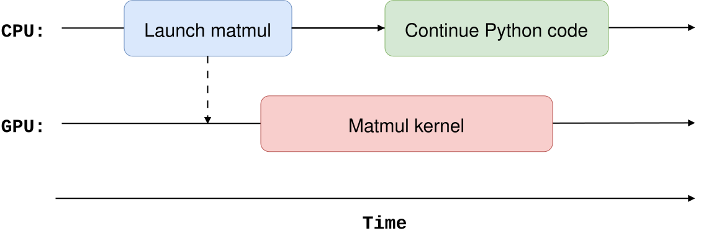
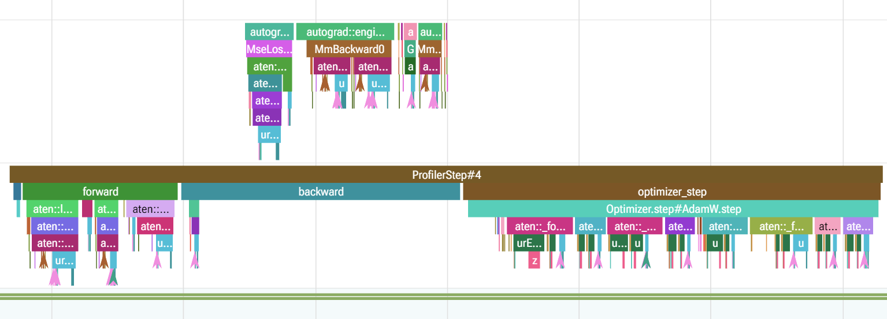
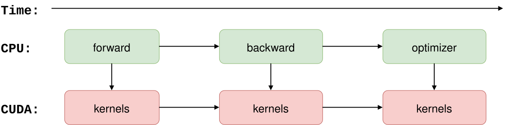

[](https://colab.research.google.com/github/jshn9515/dnnl-notebooks/blob/main/zh/ch12-llm-training-engineering/ch12.3-profiling.ipynb){fig-align="left"}

We have analyzed why an operator might be slow in terms of FLOPs, memory, and arithmetic intensity. These analyses mainly answer:

> **Where might the bottleneck be in theory?**

Actual training code is often more complex. A training step includes the DataLoader, CPU scheduling, host-to-device copies, the forward pass, the backward pass, the optimizer step, and many CUDA kernels. Knowing that a matrix multiplication involves substantial computation does not directly establish that it is the slowest part of the actual run.

The first step in performance optimization is therefore usually to answer:

> **Where does the time actually go?**

This is what **profiling** addresses.

Rather than analyzing every operator's FLOPs again, this section starts with actual code and shows how to locate bottlenecks progressively: measure complete step time, then GPU time, then use PyTorch Profiler to examine operators and the timeline.

```{python}
import datetime as dt
import os
import time
from collections.abc import Callable

import dnnlpy
import IPython.display as ipy
import pandas as pd
import torch
import torch.nn as nn
import torch.nn.functional as F
import torch.optim as optim
import torch.profiler as prof
from torch.profiler import ProfilerActivity

print('PyTorch version:', torch.__version__)
```

## 12.3.1 What Questions Should Profiling Answer First?

Saying "training is slow" is not specific enough. Possible causes include:

- The DataLoader prepares batches too slowly, frequently leaving the GPU without data to process;
- The CPU continually submits many small CUDA kernels, while the GPU computation itself is light;
- A matrix multiplication, attention, or normalization operation actually consumes most GPU time;
- Frequent CPU–GPU synchronization disrupts a pipeline that could otherwise run asynchronously;
- Data copies and computation do not overlap, leaving the GPU waiting for host-to-device copies;
- A piece of code is called many times: each call is fast, but the cumulative cost is high.

These problems require completely different optimizations.

The main role of profiling is therefore to break down a complete training step and progressively answer three levels of questions:

1. Is the overall training step slow?
2. Is most time spent on the CPU or GPU?
3. Which code region / operator / kernel is responsible?

This order matters. Profiling tools usually produce substantial information. Starting with hundreds of CUDA kernels can bury us in details without revealing what actually needs optimization.

## 12.3.2 Step Time: The Simplest Benchmark

The simplest performance metric is the time taken by one training step.

Given a function `step_fn()`, the most direct benchmark is:

```python
start = time.perf_counter()
step_fn()
elapsed = time.perf_counter() - start
```

In practice, however, we should not run the benchmark only once. The first execution often includes extra overhead, such as CPU context initialization, memory allocation, library initialization, and compilation when using `torch.compile`.

A more reliable approach is to warm up first, then measure multiple steps repeatedly:

```{python}
def cpu_benchmark(step_fn: Callable, warmup: int = 5, steps: int = 20) -> float:
    """Do a simple benchmark of step_fn().

    .. note::
        This function is wrong if step_fn() contains GPU operations,
        because it does not synchronize before and after timing.
    """
    for _ in range(warmup):
        step_fn()

    start = time.perf_counter()

    for _ in range(steps):
        step_fn()

    elapsed = time.perf_counter() - start
    return elapsed / steps
```

This returns the average **wall-clock time** per step:

$$
T_{\text{step}} = \frac{T_{\text{total}}}{N_{\text{steps}}}
$$

If each step processes $N_{\text{token}}$ tokens, we can also obtain training throughput:

$$
\text{Throughput} = \frac{N_{\text{token}}}{T_{\text{step}}}
$$

For example, `tokens / second` is usually more convenient than step time alone in language model training because it accounts for both batch size and sequence length.

This tells us only how slow the overall process is, not where it is slow. Next, we must address a common pitfall in GPU benchmarking: asynchronous CUDA execution.

## 12.3.3 CUDA Is Asynchronous: Incorrect Timing May Measure Only Kernel Launches

When PyTorch executes operations on CUDA (or other GPUs; CUDA is our example here), the CPU usually does not wait for the GPU to finish the current operation. It submits CUDA work to a stream and continues executing.

For example:

```python
start = time.perf_counter()
y = x @ x
elapsed = time.perf_counter() - start
```

If `x` is on the GPU, `elapsed` often does not represent the actual GPU execution time of the matrix multiplication. The CPU may have only completed the kernel launch while the GPU is still computing.

We can roughly visualize the process as:

{width=80%}

To measure a CUDA workload with a CPU timer, we therefore need to synchronize at the timing boundaries:

```python
accl.synchronize()
start = time.perf_counter()

step_fn()

accl.synchronize()
elapsed = time.perf_counter() - start
```

`accl.synchronize()` waits for submitted CUDA work on the current device to finish. The CPU timer then covers the GPU work itself. This synchronization blocks the CPU and reduces execution efficiency, so it is suitable for benchmarking. We should not insert it arbitrarily into a normal training loop just to measure time, because profiling may then change how the original program executes.

## 12.3.4 torch.Event: Measuring GPU Execution Time Separately

To measure how long a CUDA workload executes on the GPU, we can use `torch.Event`.

```python
start = torch.Event(enable_timing=True)
end = torch.Event(enable_timing=True)

start.record()
step_fn()
end.record()

end.synchronize()
elapsed = start.elapsed_time(end)
```

CUDA events are recorded in the CUDA stream, making them more suitable for measuring GPU time.

For example, we can write a simple benchmark:

```{python}
def benchmark_cuda(step_fn: Callable, warmup: int = 5, steps: int = 20) -> float:
    for _ in range(warmup):
        step_fn()

    start = torch.Event(enable_timing=True)
    end = torch.Event(enable_timing=True)

    start.record()

    for _ in range(steps):
        step_fn()

    end.record()
    end.synchronize()

    elapsed = start.elapsed_time(end)
    return elapsed / steps
```

An important distinction is:

- `time.perf_counter()` with synchronization more closely measures the wall-clock time we actually wait for a workload to finish;
- CUDA events more closely measure the elapsed GPU stream time between two events.

CUDA events are well suited to local benchmarks when we suspect that a CUDA operator itself is slow. However, they do not capture time spent in the DataLoader, Python scheduling, or CPU preprocessing.

Timing alone is therefore only the first level of profiling. To identify the slowest operator within a training step, we need a profiler.

## 12.3.5 torch.profiler: Breaking a Step into Operators

PyTorch provides `torch.profiler` to collect both CPU operators and CUDA activity.

First, we prepare a small model to simulate a basic training step:

```{python}
device = dnnlpy.get_default_device()

batch_size = 32
in_features = 2048
hidden_size = 8192
out_features = 2048

model = nn.Sequential(
    nn.Linear(in_features, hidden_size, bias=False),
    nn.GELU(),
    nn.Linear(hidden_size, out_features, bias=False),
).to(device)
optimizer = optim.AdamW(model.parameters(), lr=1e-3)

x = torch.randn(batch_size, in_features, device=device)
target = torch.randn_like(x)


def training_step():
    optimizer.zero_grad()
    output = model(x)
    loss = F.mse_loss(output, target)
    loss.backward()
    optimizer.step()
    return loss
```

We can use `prof.schedule()` to decide how to record training steps. Common parameters include:

- `wait`: skip the first few steps without profiling;
- `warmup`: start and warm up the profiler during the next few steps, without saving them as the formal trace;
- `active`: record profiling data for the following steps;
- `repeat`: how many times to repeat the `wait + warmup + active` cycle.

```{python}
activities = prof.supported_activities()
sort_by = f'self_{device.type}_time_total'

schedule = prof.schedule(wait=1, warmup=3, active=5, repeat=1)
with prof.profile(activities=activities, schedule=schedule) as profiler:
    for _ in range(10):
        training_step()
        profiler.step()

event_list = profiler.key_averages()
event_table = event_list.table(sort_by=sort_by, row_limit=15)

df = pd.read_csv('results/ch12.3.5_cpu_result.csv')
df.index = list(range(1, len(df) + 1))
ipy.display(df)

df = pd.read_csv('results/ch12.3.5_xpu_result.csv')
df.index = list(range(1, len(df) + 1))
ipy.display(df)
```

```code
Self CPU time total: 473.303ms
Self XPU time total: 453.482ms
```

`key_averages()` aggregates repeated events by operator and reports their execution time and call counts.

On the GPU, we can first sort by:

```python
sort_by = f'self_{device.type}_time_total'
```

to see which operators actually consume the most GPU time. If the program runs mainly on the CPU, examine:

```python
sort_by = 'self_cpu_time_total'
```

This often narrows "training is slow" down to a few operators worth investigating.

The profiler itself adds overhead. Training for 10000 steps therefore does not mean we should record all 10000 steps in full. We usually profile only a small number of representative iterations.

## 12.3.6 Reading the Profiler Table

Profiler output has many columns, but we do not need to understand them all at first. The most important distinction is between **Self Time** and **Total Time**.

Suppose operation `A` internally calls `B` and `C`. Then:

$$
T_{\text{total}}(A) = T_{\text{self}}(A) + T(B) + T(C)
$$

Here:

- Self CPU Time: CPU time spent in this event itself, excluding child events;
- CPU Time Total: CPU time spent in this event and its internal calls;
- Self CUDA Time: CUDA time spent in this event itself, excluding child events;
- CUDA Time Total: CUDA time spent in this event and its internal calls;
- \# of Calls: how many times the event was called.

When finding low-level operator hotspots, `self_*_time_total` is often more useful because it avoids counting child-operation time again in the parent. Call counts also matter. An operator taking only tens of microseconds per call may seem fast, but can still add substantial overhead if called thousands of times per step.

A common analysis therefore asks two questions together:

> **Which operator has the largest self time? Why is it called so often?**

The first helps find large operators; the second helps reveal overhead from many small operators.

Also, do not interpret profiler percentages directly as the theoretical share of FLOPs a module should occupy. The profiler measures actual execution time, which is also affected by kernel implementation, memory access, launch overhead, input shapes, and hardware utilization.

## 12.3.7 record_function: Dividing the Training Loop into Regions

Operator names alone are sometimes insufficient. For example, `aten::mm` may come from an attention projection or the MLP. We may know that matrix multiplication is slow without knowing which part of the training code it belongs to.

We can use `record_function()` to add custom regions:

```{python}
def train_step_with_regions():
    with prof.record_function('zero_grad'):
        optimizer.zero_grad()

    with prof.record_function('forward'):
        output = model(x)
        loss = F.mse_loss(output, target)

    with prof.record_function('backward'):
        loss.backward()

    with prof.record_function('optimizer_step'):
        optimizer.step()

    return loss
```

Then run the profiler again:

```{python}
with prof.profile(activities=activities, schedule=schedule) as profiler:
    for _ in range(10):
        train_step_with_regions()
        profiler.step()

event_list = profiler.key_averages()
event_table = event_list.table(sort_by=sort_by, row_limit=15)
```



We can now see two levels of granularity:

```text
training_step
├── zero_grad
├── forward
│   ├── aten::linear
│   ├── aten::mm
│   └── aten::gelu
├── backward
│   └── ...
└── optimizer_step
    └── ...
```

This is a practical profiling method:

> **Divide the code into familiar program regions first, then inspect the operators within the slowest region.**

In actual Transformer training code, we can further divide the forward pass into regions such as `attention`, `mlp`, and `embedding`, instead of starting with the complete operator list.

## 12.3.8 Timeline: Is the CPU Waiting for the GPU, or Vice Versa?

The operator table identifies the largest cumulative costs, but aggregation loses execution order. Some performance issues require a **Timeline**: Why does the GPU periodically become idle? Do host-to-device copies overlap with computation? Is the CPU continually waiting for synchronization?

For longer training runs, a profiler schedule can record only a few iterations:

```{python}
if not os.path.exists('profiler_traces'):
    os.mkdir('profiler_traces')


def trace_handler(profiler: prof.profile):
    """Profiler trace handler to save timeline to file."""
    event_list = profiler.key_averages()
    event_table = event_list.table(sort_by=sort_by, row_limit=10)

    timestamp = dt.datetime.now().strftime('%Y%m%d_%H%M%S')
    trace_path = os.path.join('profiler_traces', f'trace_{timestamp}.json')
    profiler.export_chrome_trace(trace_path)


with prof.profile(
    activities=activities,
    schedule=schedule,
    on_trace_ready=trace_handler,
) as profiler:
    for _ in range(10):
        train_step_with_regions()
        profiler.step()
```

The exported trace preserves timing relationships between events. In the timeline, we usually see CPU threads, CUDA streams, kernels, memory copies, and our custom `record_function` regions.

Compared with an operator ranking table, the timeline shows more of what actually happens during execution:

{width=80%}

What usually matters is **idle regions and waiting relationships**, rather than an individual event's name. Large gaps in the GPU timeline indicate that it lacked sufficient work during those intervals. The issue may be upstream in the CPU, DataLoader, or data transfer rather than in the GPU kernel itself.

## 12.3.9 Recognizing Common Performance Bottlenecks

With the operator table and timeline, we can summarize common issues as several patterns.

The first is one or a few CUDA operators consuming most of the time:

```text
GPU:  ────────────────────────────
          one expensive kernel
```

The bottleneck is indeed mainly GPU computation. We should next examine the operator's shape, dtype, and kernel implementation rather than optimize a Python for-loop.

The second is many short CUDA kernels separated by noticeable launch gaps:

```text
GPU:  ──  ─  ──  ─  ─  ──  ─  ──
```

This usually indicates that individual kernels are light, but the operators are fragmented and kernel launches and framework scheduling account for a growing share of time. Kernel fusion, `torch.compile`, or eliminating unnecessary small operations may help more than optimizing one kernel alone.

The third is long GPU idle periods while the CPU continues working:

```text
CPU:  ────────────────────────────
GPU:  ───────        ───────
```

This often means that the GPU is waiting for the CPU, for example because the DataLoader, tokenization, Python preprocessing, or preparation of the next batch is too slow.

The fourth is serial execution of memcpy and compute:

```text
H2D:  ──────          ──────
GPU:        ────────        ────────
```

If data transfer could overlap with computation but remains entirely serial, inspect pinned memory, `non_blocking`, prefetching, and stream usage.

The fifth is frequent synchronization. Repeatedly moving GPU tensors back to the CPU, or Python logic that depends on GPU results, may force the CPU to wait for the GPU:

```text
CPU:  launch ── wait ── launch ── wait ──
GPU:     work ─────       work ─────
```

Common examples include frequent `x.item()` calls in a hot path, copying GPU tensors to the CPU, or repeatedly reading GPU results for printing and debugging. The issue is repeated interruption of asynchronous execution rather than a slow kernel computation.

Low GPU utilization therefore does not directly imply that the model is too small or that the GPU has too little work. The profiler helps us keep asking: **Why does the GPU become idle?**

## 12.3.10 Chapter Summary

When investigating performance problems, we can proceed through the following levels:

{height=750px}

The final step is crucial. Every performance optimization should return to the original benchmark and compare the same metric before and after the change. Code that looks more efficient does not necessarily run faster.

The profiler also offers `record_shapes`, `with_stack`, and `profile_memory` to record input shapes, call stacks, and memory events. These add profiling overhead, so we should usually avoid enabling them all by default. Add this information only after narrowing the problem to a few operators and needing to identify a particular shape or calling line.

We now have a basic method for locating performance issues:

> **Measure first, locate the bottleneck, then optimize.**

The next section covers mixed precision. It may appear to be simply replacing FP32 with lower precision, but the real questions are what low precision reduces and why it can substantially accelerate large-model training on modern GPUs.
