[](https://colab.research.google.com/github/jshn9515/dnnl-notebooks/blob/main/zh/ch12-llm-training-engineering/ch12.4-mixed-precision.ipynb){fig-align="left"}

In the previous section, we used the profiler to answer:

> **Where does training time actually go?**

If the profiler shows that matrix multiplication, linear layers, and attention consume substantial time, a natural optimization is:

> **Can we perform these computations at lower precision?**

This is mixed precision training. Its core goal is to run operators suited to low precision at low precision while retaining higher precision for numerically sensitive parts, rather than simply converting the entire model from FP32 to FP16.

In PyTorch, this is usually achieved with `torch.autocast` and `torch.GradScaler`:

- `torch.autocast` determines the precision used by different operators;
- `torch.GradScaler` is mainly used to prevent FP16 gradient underflow.

In this section, we will address:

- How do FP32, FP16, and BF16 differ?
- Why can low precision be faster and use less memory?
- Why not simply call `model.half()`?
- Why does FP16 often need loss scaling?
- Why does BF16 usually not need loss scaling?

```{python}
import dnnlpy
import IPython.display as ipy
import pandas as pd
import torch
import torch.nn as nn
import torch.nn.functional as F
import torch.optim as optim
from torch import Tensor

print('PyTorch version:', torch.__version__)
```

```{python}
device = dnnlpy.get_default_device()

if device.type == 'cpu' and dnnlpy.IS_AVX2_VNNI_2:
    torch.backends.mkldnn.enabled = False

print('Using device:', device)
```

## 12.4.1 Floating-Point Numbers Are More Than Decimals

Neural network parameters, activations, and gradients are usually represented as floating-point numbers. Broadly, a floating-point number consists of a sign, exponent, and mantissa, with the following roles:

::: {.list-table}
Table 12.4.1 The three components of a floating-point number

- - Component
  - Role

- - sign
  - Whether the number is positive or negative

- - exponent
  - The largest and smallest orders of magnitude it can represent

- - mantissa
  - How finely it can represent values within that magnitude
:::

When discussing a floating-point format, we therefore need to consider two questions:

- Range: how large or small a number it can represent
- Precision: how fine a difference it can distinguish

The main differences between FP64, FP32, FP16, and BF16 are:

::: {.list-table}
Table 12.4.2 Main differences between FP64, FP32, FP16, and BF16

- - dtype
  - Total bits
  - exponent
  - mantissa
  - Main characteristics

- - FP64
  - 64
  - 11
  - 52
  - Widest range and highest precision

- - FP32
  - 32
  - 8
  - 23
  - Wide range and high precision

- - FP16
  - 16
  - 5
  - 10
  - Lower precision and narrower range

- - BF16
  - 16
  - 8
  - 7
  - Range close to FP32, but lower precision
:::

FP16 has a shorter exponent, while BF16 has the same exponent length as FP32. FP16 is therefore more susceptible to overflow and underflow. BF16 has fewer significant digits but a dynamic range close to FP32, making it usually more suitable for deep learning training. FP64 uses more memory and is slower, so it is generally used only in high-precision scientific computation, such as solving PDEs.

We can inspect the numerical ranges of different dtypes directly.

```{python}
rows = []

for dtype in [torch.float64, torch.float32, torch.float16, torch.bfloat16]:
    info = torch.finfo(dtype)
    rows.append([info.dtype, info.min, info.max, info.eps])

df = pd.DataFrame(rows, columns=['dtype', 'min', 'max', 'eps'])
df.index = list(range(1, len(df) + 1))
df.style.format({'min': '{:.3e}', 'max': '{:.3e}', 'eps': '{:.3e}'})
ipy.display(df)
```

Here, `eps` is the smallest relative spacing this dtype can distinguish near 1.

Thus:

- FP32 and FP64 represent values more finely;
- FP16 is somewhat more precise than BF16;
- BF16 has a much wider dynamic range than FP16.

This is an easily confused distinction:

> **BF16 is not more precise than FP16 in every respect. Its main advantage is a wider dynamic range, rather than a longer mantissa.**

## 12.4.2 Why Can Low Precision Be Faster?

Low-precision training usually provides two benefits: less memory traffic and higher matrix multiplication throughput.

FP32 occupies 4 bytes per element, while FP16 and BF16 occupy 2 bytes. For an operator mainly limited by memory bandwidth, low precision therefore halves the data moved to read the same number of elements.

For example, a tensor containing 1 billion elements:

```{python}
num_elements = 1_000_000_000

for dtype in [torch.float64, torch.float32, torch.float16, torch.bfloat16]:
    bytes_per_element = torch.tensor([], dtype=dtype).element_size()
    total_gib = dnnlpy.bytes_to_gib(num_elements * bytes_per_element)
    print(f'{dtype}: {total_gib:.4f} GiB')
```

Modern GPUs also usually provide dedicated hardware paths, such as Tensor Cores, for FP16 and BF16 matrix multiplication. Low precision can therefore substantially improve compute throughput for matrix multiplications in Linear, Matmul, Convolution, and Attention.

This corresponds to the two bottlenecks discussed previously:

- For memory-bound operators, low precision reduces memory traffic;
- For compute-bound operators, low precision enables higher-throughput matrix multiplication.

This does not mean that every operator should be forced to use FP16 or BF16. Softmax, normalization, and some loss computations are more sensitive to numerical range and accumulation precision; low precision may cause numerical instability. We therefore need mixed precision, rather than low precision alone.

## 12.4.3 Autocast: Letting Operators Select Precision Automatically

A seemingly direct approach is:

``` python
model = model.half()
```

This converts all model parameters and buffers to FP16. The problem is that every layer is forced into FP16, including operations that may be unsuitable for it. Optimizer updates, gradient accumulation, and certain intermediate computations may become more prone to numerical issues.

A common mixed precision approach is different. Parameters usually remain in FP32, while some forward operators temporarily use FP16 or BF16 and numerically sensitive operators retain FP32. We can therefore still initialize the model as:

```{python}
model = nn.Sequential(
    nn.Linear(128, 512),
    nn.GELU(),
    nn.Linear(512, 128),
)
print('Parameter dtype:', next(model.parameters()).dtype)
```

The parameters remain FP32. Only inside the `torch.autocast` region does PyTorch automatically select an appropriate execution precision based on the operator and device. This is usually safer than manually converting the entire model to low precision.

PyTorch's **Automatic Mixed Precision (AMP)** works mainly through `torch.autocast`. Its basic structure is:

```python
with torch.autocast(device.type, dtype=torch.float16):
    logits = model(inputs)
    loss = loss_fn(logits, labels)
```

Within this context:

- Operators suited to low precision may use FP16;
- Numerically sensitive operators may retain FP32;
- Users do not need to convert each layer's dtype manually.

First, we write a simple model so that the code can run on different devices.

```{python}
class TinyMLP(nn.Module):
    def __init__(self, input_dim: int, hidden_dim: int, output_dim: int) -> None:
        super().__init__()
        self.net = nn.Sequential(
            nn.Linear(input_dim, hidden_dim),
            nn.GELU(),
            nn.Linear(hidden_dim, output_dim),
        )

    def forward(self, x: Tensor) -> Tensor:
        return self.net(x)


device = dnnlpy.get_default_device()
model = TinyMLP(128, 512, 10).to(device)

x = torch.randn(32, 128, device=device)
labels = torch.randint(10, (32,), device=device)

print('Parameter dtype:', next(model.parameters()).dtype)
```

CUDA and XPU can use FP16 or BF16 autocast. On CPU alone, BF16 autocast is usually more suitable. The default autocast dtype is FP16 on CUDA and XPU, and BF16 on CPU.

```{python}
cpu_dtype = torch.get_autocast_dtype('cpu')
xpu_dtype = torch.get_autocast_dtype('xpu')
cuda_dtype = torch.get_autocast_dtype('cuda')

print('CPU autocast dtype:', cpu_dtype)
print('XPU autocast dtype:', xpu_dtype)
print('CUDA autocast dtype:', cuda_dtype)
```

Next, we use autocast on the current device and inspect the dtypes of the logits and loss.

```{python}
with torch.autocast(device.type) as amp:
    logits = model(x)
    loss = F.cross_entropy(logits, labels)

print('Autocast dtype:', amp.fast_dtype)
print('Logits dtype:', logits.dtype)
print('Loss dtype:', loss.dtype)
```

Here, the logits are FP16 while the loss is FP32. This is the purpose of autocast: it selects precision based on each operator's numerical characteristics rather than making every operation use a single dtype.

## 12.4.4 Loss Scaling: Scaling Gradients Before Backpropagation

The forward pass is only the first part of training. We must then call `loss.backward()` to compute gradients, some of which may be very small.

Suppose a gradient is $10^{-8}$ in FP32. FP32 can still represent it, but FP16 has a narrower dynamic range. After applying the chain rule through many layers, some small gradients may round to 0. This is gradient underflow. If many gradients become 0, parameters lose their update signals and training encounters problems. Severe gradient underflow may prevent convergence.

A simple example shows how low precision affects small values.

```{python}
tensor = torch.tensor([1e-2, 1e-4, 1e-6, 1e-7, 1e-8, 1e-9], dtype=torch.float32)

print('FP32:', tensor)
print('FP16:', tensor.half())
print('BF16:', tensor.bfloat16())
```

This example only demonstrates the representational capacity of different dtypes. In actual training, gradient underflow also depends on the hardware, model architecture, and operator implementation. The central issue remains:

> **FP16's narrow dynamic range makes it more likely to lose very small gradients.**

How can we avoid FP16 gradient underflow? The answer is loss scaling.

Normally:

$$
L \rightarrow \frac{\partial L}{\partial \theta}
$$

If we first multiply the loss by a large scale:

$$
L_{\text{scaled}} = sL
$$

the gradients are also scaled up:

$$
\frac{\partial L_{\text{scaled}}}{\partial \theta} =
s\frac{\partial L}{\partial \theta}
$$

For example, if the original gradient is $10^{-8}$ and the scale is 65536, the scaled gradient is

$$
6.5536 \times 10^{-4}
$$

which is easier to represent in FP16.

Before the optimizer update, we divide the gradients back to their original scale:

$$
\frac{1}{s}
\frac{\partial L_{\text{scaled}}}{\partial \theta} =
\frac{\partial L}{\partial \theta}
$$

Loss scaling therefore does not change the gradient we ultimately want. It temporarily puts the gradients in a safer numerical range during backpropagation.

```{python}
small_gradient = 1e-8
scale = 65536

scaled_gradient = small_gradient * scale
recovered_gradient = scaled_gradient / scale

print('Small gradient:', small_gradient)
print('Scaled gradient:', scaled_gradient)
print('Recovered gradient:', recovered_gradient)
```

In practice, we do not want to select a fixed scale manually. Too small a scale may still allow underflow; too large a scale may cause overflow, producing inf or NaN. PyTorch provides `torch.GradScaler` to manage the scale dynamically.

A typical training procedure is:

```python
optimizer.zero_grad()
scaler = torch.GradScaler(device.type)

with torch.autocast(device.type):
    logits = model(x)
    loss = loss_fn(logits, labels)

scaler.scale(loss).backward()
scaler.step(optimizer)
scaler.update()
```

What does each step do?

::: {.list-table}
Table 12.4.4 Main GradScaler methods

- - Code
  - Role

- - `scaler.scale(loss)`
  - Scale up the loss

- - `backward()`
  - Backpropagate the scaled loss

- - `scaler.step(optimizer)`
  - Check gradients and perform the optimizer step

- - `scaler.update()`
  - Adjust the scale based on whether inf / NaN appears
:::

If the gradients produced by backpropagation contain inf or NaN after unscaling, `GradScaler` skips the parameter update and lowers the scale. If no non-finite gradients are detected for a continuous period, `GradScaler` gradually increases the scale to keep gradients within FP16's representable range as much as possible, reducing underflow risk.

Let us write an FP16 AMP training step.

```{python}
def fp16_amp_training_step(
    model: nn.Module,
    optimizer: optim.Optimizer,
    scaler: torch.GradScaler,
    inputs: Tensor,
    labels: Tensor,
) -> Tensor:
    optimizer.zero_grad()

    with torch.autocast(device.type, dtype=torch.float16):
        logits = model(inputs)
        loss = F.cross_entropy(logits, labels)

    scaler.scale(loss).backward()
    scaler.step(optimizer)
    scaler.update()

    return loss.detach()
```

Run one training step and inspect the loss and current scale.

```{python}
model = TinyMLP(128, 512, 10).to(device)
optimizer = optim.AdamW(model.parameters(), lr=1e-3)
scaler = torch.GradScaler(device.type)

inputs = torch.randn(32, 128, device=device)
labels = torch.randint(10, (32,), device=device)

loss = fp16_amp_training_step(model, optimizer, scaler, inputs, labels)

print('Loss:', loss.item())
print('Current scale:', scaler.get_scale())
```

Other tutorials may have shown that `GradScaler` is common in FP16 mixed precision training but usually unnecessary for BF16 mixed precision training. BF16 has the same exponent length as FP32 and a similar dynamic range. Although its mantissa is shorter than FP16's and its numerical precision lower, it is less prone to gradient underflow caused by FP16's narrow range.

BF16 training is therefore usually written as:

```python
optimizer.zero_grad()

with torch.autocast(device.type, dtype=torch.bfloat16):
    logits = model(x)
    loss = loss_fn(logits, labels)

loss.backward()
optimizer.step()
```

without needing `GradScaler`.

```{python}
def bf16_amp_training_step(
    model: nn.Module,
    optimizer: optim.Optimizer,
    inputs: Tensor,
    labels: Tensor,
) -> Tensor:
    if device.type == 'cuda' and not torch.cuda.is_bf16_supported():
        raise RuntimeError('CUDA device does not support BF16.')
    if device.type == 'xpu' and not torch.xpu.is_bf16_supported():
        raise RuntimeError('XPU device does not support BF16.')

    optimizer.zero_grad()

    with torch.autocast(device.type, dtype=torch.bfloat16):
        logits = model(x)
        loss = F.cross_entropy(logits, labels)

    loss.backward()
    optimizer.step()

    return loss.detach()
```

Run one training step and inspect the loss.

```{python}
model = TinyMLP(128, 512, 10).to(device)
optimizer = optim.AdamW(model.parameters(), lr=1e-3)

inputs = torch.randn(32, 128, device=device)
labels = torch.randint(10, (32,), device=device)

loss = bf16_amp_training_step(model, optimizer, inputs, labels)

print('Loss:', loss.item())
```

On devices supporting BF16, it is usually the preferred choice for LLM training because of its 16-bit storage, dynamic range close to FP32, and usual lack of a need for loss scaling. Whether it is actually faster still depends on native hardware support. Software emulation on hardware without native BF16 support may not provide the expected performance benefits.

Another point to emphasize is:

> **Mixed precision is a hardware-dependent optimization. We cannot claim that one dtype is always faster without considering the device.**

## 12.4.5 Unscale Before Gradient Clipping

Transformer training sometimes uses gradient clipping:

``` python
nn.utils.clip_grad_norm_(model.parameters(), max_norm)
```

With FP16 `GradScaler`, parameter gradients are still scaled at this point and cannot be clipped directly.

The correct sequence is:

``` python
scaler.scale(loss).backward()

scaler.unscale_(optimizer)
nn.utils.clip_grad_norm_(model.parameters(), max_norm)

scaler.step(optimizer)
scaler.update()
```

Restore the true gradients first, then apply gradient clipping.

```{python}
def fp16_amp_training_step_with_gradient_clipping(
    model: nn.Module,
    optimizer: optim.Optimizer,
    scaler: torch.GradScaler,
    inputs: Tensor,
    labels: Tensor,
    max_norm: float,
) -> tuple[Tensor, float]:
    optimizer.zero_grad()

    with torch.autocast(device.type, dtype=torch.float16):
        logits = model(inputs)
        loss = F.cross_entropy(logits, labels)

    scaler.scale(loss).backward()

    # Unscale gradients before clipping
    scaler.unscale_(optimizer)
    norm = nn.utils.clip_grad_norm_(model.parameters(), max_norm)

    scaler.step(optimizer)
    scaler.update()

    return loss.detach(), norm.item()
```

This order matters. Otherwise, we clip gradients already multiplied by the scale, and `max_norm` loses its intended meaning.

```{python}
model = TinyMLP(128, 512, 10).to(device)
optimizer = optim.AdamW(model.parameters(), lr=1e-3)
scaler = torch.GradScaler(device.type)

inputs = torch.randn(32, 128, device=device)
labels = torch.randint(10, (32,), device=device)

loss, norm = fp16_amp_training_step_with_gradient_clipping(
    model, optimizer, scaler, inputs, labels, max_norm=1.0
)

print('Loss:', loss.item())
print('Current scale:', scaler.get_scale())
print('Gradient norm after clipping:', norm)
```

## 12.4.6 Which Code Should Autocast Wrap?

In general, autocast should wrap `forward` and `loss_fn`, but not `backward`. The backward pass automatically uses the dtype required by the corresponding forward operator, so we usually do not need a separate autocast context for it.

``` python
with torch.autocast(device.type):
    logits = model(x)
    loss = loss_fn(logits, labels)

loss.backward()
```

A complete BF16 training step can be written as:

```{python}
def training_step_bf16(
    model: nn.Module,
    optimizer: optim.Optimizer,
    inputs: Tensor,
    labels: Tensor,
) -> Tensor:
    optimizer.zero_grad()

    with torch.autocast(device.type, dtype=torch.bfloat16):
        logits = model(inputs)
        loss = F.cross_entropy(
            logits.reshape(-1, logits.size(-1)),
            labels.reshape(-1),
        )

    loss.backward()
    optimizer.step()

    return loss.detach()
```

The FP16 version adds `GradScaler`:

```{python}
def train_step_fp16(
    model: nn.Module,
    optimizer: optim.Optimizer,
    scaler: torch.GradScaler,
    inpus: Tensor,
    labels: Tensor,
) -> Tensor:
    optimizer.zero_grad()

    with torch.autocast(device.type, dtype=torch.float16):
        logits = model(input_ids)
        loss = F.cross_entropy(
            logits.reshape(-1, logits.size(-1)),
            labels.reshape(-1),
        )

    scaler.scale(loss).backward()
    scaler.step(optimizer)
    scaler.update()

    return loss.detach()
```

## 12.4.7 How Can We Verify That Mixed Precision Helps?

Using autocast does not guarantee a performance improvement from mixed precision. Models, GPUs, and operators differ in their low-precision support, so actual measurements are still needed.

In typical AMP training, model parameters usually remain FP32, while autocast mainly controls the compute precision of forward operators. Matrix multiplication and convolution may use FP16 / BF16, while numerically sensitive operators retain FP32. Mixed precision therefore does not simply convert all FP32 tensors in training to FP16 / BF16.

Returning to the memory ledger in 12.1:

::: {.list-table}
Table 12.4.7 Effects of mixed precision on memory components

- - Memory component
  - Necessarily halved under ordinary autocast?

- - Parameters
  - Not necessarily; usually still FP32

- - Gradients
  - Not necessarily

- - Optimizer States
  - Usually not

- - Activations
  - Many become FP16 / BF16

- - Temporary Buffers
  - Some become FP16 / BF16
:::

Changing compute precision from FP32 to FP16 therefore does not necessarily halve training memory. AMP mainly saves memory for some activations and temporary buffers. Low-precision computation also usually reduces memory traffic and uses higher-throughput low-precision compute units on the GPU.

How do we determine whether mixed precision actually helps? Compare actual results from FP32, FP16 AMP, and BF16 AMP configurations rather than simply checking whether autocast appears in the code.

Focus on three aspects:

- Performance: does average step time decrease and throughput increase?
- Memory: does peak allocated memory decrease?
- Numerical stability: does the loss decrease normally, and do inf or NaN appear?

For example, on CUDA or XPU, we can record peak memory for a training step:

```python
# Reset peak memory stats before training step
accl.reset_peak_memory_stats()

# Compute loss
loss = training_step(...)

# Get peak memory usage after training step
peak_memory = accl.max_memory_allocated()
```

Run the configurations separately and compare their peak memory.

Lower memory usage does not necessarily mean faster training, so we also need to measure step time. For example, run several warm-up steps, then average the time of subsequent steps:

```python
# Warmup
num_warmup_steps = 5
for _ in range(num_warmup_steps):
    training_step(...)

accl.synchronize()  # Make sure warmup steps are finished before timing

# Benchmark
start = torch.Event(device, enable_timing=True)
end = torch.Event(device, enable_timing=True)

start.record()

num_steps = 20
for _ in range(num_steps):
    training_step(...)

end.record()
end.synchronize()

average_step_time = start.elapsed_time(end) / num_steps
print(f'Average step time: {average_step_time:.2f} ms.')
```

Do not use the first iteration's time directly. It usually includes extra overhead from kernel initialization, memory allocation, and cache setup, and does not represent steady-state training performance.

## 12.4.8 Chapter Summary

This section discussed one of the most common efficiency optimizations in LLM training: **Mixed Precision**.

FP32, FP16, and BF16 differ in dynamic range and numerical precision as well as bytes occupied. FP16's shorter exponent makes it prone to overflow and underflow, so training usually uses loss scaling. BF16 has the same exponent length as FP32 and a similar dynamic range; despite its lower mantissa precision, it is usually more suitable for stable large-model training.

The core PyTorch tools are `torch.autocast` and `torch.GradScaler`:

- Autocast lets operators suited to low precision use FP16 / BF16;
- GradScaler scales up the loss to reduce FP16 gradient underflow;
- BF16 usually does not need `GradScaler`.

{width=80%}

Finally, remember:

> **Mixed Precision assigns different roles to balance speed, memory, and numerical stability, rather than converting every tensor to low precision.**

We now know where memory goes, how computation and memory access affect speed, how to locate bottlenecks with a profiler, and how to improve throughput with mixed precision. Sometimes, however, a single batch still cannot fit in memory even with mixed precision.

The next section discusses another common method: **Gradient Accumulation**. It does not change the memory requirement of an individual micro-batch, but accumulates gradients across multiple micro-batches to simulate a larger effective batch size.
