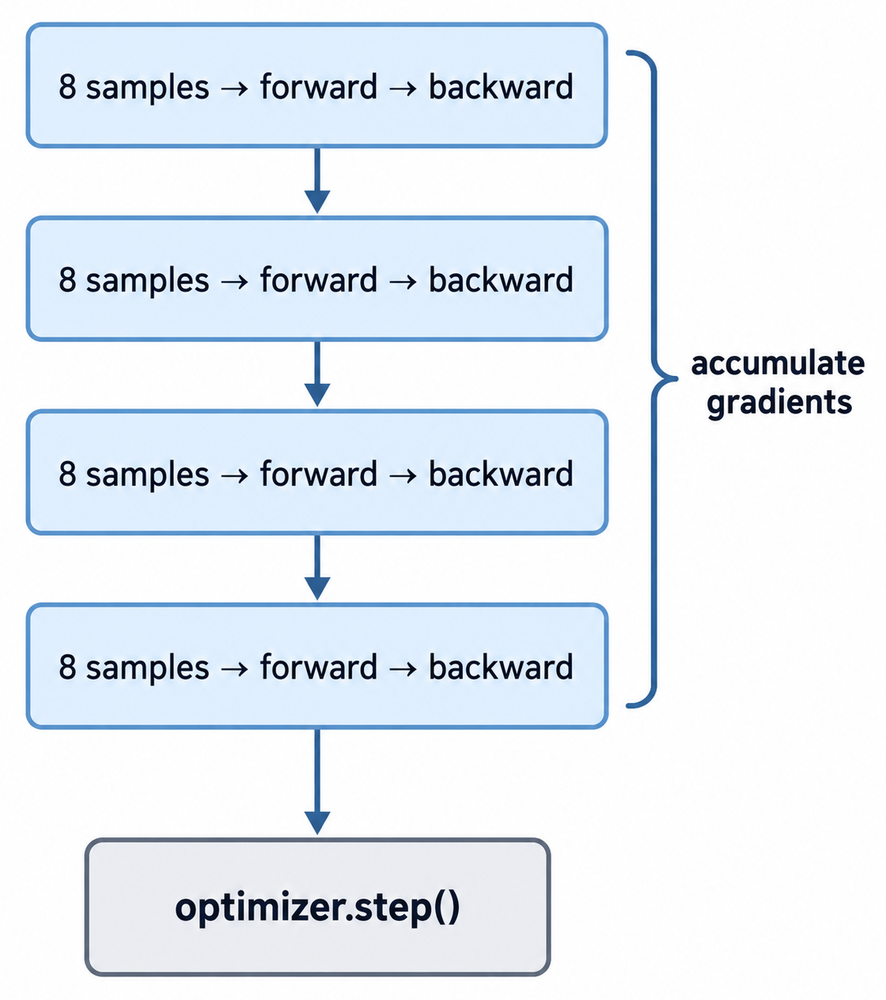

[](https://colab.research.google.com/github/jshn9515/dnnl-notebooks/blob/main/zh/ch12-llm-training-engineering/ch12.5-gradient-accumulation.ipynb){fig-align="left"}

We have seen that training memory is not determined solely by model parameters. Intermediate activations, especially during the forward pass, often grow substantially with batch size. A common situation is therefore that we want a larger batch, but the GPU cannot hold that many samples at once.

The most direct solution is to reduce the batch size. However, each parameter update then sees less data, and gradient noise is usually greater. Can the GPU process a small batch at a time while still using gradients from multiple small batches for each parameter update?

This is **Gradient Accumulation**.

Its core idea is simple:

> **Instead of updating parameters immediately after each backward pass, compute and accumulate gradients from several micro-batches, then perform one optimizer step.**

This gives parameter updates close to those of a larger batch while using less memory at a time.

```{python}
import copy

import torch
import torch.nn as nn
import torch.optim as optim
import torch.utils.data as utils
from torch import Tensor

print('PyTorch version:', torch.__version__)
```

## 12.5.1 From Batches to Micro-Batches

Suppose we originally want a batch size of 32:

$$
B = 32
$$

The GPU can hold at most 8 samples at once. Gradient accumulation splits the original batch into 4 smaller **micro-batches**:

$$
32 = 8 + 8 + 8 + 8
$$

The training process changes from:

{width=85%}

to:

{width=50%}

We usually distinguish three quantities:

- **Micro-batch size**: the number of samples actually sent to the GPU at once;
- **Gradient accumulation steps**: the number of micro-batches accumulated before a parameter update;
- **Effective batch size**: the number of samples actually used for a parameter update.

In single-GPU training:

$$
B_{\text{effective}} = B_{\text{micro}} \times N_{\text{accum}}
$$

For example:

$$
8 \times 4 = 32
$$

With `micro_batch=8` and `accum_steps=4`, each parameter update therefore combines gradients from 32 samples.

In multi-GPU training, we also multiply by the number of GPUs:

$$
B_{\text{effective}} = B_{\text{micro}} \times N_{\text{accum}} \times N_{\text{devices}}
$$

For now, we discuss only the single-GPU case. Synchronization in distributed training will be covered in 12.9.

## 12.5.2 What Does Gradient Accumulation Actually Accumulate?

Gradient accumulation relies on a basic PyTorch behavior:

> **Repeated calls to `backward()` accumulate gradients in each parameter's `.grad` by default, rather than overwriting them.**

Suppose the parameters are $\theta$ and the first micro-batch produces the gradient:

$$
g_1 = \nabla_\theta L_1
$$

After the first `backward()`:

$$
\theta.\text{grad} = g_1
$$

Without calling `zero_grad()`, we then run the backward pass for the second micro-batch:

$$
g_2 = \nabla_\theta L_2
$$

The parameter gradients become:

$$
\theta.\text{grad} = g_1 + g_2
$$

After $K$ backward passes:

$$
\theta.\text{grad} = \sum_{i=1}^{K} g_i
$$

Gradient accumulation therefore requires no special accumulator. PyTorch already accumulates `.grad`; we need to control when to clear gradients and when to update parameters.

Ordinary training usually follows:

```python
optimizer.zero_grad()
loss.backward()
optimizer.step()
```

Gradient accumulation reduces the frequency of `optimizer.step()` and `optimizer.zero_grad()`:

```python
optimizer.zero_grad()

loss1.backward()
loss2.backward()
loss3.backward()
loss4.backward()

optimizer.step()
```

The backward pass still runs for each micro-batch, but the optimizer step runs only once at the end of an accumulation window.

## 12.5.3 Why Can It Simulate a Larger Batch?

Suppose a large batch contains $B$ samples and has mean loss:

$$
L = \frac{1}{B} \sum_{j=1}^{B} \ell_j
$$

Taking the gradient with respect to $\theta$:

$$
\nabla_\theta L = \frac{1}{B} \sum_{j=1}^{B} \nabla_\theta \ell_j
$$

Now split this batch equally into $K$ micro-batches. Assume each micro-batch loss uses mean reduction:

$$
L_i = \frac{K}{B} \sum_{j \in \mathcal{B}_i} \ell_j
$$

The complete large-batch loss can then be written as:

$$
L = \frac{1}{K} \sum_{i=1}^{K} L_i
$$

Thus:

$$
\nabla_\theta L = \frac{1}{K} \sum_{i=1}^{K} \nabla_\theta L_i
$$

This explains why training code often contains:

```python
loss = loss / accum_steps
loss.backward()
```

Each micro-batch gradient is first divided by $K$, then accumulated:

$$
\frac{1}{K}g_1 + \frac{1}{K}g_2 + \cdots + \frac{1}{K}g_K = \frac{1}{K} \sum_{i=1}^{K}g_i
$$

This is exactly the mean gradient of the complete large batch.

If we forget to divide by `accum_steps`, we obtain the sum of gradients rather than their mean:

$$
\sum_{i=1}^{K} g_i
$$

It is approximately $K$ times larger than intended. Although adjusting the learning rate at the same time may give a similar effect in some cases, this no longer simulates the same large batch in the sense discussed here.

This equivalence has an important condition:

> **The model parameters must remain unchanged throughout the accumulation window.**

`optimizer.step()` must therefore come after all micro-batches have completed their backward passes. Updating parameters after every micro-batch would make subsequent gradients refer to different parameters, breaking equivalence to a single large batch.

## 12.5.4 A Complete PyTorch Training Loop

First, consider a simple single-GPU version. We assume each micro-batch contributes equally to the loss and handle a final incomplete accumulation window:

```{python}
def train_one_epoch(
    model: nn.Module,
    dataloader: utils.DataLoader[tuple[Tensor, ...]],
    loss_fn: nn.Module,
    optimizer: optim.Optimizer,
    accum_steps: int = 4,
):
    model.train()
    optimizer.zero_grad()
    micro_batches = len(dataloader)

    for micro_step, (x, y) in enumerate(dataloader):
        x = x.to(device)
        y = y.to(device)

        group_start = (micro_step // accum_steps) * accum_steps
        group_end = min(group_start + accum_steps, micro_batches)
        curr_accum_steps = group_end - group_start

        logits = model(x)
        loss = loss_fn(logits, y)
        loss = loss / curr_accum_steps
        loss.backward()

        if micro_step + 1 == group_end:
            optimizer.step()
            optimizer.zero_grad()
```

Only three points are essential:

1. `optimizer.zero_grad()` no longer belongs at the start of every micro-batch; otherwise, it clears the gradients just accumulated.
2. Run `backward()` immediately for every micro-batch. After it finishes, most of that micro-batch's computation graph and saved activations can be released without waiting for other micro-batches.
3. Run `optimizer.step()` only after an accumulation window finishes, then clear gradients to begin accumulating for the next parameter update.

The last point matters. The following code may also look like "compute 4 losses, then backpropagate," but does not achieve the intended effect:

```python
losses = []

for _ in range(4):
    logits = model(x)
    loss = loss_fn(logits, y)
    losses.append(loss)

sum(losses).backward()
```

The computation graphs of the first 3 forward passes must remain until the final `backward()`. Activations from several micro-batches then occupy memory simultaneously, eliminating the main memory advantage of gradient accumulation.

The correct approach is:

```python
for _ in range(4):
    logits = model(x)
    loss = loss_fn(logits, y) / 4
    loss.backward()
```

Running the backward pass immediately after each micro-batch's forward pass is what actually trades sequential execution over time for lower memory usage.

## 12.5.5 Comparing Full-Batch and Accumulated Gradients

Beyond the formulas, we can perform an experiment directly.

Construct two identical models. The first processes the full batch at once; the second splits the same data into 4 micro-batches and accumulates gradients. Then compare the gradients of each parameter.

```{python}
model_full = nn.Sequential(
    nn.Linear(8, 16),
    nn.GELU(),
    nn.Linear(16, 4),
)
model_accum = copy.deepcopy(model_full)

x = torch.randn(32, 8)
y = torch.randint(4, (32,))

loss_fn = nn.CrossEntropyLoss()
```

First, compute the full-batch gradients:

```{python}
model_full.zero_grad()

logits = model_full(x)
loss = loss_fn(logits, y)
loss.backward()

full_grads = [p.grad.detach().clone() for p in model_full.parameters()]
```

Then split the batch into 4 parts:

```{python}
model_accum.zero_grad()
accum_steps = 4

for x_micro, y_micro in zip(x.chunk(accum_steps), y.chunk(accum_steps), strict=True):
    logits = model_accum(x_micro)
    loss = loss_fn(logits, y_micro)
    loss = loss / accum_steps
    loss.backward()

accum_grads = [p.grad.detach().clone() for p in model_accum.parameters()]
```

Finally, compare the two sets of gradients:

```{python}
for i, (grad_full, grad_accum) in enumerate(zip(full_grads, accum_grads, strict=True)):
    max_diff = (grad_full - grad_accum).abs().max().item()
    print(f'Parameter {i} | Maximum gradient difference: {max_diff:.3e}')
```

Normally, they differ only by very small floating-point errors.

Gradient accumulation is therefore not a new gradient algorithm. It uses the linearity of gradient summation to split a large-batch backward pass into smaller backward passes and combine their results before updating parameters.

## 12.5.6 Which Memory Does Gradient Accumulation Save?

Gradient accumulation is often described as simulating a large batch with small batches, but it does not proportionally reduce all training memory.

Suppose the original batch size is 32 and we change it to:

```text
micro-batch size = 8
gradient accumulation steps = 4
```

The actual change is that only 8 samples need a forward and backward pass at any instant. Activations and some temporary buffers that depend strongly on batch size therefore usually decrease substantially. The following do not disappear when accumulation steps increase:

- The complete model parameters remain;
- The complete optimizer states remain;
- Gradients must still be retained throughout the accumulation window;
- Fixed overhead associated with the model architecture remains.

More accurately:

> **Gradient accumulation mainly reduces peak activation memory for an individual micro-batch; it does not divide total training memory by the number of accumulation steps.**

This makes it particularly suitable when a slightly larger batch causes OOM. If parameters and optimizer states already occupy most memory, increasing accumulation steps alone cannot address the underlying problem.

Another possible confusion is that gradient accumulation does not reduce gradient tensor sizes. Each trainable parameter still needs a `.grad` buffer, which receives gradients from successive micro-batches. It therefore addresses a different problem from activation checkpointing, which we discuss later.

## 12.5.7 Common Mistakes in the Training Loop

Gradient accumulation requires little code, but putting certain operations in the wrong place changes training semantics.

Gradient clipping is a common example. Suppose we use:

```python
nn.utils.clip_grad_norm_(model.parameters(), max_norm=1.0)
```

Clipping after every micro-batch backward pass clips each local gradient rather than the final accumulated large-batch gradient. The correct location is usually:

```python
loss.backward()

if should_update:
    nn.utils.clip_grad_norm_(model.parameters(), max_norm=1.0)
    optimizer.step()
    optimizer.zero_grad()
```

Finish the entire accumulation window, then clip the final gradients.

Learning rate schedulers have a similar issue. For most schedulers that update by training step, a `step` means an optimizer update rather than a micro-batch forward pass. We should therefore usually write:

```python
if should_update:
    optimizer.step()
    lr_scheduler.step()
    optimizer.zero_grad()
```

rather than call `lr_scheduler.step()` for every micro-batch. Otherwise, gradient accumulation makes the learning rate schedule advance much faster than the actual parameter updates.

The final issue is the end of an accumulation window. If only 2 micro-batches remain and `accum_steps=4`, dividing each loss by 4 still halves the final update's gradients. There are two solutions: discard the incomplete window, or dynamically calculate the number of micro-batches in the current window and divide by that number instead of always dividing by `accum_steps`. Large-scale LLM training often organizes data into regular batches beforehand, so this issue may be uncommon. A general training loop should nevertheless not assume that the dataloader length is divisible by accumulation steps.

## 12.5.8 Correct Normalization for Token-Level Loss

The derivation assumes equal loss weights for every micro-batch. This is usually reasonable for fixed-length training samples without padding. LLM training often includes padding, masks, or variable-length sequences, however, so the number of tokens that actually contribute to loss may differ between micro-batches.

Suppose micro-batch $i$ has $n_i$ valid tokens and returns mean loss:

$$
L_i = \frac{1}{n_i} \sum_{j=1}^{n_i} \ell_{ij}
$$

Simply writing:

$$
\frac{1}{K} \sum_{i=1}^{K}L_i
$$

gives each micro-batch equal weight.

To simulate averaging all valid tokens together in one large batch, we should instead calculate:

$$
L = \frac{\sum_{i=1}^{K} n_i L_i }{\sum_{i=1}^{K} n_i }
$$

In other words:

> **Strict equivalence requires weighting by valid token count, rather than always simply dividing by accumulation steps.**

When all sequences have fixed length and every position contributes to the loss:

$$
n_1 = n_2 = \cdots = n_K
$$

the two approaches are identical, making this distinction easy to overlook.

Token-level normalization therefore matters more when data includes substantial padding, packed sequences, loss masks, or variable-length samples. Actual LLM trainers often need to distinguish explicitly between averaging **micro-batch means** and averaging **valid tokens** over the complete accumulation window.

## 12.5.9 Is Gradient Accumulation Fully Equivalent to a Large Batch?

In the simplest models, the two can yield almost identical gradients. In real training, however, they are not necessarily fully equivalent.

First, BatchNorm depends on the current batch's mean and variance:

$$
\hat{x} = \frac{x - \mu_B}{\sqrt{\sigma_B^2 + \epsilon}}
$$

BatchNorm with a batch size of 32 therefore sees different statistics from 4 batches of size 8. Transformers usually use LayerNorm or RMSNorm, which do not depend on batch-dimension statistics, so this issue is less common.

Second, Dropout generates a random mask in each forward pass. A full large batch and multiple micro-batches therefore use different random masks. This usually does not disrupt training, but may produce small numerical differences.

Third, floating-point addition order matters. Floating-point addition is not strictly associative:

$$
(a + b) + c \neq a + (b + c)
$$

Even if all micro-batch losses are the same, gradient accumulation order may affect the final result.

Finally, if micro-batches have different valid token counts, dividing each micro-batch's mean loss by $K$ is not necessarily equivalent to averaging over all valid tokens. This matters particularly with padding or variable-length sequences.

A more accurate conclusion is:

> **Gradient accumulation usually simulates a larger effective batch, but is mathematically equivalent to a true large batch only when loss normalization and model behavior match.**

## 12.5.10 Chapter Summary

Gradient accumulation addresses a memory problem, but has costs.

It does not reduce the forward and backward computation needed for the same number of samples. Processing 32 samples at once becomes processing 8 samples 4 times in succession; the total computation does not simply disappear. Smaller micro-batches may even reduce GPU matrix-operation sizes and hardware utilization, sometimes lowering throughput.

The usual goal of gradient accumulation is therefore:

> **Obtain the desired effective batch size using a micro-batch size that fits in memory.**

A large batch and gradient accumulation are also not strictly numerically equivalent in every model. The derivation assumes samples do not affect each other through batch statistics. For layers such as BatchNorm that depend on current-batch statistics, smaller micro-batches change the mean and variance used by each forward pass, so accumulation cannot simply be assumed equivalent to a true large batch.

Increasing effective batch size also reduces optimizer updates per epoch. For example, updating every 8 samples becomes updating every 32 samples. Batch-size changes may affect optimization, so more accumulation steps are not always better. They should first be determined by memory constraints, then considered together with learning rate, warmup steps, training token count, and the target global batch size.

Gradient accumulation addresses the problem of **a large batch's activations not fitting in memory**: split it into micro-batches, run forward and backward passes one by one, and retain only the gradients. Another situation remains: even with micro-batch size 1, a single sample's activations are too large. We cannot reduce the batch size further, so we need to reduce the intermediate forward results saved for the backward pass.

The next section introduces **Activation Checkpointing**, which addresses exactly this problem.
