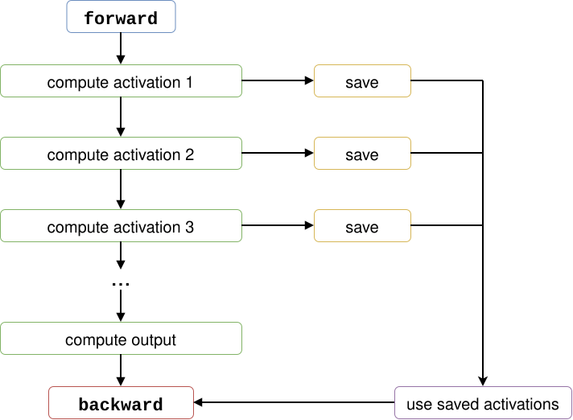

[](https://colab.research.google.com/github/jshn9515/dnnl-notebooks/blob/main/zh/ch12-llm-training-engineering/ch12.6-activation-checkpointing.ipynb){fig-align="left"}

In the previous section, we used gradient accumulation to split a large batch into multiple micro-batches, so that the GPU processes only some of the samples at a time. This can significantly reduce the peak activation memory associated with batch size. However, this approach has a clear lower limit:

> **The smallest possible micro-batch size is 1.**

What if the batch size is already 1, but the forward pass for a single sequence still does not fit in memory? Or what if the sequence is very long and the Transformer has many layers, so that even when processing just one sample at a time, the intermediate results saved during the forward pass for the backward pass still occupy a large amount of GPU memory?

In these cases, we need to address the activations themselves directly.

During normal training, the forward pass saves intermediate results that will be needed later in the backward pass. The idea behind **Activation Checkpointing** is to leave some of these intermediate results unsaved, then run the forward computation again to recompute them when the backward pass actually needs them. In other words, it makes a very direct trade-off:

$$
\text{less memory} \longleftrightarrow \text{more computation}
$$

In this section, we will look at exactly what activation checkpointing saves, where recomputation happens, and how to use it in Transformer training.

```{python}
import dnnlpy
import torch
import torch.accelerator as accl
import torch.nn as nn
import torch.nn.functional as F
import torch.utils.checkpoint as ckpt
from torch import Tensor

print('PyTorch version:', torch.__version__)
```

```{python}
device = dnnlpy.get_default_device()
print('Using device:', device)
```

## 12.6.1 Why Does the Backward Pass Need Saved Activations?

Let us start with the most basic question: why can we not simply discard all intermediate activations once the forward pass is complete?

Consider a very simple computation:

$$
y = Wx
$$

If the gradient of the loss with respect to the output is:

$$
\frac{\partial L}{\partial y}
$$

then computing the weight gradient requires:

$$
\frac{\partial L}{\partial W} = \frac{\partial L}{\partial y}x^T
$$

In other words, to compute the gradient of $W$, the backward pass needs access to the input $x$ from the forward pass.

The same is true in neural networks. A Transformer block may contain LayerNorm, QKV projection, attention, an MLP, an activation function, and a residual connection. Knowing only the final output is not enough for the backward pass; it also needs many intermediate tensors.

Therefore, the normal training process looks more like this:

{width=70%}

These activations have different lifetimes from ordinary temporary tensors. Many intermediate results have already served their purpose in the forward pass, but they cannot be released immediately because they will still be needed in the backward pass.

In a deep network, these saved tensors accumulate as computation proceeds through the network. Roughly speaking, if every layer needs to save a set of activations proportional to the batch size, sequence length, and hidden size, then a deeper network usually leaves more activations in memory at the end of the forward pass.

This is the problem activation checkpointing aims to solve:

> **The goal is not to eliminate activations, but to avoid keeping all of them in memory from the forward pass until the backward pass.**

## 12.6.2 What Does Activation Checkpointing Save?

Suppose a model consists of four blocks. During normal training, each block may save many internal activations for the backward pass:

{width=70%}

Activation checkpointing selects certain boundaries as **checkpoints**. For example, if we checkpoint Block 2 and Block 4, the forward pass mainly preserves the inputs to these blocks, rather than all the internal tensors that would normally be saved for the backward pass:

{height=450px}

Here, `checkpoint` does not mean the same thing as the model checkpoint we will discuss in Section 12.10.

- **Model checkpoint**: write parameters, optimizer states, and other information to disk so that training can be resumed later;
- **Activation checkpoint**: retain a small number of boundary tensors during training and use them to recompute intermediate activations during the backward pass.

Activation checkpointing is therefore also often called **gradient checkpointing**. However, what it actually checkpoints is not the gradients, but the boundary information needed to reconstruct the activations required for the backward pass.

One important point is:

> **Checkpointing does not reduce activation memory to 0.**

At least the following still need to exist:

- Inputs to checkpointed regions;
- Activations saved normally outside checkpointed regions;
- Tensors currently being used or recomputed during the backward pass;
- Parameters, gradients, and optimizer states.

Therefore, it reduces the intermediate activations that need to be kept for a long time across the forward → backward boundary, rather than compressing everything in GPU memory during training.

## 12.6.3 What Happens During the Backward Pass: Running the Forward Computation Again

The key step in checkpointing happens during the backward pass.

Suppose Block 2 and Block 4 are checkpointed. Normally, the forward pass saves the internal activations needed for the backward pass. With checkpointing enabled, however, it no longer retains these internal activations. When the backward pass reaches a checkpointed region, it first reruns that region's forward computation from the checkpointed inputs to recompute the intermediate results from the original forward pass, then continues the backward pass.

{height=800px}

For a checkpointed region, the computation therefore changes from:

$$
\text{Forward} + \text{Backward}
$$

to:

$$
\text{Forward} + \text{Recompute Forward} + \text{Backward}
$$

This is why checkpointing saves GPU memory while increasing the amount of computation.

If we denote the computational cost of the forward pass by $F$ and that of the backward pass by $B$, normal training costs approximately:

$$
C_{\text{normal}} = F + B
$$

If all forward computations need to be fully recomputed once during the backward pass, this becomes approximately:

$$
C_{\text{checkpoint}} \approx 2F + B
$$

In many dense neural networks, the backward pass itself is usually more expensive than the forward pass, so this does not mean training time necessarily doubles. To build intuition, suppose $B \approx 2F$. Then $F+B \approx 3F$, while adding one extra forward pass gives $2F+B \approx 4F$. The theoretical computational cost increases from roughly $3F$ to $4F$, or by about one third.

However, this is only an approximation to help us understand the trade-off. Actual wall-clock time also depends on kernel efficiency, memory bandwidth, checkpoint granularity, and the implementation of individual operators. We therefore cannot simply assume that checkpointing always makes training 33% slower. The actual cost should be measured through profiling and benchmarks, as in Section 12.3.

## 12.6.4 Basic Checkpointing in PyTorch

PyTorch provides:

```python
from torch.utils.checkpoint import checkpoint
```

Suppose we originally have a block:

```python
x = block(x)
```

The simplest way to checkpoint it is:

```python
x = checkpoint(block, x, use_reentrant=False)
```

Current PyTorch recommends the non-reentrant implementation, so we explicitly write:

```python
use_reentrant = False
```

We will explain later why `use_reentrant=False` is recommended.

First, let us implement a simple residual MLP block. It does not attempt to fully simulate a Transformer; it only preserves one important feature: it produces an intermediate activation larger than the hidden state.

```{python}
class MLPBlock(nn.Module):
    """A simple residual MLP block with LayerNorm and SiLU activation."""

    def __init__(self, hidden_size: int, intermediate_size: int):
        super().__init__()
        self.norm = nn.LayerNorm(hidden_size)
        self.fc1 = nn.Linear(hidden_size, intermediate_size)
        self.fc2 = nn.Linear(intermediate_size, hidden_size)

    def forward(self, x: Tensor) -> Tensor:
        residual = x
        x = self.norm(x)
        x = F.silu(self.fc1(x))
        x = self.fc2(x)
        return residual + x
```

Normal forward pass:

```{python}
block = MLPBlock(hidden_size=64, intermediate_size=256)
x = torch.randn(2, 16, 64)

y = block(x)
print('y.shape:', y.shape)
```

Checkpointed forward pass:

```{python}
y = ckpt.checkpoint(block, x, use_reentrant=False)
print('y.shape:', y.shape)
```

The outputs look the same. Activation checkpointing changes neither the model definition nor the implementation of the forward pass itself. It changes autograd's strategy for retaining intermediate tensors for the backward pass.

Next, we write a simplified Transformer block stack that supports checkpointing individual blocks:

```{python}
class MLPBlockStack(nn.Module):
    """Create a stack of MLP blocks with optional activation checkpointing."""

    def __init__(
        self,
        num_layers: int,
        hidden_size: int,
        intermediate_size: int,
        act_ckpt: bool = False,
    ):
        super().__init__()
        self.act_ckpt = act_ckpt
        self.blocks = nn.ModuleList(
            [MLPBlock(hidden_size, intermediate_size) for _ in range(num_layers)]
        )
        self.final_norm = nn.LayerNorm(hidden_size)

    def forward(self, x: Tensor) -> Tensor:
        for block in self.blocks:
            if self.training and self.act_ckpt:
                x = ckpt.checkpoint(block, x, use_reentrant=False)
            else:
                x = block(x)

        return self.final_norm(x)
```

Here, we deliberately include:

```python
if self.training and self.act_ckpt:
    x = ckpt.checkpoint(block, x, use_reentrant=False)
else:
    x = block(x)
```

This is because activation checkpointing is fundamentally intended to reduce the activation memory needed for **the backward pass during training**. Inference has no backward pass, so there is no need to reorganize the forward pass for this purpose.

To use it, we only need to control one switch:

```{python}
model = MLPBlockStack(
    num_layers=4,
    hidden_size=64,
    intermediate_size=256,
    act_ckpt=True,
)

x = torch.randn(2, 16, 64)
y = torch.randn(2, 16, 64)

loss = F.mse_loss(model(x), y)
loss.backward()

print('Loss:', loss.item())
```

A real Transformer block also contains attention, LayerNorm / RMSNorm, and other components, but the checkpointing approach remains the same. We do not need to manually tell PyTorch Autograd whether to save the MLP's intermediate results. We simply define a checkpointed region, and PyTorch automatically reruns that region's forward computation when the backward pass needs its internal activations.

## 12.6.5 Measuring Peak Memory: How Much GPU Memory Can We Save?

Understanding conceptually that checkpointing reduces saved activations is not enough; we can directly measure peak allocated memory on the GPU.

Below, we use the `MLPBlockStack` from earlier, run it with `act_ckpt=False` and `act_ckpt=True`, and compare memory usage. We also use `torch.Event`, introduced in Section 12.3, to measure the average step time and see how much additional computation time we pay for the reduction in memory usage.

```{python}
def benchmark_checkpointing(
    act_ckpt: bool,
    warmup_steps: int = 2,
    measure_steps: int = 5,
) -> tuple[float, float]:
    """Benchmark peak memory and step time with or without activation checkpointing."""
    if device.type == 'cpu':
        raise RuntimeError('GPU is required for this benchmark.')

    model = MLPBlockStack(
        num_layers=8,
        hidden_size=1024,
        intermediate_size=4096,
        act_ckpt=act_ckpt,
    ).to(device)

    model.train()
    x = torch.randn(16, 512, 1024, device=device)
    y = torch.randn(16, 512, 1024, device=device)

    def training_step():
        model.zero_grad()
        output = model(x)
        loss = F.mse_loss(output, y)
        loss.backward()

    for _ in range(warmup_steps):
        training_step()

    accl.synchronize()
    accl.reset_peak_memory_stats()

    start = torch.Event(enable_timing=True)
    end = torch.Event(enable_timing=True)

    start.record()
    for _ in range(measure_steps):
        training_step()
    end.record()
    end.synchronize()

    peak_mem = dnnlpy.bytes_to_gib(accl.max_memory_allocated())
    step_time = start.elapsed_time(end) / measure_steps

    return peak_mem, step_time
```

Then run the two configurations:

```{python}
#| eval: false
for enabled in [False, True]:
    peak_mem, step_time = benchmark_checkpointing(enabled)
    print(
        f'Checkpoint: {str(enabled):<5} | '
        f'Peak memory: {peak_mem:.4f} GiB | '
        f'Step time: {step_time:.4f} ms.'
    )
```

```code
Checkpoint: False | Peak memory: 3.0168 GiB | Step time: 1463.0235 ms.
Checkpoint: True  | Peak memory: 1.0474 GiB | Step time: 1708.7957 ms.
```

Of course, the specific peak memory and step time values depend on the model architecture and various other factors. What we should observe here are two trends:

- Peak activation memory gradually decreases;
- Training computation / time gradually increases.

This is the central trade-off in activation checkpointing.

To understand further **which region's** activations are no longer being saved, we can combine the profiler and memory profiling tools from Section 12.3, rather than looking only at a single final peak memory value.

## 12.6.6 Checkpoint Granularity: Finer Is Not Always Better

Once we know how to use `checkpoint()`, a natural question is: how large a region should we checkpoint?

At one extreme, we could checkpoint only small operators such as `Linear`, `GELU`, or `LayerNorm`. At the other, we could checkpoint an entire Transformer block, such as `nn.TransformerEncoderLayer`. In theory, finer granularity gives us more precise control over which activations to save and which to recompute. However, it also introduces more complex boundaries, more frequent checkpoint management, and recomputation overhead that may not be worthwhile.

For Transformers, **block-level checkpointing** is often a natural starting point because:

1. A block has clearly defined inputs and outputs;
2. A block contains many intermediate activations that can be released;
3. Checkpointing logic does not need to be scattered across every operator;
4. The implementation is simple, and checkpointing can easily be enabled or disabled for each layer.

However, checkpointing every layer is not the only option. If a Transformer has 24 layers, we can checkpoint only some of them, or group multiple layers into larger checkpointed regions. Choosing the granularity is essentially a way to adjust a continuous trade-off:

- Saving more activations increases memory usage from the forward pass until the backward pass, but reduces recomputation;
- Saving fewer activations reduces memory usage from the forward pass until the backward pass, but increases recomputation.

Therefore, we should not think of activation checkpointing as only a choice between `True` and `False`. In large-model training, the real question is usually:

> **Within the current memory budget, how much checkpointing is needed to accommodate the batch size and sequence length while avoiding unnecessary recomputation?**

## 12.6.7 Dropout, Randomness, and Stateful Forward Computation

Another issue is the correctness requirements that checkpointing places on the forward computation. Because checkpointing reruns the forward computation during the backward pass, it raises a very important requirement:

> **The recomputed results must remain semantically consistent with the original forward computation.**

The most typical example is dropout.

Suppose the dropout mask in the first forward pass is:

```text
[1, 0, 1, 1, 0, ...]
```

If recomputing the forward pass during the backward pass randomly produces a different mask:

```text
[0, 1, 1, 0, 1, ...]
```

then the recomputed activations no longer correspond to those from the original forward pass, and the gradients will naturally change as well.

By default, PyTorch's `checkpoint()` saves and restores the relevant RNG states so that checkpointed regions containing random operations such as dropout remain consistent during recomputation. This process itself has additional overhead, but we should not normally disable it just to save that overhead. If we are certain that the checkpointed region contains no random operations, we can explicitly pass `preserve_rng_state=False` to avoid this overhead.

::: {.callout-note}
For saving and restoring RNG states, PyTorch only guarantees reproducibility on the same device. If a checkpointed region spans devices, or if the forward and backward passes run on different devices, consistency of randomness is not necessarily guaranteed. See the [official PyTorch documentation](https://pytorch.org/docs/stable/checkpoint.html#torch.utils.checkpoint.checkpoint) for details.
:::

An even more dangerous situation is forward computation that depends on external state. For example:

```python
if GLOBAL_STEP < 100:
    ...
else:
    ...
```

If the original forward pass and the recomputation during the backward pass observe different external states, the two executions may take different branches, and the correctness of the gradient computation can no longer be guaranteed. Similarly, the following behaviors require particular care:

- The forward pass modifies global state;
- The forward pass has side effects on mutable objects other than its inputs, such as lists;
- Recomputation reads a cache that has already changed;
- The forward pass changes its computation path based on an external counter.

Therefore, a function suitable for checkpointing should ideally be close to a pure function:

$$
\text{output} = f(\text{input},\theta)
$$

Given the same inputs, parameters, and random state, it should produce consistent computational semantics. This is also why modules such as Transformer blocks, which have clear boundaries and consist mainly of tensor operations, are particularly suitable for activation checkpointing.

## 12.6.8 Why Is use_reentrant=False Recommended?

When using PyTorch activation checkpointing today, we often see:

```python
checkpoint(block, x, use_reentrant=False)
```

The `use_reentrant` parameter comes from PyTorch's two checkpointing implementations. We do not need to explore the internals of the autograd engine; we only need to remember a practical recommendation:

> **Modern PyTorch recommends using `use_reentrant=False` as the preferred option.**

The non-reentrant version has several features that are useful in practical training, for example:

- It still records the autograd graph during the forward pass, thereby supporting early stopping of recomputation;
- It provides more complete support for backward APIs;
- It does not require at least one input tensor and one output tensor of the checkpointed region to require gradients;
- It can stop early once the needed activations have been recomputed, rather than always rerunning the entire checkpointed function to completion.

::: {.callout-note}
For a complete comparison, see the `use_reentrant` section of the [official PyTorch documentation](https://pytorch.org/docs/stable/checkpoint.html#torch.utils.checkpoint.checkpoint).
:::

Therefore, in new training code, we should explicitly write the following rather than continue to rely on the default value:

```python
use_reentrant = False
```

This both avoids changes to default behavior after PyTorch version upgrades and makes it clear which checkpointing mechanism the code uses.

However, whichever implementation we use, the core idea remains the same: **save less during the forward pass and recompute during the backward pass.** `use_reentrant` changes how PyTorch implements this process, rather than the goal of activation checkpointing itself.

## 12.6.9 The Costs and Limits of Activation Checkpointing

Activation checkpointing is well suited to addressing activation memory usage in deep Transformers, but memory optimization is not simply a matter of turning it on and being done.

First, it mainly reduces saved activations and does not directly reduce:

- Parameters;
- Optimizer states;
- The gradient tensors themselves.

If even a model's parameters do not fit on a single GPU, enabling activation checkpointing alone cannot solve the problem. What we need instead is sharding of parameters, gradients, and optimizer states, which we will discuss later in distributed training, or lower-precision model states.

Second, activation checkpointing and gradient accumulation address different aspects of the problem:

{width=60%}

Therefore, we can use both methods together. For example:

```text
micro-batch size = 2
accumulation steps = 8
activation checkpointing = True
```

Here, gradient accumulation controls the number of samples sent to the GPU at a time, while activation checkpointing further reduces the peak activation memory generated by these 2 samples inside the deep network.

A practical adjustment sequence is to first determine the sequence length and global batch size that training actually requires, then choose the most practical micro-batch size within the current memory budget. If activations still occupy a large amount of GPU memory, enable block-level activation checkpointing and profile peak memory and throughput again.

In other words, instead of only asking whether to enable checkpointing, we should ask:

> **To fit the target batch size and model architecture on the current GPU, how much additional computation am I willing to trade for how much activation memory?**

This is the essence of activation checkpointing.

At this point, we have two very common tools for managing GPU memory during training: gradient accumulation controls the size of a single forward pass by splitting a batch into micro-batches, while activation checkpointing uses recomputation to reduce the intermediate results that must remain in memory from the forward pass until the backward pass. In the next section, we will turn to a completely different kind of checkpoint: **training-state checkpoints**. Instead of discussing which activations are temporarily retained in GPU memory, we will discuss how to save model parameters, optimizer states, the scheduler, and training progress to disk during a long LLM training run, and how to restore them correctly after training is interrupted.
