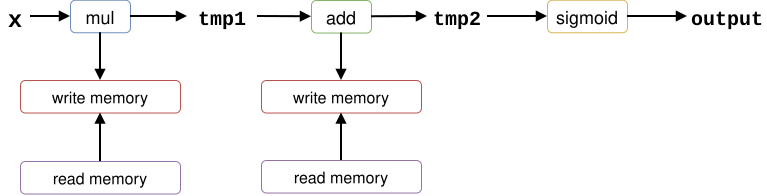

[](https://colab.research.google.com/github/jshn9515/dnnl-notebooks/blob/main/zh/ch12-llm-training-engineering/ch12.8-triton.ipynb){fig-align="left"}

We have analyzed operator performance through FLOPs, memory, and arithmetic intensity, and learned to find actual bottlenecks with a profiler. A natural question now is:

> **Once the profiler identifies a slow region of GPU computation, what can we do next?**

We should often prefer highly optimized implementations from PyTorch, cuBLAS, cuDNN, FlashAttention, and similar libraries. Reimplementing an ordinary matrix multiplication kernel is usually unnecessary.

Other computations consist of many small elementwise operators, reductions, and reshapes rather than one large operator. Each may appear fast, but they repeatedly launch CUDA kernels, write intermediate results to GPU memory, and read them back. A common optimization is **kernel fusion**: combining multiple operators into one GPU kernel.

**Triton** [@tillet2019Triton] is an important tool for this work. It lets us describe GPU data tiling, loading, computation, and stores in a Python-like style, without immediately handling CUDA threads, shared memory, and many low-level details.

This section does not attempt to teach all of Triton. We have two goals:

1. Understand how a basic Triton kernel works;
2. Judge when writing our own kernel is worthwhile.

```{python}
import dnnlpy
import torch
import torch.accelerator as accl
import torch.nn.functional as F
import triton
import triton.language as tl
from torch import Tensor
from torch.testing import assert_close
from triton.testing import do_bench

print('PyTorch version:', torch.__version__)
print('Triton version:', triton.__version__)
```

```{python}
device = dnnlpy.get_default_device()
print('Using device:', device)
```

## 12.8.1 Why PyTorch Code Does Not Necessarily Mean One Kernel

In PyTorch, we often write:

```python
y = x * weight
y = y + bias
y = y.sigmoid()
```

These look like three simple tensor operations in Python, but in eager mode they usually correspond to separate GPU operators.

Conceptually:



The issue is not necessarily computational cost. `sigmoid` and elementwise multiplication are fairly simple; the actual waste may come from:

- Multiple kernel launches;
- Intermediate tensor allocations;
- Repeated writes of intermediate results to global memory;
- The next kernel reading the same data again.

Combining these operations into one kernel ideally gives:

{height=260px}

This is the basic intuition behind **fusion**.

However, an important order of decisions is:

> **Seeing several PyTorch operators does not mean we should immediately write Triton.**

PyTorch's compiler may also perform fusion. For example, `torch.compile` can compile a Python / PyTorch graph into fewer kernels. A more reasonable optimization sequence is usually:

1. Use existing high-performance operators first;
2. If a bottleneck remains, try `torch.compile`;
3. If `torch.compile` still cannot solve it and the profiler confirms that the bottleneck remains;
4. Finally consider writing a Triton kernel.

Triton provides additional control over kernel behavior at the end of this process, rather than being the first answer to every performance problem.

## 12.8.2 Triton's Execution Model: One Program Processes a Block of Data

::: {.callout-note}
We assume familiarity with basic GPU and CUDA programming concepts, such as threads, warps, thread blocks, and grids. If needed, first consult the [CUDA C++ Programming Guide](https://docs.nvidia.com/cuda/cuda-c-programming-guide/index.html).
:::

CUDA often describes GPU programs through threads, warps, and thread blocks. We usually explicitly specify the number of thread blocks in a grid and the threads per block. For example:

```text
kernel<<<16, 256>>>(...);
```

means:

```
Grid
├── Block 0
│   ├── Thread 0
│   ├── Thread 1
│   ├── ...
|   └── Thread 255
|
├── Block 1
│   ├── Thread 0
│   ├── Thread 1
│   ├── ...
|   └── Thread 255
├── ...
|
└── Block 15
    ├── Thread 0
    ├── Thread 1
    ├── ...
    └── Thread 255
```
For a simple vector operation, a CUDA thread often uses:

```cpp
int idx = blockIdx.x * blockDim.x + threadIdx.x;
```

to determine the data position it handles.

Triton uses a somewhat higher-level abstraction. Instead of considering every underlying GPU thread directly, we first decide:

> **Which block of data should a Triton program instance handle?**

A Triton program can roughly be understood as having an abstraction level similar to a CUDA thread block, although the two are not fully equivalent.

Suppose a vector has length 1024 and each Triton program handles 256 elements:

```text
Program 0 → x[   0: 256]
Program 1 → x[ 256: 512]
Program 2 → x[ 512: 768]
Program 3 → x[ 768: 1024]
```

We therefore need to launch only 4 Triton programs.

The current program's index is obtained with:

```python
pid = tl.program_id(axis=0)
```

Here, `axis=0` is analogous to CUDA's `blockIdx.x`: it gives the current program's index in dimension 0 of the grid.

If each program handles `BLOCK_SIZE` elements, its starting position is:

```python
block_start = pid * BLOCK_SIZE
```

For example, with `pid=2` and `BLOCK_SIZE=256`:

```text
block_start = 2 * 256 = 512
```

Program 2 therefore starts processing at `x[512]`.

Next, using:

```python
offsets = block_start + tl.arange(0, BLOCK_SIZE)
```

gives all data positions handled by this program at once:

```text
offsets = [512, 513, 514, ..., 767]
```

Importantly, `tl.arange()` is not a Python loop. It creates a Triton tensor representing the positions to process within the current program. Subsequent `tl.load()` and `tl.store()` operations process the entire block using these offsets, rather than looping over elements one by one.

The rough correspondence between CUDA and Triton is:

::: {.list-table}
Table 12.8.2 Rough correspondence between CUDA and Triton

- - CUDA
  - Triton

- - Grid
  - Grid

- - Thread Block
  - Program Instance

- - `blockIdx.x`
  - `tl.program_id(0)`

- - `blockDim.x`
  - `BLOCK_SIZE`

- - `threadIdx.x`
  - Usually not exposed directly

- - Each thread determines what it processes
  - Each program determines what it processes
:::

The core way to think about Triton kernels is therefore:

> **Decide which data block each program handles, then let many programs process the full tensor in parallel.**

## 12.8.3 The First Triton Kernel: Vector Addition

Start with a simple vector addition:

$$
y_i = a_i + b_i
$$

The PyTorch version takes one line:

```python
y = a + b
```

The corresponding Triton kernel is:

```{python}
@triton.jit
def add_triton_kernel(
    a_ptr: tl.tensor,
    b_ptr: tl.tensor,
    output_ptr: tl.tensor,
    n_elements: int,
    BLOCK_SIZE: tl.constexpr,
):
    pid = tl.program_id(0)

    block_start = pid * BLOCK_SIZE
    offsets = block_start + tl.arange(0, BLOCK_SIZE)

    mask = offsets < n_elements

    a = tl.load(a_ptr + offsets, mask=mask)
    b = tl.load(b_ptr + offsets, mask=mask)

    output = a + b

    tl.store(output_ptr + offsets, output, mask=mask)
```

At first, this looks much more complex than `a + b`, but only a few operations are essential:

{height=450px}

`@triton.jit` means that Triton's JIT compiler compiles this function into a GPU kernel. `a_ptr`, `b_ptr`, and `output_ptr` are pointer arguments to input/output tensor data. `tl.load()` reads a full block using these pointers and offsets, and `tl.store()` writes the results back after computation.

Although Triton code resembles Python, the kernel does not execute ordinary Python element by element.

## 12.8.4 Why Masks Appear Almost Everywhere

The kernel above has another important component:

```python
mask = offsets < n_elements
```

If `n_elements=1000` and `BLOCK_SIZE=256`, we need:

$$
\left\lceil\frac{1000}{256}\right\rceil = 4
$$

programs.

The first three programs each handle a complete set of 256 elements, but the final program theoretically produces:

```text
[768, 769, ..., 1023]
```

Among these:

```text
1000, 1001, ..., 1023
```

are outside the tensor's bounds. We therefore need:

```python
mask = offsets < n_elements
```

and pass it to load / store:

```python
tl.load(a_ptr + offsets, mask=mask)
tl.store(y_ptr + offsets, y, mask=mask)
```

Think of this as a safety switch: load / store normally for `offsets` inside the array, and mask out `offsets` outside it to avoid out-of-bounds access. This is common in GPU kernels:

> **Block size is usually chosen for execution efficiency and does not necessarily divide the tensor shape evenly.**

A `mask` is therefore an important mechanism for correct memory access at block boundaries, rather than a decorative feature of Triton code.

## 12.8.5 Grid: How Many Programs Should We Launch?

After writing the kernel, we must tell Triton how many programs are needed for the full tensor.

First, write a Python wrapper:

```{python}
def add_triton(a: Tensor, b: Tensor) -> Tensor:
    if a.is_cpu or b.is_cpu:
        raise AssertionError('Triton kernel only supports GPU tensors.')
    if a.size() != b.size():
        raise AssertionError('Input tensors must have the same shape.')
    if not a.is_contiguous() or not b.is_contiguous():
        raise AssertionError('Triton kernel only supports contiguous tensors.')

    output = torch.empty_like(a)
    n_elements = a.nelement()

    BLOCK_SIZE = 256
    grid = (triton.cdiv(n_elements, BLOCK_SIZE),)

    add_triton_kernel[grid](a, b, output, n_elements, BLOCK_SIZE=BLOCK_SIZE)

    return output
```

Here:

```python
triton.cdiv(n_elements, BLOCK_SIZE)
```

performs ceiling division:

$$
N_{\text{programs}} =
\left\lceil \frac{N_{\text{elements}}}{\text{BLOCK\_SIZE}} \right\rceil
$$

Then:

```python
add_kernel[grid](...)
```

launches the kernel with this grid.

Triton's `BLOCK_SIZE` is not fully equivalent to CUDA's `blockDim.x`. CUDA's `blockDim.x` describes threads per block, while Triton's `BLOCK_SIZE` describes elements processed per program. Triton internally launches CUDA threads to process these elements, but we usually do not need to handle that detail.

If `n_elements` is one million and `BLOCK_SIZE=256`, one program does not process all one million elements. Many programs are launched, each handling a small data block. This explains why `BLOCK_SIZE` matters: it changes each program's workload and thus GPU parallelism, memory access, and register usage.

At this introductory stage, we need not derive a perfect `BLOCK_SIZE` manually. Establish correctness first, then tune through benchmarks. If the parameter space becomes more complex, Triton's autotune mechanism can search different configurations.

Let us now verify correctness.

```{python}
#| eval: false
a = torch.randn(1000, device=device)
b = torch.randn_like(a)

y_actual = add_triton(a, b)
y_expected = a + b

assert_close(y_actual, y_expected)
print('Correctness check passed.')
```

```code
Correctness check passed.
```

## 12.8.6 From Multiple Operators to One Kernel: Fused SwiGLU

Vector addition explains Triton's basic structure, but usually does not need a custom implementation. Fusing several small operators is a more useful case.

For example, many LLM MLPs use SwiGLU:

$$
\begin{aligned}
\operatorname{SwiGLU}(x)
&= \operatorname{SiLU}(xW_{\text{gate}})\odot(xW_{\text{up}}) \\
&= (xW_{\text{gate}})\sigma(xW_{\text{gate}})\odot(xW_{\text{up}})
\end{aligned}
$$

We can put the complete elementwise computation into one Triton kernel:

```{python}
@triton.jit
def swiglu_triton_kernel(
    gate_ptr: tl.tensor,
    up_ptr: tl.tensor,
    output_ptr: tl.tensor,
    n_elements: int,
    BLOCK_SIZE: tl.constexpr,
):
    pid = tl.program_id(0)

    offsets = pid * BLOCK_SIZE + tl.arange(0, BLOCK_SIZE)
    mask = offsets < n_elements

    gate = tl.load(gate_ptr + offsets, mask=mask)
    up = tl.load(up_ptr + offsets, mask=mask)

    silu = gate * tl.sigmoid(gate)
    output = silu * up

    tl.store(output_ptr + offsets, output, mask=mask)
```

The Python wrapper is almost the same as before:

```{python}
def swiglu_triton(gate: Tensor, up: Tensor) -> Tensor:
    if gate.is_cpu or up.is_cpu:
        raise AssertionError('Triton kernel only supports GPU tensors.')
    if not gate.is_contiguous() or not up.is_contiguous():
        raise AssertionError('Triton kernel only supports contiguous tensors.')

    output = torch.empty_like(gate)
    n_elements = gate.nelement()

    BLOCK_SIZE = 256
    grid = (triton.cdiv(n_elements, BLOCK_SIZE),)

    swiglu_triton_kernel[grid](gate, up, output, n_elements, BLOCK_SIZE=BLOCK_SIZE)

    return output
```

The PyTorch eager expression can be viewed conceptually as:

{height=550px}

The fused Triton kernel can retain intermediate results within the current program's computation:

{height=260px}

Although we have not greatly reduced mathematical computation, we have reduced intermediate tensors and kernel boundaries. This is where Triton is valuable.

If `torch.compile` already fuses the same expression, handwritten Triton may not be faster. An opportunity for fusion is therefore a reason to write Triton, not a guarantee of improved performance.

## 12.8.7 Verify Correctness Before Discussing Performance

After writing a kernel, first compare its results with a reference implementation before benchmarking. For SwiGLU, PyTorch can serve as the reference:

```{python}
#| eval: false
gate = torch.randn(4096, 4096, device=device)
up = torch.randn_like(gate)

y_actual = swiglu_triton(gate, up)
y_reference = F.silu(gate) * up

assert_close(y_actual, y_reference)
print('Correctness check passed.')
```

```code
Correctness check passed.
```

Do not simply demand bitwise identity. Implementations may use different computation orders or approximate mathematical functions, producing normal floating-point differences, especially in FP16 / BF16.

At minimum, verify a custom kernel with:

- Different tensor shapes;
- Shapes not divisible by `BLOCK_SIZE`;
- Dtypes used in actual training;
- Numerical edge cases, such as extremely large or small values;
- Non-contiguous tensors if different strides are supported.

Our simple implementation explicitly requires contiguous tensors. Triton itself is not limited to them; this kernel treats a tensor as one-dimensional contiguous memory. Supporting complex layouts requires correct stride handling.

A practical cost of custom kernels is therefore:

> **Shapes, strides, dtypes, and edge cases previously handled by the framework may become the kernel author's responsibility.**

## 12.8.8 Benchmark: Speed Must Be Measured

Compare performance only after establishing correctness.

Triton provides `triton.testing.do_bench()` to execute workloads repeatedly and report kernel runtime. For example:

```{python}
#| eval: false
def swiglu_torch(gate: Tensor, up: Tensor) -> Tensor:
    return F.silu(gate) * up


# Trigger compilation before benchmark.
swiglu_compiled = torch.compile(swiglu_torch)
swiglu_compiled(gate, up)
accl.synchronize()

eager_time = do_bench(lambda: swiglu_torch(gate, up), return_mode='median')
compiled_time = do_bench(lambda: swiglu_compiled(gate, up), return_mode='median')
triton_time = do_bench(lambda: swiglu_triton(gate, up), return_mode='median')

print(f'PyTorch eager: {eager_time:.4f} ms.')
print(f'PyTorch torch.compile: {compiled_time:.4f} ms.')
print(f'Triton: {triton_time:.4f} ms.')
```

```code
PyTorch eager: 5.6221 ms.
PyTorch torch.compile: 3.2689 ms.
Triton: 3.3234 ms.
```

We deliberately compare three implementations:

- PyTorch eager;
- PyTorch `torch.compile`;
- A custom Triton kernel.

The real question is:

> **Can handwritten Triton outperform an already optimized PyTorch implementation, and is the benefit worth the maintenance cost?**

Do not benchmark only one shape. Good performance on `[4096, 4096]` does not imply good performance on `[8, 4096]`. LLM batch size, sequence length, and hidden size all affect kernel workload. Test the shape distribution common in the real workload rather than selecting only one benchmark.

## 12.8.9 Why Training Kernels Are Harder Than Forward Demos

So far, we have written only forward kernels. Since our subject is LLM training, we must remember:

> **A working forward pass does not mean this custom kernel can directly replace training code.**

Ordinary PyTorch code:

```python
output = F.silu(gate) * up
```

is recorded by autograd in the computation graph, so PyTorch knows how to compute the following during the backward pass:

$$
\frac{\partial L}{\partial g}, \quad \frac{\partial L}{\partial u}
$$

A standalone GPU kernel essentially reads and writes tl.tensor values. We cannot assume that autograd automatically derives a backward pass from its source. We need to implement a backward kernel ourselves or at least provide a reference backward implementation.

Actual training systems must therefore also consider:

- How to implement the backward kernel;
- Which forward tensors to save for the backward pass;
- Whether to integrate using `torch.compile` / `torch.library`;
- Which dtype to use for accumulation under mixed precision;
- Compatibility with PyTorch mechanisms such as distributed training and tensor subclasses.

A Triton forward demo of a few dozen lines is therefore still far from a fused operator suitable for long-term use in a training framework.

Official Triton tutorials include more complete forward + backward examples for LayerNorm and attention. When implementing a training kernel, treat forward, backward, correctness, and benchmarking as one whole, rather than considering only the forward pass.

## 12.8.10 Chapter Summary

After learning one Triton kernel, it is easy to feel tempted to rewrite every PyTorch operator ourselves.

In practice, a more reasonable decision sequence is:

{height=550px}

Cases usually suited to Triton include:

- Clear opportunities to fuse multiple elementwise / reduction operators;
- Intermediate tensors causing unnecessary global memory traffic;
- Relatively fixed workload shapes that allow specialization for real inputs;
- Profiling has shown that this region consumes substantial training time;
- General-purpose libraries lack a suitable fused implementation.

Conversely, for ordinary GEMM, an existing mature fused operator, or code occupying only 1% of runtime, maintaining a custom Triton kernel may cost more than it gains. Triton's main value is finer GPU control when needed, rather than rewriting PyTorch in lower-level code.

We have moved from computation and memory access through profiling and modern attention APIs to writing GPU kernels. The tools become progressively lower level, but serve the same engineering principle:

> **Identify the resource that is actually constrained, then choose the corresponding optimization.**

Triton enters our toolbox when the profiler locates a specific kernel bottleneck that mature operators and `torch.compile` still cannot resolve.

This is the essential order of performance optimization: **measure performance first, then optimize.** The next section moves from operator efficiency within one GPU to single-machine multi-GPU training, discussing how DDP, ZeRO, and FSDP share computation and training states.
