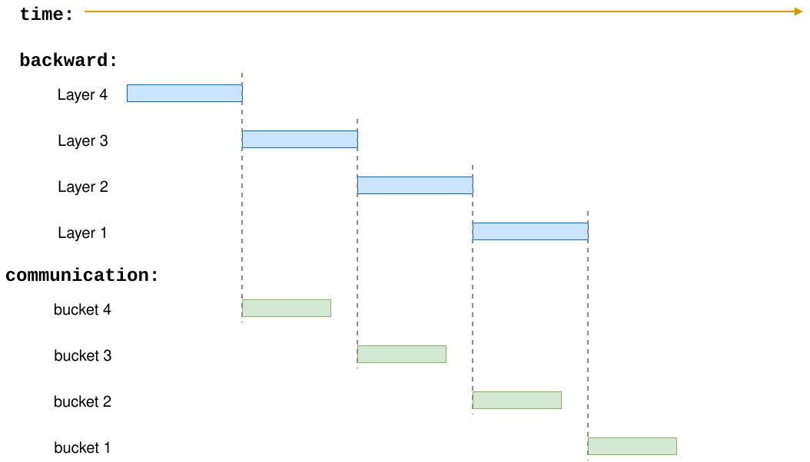

[](https://colab.research.google.com/github/jshn9515/dnnl-notebooks/blob/main/zh/ch12-llm-training-engineering/ch12.9-distributed-training.ipynb){fig-align="left"}

So far, we have assumed training runs on one GPU. Gradient accumulation splits a large batch into micro-batches, activation checkpointing reduces activation memory through recomputation, and mixed precision reduces the storage and compute costs of many tensors.

These methods have one thing in common:

> **They still use only one GPU's compute and memory resources.**

As models grow, we usually encounter two different problems.

The first is **slow training**. A GPU can process only a limited number of tokens per second. With 8 GPUs, we naturally want them to process different data simultaneously and increase overall throughput.

The second is **model states that do not fit in memory**. Even with micro-batch size 1 and activation checkpointing enabled, parameters, gradients, and optimizer states may exceed a single GPU's memory.

These problems lead to two approaches:

1. Store a complete model on each GPU and process different data: Data Parallel / DDP;
2. Distribute the model states themselves across GPUs: ZeRO / FSDP.

We will not cover every parallelism strategy here. Tensor Parallel, Pipeline Parallel, and Sequence Parallel are important, but address other forms of model partitioning. We will first clarify a common progression:

> **From replicated data parallelism to sharded data parallelism.**

```{python}
import os
from functools import partial

import dnnlpy
import torch
import torch.accelerator as accl
import torch.distributed as dist
import torch.distributed.fsdp as fsdp
import torch.distributed.fsdp.wrap as wrap
import torch.nn as nn
import torch.optim as optim
import torch.utils.data as utils
from torch.distributed.fsdp import FullyShardedDataParallel, ShardingStrategy
from torch.distributed.optim import ZeroRedundancyOptimizer
from torch.nn.parallel import DistributedDataParallel

print('PyTorch version:', torch.__version__)
```

```{python}
device = dnnlpy.get_default_device()
print('Using device:', device)
```

## 12.9.1 From Single-GPU Training to Data Parallelism

Consider the simplest case.

Suppose we have 4 GPUs and the model fits completely on each. The most direct approach is to store an identical model on every GPU:

```text
GPU 0: model copy 0
GPU 1: model copy 1
GPU 2: model copy 2
GPU 3: model copy 3
```

Then split a global batch into 4 parts:

```text
global batch
    │
    ├── batch 0 → GPU 0
    ├── batch 1 → GPU 1
    ├── batch 2 → GPU 2
    └── batch 3 → GPU 3
```

Each GPU independently performs its forward and backward passes:

```text
GPU 0: x0 → forward → backward → g0
GPU 1: x1 → forward → backward → g1
GPU 2: x2 → forward → backward → g2
GPU 3: x3 → forward → backward → g3
```

A problem remains.

Each GPU sees different data and therefore produces different gradients. If each directly performs its optimizer step:

```text
θ0 ← update(θ0, g0)
θ1 ← update(θ1, g1)
θ2 ← update(θ2, g2)
θ3 ← update(θ3, g3)
```

the four model copies soon diverge.

The key to data parallelism is:

> **Synchronize gradients across GPUs before updating parameters.**

For example, suppose the 4 GPUs produce:

$$
g_0, \quad g_1, \quad g_2, \quad g_3
$$

After synchronization, every GPU uses the same mean gradient:

$$
\bar g = \frac{1}{4} (g_0 + g_1 + g_2 + g_3)
$$

Every GPU then performs the same optimizer update:

$$
\theta_{t+1} = \mathrm{Update}(\theta_t, \bar g)
$$

With identical initial models, synchronized gradients, and optimizer states, model parameters remain identical across GPUs.

Data parallelism is therefore fundamentally:

> **Replicate the model, split the data, and synchronize the gradients.**

This also explains how to calculate global batch size.

If each GPU has micro-batch size $B_{\text{micro}}$, there are $N_{\text{dp}}$ GPUs, and gradient accumulation uses $N_{\text{accum}}$ steps:

$$
B_{\text{global}} = B_{\text{micro}} \times N_{\text{dp}} \times N_{\text{accum}}
$$

For example, 8 GPUs processing 4 samples each and accumulating 16 backward passes use 512 samples per optimizer update.

## 12.9.2 Rank, World Size, and Process Groups

Before examining DDP, we need a few terms that appear throughout distributed training.

Suppose we launch 4 training processes, each controlling one GPU:

```text
Process 0 → GPU 0
Process 1 → GPU 1
Process 2 → GPU 2
Process 3 → GPU 3
```

Each process has a unique index called its **rank**:

```text
rank = 0, 1, 2, 3
```

The total process count is the **world size**:

$$
\text{world size} = 4
$$

We also commonly see local rank, the process's device index on **its own machine**. On one machine, rank and local rank often look identical. In multi-node training, for example with two machines and 4 GPUs each:

```text
Node 0:
    rank 0 → local rank 0
    rank 1 → local rank 1
    rank 2 → local rank 2
    rank 3 → local rank 3

Node 1:
    rank 4 → local rank 0
    rank 5 → local rank 1
    rank 6 → local rank 2
    rank 7 → local rank 3
```

Thus:

- **rank**: the current process's global index in the distributed process group;
- **local rank**: its index within the local node, usually used to bind a local GPU;
- **world size**: the total process count in the distributed process group.

The processes must also belong to the same **Process Group** to perform collective communication, such as:

- `broadcast`: one rank sends data to all other ranks;
- `reduce`: aggregate data from all ranks and place the result on one rank;
- `all_reduce`: aggregate data from all ranks and give every rank the result;
- `all_gather`: every rank contributes data, and every rank collects everyone's data;
- `reduce_scatter`: aggregate data contributed by each rank, then distribute result shards to the ranks.

A process group defines:

> **Which ranks communicate together.**

In simple data-parallel training, all ranks usually belong to one group.

PyTorch generally uses `torchrun` to launch multiple training processes. For example, for 4 GPUs on one machine:

```bash
torchrun --standalone --nproc-per-node=4 train.py
```

`torchrun` sets environment information such as rank, world size, and local rank for each process. The training program then initializes the process group:

```python
local_rank = int(os.environ['LOCAL_RANK'])
device = torch.device(device.type, local_rank)
backend = dist.get_default_backend_for_device(device)

accl.set_device_index(device)
dist.init_process_group(backend)

print(
    f'rank: {dist.get_rank()}, '
    f'world_size: {dist.get_world_size()}, '
    f'local_rank: {local_rank}'
)
```

The key is to build this intuition, rather than memorize the launch command:

> **Usually, each GPU corresponds to one training process, or one rank.**

Many DDP, ZeRO, and FSDP behaviors fundamentally determine:

> **What each rank stores, and what data ranks exchange at which points.**

## 12.9.3 DistributedDataParallel: A Complete Model per Rank

PyTorch's most common data-parallel implementation is `DistributedDataParallel`, usually abbreviated **DDP**.

Its basic structure is:

{width=80%}

At the start of training, every rank holds a complete model:

```text
Rank 0: θ
Rank 1: θ
Rank 2: θ
Rank 3: θ
```

Each rank computes its forward pass independently without exchanging activations.

The important communication occurs during the backward pass. When parameter gradients are ready, DDP organizes them into buckets and performs **all-reduce** on each bucket. Mathematically:

$$
g_{\text{avg}} = \frac{1}{N} \sum_{r=0}^{N-1}g_r
$$

After all-reduce, every rank has the same reduced gradient:

```text
Rank 0: g_avg
Rank 1: g_avg
Rank 2: g_avg
Rank 3: g_avg
```

Every rank can therefore execute the same local:

```python
optimizer.step()
```

without broadcasting updated parameters from rank 0 to other ranks.

A minimal DDP structure is approximately:

```python
local_rank = int(os.environ['LOCAL_RANK'])
device = torch.device(device.type, local_rank)
backend = dist.get_default_backend_for_device(device)

accl.set_device_index(backend)
dist.init_process_group(backend)

model = nn.Transformer().to(device)
model = DistributedDataParallel(model, device_ids=[device])

sampler = utils.DistributedSampler(dataset, shuffle=True)
dataloader = utils.DataLoader(dataset, batch_size=micro_batch_size, sampler=sampler)
optimizer = optim.AdamW(model.parameters(), lr=3e-4)

for epoch in range(num_epochs):
    # Must happen before iterating over the dataloader.
    sampler.set_epoch(epoch)

    for batch in dataloader:
        optimizer.zero_grad()
        batch = batch.to(device)
        loss = model(batch)
        loss.backward()
        optimizer.step()
```

`DistributedSampler` also matters. DDP synchronizes gradients, but does not automatically partition the input dataset. If each rank traverses the full dataset, 4 GPUs may repeat computation on the same data. Before iterating through `dataloader` in each epoch, also call `sampler.set_epoch(epoch)`. Otherwise, `DistributedSampler` uses the same RNG across epochs, giving each rank the same data partition and order each epoch.

Data parallelism therefore usually combines:

- `DistributedSampler`: different ranks read different data;
- `DistributedDataParallel`: different ranks synchronize gradients.

## 12.9.4 Why DDP Improves Speed but Does Not Solve Model-State Memory

DDP's most direct benefit is throughput.

With a sufficiently large workload and controlled communication overhead, multiple ranks process more data simultaneously:

```text
1 GPU:
batch → compute → next batch

4 GPUs:
batch 0 → GPU 0 ┐
batch 1 → GPU 1 ├─ parallel compute
batch 2 → GPU 2 ┤
batch 3 → GPU 3 ┘
```

DDP does not wait until the entire backward pass finishes to synchronize all gradients at once. That would fully expose communication on the critical path and slow training.

Instead, DDP divides gradients into buckets. Once a bucket's gradients are ready, its all-reduce can start while autograd continues backpropagating through earlier layers:



This is **communication / computation overlap**.

DDP has a clear limitation, however: each rank still stores complete model states.

For now, consider only:

- Parameters;
- Gradients;
- Optimizer states.

Denote them as:

$$
M_P, \quad M_G,\quad M_O
$$

DDP model-state memory per rank remains approximately:

$$
M_{\text{DDP}} \approx M_P + M_G + M_O
$$

Even if world size increases from 1 to 8:

$$
M_{\text{DDP per rank}} \not\approx \frac{M_P + M_G + M_O}{8}
$$

because these 8 GPUs store 8 replicas:

```text
Rank 0: P + G + O
Rank 1: P + G + O
Rank 2: P + G + O
...
Rank 7: P + G + O
```

DDP therefore mainly addresses:

> **The same model already fits on one GPU, but we want more GPUs to increase training throughput.**

If complete parameters + gradients + optimizer states cannot fit on a single GPU, adding DDP ranks alone will not solve the problem. This motivates ZeRO.

## 12.9.5 ZeRO: Why Store the Same States on Every GPU?

DDP stores many states redundantly.

For 4 ranks:

```text
Rank 0: Parameters | Gradients | Optimizer States
Rank 1: Parameters | Gradients | Optimizer States
Rank 2: Parameters | Gradients | Optimizer States
Rank 3: Parameters | Gradients | Optimizer States
```

Not all these copies must persist. Each parameter needs its optimizer state during an optimizer step, but every rank need not permanently store optimizer states for all parameters.

This is the core idea of **ZeRO (Zero Redundancy Optimizer)** [@rajbhandari2020ZeRO]:

> **Since DDP ranks already train the same model together, shard the redundant training states so that each rank retains only a portion long term.**

ZeRO is usually divided into three stages.

|    Method    | Parameters | Gradients  | Optimizer States |
| :----------: | :--------: | :--------: | :--------------: |
| DDP / ZeRO-0 | Replicated | Replicated |    Replicated    |
|    ZeRO-1    | Replicated | Replicated |     Sharded      |
|    ZeRO-2    | Replicated |  Sharded   |     Sharded      |
|    ZeRO-3    |  Sharded   |  Sharded   |     Sharded      |

: Table 12.9.5 The three ZeRO stages

Suppose the data-parallel world size is $N$. Ignoring activations, temporary buffers, and temporary full parameters during communication, model-state memory can be approximated as:

$$
\begin{align}
\text{DDP:} &\quad M \approx M_P + M_G + M_O \\
\text{ZeRO-1:} &\quad M \approx M_P + M_G + \frac{M_O}{N} \\
\text{ZeRO-2:} &\quad M \approx M_P + \frac{M_G + M_O}{N} \\
\text{ZeRO-3:} &\quad M \approx \frac{M_P + M_G + M_O}{N}
\end{align}
$$

This progression matters:

- **ZeRO-1**: first shard the expensive optimizer states;
- **ZeRO-2**: also shard gradients;
- **ZeRO-3**: also shard parameters.

The most common ZeRO implementation comes from DeepSpeed, so DeepSpeed ZeRO Stage 1 / 2 / 3 are often called ZeRO-1 / ZeRO-2 / ZeRO-3. We should still distinguish:

- **ZeRO**: the algorithmic idea of removing redundancy and sharding training states;
- **DeepSpeed**: a specific training-system implementation of ZeRO.

PyTorch also has implementations corresponding to these stages. The simplest is `ZeroRedundancyOptimizer`, which works with DDP and distributes only optimizer states across ranks. It can be understood as a **ZeRO-1-style** implementation:

```python
optimizer = ZeroRedundancyOptimizer(
    model.parameters(),
    optimizer_class=optim.AdamW,
    lr=3e-4,
)
```

Parameters and gradients remain replicated as in DDP, but each rank no longer stores optimizer states for all parameters. PyTorch FSDP further shards gradients and even parameters, as we will see.

The next key question is: if ZeRO-3 shards parameters too, how does the forward pass work?

## 12.9.6 ZeRO-3: Keep Parameters Sharded and Gather Them When Needed

Suppose a layer's weight $W$ is split across 4 ranks:

```text
Rank 0: W0
Rank 1: W1
Rank 2: W2
Rank 3: W3
```

An ordinary Linear forward pass needs the full $W$:

$$
Y = XW ^ T
$$

If each rank always sees only one quarter of $W$ and the computation is unchanged, the layer cannot execute as ordinary data parallelism.

ZeRO-3's basic approach is:

> **Keep parameters sharded long term, and temporarily gather the parameters needed by a layer only when it must compute.**

A layer's lifecycle can be approximated as:

1. At rest: each rank retains only its parameter shard;
2. Before forward: restore full parameters through all-gather;
3. After forward: release full parameters and retain only the local shard;
4. Before backward: all-gather full parameters again;
5. After backward: reduce-scatter gradients and retain only the local gradient shard.

Reduce-scatter is an important collective, the opposite of all-gather: each rank contributes data, a reduction is performed, and result shards are distributed to the ranks:

{height=180px}

A complete block can therefore be illustrated approximately as:

{height=300px}

This introduces an important trade-off:

$$
\text{less persistent memory} \longleftrightarrow \text{more communication}
$$

DDP keeps parameters local, so the forward pass needs no parameter all-gather. Sharding parameters in ZeRO-3 saves substantial persistent memory, but they must be gathered before use. Larger world sizes, slower networks, and less suitable layer partitioning make this communication more likely to become a bottleneck. ZeRO-3 therefore does not guarantee faster execution than DDP.

Thus:

> **Sharding trades communication for memory.**

This resembles activation checkpointing, but trades different resources:

- Activation checkpointing: computation for memory;
- ZeRO-3: communication for memory.

## 12.9.7 From ZeRO to PyTorch FSDP

ZeRO describes **how training states are sharded**: optimizer states first (ZeRO-1), then gradients (ZeRO-2), and finally parameters too (ZeRO-3).

PyTorch provides corresponding implementations. The basic relationships are:

::: {.list-table}
Table 12.9.7 Basic relationships between ZeRO and PyTorch distributed APIs

- - Approach
  - Corresponding PyTorch implementation

- - DDP
  - `DistributedDataParallel`

- - ZeRO-1 style
  - `ZeroRedundancyOptimizer`

- - ZeRO-2 style
  - FSDP1 `SHARD_GRAD_OP` / FSDP2 `reshard_after_forward=False`

- - ZeRO-3 style
  - FSDP1 `FULL_SHARD` / FSDP2 `reshard_after_forward=True`
:::

ZeRO and FSDP are not unrelated. ZeRO describes which training states should be replicated or sharded; FSDP describes how PyTorch integrates fully sharded data parallelism into modules, autograd, collective communication, and optimizer workflows. FSDP can therefore be viewed as a concrete implementation of ZeRO in PyTorch.

PyTorch has provided two main FSDP interfaces: FSDP1 and FSDP2. Let us examine their basic usage.

## 12.9.8 FSDP1: Making a Model Fully Sharded with a Wrapper

The earliest widely used PyTorch interface is usually called **FSDP1**, centered on `FullyShardedDataParallel`:

```python
from torch.distributed.fsdp import FullyShardedDataParallel as FSDP
from torch.distributed.fsdp import ShardingStrategy
```

Its usage resembles DDP: construct an ordinary PyTorch model, then wrap it with FSDP.

Including process-group initialization from 12.9.2, a minimal FSDP1 structure is:

```python
local_rank = int(os.environ['LOCAL_RANK'])
device = torch.device(device.type, local_rank)
backend = dist.get_default_backend_for_device(device)

accl.set_device_index(device)
dist.init_process_group(backend)

sampler = utils.DistributedSampler(dataset, shuffle=True)
dataloader = utils.DataLoader(dataset, batch_size=batch_size, sampler=sampler)
auto_wrap_policy = partial(
    wrap.transformer_auto_wrap_policy,
    transformer_layer_cls={...},
)

model = nn.Transformer().to(device)
model = FullyShardedDataParallel(
    model,
    sharding_strategy=ShardingStrategy.FULL_SHARD,
    auto_wrap_policy=auto_wrap_policy,
    device_id=device,
)
optimizer = optim.AdamW(model.parameters(), lr=3e-4)

for epoch in range(num_epochs):
    sampler.set_epoch(epoch)

    for batch in dataloader:
        optimizer.zero_grad()
        batch = batch.to(device)
        loss = model(batch)
        loss.backward()
        optimizer.step()
```

The optimizer does not need to be `ZeroRedundancyOptimizer`. Under FSDP `FULL_SHARD`, parameters are already sharded by rank, and the optimizer maintains states only for local parameter shards. Optimizer states are therefore naturally sharded with the parameters.

Compared with DDP:

```python
model = DistributedDataParallel(model, device_ids=[device])
```

FSDP1 appears merely to replace the wrapper with:

```python
model = FullyShardedDataParallel(model, ...)
```

but its underlying state management is entirely different.

With `ShardingStrategy.FULL_SHARD`, FSDP1 shards parameters, gradients, and optimizer states. An FSDP unit follows the computation in Figure 12.9.6.2. Its `FULL_SHARD` therefore essentially uses the ZeRO-3 style described earlier.

FSDP1 also provides:

```python
model = FullyShardedDataParallel(
    model,
    sharding_strategy=ShardingStrategy.SHARD_GRAD_OP,
    auto_wrap_policy=auto_wrap_policy,
    device_id=device,
)
```

`SHARD_GRAD_OP` does not reshard full parameters immediately after the forward pass; it keeps them in memory for the backward pass. This avoids one parameter all-gather before backward, but uses more memory between forward and backward. In terms of the basic memory / communication trade-off, it is closer to a **ZeRO-2 style**.

::: {.callout-warning}
FSDP1 is now mainly useful for reading existing code and understanding FSDP's evolution. Current official PyTorch tutorials explicitly mark FSDP1 as deprecated and recommend FSDP2 for new code. We will therefore not expand on FSDP1 auto wrapping, state dicts, or prefetching here.
:::

## 12.9.9 FSDP2: fully_shard() Replaces the FSDP1 Wrapper

FSDP2 changes its main entry point to:

```python
from torch.distributed.fsdp import fully_shard
```

The simplest form no longer constructs a new wrapper:

```python
model = FullyShardedDataParallel(model)
```

Instead, it applies directly to an existing module:

```python
fsdp.fully_shard(model, reshard_after_forward=True)
```

We will set aside low-level implementation differences between FSDP1 and FSDP2 and focus on one important parameter:

```python
reshard_after_forward
```

It controls:

> **Whether to release full parameters immediately after the forward pass finishes using them and retain only parameter shards again.**

First, consider:

```python
fsdp.fully_shard(model, reshard_after_forward=True)
```

A parameter group's lifecycle then matches ZeRO-3. Full parameters are released after forward, so another all-gather is needed when backward requires the group. This is the classic **ZeRO-3 style**.

If we instead use:

```python
fsdp.fully_shard(model, reshard_after_forward=False)
```

parameters are not immediately resharded after forward. Since full parameters remain, backward needs no further all-gather. This can be viewed as **ZeRO-2-style** FSDP2 execution: gradients and optimizer states are sharded, while full parameters materialized during forward remain until backward finishes using them.

However, `reshard_after_forward=False` does not mean FSDP2 permanently replicates parameters on every GPU. They can still return to the sharded state when computation does not need them. "ZeRO-2 style" mainly describes retaining full parameters between forward and backward to avoid the backward all-gather.

At this level of abstraction, remember:

- FSDP1 `FULL_SHARD` corresponds to FSDP2 `reshard_after_forward=True`: ZeRO-3 style, reshard immediately after forward and all-gather before backward;
- FSDP1 `SHARD_GRAD_OP` corresponds to FSDP2 `reshard_after_forward=False`: ZeRO-2 style, retain full parameters after forward and avoid one all-gather before backward.

`reshard_after_forward` therefore expresses the familiar trade-off:

> **Are we willing to use more memory for less communication?**

## 12.9.10 Viewing DDP, ZeRO, and FSDP Through All-Reduce

DDP, ZeRO, and FSDP may appear to be three entirely different techniques, but fit within one picture.

DDP's core backward operation is `all-reduce`. From a collective perspective, all-reduce can conceptually be decomposed into `reduce-scatter` + `all-gather`.

First, `reduce-scatter` performs the reduction, with each rank retaining one shard:

```text
Rank 0: G0
Rank 1: G1
Rank 2: G2
Rank 3: G3
```

If every rank needs the full tensor again, perform `all-gather`:

```text
G0 + G1 + G2 + G3 → full G on every rank
```

DDP ultimately requires every rank to have the complete gradient, so it maintains full replicas in data parallelism.

Fully sharded training instead asks:

- Once reduce-scatter gives each rank a correct gradient shard, why must every rank immediately retain the complete gradient again?
- If each rank updates only its parameter shard, can it retain only the corresponding optimizer-state shard?
- Can parameters themselves remain sharded long term and be all-gathered only when a layer needs them?

This leads to:

{height=360px}

The following table gives an overall intuition:

::: {.list-table}
Table 12.9.10 Comparing DDP, ZeRO, and PyTorch FSDP

- - Method
  - Parameters
  - Gradients
  - Optimizer States
  - Main communication intuition

- - DDP
  - Full
  - Full
  - Full
  - Gradient All-Reduce

- - ZeRO-1
  - Full
  - Full
  - Shard
  - Distribute optimizer states and synchronize parameter updates

- - ZeRO-2
  - Full
  - Shard
  - Shard
  - Gradient Reduce-Scatter

- - ZeRO-3
  - Shard
  - Shard
  - Shard
  - Parameter All-Gather + Gradient Reduce-Scatter

- - FSDP2 (`reshard=False`)
  - Temporarily Full after forward
  - Shard
  - Shard
  - Forward All-Gather + Gradient Reduce-Scatter

- - FSDP2 (`reshard=True`)
  - Shard when not computing
  - Shard
  - Shard
  - Forward / Backward All-Gather + Gradient Reduce-Scatter
:::

An important observation follows:

> **FSDP / ZeRO-3 primarily targets memory scalability and does not guarantee faster execution than DDP.**

If the model already fits easily on every GPU but network communication is slow, DDP may be simpler and offer better throughput. Conversely, if DDP runs out of memory because of model states, its theoretically lower communication cost is irrelevant because it cannot run.

## 12.9.11 Combining the Earlier Memory Optimizations

The preceding techniques remain useful in distributed training because they address different dimensions:

- Mixed Precision: reduce tensor memory usage and memory bandwidth pressure;
- Gradient Accumulation: reduce per-micro-batch memory while maintaining a larger effective batch;
- Activation Checkpointing: reduce saved activation memory;
- DDP: replicate the model and use more GPUs for greater data-parallel throughput;
- ZeRO / FSDP: reduce persistent model-state memory per rank.

Real large-model training often combines these techniques rather than choosing just one.

For example, a training configuration might be:

```text
BF16 + micro-batch size = 2 + gradient accumulation = 8 + activation checkpointing + FSDP
```

With data-parallel world size 16, the effective batch size is:

$$
B_{\text{global}} = 2\times 8\times 16 = 256
$$

There is also an important interaction between gradient accumulation and DDP.

By default, DDP synchronizes gradients after every backward pass:

```text
micro-batch 1 → backward → all-reduce
micro-batch 2 → backward → all-reduce
micro-batch 3 → backward → all-reduce
micro-batch 4 → backward → all-reduce
```

If we intend to accumulate 4 backward passes, synchronization across ranks for the first 3 is unnecessary: the optimizer updates only after the 4th. DDP therefore provides `no_sync()`:

```python
model = DistributedDataParallel(model, device_ids=[device])

with model.no_sync():
    loss1.div(4).backward()
    loss2.div(4).backward()
    loss3.div(4).backward()

loss4.div(4).backward()  # sync gradients here
optimizer.step()
```

Communication becomes:

```text
micro-batch 1 → backward
micro-batch 2 → backward
micro-batch 3 → backward
micro-batch 4 → backward → all-reduce → optimizer.step()
```

This aligns with the accumulation window in 12.5.

With FSDP / ZeRO, communication and memory behavior become more complex. Fewer synchronizations do not necessarily save memory: sharded gradients, temporary full parameters, and reshard timing can all affect peak memory.

Actual large-model training configurations should therefore return to the principle from 12.3:

> **Establish mathematical and state correctness first, then profile memory, communication, and step time.**

## 12.9.12 Chapter Summary

Finally, condense this section into a practical selection process.

If complete training states fit easily on one GPU and training is simply too slow, DDP is usually the simplest starting point.

If parameters and gradients fit but Adam optimizer states impose substantial memory pressure, consider ZeRO-1 first. PyTorch's `ZeroRedundancyOptimizer` embodies this idea.

To reduce gradient memory further, use a ZeRO-2-style approach. In PyTorch FSDP, this is FSDP1's `SHARD_GRAD_OP` or FSDP2's (recommended) `reshard_after_forward=False`.

To avoid retaining full parameters on every rank long term, use fully sharded, ZeRO-3-style training: FSDP1's `FULL_SHARD` or FSDP2's (recommended) `reshard_after_forward=True`.

The selection process can be illustrated as:



Real systems do not always follow this process strictly. For example:

- ZeRO-3 does not automatically solve large activation memory; activation checkpointing is still needed;
- Long sequences may also require sequence parallelism or context parallelism;
- If a layer's parameters are too large and even one matrix multiplication cannot reasonably fit on a single GPU, tensor parallelism is needed;
- As GPU counts grow further, systems usually combine multiple parallelism strategies rather than use one enormous data-parallel group.

These build on the foundation established here:

> **The central question in distributed training is what each rank stores, computes, and communicates, and when.**

From this perspective:

- DDP: replicated model states + sharded data + synchronized gradients;
- ZeRO-1: remove optimizer-state redundancy first;
- ZeRO-2 style: also shard gradients and use more parameter memory to reduce some communication;
- ZeRO-3 / full sharding: parameters, gradients, and optimizer states primarily remain sharded long term; full parameters are materialized when computation needs them.

This is the central step from ordinary data parallelism to large-model distributed training. It also explains why distributed checkpoints, introduced next, are more complex than single-GPU checkpoints: when no rank holds complete parameters, gradients, and optimizer states, saving and restoring must account for shard layouts.

We have now connected memory, profiling, mixed precision, gradient accumulation, activation checkpointing, and distributed training. Next, we examine how to save and restore training states correctly in a distributed environment: **distributed checkpointing**.
