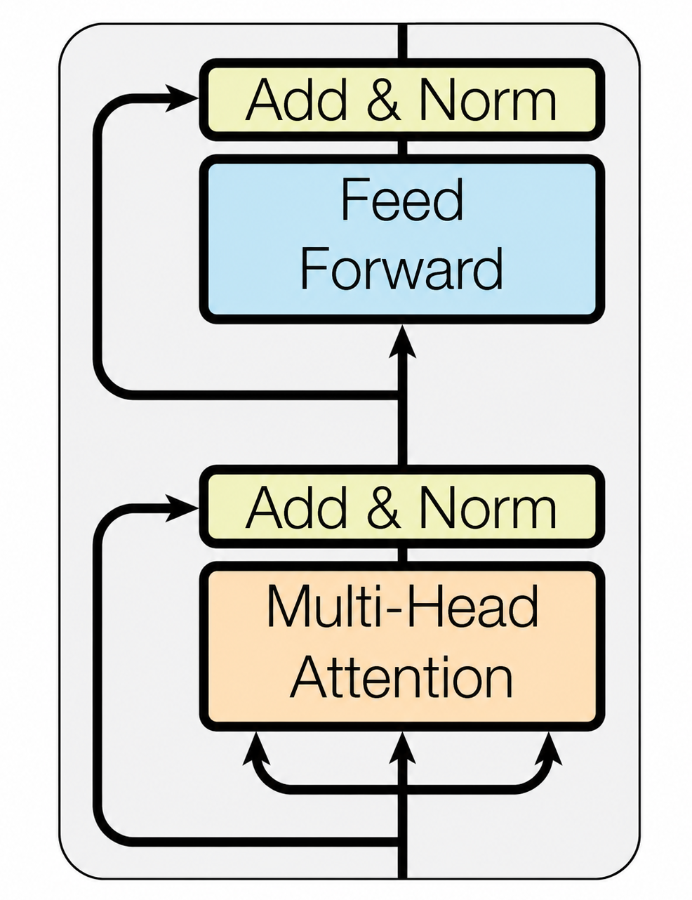
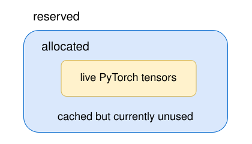

[](https://colab.research.google.com/github/jshn9515/dnnl-notebooks/blob/main/zh/ch12-llm-training-engineering/ch12.1-memory-ledger.ipynb){fig-align="left"}

第 11 章里，我们已经从零搭出了一个 MiniGPT，并完整走过了 next-token prediction、batch、loss、反向传播和参数更新。

当模型从几百万参数扩大到几十亿甚至上百亿参数以后，模型的基本训练流程其实并没有发生根本变化。真正发生变化的是每一步背后的资源规模。

对于一个几百万参数的模型，我们通常只需要关心：

> **模型写得对不对？Loss 能不能下降？**

但到了 LLM 训练里，问题会逐渐变成：

- 模型参数能不能放进 GPU？
- Forward 能不能跑完？
- Backward 会不会 OOM？
- Optimizer.step() 会不会再次 OOM？
- 单张 GPU 放不下时怎么扩展到多张 GPU？

所以，从这一章开始，我们不再只把训练看成一组 PyTorch API，而是开始从**计算、显存和硬件资源**的角度重新理解训练过程。

本节先建立其中最重要的一张账本：

> **训练一个 LLM 时，GPU 显存到底花在了哪里？**

```{python}
import dnnlpy
import IPython.display as ipy
import pandas as pd
import torch
import torch.accelerator as accl
import torch.nn as nn
import torch.optim as optim
from dnnlpy.models.gpt import MiniGPT

print('PyTorch version:', torch.__version__)
```

```{python}
device = dnnlpy.get_default_device()
print('Using device:', device)
```

## 12.1.1 训练显存到底花在哪里

假设我们下载了一个 7B 模型。如果模型参数使用 BF16，那么单纯保存权重大约需要：

$$
7\times10^9\times2\ \text{bytes} \approx 13.0\ \text{GiB}
$$

于是，一个很自然的想法是：

> 既然模型只有 13 GiB，一张 24 GiB GPU 应该可以训练吧？

实际上并不是。13 GiB 只是**参数本身**。训练时，除了 parameters，我们至少还会遇到：

- **Gradients**：反向传播后，每个可训练参数对应的梯度 `param.grad`；
- **Optimizer states**：优化器为了更新参数额外保存的数据；
- **Saved activations**：forward 产生的中间张量，为了 backward 计算梯度而保留下来；
- **Temporary buffers**：某些算子在执行过程中临时申请的工作空间，比如矩阵乘法、attention、卷积、排序、通信等内部需要的中间内存。它们通常不是长期保存的，操作结束后可以被复用或释放，但在某一瞬间可能造成很高的 peak memory。

如果进行分布式训练，还可能出现：

- **Communication buffers**：为了做 GPU 间通信临时准备的内存。比如 `all_reduce`、`all_gather`、`reduce_scatter` 时，通信库 NCCL 需要输入 / 输出缓冲区；
- **Gradient buckets**：DDP 会把很多小参数的梯度合并成较大的连续 buffer，然后一次性 `all_reduce`，而不是每个参数都单独通信；
- **Parameter buffers**：通常指为了计算或通信而把参数放进某个连续 buffer。它在 FSDP 和 ZeRO 里尤其常见。

因此，从大的类别上看，可以先把训练显存分成三部分：

```text
training memory
│
├── model states
│   ├── parameters
│   ├── gradients
│   └── optimizer states
│
├── saved activations
│   └── backward 需要保存的 forward 中间结果
│
└── runtime memory
    ├── temporary buffers
    ├── kernel workspace
    ├── communication buffers
    └── allocator overhead / fragmentation
```

这里最重要的一点是：

> **这三类显存的增长规律并不一样。**

模型状态主要由**参数量**决定；激活主要由 $B,\ T,\ D,\ L$ 决定。其中，$B$ 是 micro-batch size，$T$ 是 sequence length，$D$ 是 hidden size，$L$ 是 Transformer 层数。运行时显存则和具体的 kernel、并行策略、PyTorch allocator 以及算子实现有关。

如果是按照生命周期，我们也可以把训练显存分成两部分。

第一种是长期存在的模型状态：

```text
parameters
gradients
optimizer states
```

它们通常会跨越许多个 training step。例如，模型参数在训练开始时就存在，并一直保留到训练结束。Adam 的一阶矩和二阶矩一旦建立，也会在后面的 optimizer step 中不断更新。

第二种是只在一次 forward / backward 中暂时存在的张量：

```text
saved activations
temporary tensors
kernel workspace
```

这些张量的生命周期要短很多。

所以，以后在分析 LLM 显存之前，首先要停止使用：

$$
\text{num\_params} \times \text{bytes\_per\_param}
$$

来代表整个训练显存。它最多只能告诉我们模型权重本身有多大，而不能告诉我们训练时显存到底花在了哪里。

## 12.1.2 模型状态：一个参数背后到底有多少显存

前面我们已经按类别把训练显存分成了 model states、saved activations 和 runtime memory。接下来先从最容易估算的 model states 开始。

假设模型一共有 $N$ 个参数。对于一个模型来说，训练时占用的显存通常不只有参数本身，还可能包括对应的梯度和优化器状态。因此，model states 可以写成：

$$
M_{\text{states}} ​= M_{\text{param}} ​+ M_{\text{grad}} ​+ M_{\text{optim}}
$$

下面分别来看这三部分。

### 12.1.2.1 Parameters

如果参数本身每个元素占 $b_p$ bytes，那么：

$$
M_{\text{param}} = Nb_p
$$

常见 dtype 的理论存储大小为：

| data type |   size   |
| :-------: | :------: |
|   FP32    | 4 bytes  |
|   FP16    | 2 bytes  |
|   BF16    | 2 bytes  |
|   INT8    |  1 byte  |
|   INT4    | 0.5 byte |

: 表 12.1.2 常见 dtype 的理论存储大小

所以，一个 BF16 的 7B 模型参数量大约为：

$$
7\times10^9\times2 = 14\times10^9\ \text{bytes}
$$

换成 GiB：

$$
\frac{14\times10^9}{1024^3} \approx 13.0\ \text{GiB}
$$

注意这里的 `GB` 和 `GiB` 并不完全相同。硬件和模型参数量通常习惯使用十进制：

$$
1\ \text{GB}=10^9\ \text{bytes}
$$

而操作系统和很多显存统计使用二进制单位：

$$
1\ \text{GiB}=2^{30}\ \text{bytes}
$$

所以 `14 GB ≈ 13.0 GiB`。

### 12.1.2.2 Gradients

训练过程中，每个可训练参数通常还会得到一个对应的 gradient。因此：

$$
M_{\text{grad}} = Nb_g
$$

如果 gradient 使用 BF16，那么：

$$
M_{\text{grad}} = 2N
$$

如果使用 FP32：

$$
M_{\text{grad}} = 4N
$$

需要注意的是，参数是 BF16 并不能自动推出 gradient 一定也是 BF16。具体 dtype 取决于 mixed precision 策略和框架实现。例如，在 PyTorch AMP 中，gradient 通常会被保留为 FP32，以避免数值不稳定。

### 12.1.2.3 AdamW Optimizer States

与 SGD 只需要 gradient 就可以更新参数不同，AdamW 会为每个参数维护两个额外状态。

第一个是一阶矩：

$$
m_t = \beta_1 m_{t-1} + (1-\beta_1) g_t
$$

第二个是二阶矩：

$$
v_t = \beta_2 v_{t-1} + (1-\beta_2) g_t^2
$$

因此，对每一个参数，我们还需要保存 `m` 和 `v`。

如果它们都使用 FP32：

```text
first moment:  4 bytes
second moment: 4 bytes
```

合起来就是：

$$
M_{\text{Adam states}} = 8N
$$

### 12.1.2.4 FP32 Master Weights

某些 mixed precision 训练方案还会额外保留一份 FP32 参数副本，更新时先对 FP32 master weights 做高精度更新，再转换到低精度权重。如果存在这份参数：

$$
M_{\text{master}} = 4N
$$

因此，一个比较通用的模型状态账本可以写成：

$$
M_{\text{states}} = N(b_p + b_g + b_m + b_{m_1} + b_{m_2})
$$

其中：

- $b_p$：Parameter bytes；
- $b_g$：Gradient bytes；
- $b_m$：Master weight bytes；
- $b_{m_1}$：Adam first moment；
- $b_{m_2}$：Adam second moment。

### 12.1.2.5 大模型的显存估算技巧

考虑一种简化配置：

```text
BF16 parameters
BF16 gradients
FP32 Adam first moment
FP32 Adam second moment
```

那么每个参数需要：

|        Item        | bytes / parameter |
| :----------------: | :---------------: |
|   BF16 parameter   |         2         |
|   BF16 gradient    |         2         |
| FP32 first moment  |         4         |
| FP32 second moment |         4         |
|       total        |      **12**       |

: 表 12.1.2.1 AdamW 训练时每个参数的显存账本

因此：

$$
M_{\text{states}} = 12N
$$

如果再额外保存 FP32 master weights：

|        Item        | bytes / parameter |
| :----------------: | :---------------: |
|   BF16 parameter   |         2         |
|   BF16 gradient    |         2         |
| FP32 master weight |         4         |
| FP32 first moment  |         4         |
| FP32 second moment |         4         |
|       total        |      **16**       |

: 表 12.1.2.2 AdamW + FP32 master weights 训练时每个参数的显存账本

于是得到：

$$
M_{\text{states}} = 16N
$$

这就是经常出现的 `12 bytes/param`、`16 bytes/param` 的来源。

关键是不要认为 AdamW 就是 12 bytes 或 16 bytes。更准确的理解应该是：

> **先列出训练到底保存了哪些状态，再根据每种状态的 dtype 计算。**

我们可以直接写一个小函数：

```{python}
def model_state_breakdown(
    num_params: int,
    param_bytes: int = 2,
    grad_bytes: int = 2,
    master_weight_bytes: int = 0,
    first_moment_bytes: int = 4,
    second_moment_bytes: int = 4,
) -> pd.DataFrame:
    """Calculate model state memory breakdown for a given number of parameters
    and their respective byte sizes.
    """
    items = {
        'parameters': num_params * param_bytes,
        'gradients': num_params * grad_bytes,
        'master weights': num_params * master_weight_bytes,
        'Adam first moment': num_params * first_moment_bytes,
        'Adam second moment': num_params * second_moment_bytes,
    }

    rows = [
        {'Item': name, 'Memory (GiB)': dnnlpy.bytes_to_gib(num_bytes)}
        for name, num_bytes in items.items()
        if num_bytes > 0
    ]
    totel_mem = dnnlpy.bytes_to_gib(sum(items.values()))
    rows.append({'Item': 'total', 'Memory (GiB)': totel_mem})

    df = pd.DataFrame(rows)
    df.index = list(range(1, len(df) + 1))
    return df
```

### 12.1.2.6 7B 模型：13 GiB 权重为什么装不下

现在把这个账本真正应用到一个 7B 模型。

假设：

```text
parameters: BF16
gradients:  BF16
Adam m:     FP32
Adam v:     FP32
```

那么：

```{python}
df = model_state_breakdown(num_params=7e9)
styler = df.style.set_table_styles(
    [{'selector': 'th', 'props': [('text-align', 'center')]}]
)
ipy.display(styler)
```

注意，我们这里只计算了 model states。还没有：

```text
saved activations
attention temporary tensors
MLP intermediates
kernel workspace
communication buffers
```

如果再保留 FP32 master weights：

$$
7\times10^9\times4 \approx 26.1\ \text{GiB}
$$

于是模型状态本身就会变成：

$$
78.2 + 26.1 \approx 104.3\ \text{GiB}
$$

这时候我们就可以理解为什么 7B BF16 权重大约 13 GiB，但训练时可能需要远大于 24 GiB。前一个数字回答的是权重多大，后一个问题问的是完成训练需要同时保存哪些状态，这是两个完全不同的问题。

同时，这也提前解释了 ZeRO 和 FSDP 为什么如此重要。如果一张 GPU 必须保存完整的：

```text
parameters
gradients
optimizer states
```

那么很快就会放不下。ZeRO 和 FSDP 的核心思路之一就是：

> **不要让每张 GPU 都保存所有模型状态。**

这个问题我们会在后面的多 GPU 训练里详细讨论。

## 12.1.3 Activation Memory：Forward 需要保存什么

考虑一个简化的 Transformer block：

{height="350px"}

在 forward 过程中，会产生很多中间张量。为了 backward，其中一部分必须被 autograd 保存。

### 12.1.3.1 Query、Key、Value

Self-Attention 首先计算：

$$
\begin{align}
Q &= X W_Q \\
K &= X W_K \\
V &= X W_V
\end{align}
$$

它们通常都具有和 hidden states 相同的总元素数量，也就是 $BTD$。所以三者合起来大约为 $3BTD$ 个元素。

假设 $B=1$，$T=4096$，$D=4096$，并且使用 BF16，那么 Q、K、V 合起来大约是：

$$
3\times32 = 96\ \text{MiB}
$$

注意，这还只是**一层**。如果模型有 32 层，仅从数量级上看：

$$
96\times32 \approx 3\ \text{GiB}
$$

当然，真实 autograd 不一定同时保存所有这些 tensor，这里的目的是建立规模直觉。

### 12.1.3.2 Attention Matrix

Multi-head Attention 通常把 hidden dimension 拆成：

$$
D = H d_h
$$

其中，$H$ 是 number of heads，$d_h$ 是 head dimension。

我们知道，attention score 的形状为 $(B,H,T,T)$，因此元素数量为 $BHT^2$。这个 $T^2$ 在这里特别重要。假设 $B=1$，$H=32$，$T=4096$，那么 attention matrix 的元素数量为：

$$
1\times 32\times 4096\times 4096
$$

如果以 BF16 计算：

$$
1\times 32\times 4096^2\times 2 \approx 1\ \text{GiB}
$$

也就是说：

> **仅仅一个 $(B,H,T,T)$ 的 BF16 tensor，就已经接近 1 GiB。**

而且这还是**一层**。如果 naive attention 实现需要保存多个类似规模的中间结果，例如 score 或 softmax probability，那么显存会迅速增长。这就是为什么长 context 下，普通 attention 会变得非常危险。

例如，如果把 $T$ 从 4096 增加到 8192，attention matrix 的大小不是翻倍，而是直接变成 4 倍：

$$
T^2 \rightarrow (2T)^2 = 4T^2
$$

这也是我们第 10 章讨论 FlashAttention 时最重要的背景之一。FlashAttention 并没有改变 $QK^\top$ 在数学上的 $O(T^2)$ 计算量，它改变的是：

> **不再把完整的 $T\times T$ attention matrix 来回读取和存储到 HBM 中。**

所以，compute complexity 和 memory complexity 不是同一件事。

### 12.1.3.3 MLP Intermediate

Transformer block 的另一大块来自 MLP。简化的 FFN 可以写成：

$$
D \rightarrow rD \rightarrow D
$$

其中，$r$ 是 expansion ratio。

如果 $r=4$，那么 MLP 的中间 activation 形状为 $(B,T,4D)$，元素数量为 $4BTD$。和前文一样，仍然假设 $B=1$，$T=4096$，$D=4096$，那么 MLP 中间 activation 大约为：

$$
128\ \text{MiB}
$$

一层 128 MiB 看起来不算巨大。但是如果模型有 32 层：

$$
128\times 32 = 4096\ \text{MiB} = 4\ \text{GiB}
$$

而实际使用 SwiGLU 等结构时，中间张量布局还会有所不同。所以，即使完全不考虑 $T^2$ 的 attention matrix，MLP 和 QKV 本身也已经会产生大量 activation。

### 12.1.3.4 算不准的 Activation Memory

看到这里，我们可能想写一个公式：

$$
M_{\text{activation}} = f(\ldots)
$$

然而，activation memory 很难像参数量那样只通过模型 config 得到一个绝对准确的数字。原因在于 backward 并不是需要保存 forward 中出现过的所有 tensor。以 PyTorch 为例，PyTorch autograd 只会保存 backward 真正需要使用的部分。具体保存什么，取决于算子的 backward 实现。

例如，一个算子 backward 可能需要 `input`，也可能需要 `output`，还可能只需要保存某些统计量。如果多个算子被 fused 成一个 kernel，它需要保存的中间结果又可能改变。因此，就拿 attention 来说，数学公式相同，但不同的 kernel 实现可能会有不同的 activation memory。所以，我们更适合写一个**数量级模型**：

$$
M_{\text{activation}} \approx c_1BTDL + c_2BTrDL + c_3BHT^2L
$$

其中，$c_1,c_2,c_3$ 不是固定常数，而是由具体实现决定。

这个公式真正想表达的是增长关系：

```text
B ↑ → activation 大致线性增加
T ↑ → hidden / MLP activation 线性增加
T ↑ → naive attention matrix 二次增加
D ↑ → hidden / QKV / MLP 增加
L ↑ → 需要保存更多层的 activation
```

相比得到一个看似精确、实际上并不可靠的显存数字，这些增长关系在工程上更加重要。

## 12.1.4 Runtime Memory：为什么理论值和实际值对不上

到目前为止，我们已经有：

$$
M_{\text{model states}}, \qquad M_{\text{activations}}
$$

是不是把两者加起来，就一定等于实际显存？还是不行。

真实 GPU 训练中还存在很多 runtime memory。例如：

```text
temporary tensors
kernel workspace
cuBLAS workspace
communication buffers
gradient buckets
CUDA graph pools
allocator bookkeeping
```

某个矩阵乘法 kernel 为了提高速度，可能需要额外 workspace；DDP 为了进行 all-reduce，会建立 gradient bucket；FSDP 可能需要临时 gather 某些参数；不同 tensor 的生命周期交错，也会让显存分配无法完美填满。

因此，更合理的概念模型是：

$$
M_{\text{total}} \approx M_{\text{model states}} +
M_{\text{saved activations}} + M_{\text{runtime}}
$$

但即使这个公式，也不要把它理解成一个能够直接精确计算的静态公式。因为真正决定训练能不能进行的是：

$$
M_{\text{peak}} = \max_t M(t)
$$

也就是**峰值**。

在 PyTorch 中还有一个很容易混淆的问题。如果我们调用：

```{python}
#| eval: false
x = torch.randn(1000, 1000, 1000, device=device)
mem = accl.memory_allocated()
print(f'Allocated memory: {dnnlpy.bytes_to_mib(mem):6.4f} MiB.')
```

```code
Allocated memory: 3814.6973 MiB.
```

得到的是当前 tensor 实际占用的显存。

但是 PyTorch 使用 CUDA caching allocator。也就是说，当 Tensor 被释放以后，这块显存不一定立刻还给 CUDA driver。PyTorch 可能先把它保留起来，以便下一次快速复用。

因此还有：

```{python}
#| eval: false
mem = accl.memory_reserved()
print(f'Reserved memory: {dnnlpy.bytes_to_mib(mem):6.4f} MiB.')
```

```code
Reserved memory: 3816.0000 MiB.
```

可以简单理解为：

{width=50%}

所以经常会看到：

$$
M_{\text{reserved}} > M_{\text{allocated}}
$$

这不一定代表 memory leak。

同样，`nvidia-smi` 看到的显存也不能直接等价于：

```python
accl.memory_allocated()
```

因为两者观察的是不同层次的显存状态。后面的 Profiling 章节会专门分析这些问题。

## 12.1.5 Peak Memory：真正决定 OOM 的是什么

前面已经分别看过 model states、saved activations 和 runtime memory。现在还差最后一个关键问题：这些显存并不是在整个 training step 中始终同时存在。因此，一次训练真正需要关注的不是所有可能出现过的张量加起来有多大，而是某个时刻同时还活着的张量有多少。

也就是说，我们真正关心的是：

$$
M_{\text{peak}} = \max_t M(t)
$$

其中，$M(t)$ 表示训练过程中某个时刻正在占用的显存。这就是**峰值显存（peak memory）**。

这个区别非常重要，因为 LLM 训练中的 OOM 几乎都是由峰值显存决定的。

```{python}
#| eval: false
accl.reset_peak_memory_stats()
mem = accl.max_memory_allocated()
print(f'Peak memory: {dnnlpy.bytes_to_mib(mem):6.4f} MiB.')
```

```code
Peak memory: 3814.6973 MiB.
```

## 12.1.6 沿着一个 Training Step 看显存生命周期

我们先不考虑分布式训练，只看最普通的单 GPU training step：

```python
optimizer.zero_grad()

logits = model(x)
loss = loss_fn(logits, y)

loss.backward()

optimizer.step()
```

看起来只有五行代码，但显存状态会不断变化。

#### **Forward 开始之前**

训练已经开始以后，GPU 上通常已经存在：

```text
parameters
optimizer states
```

如果上一轮的 gradient 还没有释放，也可能存在 gradients。

此时，$M$ 可以粗略写成：

$$
M \approx M_{\text{param}} + M_{\text{optimizer}}
$$

#### **Forward 过程中**

模型从第一层一路计算到最后一层。为了 backward，autograd 不能把所有中间结果立刻扔掉。一部分 forward 中产生的 tensor 必须保存下来。于是：

```text
parameters
optimizer states
saved activations ↑
```

随着网络不断向前，saved activations 通常会不断增加。到 forward 结束附近，我们可能已经保存了很多层的 backward 所需信息。

#### **Backward 过程中**

调用 `loss.backward()` 以后，计算图开始从最后一层往前传播。这时会发生两件事情。

一方面，参数的 gradient 开始出现：

```text
gradients ↑
```

另一方面，某一层的 saved activation 在完成 backward 以后，可能就不再需要：

```text
saved activations ↓
```

所以 backward 并不是简单地：

```text
forward memory + gradients
```

全部永久叠加。

更准确地说，它是一个**激活不断被消费、梯度不断被生成**的过程。因此，峰值显存可能出现在 forward 结束附近，也可能出现在 backward 的某个位置。至于具体在哪里，取决于模型结构和实现。

#### **Optimizer Step**

最后调用 `optimizer.step()`，AdamW 会根据：

```text
gradient
first moment
second moment
```

更新参数。某些实现还可能产生临时 buffer。

另外还有一个容易忽略的问题：

> **很多 PyTorch optimizer 的 state 是 lazy initialization 的。**

也就是说，刚刚创建：

```python
optimizer = optim.AdamW(model.parameters())
```

并不意味着所有 Adam state 已经立即分配。它们通常会在参数第一次真正参与 `optimizer.step()` 时建立。

所以经常会出现一种现象：

```text
Forward 正常
Backward 正常
第一次 optimizer.step() OOM
```

这并不奇怪。因为前两步只说明：

```text
parameters + activations + gradients
```

能够放进去。

第一次 `optimizer.step()` 还可能突然加入：

```text
Adam first moment
Adam second moment
```

这就是为什么我们不能只根据 forward 是否成功判断一个模型能不能训练。

## 12.1.7 如何用 PyTorch 实际观察显存

理论账本最终还是应该和真实程序对上。我们可以写一个简单函数，在 training step 的不同阶段观察显存。

```{python}
def memory_snapshot(name: str) -> None:
    allocated = accl.memory_allocated()
    reserved = accl.memory_reserved()
    peak = accl.max_memory_allocated()

    print(
        f'{name:<20}: '
        f'allocated={dnnlpy.bytes_to_mib(allocated):6.2f} MiB | '
        f'reserved={dnnlpy.bytes_to_mib(reserved):6.2f} MiB | '
        f'peak={dnnlpy.bytes_to_mib(peak):6.2f} MiB'
    )
```

训练时可以观察：

```{python}
#| eval: false
accl.reset_peak_memory_stats()

model = MiniGPT(vocab_size=1000, block_size=32).to(device)
loss_fn = nn.CrossEntropyLoss()
optimizer = optim.AdamW(model.parameters(), lr=1e-3)

x = torch.randint(0, 1000, (4, 32), device=device)
y = torch.randint(0, 1000, (4, 32), device=device)

optimizer.zero_grad()
memory_snapshot('After `zero_grad()`')

logits = model(x)
loss = loss_fn(
    logits.reshape(-1, logits.size(-1)),  # (B*T, V)
    y.reshape(-1),  # (B*T,)
)
memory_snapshot('After `forward()`')

loss.backward()
memory_snapshot('After `backward()`')

optimizer.step()
memory_snapshot('After `step()`')
```

```code
After `zero_grad()` : allocated=  3.53 MiB | reserved=3820.00 MiB | peak=3818.23 MiB
After `forward()`   : allocated= 12.29 MiB | reserved=3830.00 MiB | peak=3818.23 MiB
After `backward()`  : allocated=  7.55 MiB | reserved=3830.00 MiB | peak=3818.23 MiB
After `step()`      : allocated= 14.61 MiB | reserved=3836.00 MiB | peak=3818.23 MiB
```

这里的结果比单纯计算 `param_count × bytes` 更接近真实训练过程。

不过实际测试时有一个细节：如果使用 AdamW，最好先完成一次 warm-up step。

因为第一次：

```python
optimizer.step()
```

可能会创建 optimizer states。

如果直接测第一次 step，我们测到的其实是：

```text
steady-state training memory + optimizer initialization
```

而后续 step 中 Adam states 已经存在。

所以更合理的 profiling 通常会先 warmup 几步，然后重置 statistics，再测 steady-state step。这个思想以后分析训练性能时还会反复出现。

## 12.1.8 从 OOM 发生的位置判断显存瓶颈

有了前面的账本，我们可以把常见 OOM 按发生阶段分类。

#### **模型加载时 OOM**

如果：

```python
model.to('cuda')
```

就失败了，那么问题首先来自模型参数。这时候：

```text
减小 batch size
gradient accumulation
activation checkpointing
```

基本都没有帮助，因为 forward 甚至还没有开始。此时需要直接减少单张 GPU 上保存的模型状态，例如降低参数精度，或者使用 Tensor Parallelism、Pipeline Parallelism、FSDP、ZeRO 等分布式训练方法，将参数或其他模型状态分散到多张 GPU 上。

#### **Forward OOM**

如果模型能够加载，但是：

```python
output = model(x)
```

时 OOM，那么很可能和：

```text
activations
attention intermediates
temporary buffers
```

有关。可以首先检查 micro-batch size，sequence length，以及 attention 的实现方式。

#### **Backward OOM**

如果 forward 能完成，但：

```python
loss.backward()
```

时 OOM，需要关注：

```text
saved activations
gradients
backward temporary tensors
```

这时 activation checkpointing 和 smaller micro-batch 通常更相关。

#### **第一次 optimizer.step() OOM**

如果：

```python
loss.backward()
```

完成以后仍然没问题，但第一次：

```python
optimizer.step()
```

炸掉，那么 optimizer states 是一个非常值得检查的地方。特别是 AdamW 的 `m` 和 `v`，可能就是在这时第一次分配。

#### **Context Length 增加后 OOM**

如果模型在 context length 为 $T = 2048$ 时可以正常训练，但把 context length 增加到 $T = 8192$ 后突然 OOM，那么首先应该检查 activation memory。

因为 context length 增加后，模型需要保存更多中间激活。尤其是在 naive attention 中，需要显式保存形状为 $(B,H,T,T)$ 的 attention score，而它的显存占用与 $T^2$ 成正比。

这种情况下，直接使用融合算子，例如换成 FlashAttention 或 cuDNN，通常比处理参数显存更直接。

## 12.1.9 从显存账本到后面的训练优化

现在再看第 17 章后面的训练优化技术，它们就不再是一组孤立的省显存技巧。本质上，它们都在修改前面建立的这张账本，只是作用的位置不同。

::: {.list-table}
表 12.1.9 显存账本和训练优化技术的对应关系

- - 技术
  - 主要影响
  - 核心思路

- - Mixed Precision
  - states + activations + compute
  - 减少 bytes/element，并提高低精度吞吐

- - Gradient Accumulation
  - activations
  - 减小 micro-batch，累积 gradient

- - Activation Checkpointing
  - saved activations
  - 少保存 activation，backward 时重算

- - FlashAttention
  - attention intermediates / IO
  - 避免完整 attention matrix 物化

- - DDP
  - throughput
  - 复制模型，切分数据

- - ZeRO / FSDP
  - model states
  - 在 GPU 之间切分模型状态

- - Quantized Optimizer
  - optimizer states
  - 用更低精度保存 optimizer state

- - Sequence Parallelism
  - activations
  - 沿 sequence dimension 切分部分 activation
:::

所以，遇到 OOM 时，不应该先问应该开哪个优化选项，而应该先判断：

> **到底是哪一项显存占用过大？**

后面的 mixed precision、gradient accumulation、activation checkpointing、FlashAttention、DDP、ZeRO 和 FSDP，实际上都可以重新放回这张显存账本中理解。

## 12.1.10 本章小结

这一节我们没有开始优化模型，而是先建立了一张训练 LLM 时最重要的显存账本。

训练显存首先可以分成：

```text
model states + saved activations + runtime memory
```

其中，model states 包括：

$$
\text{parameters} + \text{gradients} + \text{optimizer states}
$$

对于：

```text
BF16 parameters
BF16 gradients
FP32 Adam first moment
FP32 Adam second moment
```

每个参数大约对应：

$$
2+2+4+4 = 12\ \text{bytes}
$$

如果额外保存 FP32 master weights，则变成：

$$
16\ \text{bytes}
$$

因此，一个 BF16 权重只有约 13 GiB 的 7B 模型，其完整训练 model states 就可能达到约 78.2 GiB，甚至更高。

另一方面，activation memory 并不主要由参数量决定，而是和 $B,\ T,\ D,\ L$ 密切相关。

Transformer 中 hidden states、QKV 和 MLP 中间结果通常会随 sequence length 线性增长，而 naive attention 中 $(B,H,T,T)$ 的 attention score 则会随 sequence length 的平方增长。

最后，还要记住一个更重要的工程概念：

> **训练显存不是一张静态表，而是一组具有不同生命周期的 tensor。**

Forward 会不断产生 saved activations，backward 会消费这些 activations 并生成 gradients，optimizer step 又会访问甚至首次创建 optimizer states。

所以，真正决定一次训练能不能运行的是：

$$
M_{\text{peak}} = \max_t M(t)
$$

而不是模型权重文件有多大。

从这一节开始，后面的训练优化可以统一理解为：

> **想办法减少这张账本中的某一项，缩短某些 tensor 的生命周期，或者把它们切分到更多设备上。**

下一节我们继续看另一个同样重要的问题：显存只是训练成本的一部分。即使模型能够放进 GPU，也不代表它跑得快。要理解训练速度，我们还需要进一步区分 FLOPs、memory bndwidth 和 arithmetic intensity。
