[](https://colab.research.google.com/github/jshn9515/dnnl-notebooks/blob/main/zh/ch12-llm-training-engineering/ch12.4-mixed-precision.ipynb){fig-align="left"}

上一节我们用 profiler 回答了一个问题：

> **训练时间到底花在哪里？**

如果 profiler 显示，大量时间花在矩阵乘法、线性层和 attention 上，那么一个很自然的优化方向是：

> **能不能用更低精度完成这些计算？**

这就是 mixed precision training。它的核心目标不是简单地把整个模型从 FP32 改成 FP16，而是让适合低精度的算子使用低精度执行，同时让数值敏感的部分继续保留更高精度。

在 PyTorch 里，这通常由 `torch.autocast` 和 `torch.GradScaler` 两个工具实现。其中：

- `torch.autocast` 决定不同算子应该使用什么精度；
- `torch.GradScaler` 主要用于避免 FP16 梯度下溢。

这一节我们依次回答：

- FP32、FP16、BF16 有什么区别？
- 为什么低精度可以更快、更省显存？
- 为什么不能直接 `model.half()`？
- 为什么 FP16 常常需要 loss scaling？
- 为什么 BF16 通常不需要 loss scaling？

```{python}
import dnnlpy
import IPython.display as ipy
import pandas as pd
import torch
import torch.nn as nn
import torch.nn.functional as F
import torch.optim as optim
from torch import Tensor

print('PyTorch version:', torch.__version__)
```

```{python}
device = dnnlpy.get_default_device()

if device.type == 'cpu' and dnnlpy.IS_AVX2_VNNI_2:
    torch.backends.mkldnn.enabled = False

print('Using device:', device)
```

## 12.4.1 浮点数不只是小数

神经网络里的参数、激活和梯度通常使用浮点数表示。一般来说，一个浮点数可以粗略拆成 sign、exponent 和 mantissa 三部分。它们对应的作用如下：

::: {.list-table}
表 12.4.1 浮点数的三部分及其作用

- - 部分
  - 作用

- - sign
  - 正数还是负数

- - exponent
  - 能表示多大或多小的数量级

- - mantissa
  - 在这个数量级内能表示得多精细
:::

因此，讨论一个浮点格式时，要同时关心两个问题：

- Range：能表示多大、多小的数
- Precision：能分辨多细的差异

FP64、FP32、FP16 和 BF16 的主要差异如下：

::: {.list-table}
表 12.4.2 FP64、FP32、FP16 和 BF16 的主要差异

- - dtype
  - 总位数
  - exponent
  - mantissa
  - 主要特点

- - FP64
  - 64
  - 11
  - 52
  - 范围最大，精度最高

- - FP32
  - 32
  - 8
  - 23
  - 范围大，精度高

- - FP16
  - 16
  - 5
  - 10
  - 精度和范围都更小

- - BF16
  - 16
  - 8
  - 7
  - 范围接近 FP32，但精度更低
:::

其中，FP16 的 exponent 更短，而 BF16 的 exponent 和 FP32 一样长。所以 FP16 更容易遇到 overflow 和 underflow。而 BF16 虽然有效数字更少，但动态范围接近 FP32，因此通常更适合深度学习训练。FP64 由于占用内存大、计算慢，通常只在高精度科学计算（如求解 PDE）中使用。

我们可以直接查看不同 dtype 的数值范围。

```{python}
rows = []

for dtype in [torch.float64, torch.float32, torch.float16, torch.bfloat16]:
    info = torch.finfo(dtype)
    rows.append([info.dtype, info.min, info.max, info.eps])

df = pd.DataFrame(rows, columns=['dtype', 'min', 'max', 'eps'])
df.index = list(range(1, len(df) + 1))
df.style.format({'min': '{:.3e}', 'max': '{:.3e}', 'eps': '{:.3e}'})
ipy.display(df)
```

这里的 `eps` 表示在 1 附近，这种 dtype 能区分的最小相对间隔。

所以：

- FP32 和 FP64 的表示更精细；
- FP16 比 BF16 更精细一些；
- BF16 的动态范围明显大于 FP16。

这也是一个很容易混淆的地方：

> **BF16 不代表在所有方面都比 FP16 更精确。它主要是动态范围更大，而不是尾数更长。**

## 12.4.2 为什么低精度可以更快

低精度训练通常带来两个好处：更少的 memory traffic 和更高的矩阵乘法吞吐。

我们知道，FP32 每个元素占 4 bytes，而 FP16 和 BF16 每个元素占 2 bytes。因此，如果某个算子主要受显存带宽限制，那么低精度意味着读取相同数量的元素，只需要搬一半的数据。

例如，一个包含 10 亿个元素的张量：

```{python}
num_elements = 1_000_000_000

for dtype in [torch.float64, torch.float32, torch.float16, torch.bfloat16]:
    bytes_per_element = torch.tensor([], dtype=dtype).element_size()
    total_gib = dnnlpy.bytes_to_gib(num_elements * bytes_per_element)
    print(f'{dtype}: {total_gib:.4f} GiB')
```

另一方面，现代 GPU 通常为 FP16 和 BF16 矩阵乘法提供专门的硬件路径，例如 Tensor Cores。因此，对于 Linear、Matmul、Convolution 和 Attention 中的矩阵乘法，低精度通常可以显著提高计算吞吐。

这正好对应上一节的两个瓶颈：

- 对于 memory-bound 的算子，低精度减少了 memory traffic；
- 对于 compute-bound 的算子，低精度可以使用更高吞吐的矩阵乘法。

但是，这不意味着所有算子都应该强制使用 FP16 或 BF16。例如，对于 Softmax、Normalization 和部分 loss 计算，数值范围和累加精度更敏感，低精度可能导致数值不稳定。所以我们需要的是 mixed precision，而不是 low precision。

## 12.4.3 Autocast：让算子自动选择精度

一种看似直接的做法是：

``` python
model = model.half()
```

这会把所有模型参数和 buffer 整体转换成 FP16。这样做的问题是，所有层都被强制改成 FP16，包括那些可能不适合 FP16 的操作。优化器更新、梯度累积和某些中间计算都可能因此更容易出现数值问题。

Mixed precision 的常见做法则不同。参数通常保持 FP32，而前向传播中的部分算子临时使用 FP16 或 BF16，数值敏感的算子继续使用 FP32。也就是说，模型仍然可以这样初始化：

```{python}
model = nn.Sequential(
    nn.Linear(128, 512),
    nn.GELU(),
    nn.Linear(512, 128),
)
print('Parameter dtype:', next(model.parameters()).dtype)
```

参数仍然是 FP32。只有进入 `torch.autocast` 区域后，PyTorch 才会根据算子类型和设备，自动选择合适的执行精度。这种方式通常比手动把整个模型转换成低精度更安全。

PyTorch 的 **Automatic Mixed Precision (AMP)** 主要通过 `torch.autocast` 操作。基本结构是：

```python
with torch.autocast(device.type, dtype=torch.float16):
    logits = model(inputs)
    loss = loss_fn(logits, labels)
```

在这个上下文里：

- 适合低精度的算子可能使用 FP16；
- 数值敏感的算子可能继续使用 FP32；
- 用户不需要手动给每一层转换 dtype。

为了让代码可以在不同设备上运行，我们先写一个简单模型。

```{python}
class TinyMLP(nn.Module):
    def __init__(self, input_dim: int, hidden_dim: int, output_dim: int) -> None:
        super().__init__()
        self.net = nn.Sequential(
            nn.Linear(input_dim, hidden_dim),
            nn.GELU(),
            nn.Linear(hidden_dim, output_dim),
        )

    def forward(self, x: Tensor) -> Tensor:
        return self.net(x)


device = dnnlpy.get_default_device()
model = TinyMLP(128, 512, 10).to(device)

x = torch.randn(32, 128, device=device)
labels = torch.randint(10, (32,), device=device)

print('Parameter dtype:', next(model.parameters()).dtype)
```

如果有 CUDA 和 XPU，可以使用 FP16 或 BF16 autocast。如果只有 CPU，通常更适合使用 BF16 autocast。默认情况下，CUDA 和 XPU 上的 autocast dtype 是 FP16，而 CPU 上的 autocast dtype 是 BF16。

```{python}
cpu_dtype = torch.get_autocast_dtype('cpu')
xpu_dtype = torch.get_autocast_dtype('xpu')
cuda_dtype = torch.get_autocast_dtype('cuda')

print('CPU autocast dtype:', cpu_dtype)
print('XPU autocast dtype:', xpu_dtype)
print('CUDA autocast dtype:', cuda_dtype)
```

下面我们在当前设备上使用 autocast，观察 logits 和 loss 的 dtype。

```{python}
with torch.autocast(device.type) as amp:
    logits = model(x)
    loss = F.cross_entropy(logits, labels)

print('Autocast dtype:', amp.fast_dtype)
print('Logits dtype:', logits.dtype)
print('Loss dtype:', loss.dtype)
```

这里会看到 logits 是 FP16，而 loss 是 FP32。这正是 autocast 的意义。它不是让所有操作统一变成某一种 dtype，而是根据算子的数值特征做选择。

## 12.4.4 Loss Scaling：先把梯度放大再反向传播

训练时，前向传播只是第一步，后面还需要调用 `loss.backward()` 计算梯度。而在反向传播中，一些梯度可能非常小。

假设某个梯度在 FP32 中是 $10^{-8}$。它在 FP32 中仍然可以表示，但 FP16 的动态范围更小。经过多层链式法则后，一些很小的梯度可能被舍入成 0。这就是 gradient underflow。而一旦大量梯度变成 0，参数看不到更新信号，训练就会出现问题。梯度下溢严重时，模型可能无法收敛。

我们可以用一个简单例子观察低精度对小数值的影响。

```{python}
tensor = torch.tensor([1e-2, 1e-4, 1e-6, 1e-7, 1e-8, 1e-9], dtype=torch.float32)

print('FP32:', tensor)
print('FP16:', tensor.half())
print('BF16:', tensor.bfloat16())
```

注意，这个例子只是展示不同 dtype 的表示能力。在真实训练里，梯度是否下溢还取决于具体硬件、模型结构和算子实现。但核心问题没有改变：

> **FP16 的小动态范围使它更容易丢失很小的梯度。**

那么，要避免 FP16 梯度下溢，有什么办法呢？答案是 loss scaling。

正常情况下：

$$
L \rightarrow \frac{\partial L}{\partial \theta}
$$

如果先把 loss 乘以一个较大的 scale：

$$
L_{\text{scaled}} = sL
$$

那么梯度也会被放大：

$$
\frac{\partial L_{\text{scaled}}}{\partial \theta} =
s\frac{\partial L}{\partial \theta}
$$

例如，原始梯度是 $10^{-8}$，如果 scale 是 65536，那么放大后的梯度是

$$
6.5536 \times 10^{-4}
$$

从而更容易被 FP16 表示。

然后，在 optimizer 更新之前，再把梯度除回原来的尺度：

$$
\frac{1}{s}
\frac{\partial L_{\text{scaled}}}{\partial \theta} =
\frac{\partial L}{\partial \theta}
$$

所以 loss scaling 不会改变最终想要的梯度。它只是让反向传播过程中的梯度暂时处于更安全的数值范围。

```{python}
small_gradient = 1e-8
scale = 65536

scaled_gradient = small_gradient * scale
recovered_gradient = scaled_gradient / scale

print('Small gradient:', small_gradient)
print('Scaled gradient:', scaled_gradient)
print('Recovered gradient:', recovered_gradient)
```

当然，在实际训练中，我们不希望手动选择固定的 scale。如果 scale 太小，梯度仍然可能 underflow；如果 scale 太大，梯度可能 overflow，出现 inf 或 NaN。因此 PyTorch 提供 `torch.GradScaler` 动态管理 scale。

典型训练流程是：

```python
optimizer.zero_grad()
scaler = torch.GradScaler(device.type)

with torch.autocast(device.type):
    logits = model(x)
    loss = loss_fn(logits, labels)

scaler.scale(loss).backward()
scaler.step(optimizer)
scaler.update()
```

这几步分别做什么？

::: {.list-table}
表 12.4.4 GradScaler 的主要方法

- - 代码
  - 作用

- - `scaler.scale(loss)`
  - 放大 loss

- - `backward()`
  - 对放大后的 loss 反向传播

- - `scaler.step(optimizer)`
  - 检查梯度并执行 optimizer step

- - `scaler.update()`
  - 根据是否出现 inf / NaN 调整 scale
:::

如果反向传播得到的梯度在 unscale 后出现 inf 或 NaN，`GradScaler` 会跳过这次参数更新，并降低 scale。若连续一段时间没有检测到非有限梯度，`GradScaler` 会逐渐增大 scale，使梯度尽可能保持在 FP16 可表示范围内，从而减少下溢风险。

下面写一个 FP16 AMP 训练 step。

```{python}
def fp16_amp_training_step(
    model: nn.Module,
    optimizer: optim.Optimizer,
    scaler: torch.GradScaler,
    inputs: Tensor,
    labels: Tensor,
) -> Tensor:
    optimizer.zero_grad()

    with torch.autocast(device.type, dtype=torch.float16):
        logits = model(inputs)
        loss = F.cross_entropy(logits, labels)

    scaler.scale(loss).backward()
    scaler.step(optimizer)
    scaler.update()

    return loss.detach()
```

运行一个训练 step，观察 loss 和当前 scale。

```{python}
model = TinyMLP(128, 512, 10).to(device)
optimizer = optim.AdamW(model.parameters(), lr=1e-3)
scaler = torch.GradScaler(device.type)

inputs = torch.randn(32, 128, device=device)
labels = torch.randint(10, (32,), device=device)

loss = fp16_amp_training_step(model, optimizer, scaler, inputs, labels)

print('Loss:', loss.item())
print('Current scale:', scaler.get_scale())
```

如果你之前看过其他教程，你可能会发现，`GradScaler` 的使用在 FP16 mixed precision 训练中非常常见，而 BF16 mixed precision 训练通常不需要它。这是因为 BF16 的 exponent 和 FP32 一样长，动态范围接近 FP32。虽然它的 mantissa 比 FP16 更短，数值精度更低，但它不容易像 FP16 那样因为范围太小而发生梯度下溢。

所以，BF16 训练通常写成：

```python
optimizer.zero_grad()

with torch.autocast(device.type, dtype=torch.bfloat16):
    logits = model(x)
    loss = loss_fn(logits, labels)

loss.backward()
optimizer.step()
```

并不需要 `GradScaler`。

```{python}
def bf16_amp_training_step(
    model: nn.Module,
    optimizer: optim.Optimizer,
    inputs: Tensor,
    labels: Tensor,
) -> Tensor:
    if device.type == 'cuda' and not torch.cuda.is_bf16_supported():
        raise RuntimeError('CUDA device does not support BF16.')
    if device.type == 'xpu' and not torch.xpu.is_bf16_supported():
        raise RuntimeError('XPU device does not support BF16.')

    optimizer.zero_grad()

    with torch.autocast(device.type, dtype=torch.bfloat16):
        logits = model(x)
        loss = F.cross_entropy(logits, labels)

    loss.backward()
    optimizer.step()

    return loss.detach()
```

运行一个训练 step，观察 loss。

```{python}
model = TinyMLP(128, 512, 10).to(device)
optimizer = optim.AdamW(model.parameters(), lr=1e-3)

inputs = torch.randn(32, 128, device=device)
labels = torch.randint(10, (32,), device=device)

loss = bf16_amp_training_step(model, optimizer, inputs, labels)

print('Loss:', loss.item())
```

在支持 BF16 的设备上，它通常是 LLM 训练里的优先选择。原因在于 BF16 的 16-bit 存储，接近 FP32 的动态范围，以及通常不需要 loss scaling。不过 BF16 是否真的更快，仍然取决于硬件是否原生支持。如果硬件不原生支持 BF16，需要软件模拟，可能无法获得预期的性能收益。

这里还要强调的一点是：

> **Mixed precision 是硬件相关的优化。不能脱离设备，单独讨论哪一种 dtype 一定更快。**

## 12.4.5 Gradient Clipping 时要先 unscale

训练 Transformer 时，有时会使用 gradient clipping：

``` python
nn.utils.clip_grad_norm_(model.parameters(), max_norm)
```

如果使用 FP16 `GradScaler`，此时参数梯度仍然处于放大后的尺度，不能直接裁剪。

正确流程是：

``` python
scaler.scale(loss).backward()

scaler.unscale_(optimizer)
nn.utils.clip_grad_norm_(model.parameters(), max_norm)

scaler.step(optimizer)
scaler.update()
```

也就是先恢复真实梯度，再做 gradient clipping。

```{python}
def fp16_amp_training_step_with_gradient_clipping(
    model: nn.Module,
    optimizer: optim.Optimizer,
    scaler: torch.GradScaler,
    inputs: Tensor,
    labels: Tensor,
    max_norm: float,
) -> tuple[Tensor, float]:
    optimizer.zero_grad()

    with torch.autocast(device.type, dtype=torch.float16):
        logits = model(inputs)
        loss = F.cross_entropy(logits, labels)

    scaler.scale(loss).backward()

    # Unscale gradients before clipping
    scaler.unscale_(optimizer)
    norm = nn.utils.clip_grad_norm_(model.parameters(), max_norm)

    scaler.step(optimizer)
    scaler.update()

    return loss.detach(), norm.item()
```

这个顺序很重要。否则裁剪的是已经乘过 scale 的梯度，`max_norm` 就失去了原本的意义。

```{python}
model = TinyMLP(128, 512, 10).to(device)
optimizer = optim.AdamW(model.parameters(), lr=1e-3)
scaler = torch.GradScaler(device.type)

inputs = torch.randn(32, 128, device=device)
labels = torch.randint(10, (32,), device=device)

loss, norm = fp16_amp_training_step_with_gradient_clipping(
    model, optimizer, scaler, inputs, labels, max_norm=1.0
)

print('Loss:', loss.item())
print('Current scale:', scaler.get_scale())
print('Gradient norm after clipping:', norm)
```

## 12.4.6 Autocast 应该包住哪些代码

一般来说，autocast 应该包住 `forward` 和 `loss_fn`，但不应该包住 `backward`。原因是 backward 会自动使用 forward 中对应算子所需的 dtype。因此，通常不需要手动给 backward 再开一个 autocast。

``` python
with torch.autocast(device.type):
    logits = model(x)
    loss = loss_fn(logits, labels)

loss.backward()
```

一个完整的 BF16 训练 step 可以写成：

```{python}
def training_step_bf16(
    model: nn.Module,
    optimizer: optim.Optimizer,
    inputs: Tensor,
    labels: Tensor,
) -> Tensor:
    optimizer.zero_grad()

    with torch.autocast(device.type, dtype=torch.bfloat16):
        logits = model(inputs)
        loss = F.cross_entropy(
            logits.reshape(-1, logits.size(-1)),
            labels.reshape(-1),
        )

    loss.backward()
    optimizer.step()

    return loss.detach()
```

FP16 版本则多一层 `GradScaler`：

```{python}
def train_step_fp16(
    model: nn.Module,
    optimizer: optim.Optimizer,
    scaler: torch.GradScaler,
    inpus: Tensor,
    labels: Tensor,
) -> Tensor:
    optimizer.zero_grad()

    with torch.autocast(device.type, dtype=torch.float16):
        logits = model(input_ids)
        loss = F.cross_entropy(
            logits.reshape(-1, logits.size(-1)),
            labels.reshape(-1),
        )

    scaler.scale(loss).backward()
    scaler.step(optimizer)
    scaler.update()

    return loss.detach()
```

## 12.4.7 如何确认 Mixed Precision 真的有效

需要澄清的一点是，使用 autocast 并不意味着 mixed precision 一定带来了性能提升。不同模型、不同 GPU，以及不同算子的低精度支持程度都不同，因此最终还是需要通过实际测量确认。

在典型的 AMP 训练中，模型通常仍然以 FP32 保存参数，而 autocast 主要控制 forward 中不同算子的计算精度。例如矩阵乘法、卷积等算子可以使用 FP16 / BF16，而某些对数值精度更敏感的算子仍然保持 FP32。因此，mixed precision 并不是简单地把训练过程中所有 FP32 tensor 都变成 FP16 / BF16。

结合 12.1 的显存账本来看：

::: {.list-table}
表 12.4.7 Mixed Precision 对不同显存组成的影响

- - 显存组成
  - 普通 autocast 下是否一定减半

- - Parameters
  - 不一定，通常仍为 FP32

- - Gradients
  - 不一定

- - Optimizer States
  - 通常不会

- - Activations
  - 很多会变成 FP16 / BF16

- - Temporary Buffers
  - 部分会变成 FP16 / BF16
:::

所以，不能因为计算精度从 FP32 变成 FP16，就认为训练显存一定减少一半。AMP 节省的主要是部分 activation 和 temporary buffer，同时低精度计算通常还能减少 memory traffic，并利用 GPU 上更高吞吐的低精度计算单元。

那么，如何判断 mixed precision 是否真的有效？最直接的方法不是检查代码中有没有 autocast，而是比较 FP32、FP16 AMP 和 BF16 AMP 三种配置的实际运行结果。

可以重点观察三个方面：

- Performance：Average step time 是否下降，throughput 是否提高；
- Memory：Peak allocated memory 是否下降；
- Numerical stability：Loss 是否正常下降，是否出现 inf 或 NaN。

例如，在 CUDA 或 XPU 上，可以记录一个 training step 的峰值显存：

```python
# Reset peak memory stats before training step
accl.reset_peak_memory_stats()

# Compute loss
loss = training_step(...)

# Get peak memory usage after training step
peak_memory = accl.max_memory_allocated()
```

然后分别运行，比较它们的 peak memory。

但显存下降并不意味着训练一定更快，因此还需要测量 step time。例如，先运行若干个 warmup step，再统计后续多个 step 的平均时间：

```python
# Warmup
num_warmup_steps = 5
for _ in range(num_warmup_steps):
    training_step(...)

accl.synchronize()  # Make sure warmup steps are finished before timing

# Benchmark
start = torch.Event(device, enable_timing=True)
end = torch.Event(device, enable_timing=True)

start.record()

num_steps = 20
for _ in range(num_steps):
    training_step(...)

end.record()
end.synchronize()

average_step_time = start.elapsed_time(end) / num_steps
print(f'Average step time: {average_step_time:.2f} ms.')
```

不要直接使用第一次 iteration 的时间。第一次运行通常还包含 kernel 初始化、内存分配和缓存建立等额外开销，并不能代表稳定状态下的训练性能。

## 12.4.8 本章小结

这一节我们讨论了 LLM 训练中最常用的效率优化之一：**Mixed Precision**。

FP32、FP16 和 BF16 的区别不只是占用多少 bytes，还包括 dynamic range 和 numerical precision。FP16 的 exponent 更短，容易发生 overflow 和 underflow，因此训练时通常配合 loss scaling；BF16 的 exponent 和 FP32 一样长，动态范围接近 FP32，虽然尾数精度更低，但通常更适合稳定地训练大模型。

PyTorch 里的核心工具是 `torch.autocast` 和 `torch.GradScaler`。其中：

- Autocast 让适合低精度的算子使用 FP16 / BF16；
- GradScaler 通过放大 loss，减少 FP16 梯度下溢；
- BF16 通常不需要 `GradScaler`。

{width=80%}

最后还要记住：

> **Mixed Precision 不是把所有张量都改成低精度，而是在速度、显存和数值稳定性之间做分工。**

到这里，我们已经知道了显存花在哪里，计算和访存如何影响速度，怎样用 profiler 找瓶颈，以及怎样用 mixed precision 提高吞吐。但有时候，即使使用 mixed precision，单个 batch 仍然可能放不进显存。

下一节我们会讨论另一种常见方法：**梯度累积（Gradient Accumulation）**。它不改变单次 micro-batch 的显存需求，却可以让多个 micro-batch 的梯度累积起来，模拟更大的 effective batch size。
