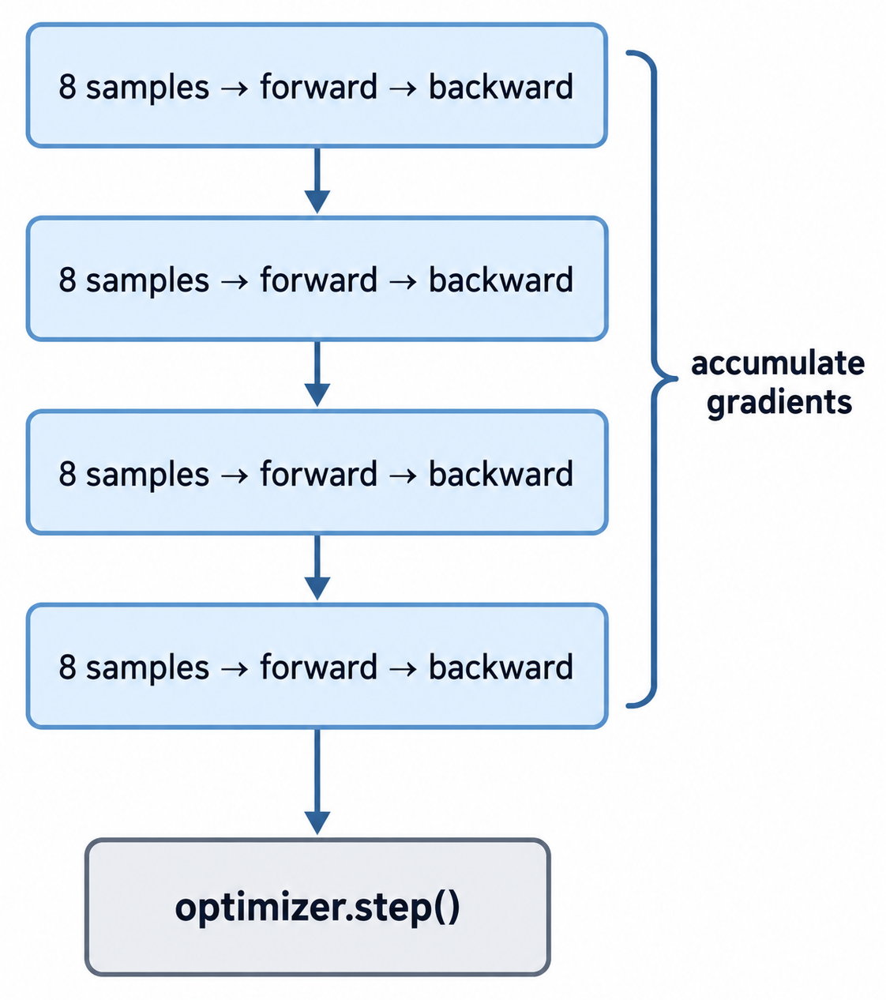

[](https://colab.research.google.com/github/jshn9515/dnnl-notebooks/blob/main/zh/ch12-llm-training-engineering/ch12.5-gradient-accumulation.ipynb){fig-align="left"}

在前面几节里，我们已经看到，训练显存并不只由模型参数决定。尤其是在 forward 过程中，中间的 activation 往往会随着 batch size 增大而明显增加。因此，一个很常见的情况是：我们希望使用更大的 batch，但 GPU 一次放不下这么多样本。

最直接的办法当然是减小 batch size。但 batch size 变小之后，每次参数更新看到的数据也会变少，梯度噪声通常会更大。有没有办法让 GPU 每次只处理一个小 batch，但在更新参数时仍然使用多个小 batch 的梯度？

这就是 **Gradient Accumulation**。

它的核心思想很简单：

> **不要每做一次 backward 就立刻更新参数，而是连续计算多个 micro-batch 的梯度，把它们累积起来，最后再执行一次 optimizer step。**

这样，我们就可以用较小的单次显存占用，得到接近更大 batch 的参数更新。

```{python}
import copy

import torch
import torch.nn as nn
import torch.optim as optim
import torch.utils.data as utils
from torch import Tensor

print('PyTorch version:', torch.__version__)
```

## 12.5.1 从 Batch 到 Micro-Batch

假设我们原本希望使用 batch size 32：

$$
B = 32
$$

但 GPU 一次最多只能放下 8 个样本。Gradient accumulation 会把原来的 batch 拆成 4 个更小的 **micro-batch**：

$$
32 = 8 + 8 + 8 + 8
$$

于是训练过程不再是：

{width=85%}

而变成：

{width=50%}

我们通常会这样区分三个量：

- **Micro-batch size**：一次真正送进 GPU 的样本数；
- **Gradient accumulation steps**：累积多少个 micro-batch 后更新一次参数；
- **Effective batch size**：一次参数更新实际使用了多少样本。

在单卡训练中：

$$
B_{\text{effective}} = B_{\text{micro}} \times N_{\text{accum}}
$$

例如：

$$
8 \times 4 = 32
$$

所以，`micro_batch=8`、`accum_steps=4` 时，一次参数更新会聚合 32 个样本的梯度。

如果以后进入多卡训练，还要再乘上 GPU 数量：

$$
B_{\text{effective}} = B_{\text{micro}} \times N_{\text{accum}} \times N_{\text{devices}}
$$

这里我们先只讨论单卡情况，分布式训练中的同步问题会留到 12.9 再讲。

## 12.5.2 Gradient Accumulation 到底累积了什么

Gradient accumulation 能成立，依赖的是 PyTorch 一个非常基础的行为：

> **多次调用 `backward()` 时，梯度默认会累加到参数的 `.grad` 中，而不是覆盖原来的梯度。**

假设参数为 $\theta$，第一个 micro-batch 得到梯度：

$$
g_1 = \nabla_\theta L_1
$$

执行第一次 `backward()` 后：

$$
\theta.\text{grad} = g_1
$$

接着，不调用 `zero_grad()`，直接对第二个 micro-batch 做 backward：

$$
g_2 = \nabla_\theta L_2
$$

那么参数中的梯度会变成：

$$
\theta.\text{grad} = g_1 + g_2
$$

继续执行 $K$ 次 backward 后：

$$
\theta.\text{grad} = \sum_{i=1}^{K} g_i
$$

因此，gradient accumulation 并不需要一个特殊的梯度累积器。PyTorch 本身就在累积 `.grad`，我们真正要控制的是：什么时候清空梯度，以及什么时候更新参数。

普通训练通常是：

```python
optimizer.zero_grad()
loss.backward()
optimizer.step()
```

而 gradient accumulation 会把 `optimizer.step()` 和 `optimizer.zero_grad()` 的频率降低：

```python
optimizer.zero_grad()

loss1.backward()
loss2.backward()
loss3.backward()
loss4.backward()

optimizer.step()
```

也就是说，backward 仍然每个 micro-batch 都做，但 optimizer step 只在一个 accumulation 结束时做一次。

## 12.5.3 为什么它可以模拟更大的 Batch

假设一个大 batch 一共有 $B$ 个样本，它的平均 loss 是：

$$
L = \frac{1}{B} \sum_{j=1}^{B} \ell_j
$$

对参数 $\theta$ 求梯度：

$$
\nabla_\theta L = \frac{1}{B} \sum_{j=1}^{B} \nabla_\theta \ell_j
$$

现在把这个 batch 平均拆成 $K$ 个 micro-batch。假设每个 micro-batch 的 loss 都使用 mean reduction：

$$
L_i = \frac{K}{B} \sum_{j \in \mathcal{B}_i} \ell_j
$$

那么完整大 batch 的 loss 可以写成：

$$
L = \frac{1}{K} \sum_{i=1}^{K} L_i
$$

因此：

$$
\nabla_\theta L = \frac{1}{K} \sum_{i=1}^{K} \nabla_\theta L_i
$$

这就解释了为什么训练代码里经常会写：

```python
loss = loss / accum_steps
loss.backward()
```

每个 micro-batch 的梯度先除以 $K$，然后连续累积：

$$
\frac{1}{K}g_1 + \frac{1}{K}g_2 + \cdots + \frac{1}{K}g_K = \frac{1}{K} \sum_{i=1}^{K}g_i
$$

这正好就是完整大 batch 的平均梯度。

如果忘记除以 `accum_steps`，那么得到的是梯度之和，而不是梯度平均：

$$
\sum_{i=1}^{K} g_i
$$

它会比预期大约放大 $K$ 倍。虽然某些情况下可以通过同时调整 learning rate 得到类似效果，但这已经不是我们这里所说的模拟同一个大 batch 了。

需要注意，这里的等价关系有一个重要前提：

> **在整个 accumulation window 中，模型参数必须保持不变。**

所以 `optimizer.step()` 只能放在所有 micro-batch 都完成 backward 之后。如果每个 micro-batch 都更新一次参数，那么后面的梯度已经是在不同参数上计算出来的，自然不再等价于一个大 batch。

## 12.5.4 一个完整的 PyTorch 训练循环

下面先看一个最简单的单卡版本。这里假设每个 micro-batch 对 loss 的贡献相同，同时处理最后不足一个完整 accumulation window 的情况：

```{python}
def train_one_epoch(
    model: nn.Module,
    dataloader: utils.DataLoader[tuple[Tensor, ...]],
    loss_fn: nn.Module,
    optimizer: optim.Optimizer,
    accum_steps: int = 4,
):
    model.train()
    optimizer.zero_grad()
    micro_batches = len(dataloader)

    for micro_step, (x, y) in enumerate(dataloader):
        x = x.to(device)
        y = y.to(device)

        group_start = (micro_step // accum_steps) * accum_steps
        group_end = min(group_start + accum_steps, micro_batches)
        curr_accum_steps = group_end - group_start

        logits = model(x)
        loss = loss_fn(logits, y)
        loss = loss / curr_accum_steps
        loss.backward()

        if micro_step + 1 == group_end:
            optimizer.step()
            optimizer.zero_grad()
```

真正关键的只有三件事：

1. `optimizer.zero_grad()` 不再放在每个 micro-batch 开头。否则刚刚累积的梯度会被清掉。
2. 每个 micro-batch 都立刻执行 `backward()`。当 backward 完成以后，这个 micro-batch 对应的大部分计算图和 saved activations 就可以被释放，不需要等其他 micro-batch。
3. 只有一个 accumulation 完成以后才执行 `optimizer.step()`，然后再清空梯度，为下一次参数更新重新开始累积。

最后这一点非常重要。下面这种写法虽然看起来也像“先算 4 个 loss，最后 backward”，但它并不能达到我们想要的效果：

```python
losses = []

for _ in range(4):
    logits = model(x)
    loss = loss_fn(logits, y)
    losses.append(loss)

sum(losses).backward()
```

因为前 3 个 forward 的计算图都必须一直保留到最后一次 `backward()`。这样多个 micro-batch 的 activation 会同时留在显存里，gradient accumulation 最主要的显存优势也就没有了。

正确做法是：

```python
for _ in range(4):
    logits = model(x)
    loss = loss_fn(logits, y) / 4
    loss.backward()
```

每个 micro-batch forward 完成后立刻 backward，才是真正用时间上的顺序执行去换显存。

## 12.5.5 验证 Full Batch 和 Gradient Accumulation 的梯度

只看公式还不够，我们可以直接做一个实验。

先构造两个完全相同的模型。第一个模型一次处理完整 batch，第二个模型把同一批数据拆成 4 个 micro-batch，然后做 gradient accumulation。最后比较每个参数得到的梯度。

```{python}
model_full = nn.Sequential(
    nn.Linear(8, 16),
    nn.GELU(),
    nn.Linear(16, 4),
)
model_accum = copy.deepcopy(model_full)

x = torch.randn(32, 8)
y = torch.randint(4, (32,))

loss_fn = nn.CrossEntropyLoss()
```

先计算完整 batch 的梯度：

```{python}
model_full.zero_grad()

logits = model_full(x)
loss = loss_fn(logits, y)
loss.backward()

full_grads = [p.grad.detach().clone() for p in model_full.parameters()]
```

然后把 batch 拆成 4 份：

```{python}
model_accum.zero_grad()
accum_steps = 4

for x_micro, y_micro in zip(x.chunk(accum_steps), y.chunk(accum_steps), strict=True):
    logits = model_accum(x_micro)
    loss = loss_fn(logits, y_micro)
    loss = loss / accum_steps
    loss.backward()

accum_grads = [p.grad.detach().clone() for p in model_accum.parameters()]
```

最后比较两组梯度：

```{python}
for i, (grad_full, grad_accum) in enumerate(zip(full_grads, accum_grads, strict=True)):
    max_diff = (grad_full - grad_accum).abs().max().item()
    print(f'Parameter {i} | Maximum gradient difference: {max_diff:.3e}')
```

正常情况下，两者只会有非常小的浮点数误差。

这也说明，gradient accumulation 并不是一种新的梯度算法。它只是利用梯度求和的线性性质，把原本一次完成的大 batch backward，拆成多个更小的 backward，再在参数更新之前把结果合起来。

## 12.5.6 Gradient Accumulation 节省了哪部分显存

Gradient accumulation 经常被描述成“用小 batch 模拟大 batch”，但它并不会让所有训练显存都按比例下降。

假设原本 batch size 是 32，现在改成：

```text
micro-batch size = 8
gradient accumulation steps = 4
```

真正发生变化的是：任意时刻只需要为 8 个样本执行 forward 和 backward。因此，与 batch size 强相关的 activation 和一部分 temporary buffers 通常会明显减少。但下面这些东西并不会因为 accumulation steps 变大而消失：

- 模型 parameters 仍然完整存在；
- Optimizer states 仍然完整存在；
- Gradients 在 accumulation window 中仍然需要保留；
- 与模型结构本身相关的固定开销仍然存在。

所以，更准确地说：

> **Gradient accumulation 主要降低的是单次 micro-batch 的 activation 峰值，而不是把整个训练显存除以 accumulation steps。**

这也解释了为什么它特别适合解决“batch 稍微大一点就 OOM”的问题。但是，如果显存主要已经被模型参数和 optimizer states 占满，仅仅增加 gradient accumulation steps 并不能解决根本问题。

还有一个容易混淆的地方：gradient accumulation 本身并不减少 gradient tensor 的大小。每个可训练参数仍然需要一个 `.grad` buffer，只不过这个 buffer 会连续接收多个 micro-batch 的梯度。因此，它和后面要讲的 activation checkpointing 解决的并不是同一个问题。

## 12.5.7 训练循环里最容易写错的几个位置

Gradient accumulation 的代码不长，但有几个位置一旦放错，训练语义就会改变。

最常见的是 gradient clipping。假设我们使用：

```python
nn.utils.clip_grad_norm_(model.parameters(), max_norm=1.0)
```

如果每个 micro-batch backward 后都 clip 一次，那么我们裁剪的是每个局部梯度，而不是最终累积得到的大 batch 梯度。正确位置通常应该是：

```python
loss.backward()

if should_update:
    nn.utils.clip_grad_norm_(model.parameters(), max_norm=1.0)
    optimizer.step()
    optimizer.zero_grad()
```

也就是先完成整个 accumulation window，再对最终梯度做 clipping。

Learning rate scheduler 也有类似问题。大多数按训练 step 更新的 scheduler，所谓的一个 `step` 指的是一次 optimizer update，而不是一次 micro-batch forward。因此通常应该写成：

```python
if should_update:
    optimizer.step()
    lr_scheduler.step()
    optimizer.zero_grad()
```

而不是每个 micro-batch 都调用一次 `lr_scheduler.step()`。否则使用 gradient accumulation 后，learning rate schedule 会比参数实际更新速度快很多。

最后一个问题是 accumulation window 的末尾。如果数据集最后只剩 2 个 micro-batch，而 `accum_steps=4`，那么仍然把每个 loss 除以 4，会让最后一次参数更新的梯度缩小一半。解决这个问题的办法有两种。一种是丢弃掉最后不完整的 accumulation window，另一种是动态计算当前 accumulation window 的 micro-batch 数量，然后除以这个数量，而不是固定除以 `accum_steps`。当然，在大规模 LLM 训练中，数据通常会被提前组织成比较规则的 batch，因此这个尾部问题未必经常出现。但在通用训练循环里，不应该默认 dataloader 长度一定能被 accumulation steps 整除。

## 12.5.8 Token-level Loss 下的正确归一化

前面的推导默认每个 micro-batch 对 loss 的权重相同。对于固定长度、没有 padding 的训练样本，这通常没有问题。但在 LLM 训练里经常会遇到 padding、mask 或不同长度的 sequence，此时不同 micro-batch 中真正参与 loss 的 token 数量可能并不相同。

假设第 $i$ 个 micro-batch 有 $n_i$ 个有效 token，它返回的平均 loss 是：

$$
L_i = \frac{1}{n_i} \sum_{j=1}^{n_i} \ell_{ij}
$$

如果直接写：

$$
\frac{1}{K} \sum_{i=1}^{K}L_i
$$

相当于让每个 micro-batch 权重相同。

但如果我们真正想模拟“把所有有效 token 放在一个大 batch 里再求平均”，应该计算：

$$
L = \frac{\sum_{i=1}^{K} n_i L_i }{\sum_{i=1}^{K} n_i }
$$

也就是说：

> **严格的等价关系应该按照有效 token 数量加权，而不是永远简单除以 accumulation steps。**

当所有 sequence 长度固定，而且每个位置都参与 loss 时：

$$
n_1 = n_2 = \cdots = n_K
$$

两种写法完全相同，所以这个区别很容易被忽略。

因此，如果训练数据中存在大量 padding，或者使用 packed sequence、loss mask、不同长度样本，那么 token-level normalization 会更加重要。实际的 LLM trainer 往往需要明确区分：我们是在对 **micro-batch mean** 求平均，还是在对整个 accumulation window 中的 **有效 token** 求平均。

## 12.5.9 Gradient Accumulation 与大 Batch 真的完全等价吗

在最简单的模型里，两者可以得到几乎相同的梯度。但在真实训练中，它们不一定完全等价。

首先是 BatchNorm。BatchNorm 的行为依赖于当前 batch 的均值和方差：

$$
\hat{x} = \frac{x - \mu_B}{\sqrt{\sigma_B^2 + \epsilon}}
$$

因此，一个 batch size 为 32 的 BatchNorm 和 4 个 batch size 为 8 的 BatchNorm 看到的统计量不同。当然，由于 Transformer 通常使用 LayerNorm 或 RMSNorm，不依赖 batch 维度统计，因此这个问题相对较少。

其次是 Dropout。Dropout 的随机 mask 是在每个 forward 时生成的，因此真正的大 batch 和多个 micro-batch 会使用不同的随机 mask。这通常不会破坏训练，但可能产生微小数值差异。

然后是浮点数加法顺序。浮点加法不严格满足结合律：

$$
(a + b) + c \neq a + (b + c)
$$

因此，即使所有 micro-batch 的 loss 都相同，累积梯度的顺序也可能影响最终结果。

最后，如果各 micro-batch 包含的有效 token 数量不同，简单地把每个 micro-batch 的平均 loss 除以 $K$，不一定等价于对所有有效 token 求整体平均。这在包含 padding 或 variable-length sequence 时尤其重要。

因此，更准确的结论是：

> **Gradient accumulation 通常能模拟更大的 effective batch，但只有在损失归一化和模型行为匹配时，才与真正的大 batch 数学等价。**

## 12.5.10 本章小结

Gradient accumulation 解决了显存问题，但它不是免费的。

首先，它不会减少完成同样数量样本所需的 forward 和 backward 计算。原本 32 个样本一次处理，现在变成 8 个样本连续处理 4 次，总计算量并没有凭空减少。相反，更小的 micro-batch 可能让 GPU 的矩阵运算规模变小，硬件利用率下降，因此吞吐有时还会变差。

所以，gradient accumulation 的目标通常不是让训练更快，而是：

> **在显存允许的 micro-batch 下，获得我们想要的 effective batch size。**

其次，大 batch 与 gradient accumulation 也不是在任何模型中都严格数值等价。前面的数学推导默认每个样本之间不会通过 batch statistics 相互影响。对于 BatchNorm 这类依赖当前 batch 统计量的层，micro-batch size 变小以后，每次 forward 使用的均值和方差已经发生变化，因此不能简单认为 accumulation 后就等价于真正的大 batch。

最后，effective batch size 变大之后，每个 epoch 的 optimizer update 次数也会减少。例如原本每 8 个样本更新一次参数，现在每 32 个样本才更新一次。Batch size 的改变本身可能影响优化行为，因此 accumulation steps 并不是越大越好。它首先应该由显存约束决定，然后再和 learning rate、warmup steps、训练 token 数以及目标 global batch size 一起考虑。

到这里，gradient accumulation 解决的是**一个大 batch 的 activation 放不下**的问题：我们把它拆成多个 micro-batch，逐个 forward 和 backward，只把梯度保留下来。但还有另一种情况：即使 micro-batch size 已经降到 1，单个样本的 activation 仍然太大。这时继续减小 batch 已经没有空间了，我们就需要进一步减少 backward 为 forward 保存的中间结果。

下一节要介绍的 **Activation Checkpointing**，解决的正是这个问题。
