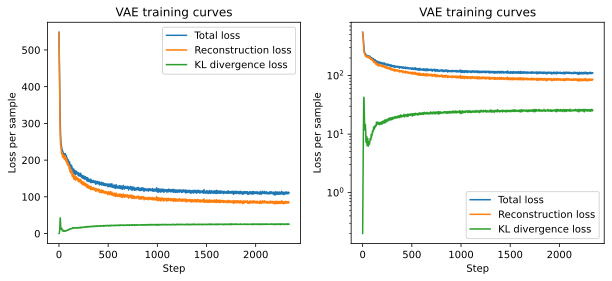
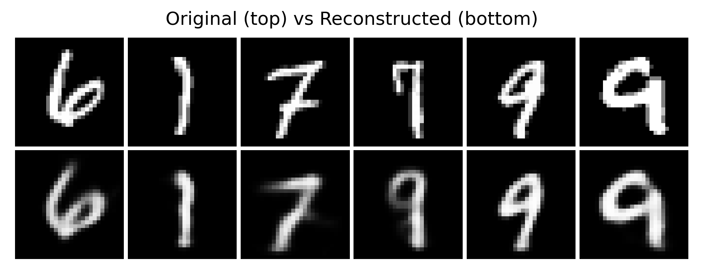
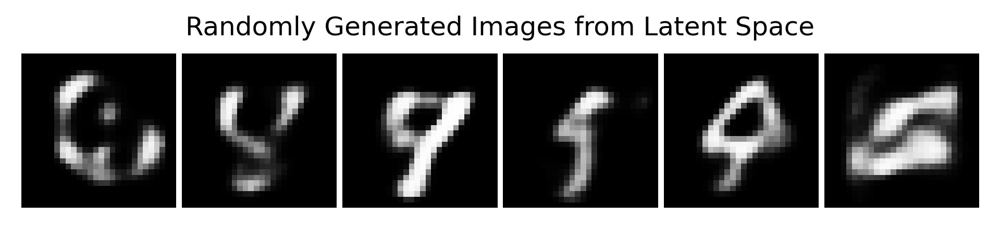
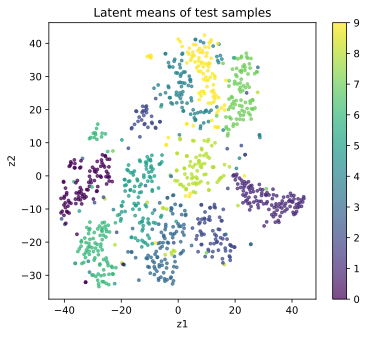
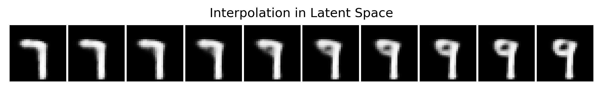
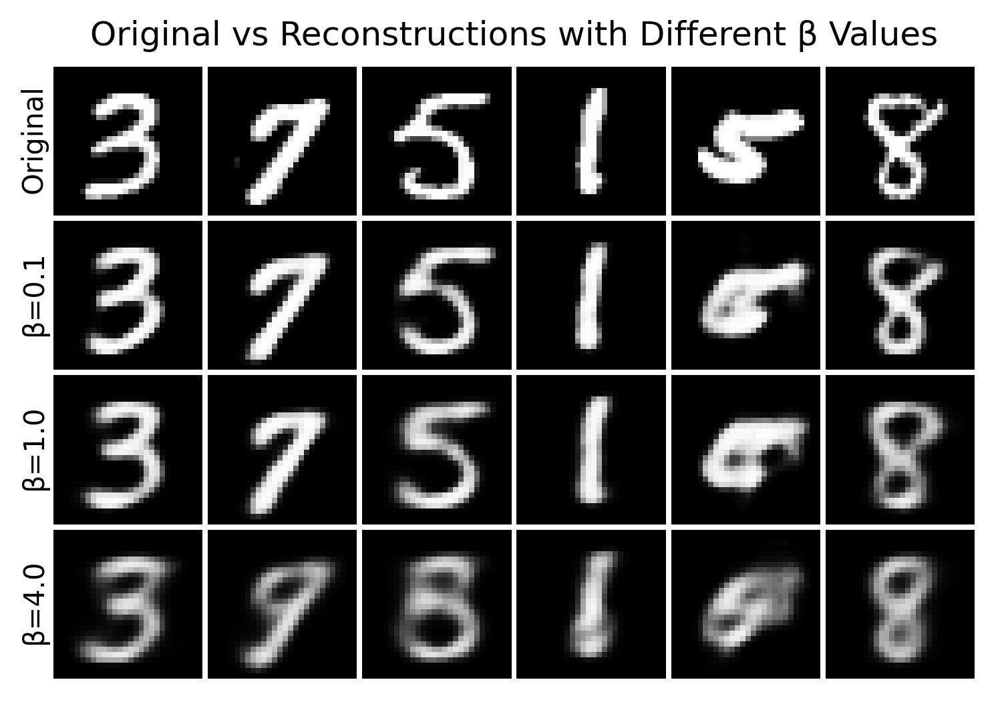

前面我们已经知道，VAE 的目标函数由两部分组成：

$$ \mathcal{L}(x)=\mathbb{E}_{q_\phi(z\mid x)}[\log p_\theta(x\mid z)]-D_{\mathrm{KL}}(q_\phi(z\mid x)\,\|\,p(z)) $$

如果把它写成训练时最小化的损失，就是：

$$ \text{loss}=\text{reconstruction loss}+\text{KL loss} $$

但只看公式还不够。真正理解 VAE，最重要的是看它在训练中会出现什么现象：

- 重建效果通常不错，但往往比 GAN 更模糊
- 潜空间往往更连续、更平滑
- 从标准正态分布采样，通常能生成像样的样本
- KL 太强或太弱时，模型行为会发生明显变化

这一节我们不只讲结论，而是直接通过代码来观察这些现象。为了更方便地观察潜空间的分布，我们使用 t-SNE 对潜空间进行可视化，并在 MNIST 上训练一个小型 VAE。

```{python}
from collections import defaultdict

import matplotlib.pyplot as plt
import torch
import torch.optim as optim
import torch.utils.data as utils
import torchvision.datasets as datasets
import torchvision.transforms.v2 as v2
from sklearn.manifold import TSNE
from torchmetrics.aggregation import MeanMetric
from torchvision.utils import make_grid

plt.rc('savefig', dpi=300, bbox='tight')
print('PyTorch version:', torch.__version__)
```

```{python}
torch.manual_seed(42)
torch.use_deterministic_algorithms(False)
torch.backends.cudnn.deterministic = False
torch.backends.cudnn.benchmark = True

device = torch.accelerator.current_accelerator(check_available=True)
if device is None:
    device = torch.device('cpu')
print(f'Using device: {device}')
```

## 13.4.1 训练一个最小 VAE

### 13.4.1.1 数据集准备

这里我们创建 MNIST 数据集。

```{python}
# Change the path to your dataset directory if needed
root = 'D:/Workspaces/Python Project/datasets'
transform = v2.Compose([v2.ToImage(), v2.ToDtype(torch.float32, scale=True)])
train_ds = datasets.MNIST(root, train=True, download=True, transform=transform)
test_ds = datasets.MNIST(root, train=False, download=True, transform=transform)

train_dl = utils.DataLoader(train_ds, batch_size=256, shuffle=True, drop_last=True)
```

### 13.4.1.2 定义 VAE 和损失函数

这里我们直接利用前面章节定义的 VAE 模型和 ELBO 损失函数。同时，为了避免损失函数的值过大，我们把损失函数的值求和汇总后除以当前批次的样本数量。

```{python}
from dnnl.ch13 import VAE, vae_loss

input_shape = (1, 28, 28)
model = VAE(input_shape).to(device)
optimizer = optim.Adam(model.parameters(), lr=1e-3)
```

### 13.4.1.3 训练 VAE 模型

这里我们把总损失拆开记录：

- `recon_loss`：重建项的损失
- `kl_loss`：KL 项的损失
- `beta`：KL 项的权重

先从最标准的情形开始，也就是 `beta = 1.0`。后面我们会改动这个值，观察不同训练现象。

```{python}
num_epochs = 10
global_step = 0
history = defaultdict(list)

loss_metric = MeanMetric().to(device)
recon_loss_metric = MeanMetric().to(device)
kl_loss_metric = MeanMetric().to(device)

model.train()
for epoch in range(1, num_epochs + 1):
    loss_metric.reset()
    recon_loss_metric.reset()
    kl_loss_metric.reset()

    for x, _ in train_dl:
        x = x.to(device)
        x_hat, mu, logvar = model(x)
        loss, recon_loss, kl_loss = vae_loss(x_hat, x, mu, logvar)
        loss.backward()

        loss_metric.update(loss.detach())
        recon_loss_metric.update(recon_loss.detach())
        kl_loss_metric.update(kl_loss.detach())

        optimizer.step()
        optimizer.zero_grad()

        history['loss'].append(loss.item())
        history['recon_loss'].append(recon_loss.item())
        history['kl_loss'].append(kl_loss.item())

        global_step += 1

    print(
        f'Epoch [{epoch:2d}/{num_epochs:2d}] | '
        f'loss: {loss_metric.compute():.4f} | '
        f'recon_loss: {recon_loss_metric.compute():.4f} | '
        f'kl_loss: {kl_loss_metric.compute():.4f}'
    )
```

```{python}
fig = plt.figure(1, figsize=(10, 4))
axes = fig.subplots(1, 2)
for ax in axes:
    ax.plot(history['loss'], label='Total loss')
    ax.plot(history['recon_loss'], label='Reconstruction loss')
    ax.plot(history['kl_loss'], label='KL divergence loss')
    ax.set_xlabel('Step')
    ax.set_ylabel('Loss per sample')
    ax.set_title('VAE training curves')
axes[0].legend(loc='upper right')
axes[1].legend(loc='lower right')
axes[1].set_yscale('log')
fig.savefig('figures/ch13.4-vae-training-curves.svg')
plt.close(fig)
```

<figure class="figure" style="text-align: center;">
  
</figure>

上图左侧是原始尺度的损失曲线，右侧是对数尺度。在一开始，重建损失很大，但随着训练的进行，重建损失迅速下降。而 KL 损失在一开始很小，并在前几个 step 里来回震荡，但随着训练的进行逐渐增加，最后趋于稳定。总损失总体趋势和重建损失相同，但由于 KL 损失的增加，下降速度比重建损失慢一些。模型在大约 2000 个 step 后收敛。

这说明，VAE 在训练过程中优化的并不是单独最小化 KL 损失，而是在重建项和 KL 正则项之间进行权衡。为了获得更好的重建效果，模型需要让后验分布 $q_\phi(z \mid x)$ 携带更多关于输入数据 $x$ 的信息；但当 $q_\phi(z \mid x)$ 更依赖输入数据时，它就会偏离先验分布 $p(z)$，从而导致 KL 损失增大。在训练过程中，模型会逐渐找到一个平衡点，使得重建损失和 KL 损失都得到合理的优化。因此，KL 的增加并不一定意味着训练异常，反而往往说明模型开始有效利用潜变量来表示输入数据。

接下来，我们来看看 VAE 的几个重要现象。

## 13.4.2 现象一：VAE 能重建，但结果往往偏平滑

VAE 的 decoder 不是在死记硬背一个点，而是在处理带有随机性的潜变量分布。这使得它学到的表示更平滑，但也常常让重建结果显得更柔和、更模糊。

下面我们把原图和重建图放在一起看。

```{python}
num_samples = 6
samples_idx = torch.randperm(len(test_ds))[:num_samples]
original = [test_ds[int(idx)][0] for idx in samples_idx]
original = torch.stack(original).to(device)

model.eval()
with torch.inference_mode():
    reconstructed, *_ = model(original)

image_list = torch.concat([original, reconstructed], dim=0)
grid = make_grid(image_list, nrow=num_samples, padding=1, pad_value=1)
grid = grid.permute(1, 2, 0).numpy(force=True)  # CxHxW -> HxWxC

fig = plt.figure(2, figsize=(8, 3))
ax = fig.add_subplot(1, 1, 1)
ax.imshow(grid, cmap='gray')
ax.axis('off')
ax.set_title('Original (top) vs Reconstructed (bottom)')
fig.savefig('figures/ch13.4-reconstructed.png')
plt.close(fig)
```

<figure class="figure" style="text-align: center;">
  
</figure>

如果你把它和普通 AutoEncoder 对比就会发现，AutoEncoder 的重建通常更锐利，因为它不需要服从一个先验概率；而 VAE 的重建往往更平滑，因为它必须让潜空间保持连续、可采样。这也是为什么很多人第一次看 VAE 的生成结果，会觉得它有点糊。这种模糊并不一定说明模型没学会，而是它在为可生成、可插值、可采样的潜空间付出的代价。

## 13.4.3 现象二：从标准正态采样，真的可以生成新样本

VAE 的一个关键优点是，训练完成后，我们可以直接从先验分布 $z \sim \mathcal{N}(0, I)$ 中采样，然后通过 decoder 生成图片。相比于 AE 生成出的图片往往只是噪声，不带有任何结构，VAE 生成的图片通常能看出明显的数字形状，虽然可能比较模糊。这说明 VAE 学到的不是单纯的压缩器，而是一个真正的生成模型。

```{python}
num_samples = 6
z = torch.randn(num_samples, model.latent_dim).to(device)

model.eval()
with torch.inference_mode():
    x_hat = model.decode(z)

grid = make_grid(x_hat, nrow=num_samples, padding=1, pad_value=1)
grid = grid.permute(1, 2, 0).numpy(force=True)  # CxHxW -> HxWxC

fig = plt.figure(3, figsize=(8, 2))
ax = fig.add_subplot(1, 1, 1)
ax.imshow(grid, cmap='gray')
ax.axis('off')
ax.set_title('Randomly Generated Images from Latent Space')
fig.savefig('figures/ch13.4-randomly-generated.png')
plt.close(fig)
```

<figure class="figure" style="text-align: center;">
  
</figure>

这一步生成出来的结果还比较像手写数字，虽然仍然很模糊，但起码有了明显的数字形状。说明 KL 项确实把潜空间拉向了标准正态附近，并且 decoder 也确实学会了如何把这个潜空间解释成数据。这正是普通 AutoEncoder 很难稳定做到的。普通 AE 的潜空间往往很零散，就像 13.1 节里的实验一样，我们随便采样一个点，decoder 往往会输出一个很奇怪的结果。

## 13.4.4 现象三：潜空间是连续的，而不是碎片化的

为了看潜空间，我们把每张测试图片都编码成均值向量 $\mu(x)$。然后，由于维度较高，是 32 维，因此我们使用 t-SNE 对这些均值向量进行降维可视化。我们还用不同的颜色标记了不同类别的数字。

```{python}
num_samples = 1000
samples_idx = torch.randperm(len(test_ds))[:num_samples]
samples_batch = [test_ds[int(idx)][0] for idx in samples_idx]
samples_batch = torch.stack(samples_batch).to(device)

model.eval()
with torch.inference_mode():
    mu_list, _ = model.encode(samples_batch)

mu_list = mu_list.numpy(force=True)
label_list = test_ds.targets[samples_idx].numpy()

Mdl = TSNE(n_components=2, random_state=42)
mu_2d = Mdl.fit_transform(mu_list)

fig = plt.figure(4, figsize=(6, 5))
ax = fig.add_subplot(1, 1, 1)
scatter = ax.scatter(mu_2d[:, 0], mu_2d[:, 1], c=label_list, s=8, alpha=0.7)
fig.colorbar(scatter)
ax.set_xlabel('z1')
ax.set_ylabel('z2')
ax.set_title('Latent means of test samples')
fig.savefig('figures/ch13.4-latent-space.svg')
plt.close(fig)
```

<figure class="figure" style="text-align: center;">
  
</figure>

可以看到，同类数字会在潜空间中形成相对接近的区域，不同数字之间并不是完全割裂，而是带有一定的连续过渡。潜空间的整体分布不会无限发散，而会被 KL 项拉在中心附近。VAE 学到的潜空间不只是能编码数据，还往往具有几何结构。

也正因为如此，VAE 才特别适合做插值。

## 13.4.5 现象四：潜空间插值通常是平滑的

如果潜空间真的是连续的，那么在两个样本之间做线性插值时，decoder 生成出来的结果也应该是平滑变化的，而不是突然跳变。下面我们随便取两张测试图片，先编码得到它们对应的均值向量，再在这两个点之间插值。

```{python}
num_samples = 2
num_steps = 10
samples_idx = torch.randperm(len(test_ds))[:num_samples]

model.eval()
x1, _ = test_ds[int(samples_idx[0])]
x2, _ = test_ds[int(samples_idx[1])]
x1 = x1.unsqueeze(0).to(device)
x2 = x2.unsqueeze(0).to(device)

with torch.inference_mode():
    mu1, _ = model.encode(x1)
    mu2, _ = model.encode(x2)

    alphas = torch.linspace(0, 1, num_steps, device=device).view(-1, 1)
    z_list = torch.lerp(mu1, mu2, alphas)
    x_hat = model.decode(z_list)

x_hat = make_grid(x_hat, nrow=num_steps, padding=1, pad_value=1)
x_hat = x_hat.permute(1, 2, 0).numpy(force=True)  # CxHxW -> HxWxC

fig = plt.figure(5, figsize=(num_steps, 2))
ax = fig.add_subplot(1, 1, 1)
ax.imshow(x_hat, cmap='gray')
ax.axis('off')
ax.set_title('Interpolation in Latent Space')
fig.savefig('figures/ch13.4-interpolation.png')
plt.close(fig)
```

<figure class="figure" style="text-align: center;">
  
</figure>

你会发现插值结果是平滑变化的，而不是突然跳变的。随着插值系数从 0 变到 1，数字形状会慢慢变化，笔画会逐渐移动、弯曲或合并。虽然中间态不一定是标准数字，但通常不像噪声。这说明 latent space 不是一堆毫无关系的离散点，而更像一个连续的语义空间。

## 13.4.6 KL 项太强或太弱，会发生什么

现在我们来看 VAE 训练中非常关键的一点：KL 项的权重，会显著影响模型行为。

我们把损失写成：

$$ \text{loss} = \text{reconstruction loss} + \beta \cdot \text{KL loss} $$

这里的 $\beta$ 用来控制 KL 的强弱。如果 $\beta$ 太小，模型就更在意重建，潜空间可能变得不规整；如果 $\beta$ 太大，模型就更在意贴近先验，重建可能明显变差。

下面用一个小实验快速比较不同 $\beta$ 的效果。为了节省时间，我们只训练少量 epoch。

```{python}
betas = [0.1, 1.0, 4.0]
models = {}

for beta in betas:
    print(f'Training beta={beta}...')
    model = VAE(input_shape).to(device)
    optimizer = optim.Adam(model.parameters(), lr=1e-3)

    for epoch in range(5):
        model.train()

        for x, _ in train_dl:
            x = x.to(device)
            x_hat, mu, logvar = model(x)
            loss, *_ = vae_loss(x_hat, x, mu, logvar, beta=beta)
            loss.backward()

            optimizer.step()
            optimizer.zero_grad()

    models[beta] = model.eval()
```

```{python}
num_samples = 6
samples_idx = torch.randperm(len(test_ds))[:num_samples]
original = [test_ds[int(idx)][0] for idx in samples_idx]
original = torch.stack(original).to(device)

reconstructed = []
with torch.inference_mode():
    for beta in betas:
        x_hat, *_ = models[beta](original)
        reconstructed.append(x_hat)

image_list = torch.concat([original] + reconstructed, dim=0)
grid = make_grid(image_list, nrow=num_samples, padding=1, pad_value=1)
grid = grid.permute(1, 2, 0).numpy(force=True)

fig = plt.figure(6, figsize=(num_samples, 2 * (len(betas) + 1)))
ax = fig.add_subplot(1, 1, 1)
ax.imshow(grid, cmap='gray')

row_labels = ['Original'] + [f'β={beta}' for beta in betas]
for i, label in enumerate(row_labels):
    ax.text(-0.5, i * 29 + 14, label, ha='right', va='center', rotation=90, fontsize=10)

ax.axis('off')
ax.set_title('Original vs Reconstructions with Different β Values')
fig.savefig('figures/ch13.4-beta-comparison.png')
plt.close(fig)
```

<figure class="figure" style="text-align: center;">
  
</figure>

图中第一行是原图，第二行是 $\beta=0.1$ 的重建，第三行是 $\beta=1.0$ 的重建，第四行是 $\beta=4.0$ 的重建。

可以看到，当 $\beta$ 很小时，重建效果更清楚，但潜空间更容易乱跑，从标准正态直接采样时，生成质量不一定稳定；当 $\beta$ 较大时，潜空间会更规整，采样更稳定，但重建更容易模糊，甚至丢失细节。

这就是 VAE 的一种权衡。当我们想让潜空间更漂亮、连续、服从先验时，就可能牺牲一些重建精度；反之，如果我们想要更清晰的重建，就可能得到一个不太规整的潜空间，模型也就退化成了一个普通的 AutoEncoder，失去了 VAE 的生成能力。

## 13.4.7 一个常见的失败现象：Posterior Collapse

在某些更强的 decoder 上，VAE 还会遇到一个著名问题：**后验坍塌（posterior collapse）**。

它指的是，在训练过程中，encoder 输出的后验分布 $q_\phi(z\mid x)$ 逐渐变得和先验分布 $p(z)$ 一模一样，导致 KL 项几乎为零。此时，decoder 几乎不依赖潜变量 $z$ 就能完成生成任务，最终 latent variable 失去了信息承载作用。

直觉上，这就像模型在说：

> 既然 decoder 已经很强，那我干脆不认真使用 latent code 了。

在 MNIST 这种简单实验里，这个问题不一定特别明显。但在文本生成、强自回归 decoder 或复杂模型中，它会成为一个非常实际的问题。我们可以用一些方法来缓解这个问题，使用更合适的 decoder 结构，使用 $\beta$-VAE、InfoVAE 等变体进行调整。这些技巧不需要我们现在就全部记住，但我们要知道，VAE 的训练并不是永远天然稳定，KL 项的设计和权重非常关键。

## 13.4.8 本章小结

现在我们来总结一下，VAE 的训练现象背后有哪些重要的直觉：

1. VAE 的重建通常比较平滑。它不是只追求像素级拟合，还要让潜空间满足概率结构。
2. VAE 可以直接从标准正态采样生成。这说明它学到的是一个真正可生成的 latent space。
3. 潜空间往往具有连续结构。同类样本相互接近，不同样本之间可以平滑插值。
4. KL 项控制着重建能力与潜空间规整性的平衡。太弱，潜空间会散；太强，重建会糊。

VAE 是后续一系列生成模型的基础。理解它的训练现象和潜空间直觉，对我们后续学习 diffusion、latent diffusion 等模型非常重要。它不仅是一个生成模型，更是一个学习潜空间结构的工具，这也是它在生成模型领域具有重要地位的原因。

## 13.4.9 练习

你可以自己继续修改上面的代码，观察更多现象：

1. 把 `latent_dim` 从 32 改成 4、8、16，看看重建和采样会发生什么变化。
2. 把 `beta` 改成更小或更大，比较不同模型的潜空间分布。
3. 试着把重建项从 BCE 改成 MSE，观察生成图像风格的变化。
4. 把训练 epoch 增加到 15 或 20，看看潜空间可视化是否更清晰。
5. 对比普通 AutoEncoder 和 VAE 的插值结果，理解“规整潜空间”到底带来了什么。
