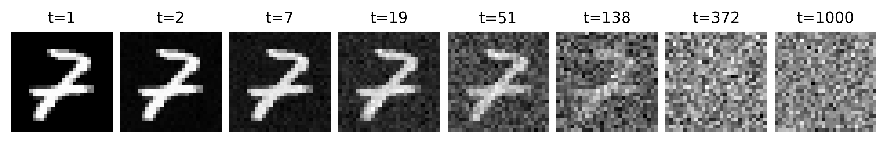
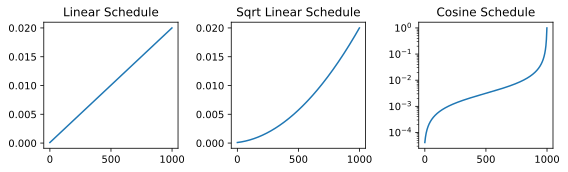
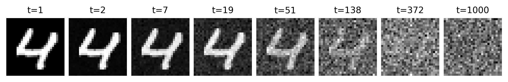

上一节我们先从直觉上理解了 DDPM 的核心想法：先把真实图像一步一步变成噪声，再学习这个过程的逆过程。如果你已经接受了这个大方向，那么接下来的问题就是：

- 这个加噪过程到底怎么定义？
- 为什么它最后会变成高斯噪声？
- 为什么 DDPM 要专门设计这样一个前向过程？

这一节，我们就来把前向扩散过程讲清楚。这一部分很重要，因为它几乎决定了整个 DDPM 的建模框架。

```{python}
import random
import time

import matplotlib.pyplot as plt
import torch
import torchvision.datasets as datasets
import torchvision.transforms.v2 as v2
from torch import Tensor

plt.rc('savefig', dpi=300, bbox='tight')
print('PyTorch version:', torch.__version__)
```

## 14.2.1 图像到噪声的过程：一个高斯马尔可夫链

假设我们有一张真实图像 $x_0$。我们希望通过若干步，一步一步加入噪声。因此，我们可以定义一个链式前向过程：

$$ x_0 \rightarrow x_1 \rightarrow x_2 \rightarrow \cdots \rightarrow x_T $$

其中，$x_0$ 是真实样本，$x_t$ 是第 $t$ 步加噪后的结果，$x_T$ 接近标准高斯分布。

所以，我们通过很多个很小的随机扰动，把真实数据逐步洗掉。这样，每一步的变化都很小，整个过程更平滑，也更容易分析。

DDPM 里通常把前向过程写成一个马尔可夫链：

$$ q(x_t \mid x_{t-1}) = \mathcal{N}\big(x_t;\sqrt{1-\beta_t}\,x_{t-1}, \beta_t I\big) $$

第一次看到这个式子，可能会有点抽象。它其实是在说，从 $x_{t-1}$ 到 $x_t$ 的转移概率并不是一个确定的函数，而是一个高斯分布，均值是 $\sqrt{1-\beta_t}\,x_{t-1}$，方差是 $\beta_t I$。也就是说，$x_t$ 是在 $x_{t-1}$ 的基础上加了一个高斯噪声。

把上面的式子写成我们熟悉的形式，就是：

$$ x_t = \sqrt{1-\beta_t}\,x_{t-1} + \sqrt{\beta_t}\,\epsilon_t, \quad \epsilon_t \sim \mathcal{N}(0, I) $$

其中，$\epsilon_t$ 是一个标准高斯噪声；$\beta_t \in (0,1)$ 是这一步加噪的强度；$\sqrt{1-\beta_t}$ 控制原图保留多少；$\sqrt{\beta_t}$ 控制噪声注入多少。一般来说，我们会控制 $\beta_t$ 的范围在 0.0001 到 0.02 之间，并且随着 $t$ 的增加逐渐增大，这样就能保证最后的 $x_T$ 接近标准高斯分布。而且由于 $\beta_t$ 很小，$\sqrt{1-\beta_t}$ 就接近 1，所以每一步我们都保留了大部分的原图信息，只是混入了一点点噪声。

所以这个公式本质上就是一句话：新图像 = 保留大部分旧图像 + 混入一小部分随机噪声。这也符合我们上一节的直觉。

## 14.2.2 为什么前面要乘上 $\sqrt{1-\beta_t}$？

很多人第一次看到这里时，会问一个自然的问题：

> **为什么不是简单写成 $x_t = x_{t-1} + \text{noise}$ 呢？**

这是个非常好的问题。实际上，如果我们每一步只是直接往上叠噪声，那么图像的整体方差会越来越乱，数值尺度可能会不断膨胀。这样虽然图像也能变脏，但过程会不太稳定，也不方便分析。所以 DDPM 做了一个更规整的设计：

$$ x_t = \sqrt{1-\beta_t}\,x_{t-1} + \sqrt{\beta_t}\,\epsilon_t $$

这样一来，我们可以把每一步理解成一种受控的插值。从方差角度看，这个形式也更干净。因为如果 $x_{t-1}$ 和 $\epsilon_t$ 都大致是单位方差，那么前一部分的方差大约是 $1-\beta_t$，后一部分的方差大约是 $\beta_t$，它们加起来还是大约 1。

所以，这种设计保证了在不断加噪的同时，整体数值尺度不会失控。也就使网络的训练和推理过程更稳定，更容易分析。

```{python}
# Change the root path to your local directory if needed
root = 'D:/Workspaces/Python Project/datasets'
transform = v2.Compose([v2.ToImage(), v2.ToDtype(torch.float32, scale=True)])
ds = datasets.MNIST(root, train=False, download=True, transform=transform)

idx = random.randrange(len(ds))
x0 = ds[idx][0].squeeze(0)  # shape: (28, 28)


def add_noise_v1(x0: Tensor, betas: Tensor) -> Tensor:
    xt = x0.clone()
    for beta in betas:
        noise = torch.randn_like(x0)
        xt = (1 - beta).sqrt() * xt + beta.sqrt() * noise
    return xt


betas = torch.linspace(0.0001, 0.02, steps=1000)
samples = [x0]
t1 = time.time()
for i in range(len(betas)):
    xt = add_noise_v1(x0, betas[:i + 1])
    samples.append(xt)
t2 = time.time()
print(f'[Time]: add_noise_v1 took {t2 - t1:.4f} seconds.')

# We use step=8 here for better visualization
idx = torch.logspace(0, 3, steps=8, dtype=torch.long)
samples = [samples[i] for i in idx - 1]

fig = plt.figure(1, figsize=(8, 2))
axes = fig.subplots(1, len(samples))
for i, ax in enumerate(axes):
    ax.imshow(samples[i], cmap='gray')
    ax.axis('off')
    ax.set_title(f't={idx[i]}', fontsize=10)
fig.tight_layout(pad=0.5)
fig.savefig('figures/ch14.2-add-noise-v1.png')
plt.close(fig)
```

<figure class="figure" style="text-align: center;">
  
</figure>

我们对原始图像 $x_0$ 进行 1000 这样的加噪操作，并在 1~1000 步中选取 8 个不同的时间点来观察图像的变化。我们会发现，在开头几步，图像的结构非常清晰；随着步数的增加，图像逐渐变得模糊；到 300 步以后，原本的结构已经完全淹没在噪声里了。加噪步数越多，最终得到的图像就越接近高斯分布，反向采样得到的图像也就越好。

这正是前向扩散过程想做的事。

## 14.2.3 $\beta_t$ 的作用与噪声调度策略

在前向过程中，$\beta_t$ 表示第 $t$ 步的噪声强度，它决定了这一轮加噪有多猛。

如果我们把所有步的 $\beta_t$ 都设得非常大，那么图像会很快被打坏，前后两步差别太剧烈。这样反向过程就会更难学，因为模型每一步都要修正很大一块误差，这也就和直接从噪声生成图像差不多了，失去了逐步修正的优势。相反，如果每一步的 $\beta_t$ 都比较小，那么图像是被缓慢地推向噪声分布的，整个过程更平滑。

因此，DDPM 通常会提前设定一个 **噪声调度器（Noise Scheduler）**：

$$ \beta_1, \beta_2, \dots, \beta_T $$

这串数一般是人为指定的，而不是训练出来的。

常见的做法包括：

- **线性调度**：让 $\beta_t$ 随时间逐渐变大（我们前面的示例就是这种）；
- **平方根线性调度**：让 $\sqrt{\beta_t}$ 随时间逐渐变大；
- **余弦调度**：让整体噪声注入过程呈现余弦式变化。

它们背后的共同想法都是：前期噪声少加一点，后期再逐渐加大，让信号平滑地衰减。所以它们都是单调递增的函数。

```{python}
from diffusers.schedulers.scheduling_ddpm import DDPMScheduler

linear = DDPMScheduler(beta_schedule='linear')
sqrt_linear = DDPMScheduler(beta_schedule='scaled_linear')
sqrt_cosine = DDPMScheduler(beta_schedule='squaredcos_cap_v2')

fig = plt.figure(2, figsize=(8, 2.5))
ax = fig.add_subplot(1, 3, 1)
ax.plot(linear.betas, label='linear')
ax.set_title('Linear Schedule')
ax = fig.add_subplot(1, 3, 2)
ax.plot(sqrt_linear.betas, label='sqrt linear')
ax.set_title('Sqrt Linear Schedule')
ax = fig.add_subplot(1, 3, 3)
ax.plot(sqrt_cosine.betas, label='cosine')
ax.set_yscale('log')
ax.set_title('Cosine Schedule')
fig.tight_layout()
fig.savefig('figures/ch14.2-beta-schedules.svg')
plt.close(fig)
```

<figure class="figure" style="text-align: center;">
  
</figure>

## 14.2.4 多步展开：$x_t$ 可以直接写成 $x_0$ 和噪声的组合

虽然前向过程是一步一步定义的，但 DDPM 有一个非常漂亮的性质：

> **我们可以把任意时刻的 $x_t$ 直接写成原图 $x_0$ 和一个高斯噪声的线性组合。**

这件事非常关键，因为它让训练变得特别方便。

我们已经知道了单步的加噪公式：

$$ x_t = \sqrt{1-\beta_t}\,x_{t-1} + \sqrt{\beta_t}\,\epsilon_t, \quad \epsilon_t \sim \mathcal{N}(0, I) $$

先定义：

$$ \alpha_t = 1 - \beta_t $$

再定义累计乘积：

$$ \bar{\alpha}_t = \prod_{s=1}^{t} \alpha_s $$

利用归纳法，可以推导出：

$$ q(x_t \mid x_0) = \mathcal{N}\big(x_t; \sqrt{\bar{\alpha}_t}\,x_0,\ (1-\bar{\alpha}_t)I\big) $$

等价地，我们可以直接采样：

$$ x_t = \sqrt{\bar{\alpha}_t}\,x_0 + \sqrt{1-\bar{\alpha}_t}\,\epsilon, \quad \epsilon \sim \mathcal{N}(0, I) $$

这个公式值得你多看几遍，因为它非常重要。公式的完整推导见 [@luo2022UnderstandingDiffusionModels, eq. 61-70]。这里我们先来理解一下这个式子。

这个公式的前半部分，也就是 $\sqrt{\bar{\alpha}_t}\,x_0$，表示在 $t$ 步之后，原图 $x_0$ 还剩下多少。由于 $\bar{\alpha}_t$ 是 $\alpha_t$ 的累积乘积，而 $\alpha_t = 1 - \beta_t$ 又是小于 1 的数，所以 $\bar{\alpha}_t$ 会随着 $t$ 的增加而逐渐变小。这就意味着，随着时间的推移，原图的权重会越来越弱。

这正好对应我们想要的效果：时间越往后，图像中的原始结构越少，噪声越多。

```{python}
# Change the root path to your local directory if needed
root = 'D:/Workspaces/Python Project/datasets'
transform = v2.Compose([v2.ToImage(), v2.ToDtype(torch.float32, scale=True)])
ds = datasets.MNIST(root, train=False, download=True, transform=transform)

idx = random.randint(0, len(ds) - 1)
x0 = ds[idx][0].squeeze(0)  # shape: (28, 28)


def add_noise_v2(x0: Tensor, betas: Tensor, timestep: int) -> Tensor:
    noise = torch.randn_like(x0)
    t = timestep
    alphas = 1.0 - betas
    alpha_bars = alphas.cumprod(dim=0)
    xt = alpha_bars[t].sqrt() * x0 + (1 - alpha_bars[t]).sqrt() * noise
    return xt


betas = torch.linspace(0.0001, 0.02, steps=1000)
samples = [x0]
t1 = time.time()
for t in range(len(betas)):
    xt = add_noise_v2(x0, betas, t)
    samples.append(xt)
t2 = time.time()
print(f'[Time]: add_noise_v2 took {t2 - t1:.4f} seconds.')

# We use step=8 here for better visualization
idx = torch.logspace(0, 3, steps=8, dtype=torch.long)
samples = [samples[i] for i in idx - 1]

fig = plt.figure(3, figsize=(8, 2))
axes = fig.subplots(1, len(samples))
for i, ax in enumerate(axes):
    ax.imshow(samples[i], cmap='gray')
    ax.axis('off')
    ax.set_title(f't={idx[i]}', fontsize=10)
fig.tight_layout(pad=0.5)
fig.savefig('figures/ch14.2-add-noise-v2.png')
plt.close(fig)
```

<figure class="figure" style="text-align: center;">
  
</figure>

这段代码不是按逐步递推来生成 $x_t$，而是直接使用闭式公式：

$$ x_t = \sqrt{\bar{\alpha}_t}\,x_0 + \sqrt{1-\bar{\alpha}_t}\,\epsilon $$

这说明，我们在训练时，其实没必要真的从 $x_0$ 一步一步模拟到 $x_t$。只要知道第 $t$ 步对应的 $\bar{\alpha}_t$，我们就可以一次性把样本送到任意噪声水平。这会让训练高效很多。

## 14.2.5 为什么最后会接近高斯噪声？

这是理解 DDPM 时特别关键的一步。

我们前面已经知道：

$$ x_t = \sqrt{\bar{\alpha}_t}\,x_0 + \sqrt{1-\bar{\alpha}_t}\,\epsilon $$

随着 $t$ 不断增大，$\bar{\alpha}_t$ 会持续变小。如果我们把步数设得足够多，并且 schedule 设计得合适，那么最后会有：

$$ \bar{\alpha}_T \approx 0,\qquad 1 - \bar{\alpha}_T \approx 1 $$

于是上式就变成：

$$ x_T \approx \epsilon,\qquad \epsilon \sim \mathcal{N}(0, I) $$

也就是说，到了最后一步，原图信息几乎完全消失，只剩下一个近似标准高斯噪声的变量。事实上，可以证明的是，当 $T \to \infty$ 时，$x_T$ 的分布会弱收敛到标准高斯分布。这是一个渐进的过程，所以在实际中我们只需要 $T$ 足够大，就能让 $x_T$ 非常接近高斯分布了。一般来说，对于 DDPM，$T$ 的值通常在 1000 左右。

所以，这正是 DDPM 最想要的结果。把复杂的数据分布，渐进地变成一个非常简单、非常容易采样的分布。至于为什么变成高斯分布？因为高斯分布是一个非常简单的分布。我们知道它的解析形式，能够轻松采样，并且在数学上也很好处理。

## 14.2.6 DDPM 前向过程的设计动机

到这里你可能会发现，DDPM 的前向过程并不是随便拍脑袋设计的。它之所以常常写成：

$$ q(x_t \mid x_{t-1}) = \mathcal{N}\big(x_t;\sqrt{1-\beta_t}x_{t-1}, \beta_t I\big) $$

主要有几个原因。

1. 它足够简单。每一步都是高斯扰动，形式规整，容易实现，也容易推导。
2. 它足够平滑。每一步都只加一点小噪声，因此前后状态变化不会太激烈。
3. 它有闭式表达。这点尤其重要。因为我们能把 $x_t$ 直接写成 $x_0$ 和噪声的组合，这使得训练非常方便。
4. 它把终点变成高斯分布，而高斯分布是我们最容易采样的起点。生成时，只要从高斯噪声开始，再学着反过来走就行了。

所以我们可以说：

> **DDPM 的前向过程，本质上是一个人为设计的、数学上很舒服的破坏过程。**

说了这么多，那么这个前向过程在训练时到底是怎么用的呢？

说出来你可能会感觉很惊讶，其实模型压根就不需要学习前向过程。前向过程的定义是固定的，它唯一的作用，就是给训练样本制造不同噪声水平的版本。我们在训练时，直接用前面那个闭式公式来生成不同水平的带噪图像就好了。

训练时，我们通常会这样做：

1. 从数据集中取一张真实图像 $x_0$；
2. 随机采样一个时间步 $t$；
3. 采样一个标准高斯噪声 $\epsilon$；
4. 用公式 $x_t = \sqrt{\bar{\alpha}_t}x_0 + \sqrt{1-\bar{\alpha}_t}\epsilon$ 构造出对应的带噪图像；
5. 把 $x_t$ 和 $t$ 扔给神经网络，让它去预测噪声 $\epsilon$。

所以，前向过程在训练里扮演的是出题人的角色。它负责把原图弄脏，并且它知道到底加了多少噪声，然后让神经网络猜回来。于是，训练问题就变成了一个监督学习问题：给你一张某个噪声等级下的图，能不能把其中掺入的噪声预测出来？

这比直接让模型无中生有地生成一张图，要具体得多。

## 14.2.7 本章小结

到这里，我们可以把 14.2 的核心内容压缩成几句话。

DDPM 的前向过程是一个逐步加噪的马尔可夫链：

$$ x_t = \sqrt{1-\beta_t}\,x_{t-1} + \sqrt{\beta_t}\,\epsilon_t $$

它的作用是把真实数据逐步推向高斯噪声。这个过程是人为设定的，模型不用学习。

根据闭式公式，任意时刻的 $x_t$ 都可以直接写成：

$$ x_t = \sqrt{\bar{\alpha}_t}x_0 + \sqrt{1-\bar{\alpha}_t}\epsilon $$

这使得训练可以随机跳到任意噪声水平，而不用真的一步一步模拟。

那么，反向过程呢？如果前向过程是加入噪声，那反向过程自然就是去掉噪声。可是，为什么预测噪声，就等价于在做去噪？为什么 DDPM 的训练目标最后会变成一个简单的 MSE？在理解了前向扩散之后，下一步我们来看看，我们该如何从噪声一步一步走回图像。这才是 DDPM 真正开始生成的地方。
