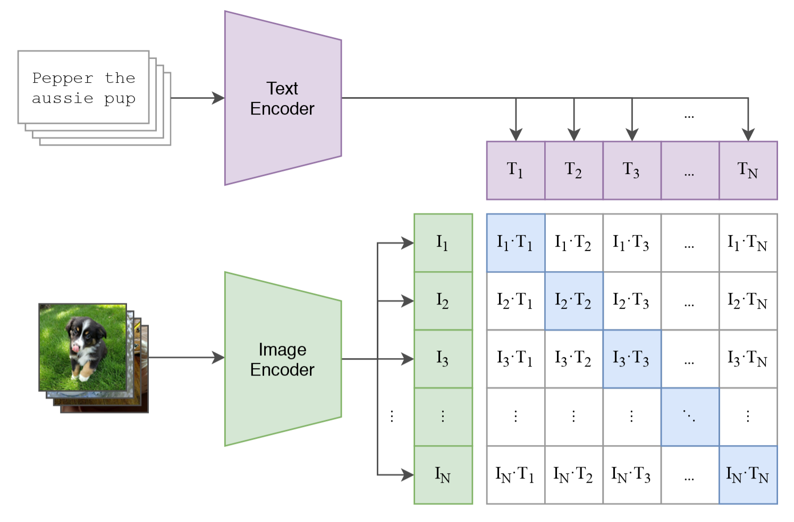
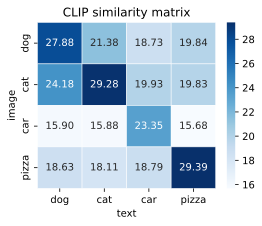
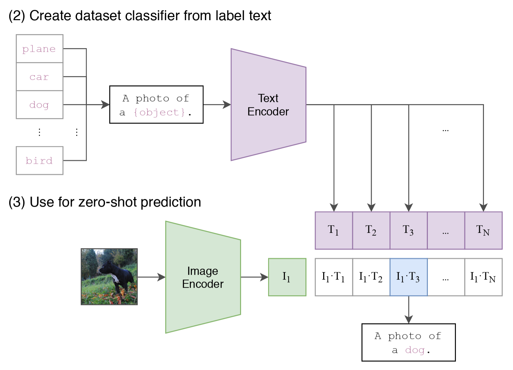
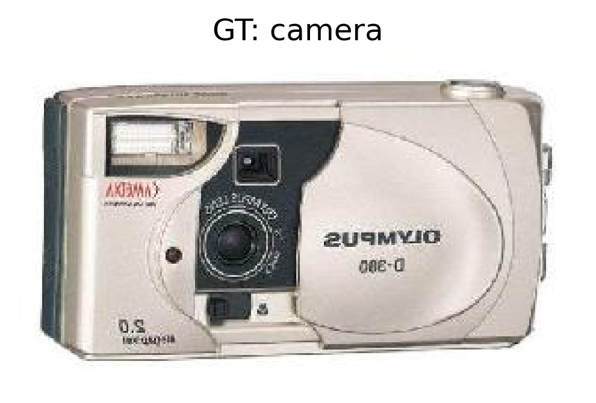
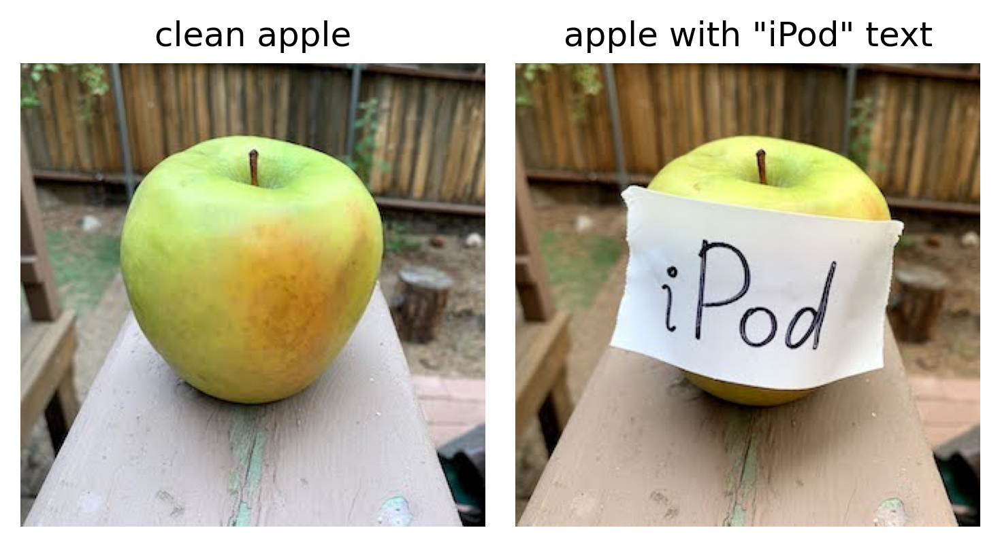

在前面的章节里，我们见过很多视觉和文本模型。无论是分类、检测、还是生成，这些模型大多都只处理一种模态，也就是图像或文本本身。但如果我们退一步想，现实世界里的监督信号并不总是整齐的类别标签。更多时候，我们拿到的是图像配上一段自然语言描述，例如“这是一只趴在沙发上的猫”、“一辆停在路边的蓝色汽车”或者“一个人在海边冲浪”。

那么，一个自然的问题就是：

> **我们能不能直接利用图像和文本之间的对应关系来训练模型？**

CLIP (Contrastive Language-Image Pretraining) [@radford2021CLIP] 给出的答案是可以。它的核心想法非常直接：让模型同时看图像和文本，并且学习哪张图应该和哪句话更接近，哪张图不应该和哪句话接近。如果这个目标学得足够好，那么模型最终就会把图像和文本都映射到同一个语义空间里。于是，图像分类、图文检索、零样本识别这些任务，都可以统一成一个算相似度的问题。

这一节我们就来把 CLIP 的核心思路讲清楚。你会看到，它并没有显式地训练一个传统分类器，而是把监督信号放在了图文对齐这件事上。也正因为如此，它才具备了很强的零样本学习能力。

```{python}
import os
import random

import IPython.display as ipy
import matplotlib.pyplot as plt
import PIL.Image as Image
import seaborn as sns
import torch
import torch.nn.functional as F
import torchvision.datasets as datasets
import transformers
from torch import Tensor
from transformers import CLIPModel, CLIPProcessor

plt.rc('savefig', dpi=300, bbox='tight')
print('PyTorch version:', torch.__version__)
print('Transformers version:', transformers.__version__)
```

```{python}
device = torch.accelerator.current_accelerator(check_available=True)
if device is None:
    device = torch.device('cpu')
print('Using device:', device)
```

## 15.1.1 为什么要把图像和文本放到一起学？

传统图像分类通常依赖人工标注的离散类别，例如“猫”“狗”“汽车”。这种监督方式当然很有效，但也有两个明显限制。

第一，类别集合是固定的。如果模型只见过 1000 个类别，那么它天然就被限制在这 1000 个类别里。即使图片表达的是“狗正在接飞盘”或者“两个人在厨房里做饭”，传统分类器通常也只能给出“狗”或“人”这样的静态类别，而很难直接利用这些更完整的语义描述。

第二，人工标注成本很高。你需要先定义标签体系，再让标注者逐张打标签。而互联网上天然存在大量图文对，例如网页图片与标题、商品图片与描述、社交媒体图片与配文。这些数据虽然带有一定噪声，但规模极大。

于是，一个很有吸引力的思路出现了：

> **不用把监督信号压缩成固定类别，而是直接利用自然语言本身作为监督。**

这样做的好处是很明显的。因为自然语言本身就携带了丰富语义。它不仅能表示类别，还能表示属性、关系、动作和场景。例如，“一只狸花猫在草地上奔跑”比单独一个“猫”标签携带的信息多得多。

从这个角度看，CLIP 的训练目标其实很直观：给定一批图像和一批文本，让模型判断哪张图和哪句话是一对。

看起来它像是在做配对，但这件事背后真正要求模型学会的是：图像里有什么，文本里在说什么，以及这两者在语义上是否一致。为了完成这个任务，模型不能只记住固定类别，而必须把图像语义和文本语义映射到一个可以直接比较的空间里。也正因为如此，CLIP 学到的是一种跨模态的语义对齐。

这种训练方式还有一个非常重要的结果：模型不再被固定标签表严格限制。推理时，我们甚至不一定需要重新训练一个新的分类头，只要写出一些文本描述，就可以直接拿图像去和这些文本做匹配。也就是说，训练时我们用文本来监督模型；测试时，我们也可以直接写出一组文本描述，让模型判断图片和哪一句最匹配。

这也是为什么 CLIP 看起来像是在学“配对”，但最后却能表现出比传统带固定标签分类更灵活的能力。

## 15.1.2 CLIP 的核心结构：两个编码器 + 一个相似度矩阵

CLIP 的结构可以概括成两部分。

- 一个图像编码器 $f_\theta(\cdot)$，把图片编码成向量（比如 ResNet 或 ViT）；
- 一个文本编码器 $g_\phi(\cdot)$，把文本编码成向量（比如 Transformer）。

<figure class="figure" style="text-align: center;">
  
  <figcaption>图 1：CLIP 网络结构 [@radford2021CLIP, fig. 1]</figcaption>
</figure>

给定一张图片 $I_i$ 和一句文本 $T_j$，我们先分别得到它们的特征：

$$ v_i = f_\theta(I_i), \qquad t_j = g_\phi(T_j) $$

我们计算它们之间的余弦相似度：

$$ \cos(\theta_{ij}) = \frac{v_i^\top t_j}{\|v_i\|_2 \cdot \|t_j\|_2} $$

实际上，CLIP 并不是直接把这个余弦相似度送进后面的 softmax，而是会先乘上一个可学习的缩放系数 $\tau$：

$$ s_{ij} = \tau \cdot \cos(\theta_{ij}) $$

这个 $\tau$ 可以理解成一个放大分数差距的旋钮。它不会改变哪一对图文更相似，但会改变这些相似度分数拉开的程度。$\tau$ 越大，最匹配的图文对会更突出，错误配对的分数也会被压得更低，softmax 之后的分布也会更尖锐；$\tau$ 越小，各个分数就会更接近，模型的判断也会显得没那么坚决。

有些资料会把它写成 temperature $T$ 的形式：

$$ s_{ij} = \frac{1}{T} \cdot \cos(\theta_{ij}) $$

这两种写法本质上是一样的，只是记号不同，其中 $\tau = \frac{1}{T}$。

这里的 temperature 和生成模型里的 temperature 在数学作用上有些相似：它们都会影响 softmax 分布有多尖锐。只不过，在 LLM 等生成任务里，temperature 常被通俗地理解成“控制创造力”或“控制发散程度”，因为它会进一步影响采样时的随机性；而在 CLIP 里，它并不控制生成，而是用来调节图文匹配分数的尺度，让正样本和负样本之间的差异更明显。换句话说，生成模型里的 temperature 更多影响“会生成什么”，而 CLIP 里的 temperature 更多影响“模型会把谁看得更像”。

::: {.callout-note}
上面为了直观，我们直接写成了余弦相似度。实际实现时，通常不是单独去调用 cosine similarity，而是先对图像特征和文本特征做 L2 归一化，再计算它们的点积。因为归一化后的点积在数学上恰好等于余弦相似度，所以这两种写法本质上是一样的。这样写的好处是，后面构造整个 batch 的相似度矩阵会更方便。
:::

有了单个图文对的相似度分数 $s_{ij}$ 之后，我们就可以把一个 batch 里的所有图片和文本两两配对，得到一个相似度矩阵：

$$
S =
\begin{bmatrix}
s_{1,1} & s_{1,2} & \cdots & s_{1,n} \\
s_{2,1} & s_{2,2} & \cdots & s_{2,n} \\
\vdots & \vdots & \ddots & \vdots \\
s_{n,1} & s_{n,2} & \cdots & s_{n,n}
\end{bmatrix}
$$

这样一来，每张图片都可以和 batch 中的每一句文本计算一次相似度，每一句文本也都可以和 batch 中的每一张图片计算一次相似度。如果第 $i$ 张图和第 $i$ 句文本是一对，那么我们就希望矩阵对角线上的分数尽可能大，而非对角线上的分数尽可能小。也就是说：

- 正样本对要尽可能靠近；
- 负样本对要尽可能远离。

这就是 CLIP 的核心训练信号。

在代码里，我们直接加载预训练的 CLIP 模型，拿到它的图像编码器和文本编码器，然后把一批图像和一批文本送进去，得到它们的特征向量。接着，我们对这些特征向量做 L2 归一化，再计算它们的点积，乘上缩放系数 $\tau$，就得到了相似度矩阵 $S$。

```{python}
# 1) load pretrained CLIP model and processor
model_id = 'openai/clip-vit-base-patch32'
model = CLIPModel.from_pretrained(model_id, device_map=device)
processor = CLIPProcessor.from_pretrained(model_id, device_map=device)
model.eval()
ipy.clear_output()
```

```{python}
# pyright: reportArgumentType=false
# pyright: reportAttributeAccessIssue=false
# pyright: reportCallIssue=false

# 2) Prepare a batch of images
labels = ['dog', 'cat', 'car', 'pizza']
file_paths = [os.path.join('figures', f'ch15-{label}.png') for label in labels]
images = [Image.open(fp).convert('RGB') for fp in file_paths]

# 3) Prepare a batch of text prompts
texts = [f'a photo of a {label}' for label in labels]

# 4) Extract features and compute similarity matrix
with torch.inference_mode():
    image_input = processor(images=images, return_tensors='pt').to(device)
    text_input = processor(text=texts, padding=True, return_tensors='pt').to(device)

    # Both image_features and text_features have shape (batch_size, feature_dim)
    image_features = model.get_image_features(**image_input).pooler_output
    text_features = model.get_text_features(**text_input).pooler_output

    image_features = F.normalize(image_features, dim=-1)
    text_features = F.normalize(text_features, dim=-1)

    similarity = model.logit_scale.exp() * image_features @ text_features.T

fig = plt.figure(1, figsize=(4, 3))
ax = fig.add_subplot(1, 1, 1)
sns.heatmap(
    similarity.cpu(),
    annot=True,
    fmt='.2f',
    cmap='Blues',
    linewidths=0.5,
    xticklabels=labels,
    yticklabels=labels,
    ax=ax,
)
ax.set_xlabel('text')
ax.set_ylabel('image')
ax.set_title('CLIP similarity matrix')
fig.savefig('figures/ch15.1-clip-similarity-matrix.svg')
plt.close(fig)
```

<figure class="figure" style="text-align: center;">
  
</figure>

这张相似度矩阵很好地说明了 CLIP 是怎么工作的：它会把配对正确的图像和文本拉得更近。从图里可以看到，每一行里最高的分数都出现在对角线上，比如 dog 图片和 dog 文本的分数最高，cat 图片和 cat 文本的分数也最高。这说明模型基本能判断出这张图最像哪段文本。

同时，这个矩阵也说明 CLIP 学到的并不只是“对”或者“错”。比如 dog 和 cat 虽然不是完全匹配，但它们之间的分数还是比较高，因为狗和猫在语义上本来就比较接近，同属于“动物”；而 pizza 跟动物差得比较远，所以分数就更低。也就是说，CLIP 学到的是一种“谁和谁更像”的语义感觉，而不是简单地把每个类别硬分开。

## 15.1.3 CLIP 的训练目标：双向对比学习

假设一个 batch 里有 $N$ 个图文对，并且第 $i$ 张图和第 $i$ 句文本对应。那么，对于第 $i$ 张图来说，我们可以把第 $i$ 句文本当成正确类别，把其他 $N-1$ 句文本都当成负类。于是，图像到文本方向的损失可以写成：

$$ \mathcal{L}_{\text{image}} = -\frac{1}{N} \sum_{i=1}^{N} \log \frac{\exp(s_{ii})}{\sum_{j=1}^{N} \exp(s_{ij})} $$

同理，从文本到图像的方向也可以定义一个对称损失：

$$ \mathcal{L}_{\text{text}} = -\frac{1}{N} \sum_{i=1}^{N} \log \frac{\exp(s_{ii})}{\sum_{j=1}^{N} \exp(s_{ji})} $$

最终损失就是两者的平均：

$$ \mathcal{L} = \frac{1}{2} \left( \mathcal{L}_{\text{image}} + \mathcal{L}_{\text{text}} \right) $$

这个目标看起来很像分类，但和普通分类不同的是，这里的类别不是固定标签，而是当前 batch 里的配对样本。换句话说，CLIP 不是在学一个固定类别的分类器，而是在学一个跨模态相似度空间。

```{python}
# pyright: reportArgumentType=false


def clip_loss(
    image_features: Tensor,
    text_features: Tensor,
    temperature: float = 10.0,
) -> tuple[Tensor, Tensor]:
    image_features = F.normalize(image_features, dim=-1)
    text_features = F.normalize(text_features, dim=-1)
    logits = temperature * image_features @ text_features.T

    labels = torch.arange(len(logits), device=logits.device)
    loss_i = F.cross_entropy(logits, labels)
    loss_t = F.cross_entropy(logits.T, labels)
    return (loss_i + loss_t) / 2, logits


loss, logits = clip_loss(image_features, text_features, temperature=12.0)
pred_text_idx = logits.argmax(dim=1)
pred_image_idx = logits.argmax(dim=0)

print('CLIP loss:', loss.item())
print('image -> text predictions:', pred_text_idx.tolist())
print('text -> image predictions:', pred_image_idx.tolist())
```

从代码里你可以看到，CLIP loss 的实现其实非常简洁。只要你拿到了图像特征和文本特征，后面的训练目标几乎就是一个双向的 cross-entropy，外加一个缩放系数。

这也是 CLIP 很漂亮的地方之一：模型架构并不复杂，关键是训练数据规模和监督方式发生了变化。它不是依赖精细类别标签，而是依赖海量图文配对数据，让图像和语言在同一个空间里自然对齐。

## 15.1.4 为什么 CLIP 能做 zero-shot 分类？

在讨论这个问题之前，我们先来讲一下什么是 zero-shot 分类。

简单来说，zero-shot 分类指的是模型在没有见过某个类别的训练样本的情况下，仍然能够正确识别这个类别的能力。对于传统分类器来说，这几乎是不可能的，因为它们最后一层是一个固定类别数的线性层，模型只能输出这些预定义类别的概率。所以一旦类别表变了，你往往就需要重新训练或微调模型。

但是 CLIP 不一样。它输出的不是固定类别概率，而是图像向量和文本向量。于是，当你想做分类时，只需要把候选类别写成若干句 prompt，例如：

- "a photo of a cat"
- "a photo of a dog"
- "a photo of a truck"

然后把这些文本也编码成向量，和图像向量算相似度。哪个 prompt 最接近，就把图像判成哪个类别。

<figure class="figure" style="text-align: center;">
  
  <figcaption>图 2：CLIP zero-shot 分类 [@radford2021CLIP, fig. 1]</figcaption>
</figure>

也就是说，CLIP 并不像传统分类模型那样用一个固定的线性层来输出类别，而是在推理时用一组文本描述生成对应的类别向量，再根据图像和这些向量的相似度来做判断。这就是 zero-shot 的根源：

> **类别是通过语言在推理时定义的，而不是在训练时写死的。**

当然，这里也有一个很重要的现实细节。OpenAI 原始 CLIP 的文本编码器主要是按英文数据训练的，所以很多时候英文 prompt 的效果会明显好于中文 prompt。这不是 CLIP 理论本身的限制，而是训练语料分布带来的结果。

```{python}
# pyright: reportArgumentType=false
# pyright: reportAttributeAccessIssue=false
# pyright: reportCallIssue=false

# Change the root path to your local directory where you want to store the CIFAR10 dataset
root = 'D:/Workspaces/Python Project/datasets'
dataset = datasets.Caltech101(root, target_type='category', download=True)
idx = random.randrange(len(dataset))
image, label = dataset[idx]

prompts = [f'a photo of a {name}' for name in dataset.categories]
inputs = processor(image, prompts, padding=True, return_tensors='pt').to(device)

with torch.inference_mode():
    outputs = model(**inputs)
    probs = outputs.logits_per_image.softmax(dim=-1)[0]

topk = probs.topk(5)
pred_names = [dataset.categories[i] for i in topk.indices.tolist()]
pred_scores = topk.values.tolist()

fig = plt.figure(2, figsize=(4, 4))
ax = fig.add_subplot(1, 1, 1)
ax.imshow(image)
ax.axis('off')
ax.set_title(f'GT: {dataset.categories[label]}')
fig.savefig('figures/ch15.1-clip-zero-shot-example.png')
plt.close(fig)

z = zip(pred_names, pred_scores, strict=True)
for rank, (name, score) in enumerate(z, start=1):
    print(f'{rank}. {name:<15s} prob={score:.4f}')
```

<figure class="figure" style="text-align: center;">
  
</figure>

这段代码其实把 CLIP 的 zero-shot 推理过程完整走了一遍：

1. 先准备一张输入图片；
2. 再把候选类别改写成一组自然语言 prompt；
3. 用同一个模型分别编码图片和文本；
4. 通过相似度得到最终预测。

如果你想进一步提升效果，通常有几个常见技巧：

- 使用更好的 prompt 模板，而不是单一的 `a photo of a ...`；
- 对同一类别写多条 prompt，再把文本特征做平均；
- 使用更强的视觉 backbone 或更大的预训练模型；
- 在下游数据上做少量微调。

## 15.1.5 CLIP 的对抗攻击：苹果为什么会被看成 iPod？

前面我们看到，CLIP 的强项在于把图像和文本放进同一个语义空间里。这个能力很强，但也带来了一个新的脆弱点：

> **如果图像里本身就包含文字，模型往往会非常认真地去读这些文字。**

OpenAI 在 [@goh2021MultimodalNeurons] 里把这类现象称为 **文字排版攻击（typographic attacks）**。直觉上，这并不神秘。因为 CLIP 本来就是用图文对应关系训练出来的，所以它学会了同时利用视觉形状和图像中的文字线索。当图片里的文字和物体本身的视觉内容发生冲突时，文字有时会强到足以把分类结果带偏。

OpenAI 一个很经典的例子就是：在一张苹果图片上贴上写着 `iPod` 的文字标签，模型可能会把这张图错误地偏向 `iPod`，甚至直接把苹果判断成 iPod。这个现象正好说明了文本攻击的危险之处：攻击不需要修改很多像素，只需要给图像塞进一个足够强的文字语义。

```{python}
# pyright: reportCallIssue=false

clean_img = Image.open('figures/ch15.1-apple-blank.jpg').convert('RGB')
attacked_img = Image.open('figures/ch15.1-apple-ipod.jpg').convert('RGB')
prompts = [
    'a photo of a green apple',
    'a photo of an iPod',
]


def score_image(image: Image.Image, prompts: list[str]) -> Tensor:
    inputs = processor(image, prompts, padding=True, return_tensors='pt').to(device)
    with torch.inference_mode():
        logits = model(**inputs).logits_per_image[0]
        probs = logits.softmax(dim=-1)
    return probs.cpu()


clean_probs = score_image(clean_img, prompts).tolist()
attacked_probs = score_image(attacked_img, prompts).tolist()

fig = plt.figure(3, figsize=(5, 3))
ax = fig.add_subplot(1, 2, 1)
ax.imshow(clean_img)
ax.set_title('clean apple')
ax.axis('off')
ax = fig.add_subplot(1, 2, 2)
ax.imshow(attacked_img)
ax.set_title('apple with "iPod" text')
ax.axis('off')
fig.tight_layout()
fig.savefig('figures/ch15.1-clip-typographic-attack.png')
plt.close(fig)

z = zip(prompts, clean_probs, attacked_probs, strict=True)
table = '| prompt | clean | attacked |\n|:---:|:---:|:---:|\n'
for prompt, clean, attacked in z:
    table += f'| {prompt} | {clean:.4f} | {attacked:.4f} |\n'

ipy.display(ipy.Markdown(table))
```

<figure class="figure" style="text-align: center;">
  
</figure>

你能看到一个很直观的失败案例：

1. 干净图片上，`green apple` prompt 的分数更高；
2. 加上 `iPod` 文字后，`iPod` prompt 的分数升高；
3. 最终 attacked image 的 Top-1 预测从 `green apple` 变成 `iPod`。

这正是我们想展示的内容：**文本攻击让模型犯了错**。也就是说，模型并没有稳定地抓住图里是苹果这个事实，而是被图上的文字语义劫持了。

一种可能的解释是，CLIP 在训练时学到的图文对齐机制有时候会让它过于依赖文字线索。比如，在大量互联网图文对数据中，图像里的文字本身往往就是语义的重要组成部分：商品包装上的品牌名、路牌上的地名、海报上的标题、书本封面上的书名，都会和图像类别高度相关。于是，模型逐渐学会了一种捷径：看到图中文字时，直接把这些文字当作识别目标的重要证据，而不是始终优先依赖物体的视觉外观。

这个例子背后反映的是 CLIP 的一个重要性质：它学到的不是纯视觉分类器，而是图文联合语义空间里的相似度模型。正因为它能读字，所以图像里的文字既可以帮助它，也可以攻击它。也就是说，CLIP 的 zero-shot 能力和它对文字排版攻击的脆弱性，其实来自同一套机制。

## 15.1.6 本章小结

现在我们可以把 CLIP 的核心逻辑总结成三句话。

1. 它不再把图像任务限制成固定类别分类，而是直接利用自然语言作为监督信号；
2. 它通过图像编码器和文本编码器把两种模态映射到同一个向量空间，再用对比学习把正确图文对拉近、错误图文对拉远；
3. 正因为分类是通过文本 prompt 在推理时动态定义的，所以 CLIP 天然具备 zero-shot 能力。

从更大的视角看，CLIP 之所以重要，并不仅仅是因为它在 zero-shot 分类上表现好，而是因为它展示了一种非常关键的范式：大规模自然语言监督可以成为视觉表示学习的统一接口。后面很多视觉语言模型、图文检索模型以及多模态大模型，几乎都能在这个思路上找到影子。

不过，CLIP 也有一个非常明显的边界：它擅长对齐，却不擅长生成。更准确地说，CLIP 的核心能力是判断这张图和哪段文本更匹配，而不是看着这张图，把它用语言说出来。它能够完成 zero-shot 分类、图文检索这类匹配式任务，但当任务进一步变成图像描述、视觉问答，或者需要更细粒度的图文交互时，单纯的对比学习结构就开始显得不够了。

这正好引出了下一个问题：如果我们不满足于把图像和文本对齐，而是希望模型真正学会理解图像内容，并生成自然语言，那应该怎么办？一种自然的思路是，在保留图文对齐能力的同时，进一步加入语言建模目标，让模型不仅会选答案，还会写答案。这正是 BLIP (Bootstrapping Language-Image Pre-training) [@li2022BLIP] 想要解决的问题。

下一节我们就来看，BLIP 究竟在 CLIP 的基础上改了什么，以及为什么这些改动能让模型从匹配图文迈向生成语言。
