[](https://colab.research.google.com/github/jshn9515/dnnl-notebooks/blob/main/zh/ch18-gpt2-from-scratch/ch18.3-tokenizer.ipynb){fig-align="left"}

前面几节里，我们已经把 MiniGPT 的主体搭起来了：

{height=350px}

但是这里其实藏着一个很重要的问题：

> **Token ids 是从哪里来的？**

神经网络不能直接读字符串。比如：

```text
Deep learning is fun.
```

在送进 MiniGPT 之前，它必须先变成一串整数：

```text
[12, 45, 9, 102, 7, ...]
```

这个把文本和整数序列互相转换的组件，就是 **tokenizer**。

语言模型看起来是在预测文字，其实训练时真正预测的是：

$$
p(x_{t+1} \mid x_{\le t})
$$

其中每个 $x_t$ 都是一个 token id，而不是原始字符本身。

所以 tokenizer 决定了一个非常基础的问题：

> **模型到底把文本切成什么单位来预测？**

这一节我们不急着继续扩大 MiniGPT，而是先把 tokenizer 这件事讲清楚。因为从这一节开始，模型面对的就不再是手写的 toy token ids，而是真正从文本里编码出来的 token ids。

```{python}
import itertools as it
from collections import Counter
from pprint import pprint
from typing import Self, override

import dnnlpy.models.gpt as gpt
import dnnlpy.tokenizers as tk
import torch
from torch import Tensor

type Corpus = dict[tuple[str, ...], int]
type Symbols = tuple[str, ...]
type Pair = tuple[str, str]

print('PyTorch version:', torch.__version__)
```

## 18.3.1 Tokenizer 做了什么

一个 tokenizer 至少要做两件事：

1. **Encode**：把字符串变成 token ids；
2. **Decode**：把 token ids 变回字符串。

写成函数就是：

$$
\begin{aligned}
\operatorname{encode}(\text{text}) &= [x_1, x_2, \dots, x_T] \\
\operatorname{decode}([x_1, x_2, \dots, x_T]) &= \text{text}
\end{aligned}
$$

对语言模型来说，`encode` 的结果才是真正进入模型的输入：

```text
raw text -> tokenizer.encode -> token ids -> MiniGPT
```

而模型生成出来的也不是字符串，而是一串新的 token ids：

```text
MiniGPT -> generated token ids -> tokenizer.decode -> text
```

所以 tokenizer 位于文本世界和模型世界的边界上。

下面先写一个最简单的 tokenizer：字符级 tokenizer。

## 18.3.2 字符级 Tokenizer：最容易理解的版本

字符级 tokenizer 的想法非常直接：

> **把每个字符当成一个 token。**

比如：

```text
"hello" -> ['h', 'e', 'l', 'l', 'o']
```

只要给每个字符分配一个 id，就可以把字符串变成整数序列。

```{python}
class CharacterTokenizer(tk.Tokenizer):
    def __init__(self, vocab: dict[str, int], unk_token: str = '<unk>'):
        super().__init__(vocab, unk_token=unk_token)

    @override
    @classmethod
    def from_text(cls, text: str | list[str], unk_token: str = '<unk>') -> Self:
        if isinstance(text, str):
            text = [text]

        vocab_tokens = {ch for line in text for ch in line}
        vocab_tokens = [unk_token] + sorted(vocab_tokens - {unk_token})
        vocab = {token: idx for idx, token in enumerate(vocab_tokens)}
        return cls(vocab, unk_token)

    @override
    def encode(self, text: str) -> list[int]:
        return [self.token_to_id.get(ch, self.unk_id) for ch in text]

    @override
    def decode(self, ids: list[int], skip_special_tokens: bool = True) -> str:
        if skip_special_tokens:
            special_tokens = set(self.special_tokens)
        else:
            special_tokens = set()

        tokens = []
        for i in ids:
            token = self.id_to_token[int(i)]
            if token not in special_tokens:
                tokens.append(token)

        return ''.join(tokens)
```

测试一下：

```{python}
text = 'hello world'
tokenizer = CharacterTokenizer.from_text(text)

ids = tokenizer.encode('hello')
recovered = tokenizer.decode(ids)

print('Vocab:', tokenizer.token_to_id)
print('Ids:', ids)
print('Decoded:', recovered)
print('Vocab size:', tokenizer.vocab_size)
```

字符级 tokenizer 有一个很大的优点：简单。它不需要复杂算法，也不太会遇到未知词。只要训练语料里出现过这个字符，之后就能编码它。但它也有一个明显缺点：序列会变长。

比如一个单词 `learning`，如果按字符切分，就会变成 8 个 token：

```text
l e a r n i n g
```

而语言模型的计算量和 context length 密切相关。序列越长，训练和推理都越贵。这也是为什么现代大语言模型通常不会只用字符级 tokenizer。

## 18.3.3 词级 Tokenizer：看起来自然，但问题更多

另一个直觉做法是把每个单词当成 token：

```text
"deep learning is fun" -> ["deep", "learning", "is", "fun"]
```

这会让序列变短。可是它也带来两个问题。

第一，词表会变得非常大。自然语言里的词形变化非常多，例如：

```text
learn
learning
learned
learner
learners
```

如果每个词都作为独立 token，词表会迅速膨胀。

第二，会遇到 out-of-vocabulary，也就是训练时没见过的词。比如 tokenizer 训练时没有见过 `MiniGPT`，那么它就不知道应该把这个词映射成哪个 id。

```{python}
class WordTokenizer(tk.Tokenizer):
    def __init__(self, vocab: dict[str, int], unk_token: str = '<unk>'):
        super().__init__(vocab, unk_token=unk_token)

    @override
    @classmethod
    def from_text(cls, text: str | list[str], unk_token: str = '<unk>') -> Self:
        if isinstance(text, str):
            text = [text]

        vocab_tokens = {word for line in text for word in line.split()}
        vocab_tokens = [unk_token] + sorted(vocab_tokens - {unk_token})
        vocab = {token: idx for idx, token in enumerate(vocab_tokens)}
        return cls(vocab, unk_token)

    @override
    def encode(self, text: str) -> list[int]:
        return [self.token_to_id.get(word, self.unk_id) for word in text.split()]

    @override
    def decode(self, ids: list[int], skip_special_tokens: bool = True) -> str:
        if skip_special_tokens:
            special_tokens = set(self.special_tokens)
        else:
            special_tokens = set()

        tokens = []
        for i in ids:
            token = self.id_to_token[int(i)]
            if token not in special_tokens:
                tokens.append(token)

        return ' '.join(tokens)
```

```{python}
text = 'deep learning is fun deep learning is useful'
tokenizer = WordTokenizer.from_text(text)

print('Vocab:', tokenizer.token_to_id)
print('Encode known words:', tokenizer.encode('deep learning is fun'))
print('Encode unknown word:', tokenizer.encode('MiniGPT is fun'))
```

这里 `MiniGPT` 没有出现在训练文本里，所以它被映射成 `<unk>`。这对语言模型不太理想。因为一旦变成 `<unk>`，模型就失去了原始词的信息。所以我们希望 tokenizer 同时满足两个目标：

1. 不要像字符级 tokenizer 那样把序列切得太碎；
2. 也不要像词级 tokenizer 那样容易遇到未知词。

这就引出了现代语言模型里常见的 **subword tokenizer**。

## 18.3.4 子词级 Tokenizer：介于字符和单词之间

子词级 tokenizer 的核心思想是：

> **常见词可以作为一个 token，不常见词拆成更小的片段。**

比如：

```text
learning -> learn ing
MiniGPT  -> Mini GPT
unhappy  -> un happy
```

这样一来，常见片段可以复用，未知词也可以被拆开表示。一个词不一定非要整体在词表里，只要它能被拆成词表里已有的 subword，就可以被编码。这就是 BPE、WordPiece、Unigram 等 tokenizer 的共同目标。GPT 系列常见的是 BPE 风格的 tokenizer。

### 18.3.4.1 BPE：一种简单的贪心合并算法

BPE 的全称是 Byte Pair Encoding。放在 tokenizer 里，可以把它理解成一种简单的贪心合并算法：

> **从很小的基本单位开始，不断合并最常一起出现的相邻 token pair。**

原始 BPE 是在 byte-level 分词的。这里为了方便，我们先不用 byte，而是从字符开始演示。

假设训练语料里有这些词：

```text
low lower lowest
```

一开始按字符切：

```text
l o w
l o w e r
l o w e s t
```

如果 `(l, o)` 经常一起出现，就把它合并成 `lo`：

```text
lo w
lo w e r
lo w e s t
```

如果 `(lo, w)` 又经常一起出现，就合并成 `low`：

```text
low
low e r
low e s t
```

这样常见片段会逐渐变成更长的 token。

下面，我们写一个非常简化的 BPE 训练函数，来演示这个过程。

首先，我们在每个词尾加一个特殊符号 `</w>`，来表示词的结束。这样在合并时就不会跨词合并。

```{python}
def word2symbols(word: str) -> Symbols:
    return tuple(word) + ('</w>',)
```

然后，我们统计 corpus 里所有相邻 token pair 的频率：

```{python}
def get_pair_counts(corpus: Corpus) -> Counter[Pair]:
    counts = Counter()
    for symbols, freq in corpus.items():
        for pair in it.pairwise(symbols):
            counts[pair] += freq
    return counts
```

例如，我们有这样一个 corpus：

```{python}
corpus = {
    word2symbols('low'): 1,
    word2symbols('lower'): 1,
    word2symbols('lowest'): 1,
}
pprint(corpus)
```

统计出来的 pair counts 就是：

```{python}
pair_counts = get_pair_counts(corpus)
pprint(pair_counts)
```

当我们找到最频繁的 pair 后，就可以把它们合并成一个新的 token：

```{python}
def merge_pair(symbols: Symbols, pair: Pair) -> Symbols:
    merged = []
    i = 0
    while i < len(symbols):
        if i < len(symbols) - 1 and (symbols[i], symbols[i + 1]) == pair:
            merged.append(symbols[i] + symbols[i + 1])
            i += 2
        else:
            merged.append(symbols[i])
            i += 1
    return tuple(merged)
```

假设我们要合并 `('l', 'o')`，那么 `word_to_symbols('lower')` 就会变成：

```{python}
symbols = word2symbols('lower')
merged_symbols = merge_pair(symbols, ('l', 'o'))
print('Before merge:', symbols)
print('After merge:', merged_symbols)
```

现在，我们可以把这个过程放在一个循环里，来训练 BPE。如果最高频的 pair 都只出现一次，就不继续合并。

```{python}
def train_bpe(
    corpus: Corpus,
    num_merges: int,
    min_frequency: int = 2,
) -> list[Pair]:
    corpus = dict(corpus)
    merges = []

    for _ in range(num_merges):
        pair_counts = get_pair_counts(corpus)
        if not pair_counts:
            break

        best_pair, freq = pair_counts.most_common(1)[0]
        if freq < min_frequency:
            break

        merges.append(best_pair)

        new_corpus = Counter()
        for symbols, count in corpus.items():
            new_symbols = merge_pair(symbols, best_pair)
            new_corpus[new_symbols] = count
        corpus = new_corpus

    return merges
```

训练几个 merge：

```{python}
words = 'low lower lowest low lower newest'.split()
words_freq = Counter(words)
corpus = {word2symbols(w): f for w, f in words_freq.items()}
merges = train_bpe(corpus, num_merges=10)

print('Learned merges:')
for i, pair in enumerate(merges, start=1):
    print(f'{i:2d}. {pair} -> {pair[0] + pair[1]}')
```

注意，这只是一个教学版 BPE，用来展示“频繁 pair 合并”的核心思想。真实 GPT tokenizer 会处理 byte、unicode、空格、特殊 token、正则预切分等更多细节。

### 18.3.4.2 用学到的 merges 编码新单词

BPE 训练结束后，得到的是一串 merge rules。编码一个新词时，可以从字符开始，按照训练时学到的 merge 顺序不断合并。

```{python}
def merge_word(word: str, merges: list[Pair]) -> Symbols:
    symbols = word2symbols(word)
    for pair in merges:
        symbols = merge_pair(symbols, pair)
    return symbols
```

看几个例子：

```{python}
words = ['low', 'lower', 'lowest', 'newest', 'newer']
n = max(len(word) for word in words)
for word in words:
    print(f'{word:<{n}} -> {merge_word(word, merges)}')
```

可以看到，BPE 不要求一个词必须完整出现在词表里。只要它能拆成已有片段，就可以编码。这和词级 tokenizer 最大的区别是，词级 tokenizer 遇到未知词就只能退回 `<unk>`，而 BPE 可以把它拆成更小的已知片段。所以 BPE 更适合开放词表的自然语言建模。

### 18.3.4.3 词表是什么

训练 tokenizer 的结果不只是 merge rules，还包括一个**词表（vocabulary）**。

词表就是 token 和 id 的映射：

$$
\text{token} \leftrightarrow \text{id}
$$

例如：

```text
"the"   ->  123
"ing"   ->  456
"GPT"   ->  789
"."     ->   13
```

模型里的 `vocab_size` 就来自 tokenizer 的词表大小。

上一节 MiniGPT 里有一个参数：

```python
vocab_size = 100
```

现在就能解释它的含义了：

> **LM head 输出的最后一维大小，必须等于 tokenizer 的词表大小。**

如果 tokenizer 的词表有 $V$ 个 token，那么模型每个位置就要输出 $V$ 个 logits：

$$
\text{logits} \in \mathbb{R}^{B \times T \times V}
$$

每一个 logit 都对应一个可能的下一个 token。

下面基于 BPE 的结果构造一个小词表。

```{python}
def build_bpe_vocab(
    alphabet: set[str],
    merges: list[Pair],
    special_tokens: list[str],
) -> dict[str, int]:
    tokens = set(alphabet)
    tokens.update(a + b for a, b in merges)
 
    vocab_tokens = special_tokens + sorted(tokens - set(special_tokens))
    return {token: i for i, token in enumerate(vocab_tokens)}


alphabet = {sym for word in words for sym in word2symbols(word)}
special_tokens = ['<pad>', '<bos>', '<eos>', '<unk>']
vocab = build_bpe_vocab(alphabet, merges, special_tokens)
id_to_token = {i: token for token, i in vocab.items()}

print(vocab)
print('Vocab size:', len(vocab))
```

这里我们加了几个常见 special tokens：

- `<pad>`：用于把不同长度的序列补齐到同样长度；
- `<bos>`：Beginning of sequence；
- `<eos>`：End of sequence；
- `<unk>`：Unknown token。

不过需要注意，不同 GPT tokenizer 对 special tokens 的设计不完全一样。有些 decoder-only LM 会把 `<eos>` 同时用作 padding token，有些则会单独定义 pad token。这里先理解概念即可。

### 18.3.4.4 一个最小 BPE Tokenizer

现在我们把前面的函数包装成一个最小可用的 BPE tokenizer。

它仍然是教学版：

- 以空格切分单词；
- 在单词内部做 toy BPE；
- 用 `</w>` 表示词尾；
- 不处理真实 GPT tokenizer 里的 byte-level 细节。

```{python}
class BPETokenizer(tk.Tokenizer):
    def __init__(
        self,
        vocab: dict[str, int],
        merges: list[Pair],
        unk_token: str = '<unk>',
    ):
        self.merges = merges
        super().__init__(vocab, unk_token=unk_token)

    @override
    @classmethod
    def from_text(
        cls,
        text: str | list[str],
        vocab_size: int = 100,
        min_frequency: int = 2,
        unk_token: str = '<unk>',
    ) -> Self:
        if isinstance(text, str):
            text = [text]

        word_freqs = Counter(word for line in text for word in line.split())
        corpus = {word2symbols(w): f for w, f in word_freqs.items()}

        alphabet = {sym for symbols in corpus for sym in symbols}
        num_merges = max(0, vocab_size - len(alphabet) - 1)
        merges = train_bpe(corpus, num_merges, min_frequency)

        vocab = build_bpe_vocab(alphabet, merges, [unk_token])
        return cls(vocab, merges, unk_token)

    @override
    def encode(self, text: str) -> list[int]:
        unk_id = self.vocab[self.unk_token]

        ids = []
        for word in text.split():
            for piece in merge_word(word, self.merges):
                ids.append(self.vocab.get(piece, unk_id))

        return ids

    @override
    def decode(self, ids: list[int], skip_special_tokens: bool = True) -> str:
        if skip_special_tokens:
            special_tokens = set(self.special_tokens)
        else:
            special_tokens = set()

        tokens = []
        for i in ids:
            if self.id_to_token[int(i)] not in special_tokens:
                tokens.append(self.id_to_token[int(i)])

        return ''.join(tokens).replace('</w>', ' ').strip()
```

测试一下：

```{python}
text = 'low lower lowest low lower newest deep learning deep learner'
tokenizer = BPETokenizer.from_text(text, vocab_size=20)

sample = 'lower newest learner'
ids = tokenizer.encode(sample)
decoded = tokenizer.decode(ids)

print('Sample:', sample)
print('Ids:', ids)
print('Tokens:', tokenizer.lookup_tokens(ids))
print('Decoded:', decoded)
print('Vocab size:', tokenizer.vocab_size)
```

这个 tokenizer 已经可以和 MiniGPT 对接了：

```text
text -> tokenizer.encode -> token ids -> MiniGPT
```

只是因为它是教学版，所以不适合处理复杂真实文本。真正的 GPT tokenizer 通常使用 byte-level BPE，这样可以避免大量 unicode 和未知字符问题。

## 18.3.5 Byte-level BPE：为什么 GPT 不只是按字符切

真实文本里有很多麻烦的东西：

```text
English, 中文, emoji 😊, 换行符, 标点, 代码里的空格缩进...
```

如果直接从 unicode 字符开始建词表，会遇到很多边界情况。GPT 系列 tokenizer 的一个重要思路是从 **byte** 开始。

文本在计算机里本来就可以编码成字节。例如 UTF-8 会把字符串变成 bytes：

```{python}
examples = ['hello', '你好', '😊']

for s in examples:
    b = s.encode('utf-8')
    print(f'{repr(s)} -> {list(b)} | {len(b)} bytes')
```

byte-level tokenizer 的好处是：

> **只要文本能被编码成 bytes，就一定可以被表示。**

因此，我们只需要 256 个 byte token，就可以覆盖任意 UTF-8 文本。然后 BPE 再把常见 byte pair 合并成更长的 subword token。这也是为什么 GPT tokenizer 通常不需要大量的 `<unk>`。因为它可以退回到 byte 级别表示任何文本。

不过 byte-level BPE 的完整实现比较繁琐，不适合作为这一节的重点。我们只需要记住它的直觉。

- Character tokenizer：从字符开始
- Word tokenizer：从单词开始
- Byte-level BPE：从 byte 开始，逐步合并常见 byte/subword pair

## 18.3.6 Tokenizer 如何影响语言模型

Tokenizer 是一个十分重要的预处理步骤。它会直接影响语言模型的训练和推理。

```{python}
text = 'Here is a simple example of tokenization.'
char_tokenizer = CharacterTokenizer.from_text(text)
word_tokenizer = WordTokenizer.from_text(text)
bpe_tokenizer = BPETokenizer.from_text(text, vocab_size=20)
```

#### **1. 影响序列长度**

同一段文本，用不同 tokenizer 编码后，token 数可能差很多。

```{python}
text = "I don't like tokenization."
char_ids = char_tokenizer.encode(text)
word_ids = word_tokenizer.encode(text)
bpe_ids = bpe_tokenizer.encode(text)

print('Character tokens:', len(char_ids))
print('Word tokens:', len(word_ids))
print('BPE tokens:', len(bpe_ids))
```

语言模型的 context length 是按 token 数计算的，而不是按字符数或单词数计算的。所以当我们说一个模型的 context length 是 1024，意思是这个模型最多输入 1024 个 token。不是 1024 个汉字，也不是 1024 个英文单词。

#### **2. 影响模型计算量**

Tokenizer 会通过改变序列长度，直接影响模型的计算量。

设序列长度为 $T$，Self-Attention 需要计算一个 $T \times T$ 的注意力矩阵，因此其计算量大致随 $T^2$ 增长。序列越长，训练和推理通常就越慢。例如，token 数从 100 增加到 200 时，Attention 的这部分计算量大约会变成原来的 4 倍。

不过，token 越少并不一定总是越好。更大的词表通常可以得到更短的序列，但也会增加 LM head 和 softmax 的计算量。因此，tokenizer 需要在序列长度和词表大小之间进行权衡。

#### **3. 影响词表大小**

词表越大，LM head 的输出维度就越大。

$$
\text{lm\_head}: \mathbb{R}^D \rightarrow \mathbb{R}^V
$$

如果 $V$ 很大，最后一层的参数和 cross entropy 的计算都会变大。但如果 $V$ 太小，文本会被切得很碎，序列长度又会变长。

所以 tokenizer 本质上是在做一个 trade-off：

- Larger vocab -> shorter sequences, larger output layer
- Smaller vocab -> longer sequences, smaller output layer

## 18.3.7 从 Tokenizer 到训练样本

现在我们可以把 18.1 的 next-token prediction 和这一节的 tokenizer 接起来。

给定一段原始文本：

```{python}
text = """
Machine learning models learn patterns from data. A language model reads a sequence
of tokens and predicts what token is likely to appear next. During training, the model
gradually improves its predictions by comparing them with the correct answers.
Tokenization is an important step because it determines how raw text is divided into
smaller units. Some tokenizers use characters, some use complete words, and modern
language models often use subword tokens to balance vocabulary size and sequence length.
"""
text = text.replace('\n', ' ').strip()
tokenizer = BPETokenizer.from_text(text, vocab_size=100)

token_ids = tokenizer.encode(text)
print('Token ids:', token_ids[:10], '...')
print('Num tokens:', len(token_ids))
```

语言模型训练时，不是直接拿整段字符串训练，而是先得到 token stream：

$$
x_1, x_2, x_3, \dots, x_N
$$

然后从里面切出长度为 `block_size + 1` 的片段，再错开一位得到 `input_ids` 和 `labels`：

```{python}
def ids_to_tokens(tokenizer: tk.Tokenizer, batch_ids: Tensor) -> list[list[str]]:
    return [
        [tokenizer.id_to_token[token_id] for token_id in row]
        for row in batch_ids.tolist()
    ]


block_size = 6
batch_size = 3
token_ids = torch.tensor(token_ids, dtype=torch.long)
x, y = gpt.get_batch(token_ids, block_size, batch_size)

print('x:', x.tolist())
print('y:', y.tolist())
print('x tokens:', ids_to_tokens(tokenizer, x))
print('y tokens:', ids_to_tokens(tokenizer, y))
```

然后，把这些 `input_ids` 和 `labels` 送进模型：

```{python}
model = gpt.MiniGPT(
    vocab_size=tokenizer.vocab_size,
    block_size=block_size,
    embed_dim=16,
    num_heads=2,
    hidden_dim=64,
    num_layers=2,
)
logits = model(x)
loss = model.loss(x, y)
print('Logits shape:', logits.shape)
print('Loss:', loss.item())
```

## 18.3.8 本章小结

这一节介绍了 tokenizer 的基本概念，以及字符级、词级和子词级三种常见方案。

字符级 tokenizer 实现最简单，也几乎不会遇到未知字符，但生成的序列通常较长；词级 tokenizer 可以显著缩短序列，却容易受到未知词和词表膨胀的影响；子词级 tokenizer 则在二者之间取得了更好的平衡，因此成为现代语言模型中的主流选择。GPT 系列通常使用 byte-level BPE，使 tokenizer 能够覆盖任意文本，同时保持较为合理的序列长度。

本节的核心内容可以总结为：

1. Tokenizer 定义了模型要预测的 token 单位：语言模型不是直接预测字符串，而是预测 token ids。
2. 字符级 tokenizer 简单，但序列长：适合教学和小实验。
3. 词级 tokenizer 序列短，但容易遇到未知词：开放文本场景下不够稳健。
4. BPE 介于两者之间：常见词或片段可以整体表示，不常见词可以拆开。
5. 词表大小会影响模型结构：`vocab_size` 决定 embedding table 和 LM head 的大小。
6. 训练样本来自 token stream：先 tokenize，再切 chunk，再构造错位一位的 `input_ids` 和 `labels`。

下一节我们会回到模型内部，重点介绍三个与词表密切相关的组件：

- Embedding：把 token id 映射成向量；
- LM Head：把 hidden state 映射回 token logits；
- Weight Tying：共享 embedding 和 LM head 的权重。

通过这些组件，我们将看到 token id 如何进入模型，又如何在输出端重新变成对下一个 token 的预测。
