[](https://colab.research.google.com/github/jshn9515/dnnl-notebooks/blob/main/zh/ch18-gpt2-from-scratch/ch18.5-training-minigpt.ipynb){fig-align="left"}

前面几节里，我们已经完成了一个 decoder-only 的 `MiniGPT`：输入 token ids，经过 token embedding、positional embedding 和一组 causal GPT blocks，最后输出整个词表上的 logits。

这一节，我们把它真正放到一个小型文本数据集上训练。我们选择 [TinyStories](https://huggingface.co/datasets/roneneldan/TinyStories)：它由大量短篇儿童故事组成，词汇和句式相对简单，非常适合观察一个小模型如何从随机输出逐渐学会生成基本连贯的文本。

完整流程是：

{height=550px}

这里的目标是完成一次规模可控、能够真实运行的 MiniGPT 预训练实验。

```{python}
import math
import random
from collections.abc import Iterable, Iterator

import dnnlpy
import dnnlpy.models.gpt as gpt
import dnnlpy.nn.functional as dF
import dnnlpy.optim as dopt
import IPython.display as ipy
import tokenizers as tk
import tokenizers.decoders as tkd
import tokenizers.implementations as tki
import tokenizers.models as tkm
import tokenizers.normalizers as tkn
import tokenizers.pre_tokenizers as tkpt
import tokenizers.processors as tkp
import torch
import torch.nn as nn
from datasets import load_dataset
from torch import Tensor

print('PyTorch version:', torch.__version__)
```

```{python}
dnnlpy.set_seed(42)
device = dnnlpy.get_default_device()
print('Using device:', device)
```

## 18.5.1 为什么选择 TinyStories

如果直接使用网页上的文本，对我们训练这个小模型并不合适。网页 HTML 里包含大量罕见词、代码、公式、模板和多种语言，一个参数量很小、训练步数有限的模型很难在短时间内学出直观结果。

TinyStories 的特点恰好相反：

- 每条样本都是一篇较短的故事；
- 句式和词汇相对简单；
- 文本仍然是真正的自然语言，而不是人为设计的数字规律；
- 小模型经过有限训练后，也可能生成具有基本故事结构的文本。

因此，它非常适合回答这一节真正关心的问题：

> **怎样把原始文档变成 MiniGPT 可以学习的 next-token prediction 样本？**

我们使用 streaming 模式，每次只取一小部分数据。这样无需先把整个数据集下载到本地，也方便通过配置控制实验规模。

::: {.callout-note}
这里我们把 `NUM_TRAIN_STORIES` 设置为 10000，约占 TinyStories 训练集的 0.5%。TinyStories 训练集总共有 2,141,709 篇故事。条件允许的话，可以尝试增大训练集规模，观察模型在更多训练数据上的表现。
:::

```{python}
NUM_TRAIN_STORIES = 10000
NUM_VALID_STORIES = 1000

train_ds = load_dataset(
    'roneneldan/TinyStories',
    split='train',
    streaming=True,
)
valid_ds = load_dataset(
    'roneneldan/TinyStories',
    split='validation',
    streaming=True,
)
ipy.clear_output()

train_texts = [ds['text'] for ds in train_ds.take(NUM_TRAIN_STORIES)]
valid_texts = [ds['text'] for ds in valid_ds.take(NUM_VALID_STORIES)]
idx = random.randrange(len(train_texts))

print('Num training stories:', len(train_texts))
print('Num validation stories:', len(valid_texts))
print('\nExample story:')
print(train_texts[idx][:500])
```

这里的 training set 和 validation set 是基于原数据集的 split，而不是在 token stream 上随机采样。这样可以更清晰地观察模型是否在记忆训练语料，还是学会了某种更一般的语言规律。

## 18.5.2 Hugging Face Tokenizers 库简介

在实际进行模型训练之前，我们需要先把文本转换成 token ids。Hugging Face 的 Tokenizers [@Tokenizers] 库提供了高性能的 tokenizer 实现，支持多种预训练 tokenizer 结构，也允许我们从头训练一个适合当前语料的小型 tokenizer。

{height=550px}

下面分别看这些组件负责什么。

### 18.5.2.1 Normalizer：统一同一种文本的不同写法

`normalizer` 的作用是在真正切分文本之前，对原始字符串进行规范化，例如：

- Unicode 规范化：NFC、NFD、NFKC、NFKD；
- 转成小写；
- 去除重音符号；
- 替换或删除某些字符。

例如，全角字符 `Ｈｅｌｌｏ` 和普通 ASCII 字符 `Hello` 看起来表达相同内容，但底层 Unicode code 码点不同。NFKC 可以把它们规范成更统一的形式：

```{python}
normalizer = tkn.NFKC()
print(normalizer.normalize_str('Ｈｅｌｌｏ　Ｗｏｒｌｄ'))
```

Normalizer 会直接影响词表统计。假如训练时把文本转成小写，而推理时不做同样的处理，模型看到的 token 分布就会发生变化。因此，normalization 规则是 tokenizer 本身的一部分。

不过，规范化也可能丢失信息。例如，大写转小写会让 `Apple` 和 `apple` 变成同一个字符串。GPT 风格的 tokenizer 通常希望尽量保留原始文本，所以也可以完全不设置 normalizer。

在当前 TinyStories 实验中，我们只使用 `NFKC` 统一少量 Unicode 兼容字符，不做 lowercase：

```{python}
tokenizer = tk.Tokenizer(tkm.BPE(unk_token='[UNK]'))
tokenizer.normalizer = tkn.NFKC()
```

### 18.5.2.2 Pre-tokenizer：先规定 BPE 不能跨过哪些边界

`pre_tokenizer` 会先把规范化后的字符串切成若干 pre-token。随后，BPE 只能在每个 pre-token 内部继续拆分或合并，不能跨越 pre-token 的边界。

例如，最简单的 whitespace pre-tokenizer 可能先得到：

```text
"A little cat." -> ["A", "little", "cat", "."]
```

之后 BPE 可以把 `little` 处理成：

```text
["lit", "tle"]
```

但不会把 `A` 的结尾和 `little` 的开头合并成一个 token。

Byte-level tokenizer 会先把 UTF-8 字节映射成一组可见 Unicode 字符。这样，底层模型只需要面对固定的 256 种字节基础符号，理论上任何 UTF-8 文本都可以表示。

```{python}
tokenizer.pre_tokenizer = tkpt.ByteLevel(add_prefix_space=False)
```

这里 `add_prefix_space` 控制是否在句首自动补一个空格。设为 `True` 时，句首的 `Hello` 会被当成与句中的 ` Hello` 相同的形式。这里设为 `False`。

可以单独观察 pre-tokenizer 的结果：

```{python}
pre_tokenizer = tkpt.ByteLevel(add_prefix_space=False)
print(pre_tokenizer.pre_tokenize_str('Once upon a time!'))
```

结果里的 `Ġ` 字符并不是原文真的包含这些字符，而是 `ByteLevel` 用来可视化表示空格字节的一个特殊符号。

### 18.5.2.3 Model：真正学习词表和切分规则

`model` 才是通常所说的 BPE、WordPiece 或 Unigram 算法。在这里：

```{python}
tokenizer.model = tkm.BPE(unk_token='[UNK]')
```

BPE 训练时会统计 pre-token 内部相邻符号的频率，并反复合并高频 pair。训练完成后，model 中保存两类核心信息：

- Vocabulary：token string 和 token id 的映射；
- Merges：BPE 合并规则及其优先级。

所以 pre-tokenizer 和 BPE model 的职责并不相同。Pre-tokenizer 先划定边界，决定哪些位置绝对不能跨越；BPE model 再在这些边界内部学习应该怎样合并。

### 18.5.2.4 Post-processor：在 tokenization 之后整理 Encoding

`post_processor` 在 model 已经生成 token 后运行，主要负责：

- 添加 `[CLS]`、`[SEP]`、`[EOS]` 等特殊 token；
- 处理一对输入序列；
- 生成或调整 `type_ids`；
- 调整 token 对应原文的 offsets。

它仍然属于 encode 路径，并不是用来把 token 还原成文本的。

例如，BERT tokenizer 可以通过 post-processor 把：

```text
hello world
```

变成：

```text
[CLS] hello world [SEP]
```

对于当前 causal language model，我们希望每篇故事自动在结尾加入 `[EOS]`。但是必须先训练 tokenizer，拿到 `[EOS]` 的 id，才能创建这个 post-processor。因此这一步稍后再设置。

`ByteLevel(trim_offsets=True)` 是另一种 post-processor。它主要修正 ByteLevel token 的 offset，让前导空格不被算入 token 对应的原文范围：

```{python}
tokenizer.post_processor = tkp.ByteLevel(trim_offsets=True)
```

它通常不会改变 token ids，只影响 `Encoding.offsets` 等对齐信息。当前语言模型训练只使用 ids，因此最重要的 post-processing 是追加 `[EOS]`。

### 18.5.2.5 Decoder：把内部 token 表示还原成可读字符串

`decoder` 用在 `tokenizer.decode(...)` 中。ByteLevel pre-tokenizer 把原始字节映射成了特殊的可见字符，因此需要对应的 ByteLevel decoder 执行逆映射：

```{python}
tokenizer.decoder = tkd.ByteLevel()
```

例如，内部 token 可能长这样：

```text
["Once", "Ġupon", "Ġa", "Ġtime"]
```

ByteLevel decoder 会把 `Ġ` 对应的空格恢复，最终得到：

```text
"Once upon a time"
```

需要特别注意：

- Post-processor 负责 encode 时的整理和调整；
- Decoder 负责 decode 时的还原和转换。

它们解决的是两个方向上的不同问题。

## 18.5.3 在训练语料上训练一个小 BPE

MiniGPT 不能直接读取字符串，它只能接收整数 token ids。因此，在训练语言模型之前，我们先在 TinyStories 的训练子集上训练一个小型 byte-level BPE tokenizer。

这里，我们设置词表大小为 4096。较小词表有两个直接好处：

1. `nn.Embedding` 和 LM head 的参数更少；
2. 每一步计算整个词表 logits 的成本更低。

代价是同一段文本通常会被切成更多 token。词表大小并不存在唯一最优值，这里只是选择一个适合的折中。

```{python}
def text_iterator(texts: Iterable[str]) -> Iterator[str]:
    yield from texts


VOCAB_SIZE = 4096
SPECIAL_TOKENS = ['[UNK]', '[EOS]']

tokenizer = tki.ByteLevelBPETokenizer()
tokenizer.train_from_iterator(
    text_iterator(train_texts),
    vocab_size=VOCAB_SIZE,
    min_frequency=2,
    special_tokens=SPECIAL_TOKENS,
    show_progress=True,
    length=len(train_texts),
)
tokenizer.save('models/tokenizer.json')

unk_id = tokenizer.token_to_id('[UNK]')
eos_id = tokenizer.token_to_id('[EOS]')

assert unk_id is not None
assert eos_id is not None

print('Actual vocab size:', tokenizer.get_vocab_size())
print('UNK id:', unk_id)
print('EOS id:', eos_id)
```

检查一次 encode 和 decode：

```{python}
text = train_texts[idx][:150]
encoding = tokenizer.encode(text)

print('Text:')
print(text)
print('\nToken ids:')
print(encoding.ids[:40])
print('\nTokens:')
print(encoding.tokens[:40])
print('\nDecoded:')
print(tokenizer.decode(encoding.ids))
```

这一节把 tokenizer 训练和语言模型训练放在同一个 notebook 中，是为了让数据流完整可见。在更大的项目中，tokenizer 通常只训练一次，然后保存下来，供后续所有模型训练和推理复用。

## 18.5.4 从 Document 变成 Token Stream

TinyStories 中的一条样本是一篇 document。语言模型训练需要先把每篇故事编码成 token ids，并在故事末尾追加 `[EOS]`：

```text
story 1 tokens, [EOS], story 2 tokens, [EOS], story 3 tokens, [EOS], ...
```

`[EOS]` 让模型知道一篇故事在哪里结束。不同故事虽然被拼接到同一条 token stream 中，但边界信息并没有完全消失。

```{python}
def encode_documents(
    texts: Iterable[str],
    tokenizer: tk.Tokenizer,
    eos_id: int,
) -> Tensor:
    """Encode documents and concatenate them into one 1D token stream."""
    token_ids = []

    for encoding in tokenizer.encode_batch(list(texts)):
        token_ids.extend(encoding.ids)
        token_ids.append(eos_id)

    return torch.tensor(token_ids, dtype=torch.long)


train_tokens = encode_documents(train_texts, tokenizer, eos_id)
valid_tokens = encode_documents(valid_texts, tokenizer, eos_id)

print('Training tokens:', f'{len(train_tokens):,}')
print('Validation tokens:', f'{len(valid_tokens):,}')
print('First token ids:', train_tokens[:30].tolist())
```

这里采用了最容易理解的预训练数据形式：把多个文档连接成一条长 token stream，然后从中采样定长窗口。更完整的数据系统还需要考虑 packing、文档边界 mask、数据去重、shuffle 和分布式采样等问题。这些属于后面的 LLM 数据与训练工程章节。在当前实验中，连续 token stream 已经足够我们观察模型学习语言规律的过程。

## 18.5.5 训练 MiniGPT

下面我们沿用前面实现的 `MiniGPT`，进行模型训练。

```{python}
model = gpt.MiniGPT(
    vocab_size=tokenizer.get_vocab_size(),
    block_size=128,
    embed_dim=256,
    num_layers=4,
    num_heads=4,
    dropout=0.1,
).to(device)

num_parameters = sum(p.numel() for p in model.parameters())
print('Num parameters:', f'{num_parameters:,}')
```

这里的 `block_size` 就是前面提到的 `context_length`，它决定了模型每次能看到多长的上下文。增大 `block_size` 可以让模型学会更长距离的依赖，但也会增加训练时每一步的计算成本。

我们在训练时定期计算 train loss 和 validation loss。评估函数使用多个随机 batch 的平均值，避免单个 batch 的偶然波动太大。不在全部数据集上计算 loss，而是为了节省时间和显存。

```{python}
@torch.inference_mode()
def estimate_loss(
    model: gpt.MiniGPT,
    train_tokens: Tensor,
    valid_tokens: Tensor,
    block_size: int,
    batch_size: int,
    device: torch.device,
    eval_batches: int = 20,
) -> dict[str, float]:
    was_training = model.training
    model.eval()
    result = {}

    for split, token_ids in {
        'train': train_tokens,
        'valid': valid_tokens,
    }.items():
        losses = []

        for _ in range(eval_batches):
            x, y = gpt.get_batch(
                token_ids,
                block_size=block_size,
                batch_size=batch_size,
                device=device,
            )
            loss = model.loss(x, y)
            losses.append(loss.item())

        result[split] = sum(losses) / len(losses)

    model.train(was_training)
    return result


initial_loss = estimate_loss(
    model,
    train_tokens,
    valid_tokens,
    batch_size=32,
    block_size=128,
    device=device,
)
print('Initial loss:', initial_loss)
print('Random baseline log(V):', math.log(tokenizer.get_vocab_size()))
```

随机初始化时，如果模型对所有 token 给出近似均匀的概率，cross entropy 大约为：

$$
\mathcal{L} \approx \log V
$$

因此，初始 loss 接近 `log(vocab_size)` 通常是合理现象。

```{python}
num_steps = 2000
eval_interval = 200

optimizer = dopt.AdamW(
    model.parameters(),
    lr=3e-4,
    betas=(0.9, 0.95),
    weight_decay=0.1,
)

history = []
model.train()

for step in range(1, num_steps + 1):
    x, y = gpt.get_batch(
        train_tokens,
        block_size=128,
        batch_size=32,
        device=device,
    )

    with torch.autocast(device.type, dtype=torch.bfloat16):
        loss = model.loss(x, y)

    loss.backward()
    nn.utils.clip_grad_norm_(model.parameters(), 1.0, foreach=True)

    if step % eval_interval == 0:
        result = estimate_loss(
            model,
            train_tokens,
            valid_tokens,
            block_size=128,
            batch_size=32,
            device=device,
        )
        history.append({'step': step, **result})

        n = len(str(num_steps))
        print(
            f'Step [{step:{n}d}/{num_steps:{n}d}] '
            f'| loss: {result["train"]:.4f} '
            f'| val_loss: {result["valid"]:.4f} '
        )

    optimizer.step()
    optimizer.zero_grad()

model.eval()
torch.save(model.state_dict(), 'models/minigpt.pt')
```

这里我们加入 gradient clipping，把全局梯度范数限制在 1.0 附近。它是一个简单的数值稳定措施，可以降低偶发大梯度破坏训练的风险。具体可以参考前面的章节。

当前 notebook 还没有加入 learning-rate warmup、cosine decay、gradient accumulation、checkpoint 和分布式训练。它们会在第 17 章分别展开。

## 18.5.6 从训练好的模型生成故事

训练时，模型在每个位置预测下一个 token，以提高训练效率；生成时，我们只取最后一个位置的 logits，采样出一个新 token，再把它追加到输入末尾。

下面先实现最基本的 temperature sampling。Top-k 和 top-p 会在下一节单独解释。

```{python}
@torch.inference_mode()
def generate(
    model: gpt.MiniGPT,
    input_ids: Tensor,
    max_new_tokens: int,
    temperature: float = 1.0,
    eos_id: int | None = None,
) -> Tensor:
    model.eval()

    for _ in range(max_new_tokens):
        model_input = input_ids[:, -model.block_size :]
        logits = model(model_input)

        next_token_logits = logits[:, -1, :] / temperature
        probs = dF.softmax(next_token_logits, dim=-1)
        next_token = probs.multinomial(num_samples=1)

        input_ids = torch.concat([input_ids, next_token], dim=1)
        if eos_id is not None and torch.all(next_token == eos_id):
            break

    return input_ids


prompt = 'Once upon a time, there was a little girl'
prompt_ids = tokenizer.encode(prompt).ids

input_ids = torch.tensor([prompt_ids], dtype=torch.long, device=device)
output_ids = generate(
    model,
    input_ids,
    max_new_tokens=150,
    temperature=0.8,
    eos_id=eos_id,
)

generated_text = tokenizer.decode(output_ids[0].tolist())
print(generated_text)
```

只训练几百步时，结果可能仍然重复、语法不稳定，甚至接近乱码。这不表示训练循环失效，而是因为模型看到的 token 数和完成的优化步数仍然非常有限。

一次训练处理的 token 数大约是：

$$
\text{trained tokens} = \text{steps} \times B \times T
$$

## 18.5.7 怎样把实验逐渐放大

确认默认配置能够正确运行后，可以一次只修改一个因素：

- 更多训练数据：增大 training stories 的数量；
- 更长训练时间：增大 `max_steps`；
- 更大的模型：增大 `embed_dim`、`num_layers` 或 `num_heads`；
- 更长上下文：增大 context length；
- 更大的有效 batch：增大 batch size 或后面会讲的 gradient accumulation。

推荐的顺序是：先确认 train/validation loss 正常下降，再增加训练步数，然后才逐步扩大模型。直接把所有维度同时调大，会让显存不足、训练缓慢或数值问题更难定位。还要注意，模型规模、tokenizer、数据量和训练 token 数是相互耦合的。一个更大的模型如果只训练很少 token，未必比小模型更好；更大的词表也会扩大 embedding 和 LM head，却不保证适合当前语料。

本章先建立实验直觉。后面的 scaling laws、LLM 数据和训练工程章节会更系统地讨论这些权衡。

## 18.5.8 本章小结

这一节，我们把 MiniGPT 从一个结构示例变成了真正可以训练的语言模型：

```text
TinyStories
    -> BPE tokenizer
    -> Train / validation token streams
    -> Random context windows
    -> Shifted next-token labels
    -> MiniGPT
    -> Cross entropy over B × T positions
    -> AdamW updates
    -> Sampled story
```

需要注意的关键点包括：

- 原始训练数据首先是 document，经过 tokenizer 后才成为 token ids；
- 不同故事之间插入 `[EOS]`，然后可以连接成连续 token stream；
- `input_ids` 和 `labels` 来自同一个窗口，只是错开一个 token；
- `batch_size` 决定一次并行多少个窗口，`block_size` 决定每个窗口有多长；
- Logits 的形状是 `(B, T, V)`，训练时对全部 $B \times T$ 个位置计算 loss；
- 生成时只使用最后一个位置的 logits，并把采样结果反复追加到上下文中。

到这里，我们已经完成了一个小型 GPT 的真实预训练闭环。下一节会继续研究 logits 之后的生成策略：temperature、top-k 和 top-p 为什么会改变模型输出。
