Chapter 2 里我们已经介绍过最基本的 checkpoint：保存 `model.state_dict()`、`optimizer.state_dict()`，然后在新的训练进程里重新构造对象并恢复状态。

到了大模型训练，这套基本原则没有改变，真正变复杂的是：

> **训练状态开始分布在多个 rank 上，而且不同并行方式下，状态的布局并不一样。**

对于 DDP，每个 rank 都保存完整模型副本；对于 FSDP，parameters、gradients 和 optimizer states 会被分片。于是 checkpoint 的问题不再只是保存哪些 dictionary，而是：

- 哪些状态是 replicated 的；
- 哪些状态是 rank-local 的；
- 哪些状态已经被 shard；
- 保存时是否需要 gather；
- 恢复时怎样重新映射到新的 distributed layout。

这一节，我们来重点讨论 DDP 和 FSDP 下 checkpoint 的差异，以及 PyTorch Distributed Checkpoint 如何处理 sharded state。

```{python}
import os
import random
from typing import Any

import dnnlpy
import numpy as np
import torch
import torch.accelerator as accl
import torch.distributed as dist
import torch.distributed.checkpoint as dcp
import torch.distributed.checkpoint.state_dict as state
import torch.distributed.fsdp as fsdp
import torch.nn as nn
import torch.optim as optim
import torch.optim.lr_scheduler as lr
from torch.distributed.checkpoint.stateful import Stateful
from torch.nn.parallel import DistributedDataParallel

rng = np.random.default_rng(42)

print('PyTorch version:', torch.__version__)
```

```{python}
device = dnnlpy.get_default_device()
print('Using device:', device)
```

## 19.10.1 回顾：单卡训练的 Checkpoint

一个比较完整的训练 checkpoint，至少可以分成几类状态。

第一类是**模型状态**：

```python
model.state_dict()
```

它通常包含 parameters 和 registered buffers。

第二类是**优化器状态**：

```python
optimizer.state_dict()
```

对于 AdamW，这里面会包含每个参数对应的 moving averages，以及 parameter groups 中的 learning rate、weight decay 等信息。

第三类是**训练控制状态**，例如：

- Global step；
- Current epoch；
- Tokens seen；
- Learning rate scheduler；
- Gradient scaler。

第四类是**随机状态和数据状态**。如果训练里存在 dropout、随机采样或 shuffle，那么重新启动时 RNG 和数据位置也会影响接下来看到什么数据、产生什么随机 mask。

先从单卡情况开始。假设有一个简单模型：

```{python}
model = nn.Sequential(
    nn.Linear(16, 64),
    nn.GELU(),
    nn.Linear(64, 4),
)
optimizer = optim.AdamW(model.parameters(), lr=3e-4)
lr_scheduler = lr.CosineAnnealingLR(optimizer, T_max=1000)
```

如果使用 FP16 mixed precision，还可能有 `GradScaler`。BF16 训练通常不需要 loss scaling，所以这里把 scaler 当成可选状态。

可以把 checkpoint 组织成一个普通 dictionary：

```{python}
def save_checkpoint(
    path: str | os.PathLike[str],
    *,
    model: nn.Module,
    optimizer: optim.Optimizer,
    lr_scheduler: lr.LRScheduler,
    scaler: torch.GradScaler | None = None,
    global_step: int | None = None,
    current_epoch: int | None = None,
    num_tokens_seen: int | None = None,
):
    checkpoint = {
        'model': model.state_dict(),
        'optimizer': optimizer.state_dict(),
        'lr_scheduler': lr_scheduler.state_dict(),
        'scaler': scaler.state_dict() if scaler is not None else None,
        'global_step': global_step,
        'current_epoch': current_epoch,
        'num_tokens_seen': num_tokens_seen,
        'rng_states': {
            'python': random.getstate(),
            'numpy': rng.bit_generator.state,
            'torch.cpu': torch.get_rng_state(),
        },
    }

    if accl.is_available():
        checkpoint['rng_states']['torch.accl'] = accl.random.get_rng_state()

    torch.save(checkpoint, path)
```

然后保存：

```{python}
save_checkpoint(
    'checkpoint.pt',
    model=model,
    optimizer=optimizer,
    lr_scheduler=lr_scheduler,
    global_step=int(5e4),
    current_epoch=3,
    num_tokens_seen=int(8e9),
)
```

恢复训练时，第一步通常不是读取文件，而是先重新构造**相同结构**的 model、optimizer 和 scheduler：

```python
model = nn.Transformer(...)
optimizer = optim.AdamW(model.parameters(), lr=...)
lr_scheduler = lr.CosineAnnealingLR(optimizer, T_max=...)
```

然后再加载状态。

一个典型流程可以写成：

```{python}
def load_checkpoint(
    path: str | os.PathLike[str],
    *,
    model: nn.Module,
    optimizer: optim.Optimizer,
    lr_scheduler: lr.LRScheduler,
    scaler: torch.GradScaler | None = None,
):
    checkpoint = torch.load(path, map_location='cpu', weights_only=True)
    model.load_state_dict(checkpoint['model'])

    # Scheduler should already be constructed before optimizer state is loaded.
    optimizer.load_state_dict(checkpoint['optimizer'])
    lr_scheduler.load_state_dict(checkpoint['lr_scheduler'])

    if scaler is not None and 'scaler' in checkpoint:
        scaler.load_state_dict(checkpoint['scaler'])

    rng_states = checkpoint['rng_states']
    random.setstate(rng_states['python'])
    rng.bit_generator.state = rng_states['numpy']
    torch.set_rng_state(rng_states['torch.cpu'])

    # TODO: torch.accelerator.random.set_rng_state()
    device = accl.current_accelerator(check_available=True)
    if device is not None:
        backend = torch.get_device_module(device)
        backend.set_rng_state(rng_states['torch.accl'])

    return {
        'global_step': checkpoint['global_step'],
        'current_epoch': checkpoint['current_epoch'],
        'num_tokens_seen': checkpoint['num_tokens_seen'],
    }
```

加载一下之前保存的 checkpoint：

```{python}
model = nn.Sequential(
    nn.Linear(16, 64),
    nn.GELU(),
    nn.Linear(64, 4),
).to(device)
optimizer = optim.AdamW(model.parameters(), lr=3e-4)
lr_scheduler = lr.CosineAnnealingLR(optimizer, T_max=1000)

checkpoint = load_checkpoint(
    'checkpoint.pt',
    model=model,
    optimizer=optimizer,
    lr_scheduler=lr_scheduler,
)
print(checkpoint)
```

这里有几个细节值得单独说明。

首先，我们使用 `map_location='cpu'`，让 checkpoint 先加载到 CPU。对于很大的 checkpoint，这可以避免 `torch.load()` 直接按照原保存位置把大量 tensor 恢复到 GPU，引起额外的显存峰值。模型本身应该由训练代码决定最终放到哪一个 device。

其次，scheduler 应该先构造出来，再加载 optimizer state。PyTorch 的 optimizer 文档明确提醒：如果在创建 scheduler 之前就加载 optimizer state，scheduler 初始化可能再次改写 optimizer 中恢复出来的 learning rate。因此，推荐顺序是先依次构造 optimizer、scheduler，再依次加载它们的 state。

最后，我们需要保存每个 device 的 RNG state。对于单机训练，通常只需要保存 CPU 和当前 GPU 的 RNG state；对于多机训练，每个 rank 可能有多个 GPU，因此需要保存每个 GPU 的 RNG state。PyTorch 2.14 引入了 `get_rng_state_all()` 和 `set_rng_state_all()`，可以一次性获取和设置所有 accelerator 的 RNG state。

当然，上面的讨论主要针对单机单卡场景。进入分布式训练后，checkpoint 的设计会明显复杂一些，其中一个关键问题是区分两类状态：

- Replicated state：每个 rank 都有完整副本；
- Sharded state：每个 rank 只持有一部分。

DDP 主要属于前一种，而 FSDP 主要属于后一种。先理解 replicated 与 sharded 这一区别，后面再看分布式 checkpoint 的保存、加载和 resharding 就会清楚很多。

## 19.10.2 DDP Checkpoint：模型是 Replicated 的

DDP 的结构相对简单。假设 world size 为 4，每个 rank 都有一份完整模型：

```text
Rank 0: full model
Rank 1: full model
Rank 2: full model
Rank 3: full model
```

Backward 时 DDP 会同步梯度，因此一次 optimizer step 之后，各 rank 上的 model parameters 仍然保持一致。如果 optimizer 配置和更新过程也一致，那么 optimizer state 也通常是 replicated 的。

因此，从 model $(M)$ 和 optimizer state $(O)$ 的角度看：

```text
Rank 0: M + O
Rank 1: M + O
Rank 2: M + O
Rank 3: M + O
```

这里的 $M$ 和 $O$ 是重复副本。

所以最常见的保存方式是只让 rank 0 写 checkpoint：

```{python}
def save_ddp_checkpoint(
    path: str | os.PathLike[str],
    *,
    model: DistributedDataParallel,
    optimizer: optim.Optimizer,
    lr_scheduler: lr.LRScheduler,
    scaler: torch.GradScaler | None = None,
    global_step: int | None = None,
    current_epoch: int | None = None,
    num_tokens_seen: int | None = None,
):
    rank = dist.get_rank()
    world_size = dist.get_world_size()

    local_rng_state = {
        'python': random.getstate(),
        'numpy': rng.bit_generator.state,
        'torch.cpu': torch.get_rng_state(),
        'torch.accl': accl.random.get_rng_state() if accl.is_available() else None,
    }
    global_rng_states = [None] * world_size if rank == 0 else None
    dist.gather_object(local_rng_state, global_rng_states, dst=0)

    if rank == 0:
        checkpoint = {
            'model': model.module.state_dict(),
            'optimizer': optimizer.state_dict(),
            'lr_scheduler': lr_scheduler.state_dict(),
            'scaler': scaler.state_dict() if scaler is not None else None,
            'global_step': global_step,
            'current_epoch': current_epoch,
            'num_tokens_seen': num_tokens_seen,
            'rng_states': global_rng_states,
        }
        torch.save(checkpoint, path)

    dist.barrier()  # Sync all ranks before continuing
```

这里使用 `model.module.state_dict()` 是因为 `DistributedDataParallel` 只是包在原始模型外面的一层 wrapper。如果直接用 `model.state_dict()`，参数名会带上 `module.` 前缀。此时直接加载到未经过 DDP 包装的原始模型中，参数名就无法直接对应。保存 `model.module.state_dict()` 可以让 checkpoint 更接近原始未包装模型的结构，也更容易在非 DDP 环境中加载。

有一个点需要注意：

> **Model state replicated 不代表所有 distributed state 都 replicated。**

例如：

- 每个 rank 的 RNG state 可能不同；
- `DistributedSampler` 的局部数据位置可能不同；
- 每个 rank 可能维护自己的 dataloader worker state；
- 某些自定义 metric / cache 也可能是 rank-local。

因此，如果目标只是恢复相同模型参数继续训练，rank 0 保存通常已经够用；如果目标是尽可能精确地恢复整个 distributed job，还需要额外处理这些 rank-local state。

## 19.10.3 DDP Resume：恢复以后为什么还能保持一致

DDP 的恢复流程通常是：

{height=530px}

一种常见方式是在每个 rank 都读取同一个 checkpoint：

```{python}
def load_ddp_checkpoint_v1(
    path: str | os.PathLike[str],
    *,
    model: DistributedDataParallel,
    optimizer: optim.Optimizer,
    lr_scheduler: lr.LRScheduler,
    scaler: torch.GradScaler | None = None,
):
    rank = dist.get_rank()
    checkpoint = torch.load(path, map_location='cpu', weights_only=True)

    model.module.load_state_dict(checkpoint['model'])
    optimizer.load_state_dict(checkpoint['optimizer'])
    lr_scheduler.load_state_dict(checkpoint['lr_scheduler'])

    if scaler is not None:
        scaler.load_state_dict(checkpoint['scaler'])

    local_rng_state = checkpoint['rng_states'][rank]

    random.setstate(local_rng_state['python'])
    rng.bit_generator.state = local_rng_state['numpy']
    torch.set_rng_state(local_rng_state['torch.cpu'])

    # TODO: torch.accelerator.random.set_rng_state()
    device = accl.current_accelerator()
    if device is not None:
        backend = torch.get_device_module(device)
        backend.set_rng_state(local_rng_state['torch.accl'])

    return {
        'global_step': checkpoint['global_step'],
        'current_epoch': checkpoint['current_epoch'],
        'num_tokens_seen': checkpoint['num_tokens_seen'],
    }
```

由于所有 rank 加载相同 model 和 optimizer state，恢复后的起点仍然一致。后续每次 backward 又会继续进行 gradient synchronization，所以 replicas 会继续保持一致。

另一种思路是只让 rank 0 读取 checkpoint，再 broadcast 到其他 rank：

```{python}
def load_ddp_checkpoint_v2(
    path: str | os.PathLike[str],
    *,
    model: DistributedDataParallel,
    optimizer: optim.Optimizer,
    lr_scheduler: lr.LRScheduler,
    scaler: torch.GradScaler | None = None,
):
    rank = dist.get_rank()

    if rank == 0:
        checkpoint = torch.load(path, map_location='cpu', weights_only=True)
    else:
        checkpoint = None

    objects = [checkpoint]
    dist.broadcast_object_list(objects, src=0)

    checkpoint = objects[0]

    model.module.load_state_dict(checkpoint['model'])
    optimizer.load_state_dict(checkpoint['optimizer'])
    lr_scheduler.load_state_dict(checkpoint['lr_scheduler'])

    if scaler is not None:
        scaler.load_state_dict(checkpoint['scaler'])

    local_rng_state = checkpoint['rng_states'][rank]

    random.setstate(local_rng_state['python'])
    rng.bit_generator.state = local_rng_state['numpy']
    torch.set_rng_state(local_rng_state['torch.cpu'])

    # TODO: torch.accelerator.random.set_rng_state()
    device = accl.current_accelerator()
    if device is not None:
        backend = torch.get_device_module(device)
        backend.set_rng_state(local_rng_state['torch.accl'])

    return {
        'global_step': checkpoint['global_step'],
        'current_epoch': checkpoint['current_epoch'],
        'num_tokens_seen': checkpoint['num_tokens_seen'],
    }
```

对于普通 DDP checkpoint，让所有 rank 直接从共享存储读取同一个文件通常已经足够简单。是否改为由 rank 0 读取后再 broadcast，主要取决于底层存储系统的性能以及 checkpoint 的大小。需要注意的是，`broadcast_object_list()` 会对 Python 对象进行序列化和反序列化。当 checkpoint 较大时，这部分额外开销可能抵消减少磁盘读取所带来的收益。

另外一个值得注意的是 **sampler**。使用 `DistributedSampler` 时，恢复以后需要保证 epoch / seed / offset 和训练进度匹配。否则模型虽然恢复到了正确的 step，但数据却重新从 0 开始，严格意义上已经不是原来的训练轨迹。

所以 DDP checkpoint 的核心难点通常不是 model shard，而是：

> **Replicated model state 很简单，rank-local runtime state 才是容易遗漏的地方。**

## 19.10.4 为什么 FSDP Checkpoint 完全不同

FSDP2 的目标之一，就是让每个 rank 不再长期保存完整模型状态。

假设一个参数被切成 4 个 shard：

```text
Rank 0: P0
Rank 1: P1
Rank 2: P2
Rank 3: P3
```

Gradients 和 optimizer states 也可能保持相同的 sharded layout：

```text
Rank 0: P0 | G0 | O0
Rank 1: P1 | G1 | O1
Rank 2: P2 | G2 | O2
Rank 3: P3 | G3 | O3
```

这时候就不能简单地说：

```python
if rank == 0:
    torch.save(...)
```

因为 rank 0 根本没有 P1, P2, P3 对应的完整状态。

最直接的解决方案是 checkpoint 前把所有参数 gather 成完整 tensor，然后再保存。这种方法的优点是得到一个普通 full state dict，加载和模型发布都很方便。但缺点也非常明显：

> **保存 checkpoint 时重新构造完整参数和 optimizer state，会产生很大的内存峰值，而且 I/O 也集中在少数 rank。**

所以 FSDP checkpoint 一般存在两种思路：

1. Full State Dict：Gather 成完整状态再保存；
2. Sharded State Dict：保持分片，多个 rank 协同保存。

前者更方便与普通 PyTorch 模型互操作，后者更适合真正的大规模训练恢复。

对于 **full state dict**，保存时：

{height=330px}

最后得到的 checkpoint 更接近普通 `model.state_dict()`。

优点是易于离线处理，易于转换成推理 checkpoint，不依赖保存时的 sharding layout，可以直接被非分布式模型读取；缺点是 gather 本身需要额外 memory，而且 optimizer state 可能比 model parameters 更大，因此并不总是适合大规模训练。

至于 **sharded state dict**，在保存时，每个 rank 直接保存自己持有的 shard：

```text
Rank 0 → P0 / O0
Rank 1 → P1 / O1
Rank 2 → P2 / O2
Rank 3 → P3 / O3
```

这样我们就不需要在某个 rank 上重新构造整个 model state，memory 和 I/O 都更容易扩展。但恢复时就多了一个问题：

> **如果新的 world size 或 sharding layout 和保存时不同，旧 shard 要怎样重新映射到新 shard？**

这正是 PyTorch DCP 重点解决的问题。

## 19.10.5 Distributed Checkpoint：不再把 Shard 当普通文件

PyTorch 提供 `torch.distributed.checkpoint` API，通常简称 **DCP**。

DCP 的核心是让 checkpoint 系统理解：

> **这些 tensor 是一个逻辑 distributed state 的不同 shard。**

具体流程如下：

{height=430px}

其中：

- `get_state_dict()`：把 model / optimizer state 转换成统一的 distributed state-dict 表示；
- Planner：决定某个 rank 应该保存或读取哪些 tensor chunk；
- StorageWriter / StorageReader：真正负责 storage I/O；
- Metadata：描述 checkpoint 中有哪些 tensor、shape、chunk 和逻辑 key；
- `set_state_dict()`：把加载后的 state 写回当前 model / optimizer。

这里最重要的是把**逻辑 state**和**物理 shard 文件**分开。

应用层不应该依赖：

```text
rank0.pt
rank1.pt
rank2.pt
```

这样的具体文件布局，而应该依赖：

```text
model.layers.7.mlp.up_proj.weight
```

这样的逻辑参数名称。

## 19.10.7 Stateful：统一 Model 和 Optimizer 的分布式表示

FSDP 下直接处理 `state_dict` 会比较麻烦，因为会受到不同布局的影响。PyTorch 为此提供：

```python
from torch.distributed.checkpoint.state_dict import get_state_dict, set_state_dict
```

`get_state_dict()` 函数会把 model 和 optimizer state 转换成更统一的表示，并使用模型原始结构中的**规范 FQNs (Fully Qualified Names)** 来标识参数，例如：

```text
transformer.blocks.7.attn.q_proj.weight
```

这很重要，因为 optimizer state 不应该永远依赖某次 Python 进程中的 parameter ID，也不应该和某一种 wrapper 后的参数名称强绑定。

一个常见写法是把 model 和 optimizer 封装成 `Stateful`：

```{python}
class TrainingState(Stateful):
    def __init__(self, model: nn.Module, optimizer: optim.Optimizer):
        self.model = model
        self.optimizer = optimizer

    def state_dict(self) -> dict[str, Any]:
        model_state, optim_state = state.get_state_dict(self.model, self.optimizer)
        return {'model': model_state, 'optimizer': optim_state}

    def load_state_dict(self, state_dict: dict[str, Any]) -> None:
        state.set_state_dict(
            self.model,
            self.optimizer,
            model_state_dict=state_dict['model'],
            optim_state_dict=state_dict['optimizer'],
        )
```

这里的 `get_state_dict()` 和 `set_state_dict()` 是 PyTorch 为分布式训练提供的一组统一状态接口。

`get_state_dict()` 用来从当前的 model 和 optimizer 中导出可保存的状态，并统一处理 DDP、FSDP 等并行方式下的参数命名、参数身份以及 optimizer state 与模型参数之间的对应关系；`set_state_dict()` 则执行相反的过程，把加载得到的状态重新写回当前的 model 和 optimizer。

需要注意的是：

> **`get_state_dict()` 并没有把所有 shard gather 成完整 tensor。**

对于 sharded model，导出的 state 仍然可以保持分布式表示。它主要统一的是 state-dict 的语义和参数映射关系，而不是强制取消 sharding。这样 DCP 就可以在不同分布式训练配置下，用统一的方式保存和恢复训练状态。

保存时，所有相关 rank 一起调用：

```python
state_dict = {'train': TrainingState(model, optimizer)}
dcp.save(state_dict, checkpoint_id='checkpoints/step_50000')
```

DCP 再根据 distributed state 生成各 rank 的 save plan，并协调写入 shard 和 metadata。

## 19.10.8 DCP Save：每个 Rank 到底做了什么

把 `dcp.save()` 再拆细一点，大致可以理解成：

{height=580px}

`Planner` 并不负责真正写文件。它的职责是确定这个 rank 需要写哪些 logical tensor，以及这些 tensor 的哪些 chunk。真正 I/O 交给 `StorageWriter`。

如果我们把上面的 `Planner` 和 `StorageWriter` 显式写出来，就是：

```python
state_dict = {'train': TrainingState(model, optimizer)}
planner = dcp.DefaultSavePlanner()
writer = dcp.FileSystemWriter('checkpoints/step_50000')

dcp.save(state_dict, planner=planner, storage_writer=writer)
```

这和手动写：

```python
torch.save(local_state, f'rank_{rank}.pt')
```

有本质区别。后者只是把各 rank 的局部 Python object 分开保存，checkpoint 系统并不知道这些 shard 在逻辑上如何组成完整 tensor；DCP 则保存了额外 metadata，使 load planner 能够理解 shard 的对应关系。

因此，可以把 DCP checkpoint 理解为三部分信息：实际保存的参数数据 shards、描述完整逻辑 tensor 的 metadata，以及这些数据在保存时如何分布到各个 rank 上的 sharding metadata。正因为 checkpoint 中保留了这些逻辑和分片信息，加载时 DCP 才能根据当前的 world size 和并行布局重新映射数据，而不必严格复现保存 checkpoint 时的原始 sharding 方式。这也是后续 resharding 能够实现的基础。

## 19.10.9 DCP Load-Time Resharding：从旧布局恢复到新布局

假设某个参数：

$$
W \in \mathbb{R}^{8\times 4}
$$

保存时 world size 为 4：

```text
Rank 0: W[0:2]
Rank 1: W[2:4]
Rank 2: W[4:6]
Rank 3: W[6:8]
```

但恢复时 world size 变成 2：

```text
Rank 0: W[0:4]
Rank 1: W[4:8]
```

最笨的方式就是 gather 所有 shard 到某个 rank，然后再重新 split。但这样会制造一个完整 tensor。

PyTorch DCP 的做法是先构造**当前** FSDP model，让系统知道现在每个 rank 的目标 shard，然后结合保存的 checkpoint metadata 计算读取计划：

1. 读取 checkpoint 中保存的各个分片信息；
2. 根据当前进程组和模型结构确定目标分片布局；
3. Load Planner 对比旧分片与当前目标布局，规划数据该如何重组；
4. 确定当前 rank 的目标分片具体需要读取哪些旧 checkpoint 数据块；
5. 从存储中读取这些数据块，并直接填充到当前 rank 的目标分片中。

因此 `dcp.load()` 是 **in-place load**。必须先按照当前 world size 和 parallelism 创建好 model 和 optimizer：

```python
model = nn.Transformer()
for layer in model.encoder.layers:
    fsdp.fully_shard(layer)
for layer in model.decoder.layers:
    fsdp.fully_shard(layer)
fsdp.fully_shard(model)
optimizer = optim.AdamW(model.parameters(), lr=3e-4)

state_dict = {'train': TrainingState(model, optimizer)}
dcp.load(state_dict, checkpoint_id='checkpoints/step_50000')
```

对上面的例子来说，新 rank 0 可以直接读取旧 checkpoint 中对应的 chunk，再把它们放进当前 rank 0 的 `W[0:4]`。不需要先让某个 rank 持有完整 $W$。这就是 **load-time resharding**。

和 `dcp.save()` 一样，我们把 `dcp.load()` 拆开：

{height=620px}

把 `Planner` 和 `StorageReader` 显式写出来：

```python
model = nn.Transformer()
for layer in model.encoder.layers:
    fsdp.fully_shard(layer)
for layer in model.decoder.layers:
    fsdp.fully_shard(layer)
fsdp.fully_shard(model)
optimizer = optim.AdamW(model.parameters(), lr=3e-4)

state_dict = {'train': TrainingState(model, optimizer)}
planner = dcp.DefaultLoadPlanner()
reader = dcp.FileSystemReader('checkpoints/step_50000')

dcp.load(state_dict, planner=planner, storage_reader=reader)
```

虽然 DCP 可以自动处理不同 world size，但当 world size 变化以后，还要单独检查训练语义。例如：

- Global batch size 是否变化；
- Gradient accumulation 是否需要调整；
- Sampler 如何重新分片；
- Learning rate schedule 是按 step 还是 token count 推进。

所以，DCP 能解决的是：

> **旧 checkpoint 的 distributed tensor 如何映射到新的 distributed layout。**

它不会自动决定新的训练策略。

## 19.10.10 本章小结

最后把 DDP 和 FSDP 放在一起看。

DDP 的特点是：

1. Model state：复制；
2. Optimizer state：通常复制；
3. Checkpoint：通常只需要一份完整副本。

因此最简单的方案就是 rank 0 保存完整 checkpoint，其他 rank 不保存，然后额外处理 rank-local RNG、sampler 和 data position。

FSDP 的特点则是：

1. Model state：分片；
2. Optimizer state：分片；
3. Checkpoint：每个 rank 只保存自己持有的 shard。

Rank 0 自己并没有完整的 model state。这时可以选择 gather 成 full state dict，但大规模训练中更常见的是保留 sharded state，并通过 DCP 并行保存和恢复。

可以把两者总结成：

::: {.list-table}
表 19.10.10 DDP 和 FSDP checkpoint 对比

- - 类型
  - DDP
  - FSDP

- - Parameters
  - Replicated
  - Sharded

- - Optimizer State
  - Replicated
  - Sharded

- - 单个 Rank 是否有完整状态
  - 通常有
  - 没有

- - Rank 0 单独保存
  - 通常可行
  - Sharded state 下不完整

- - 是否需要 Reshard
  - 通常不需要
  - 可能需要

- - DCP 的价值
  - 可用但不是必须
  - 非常重要
:::

因此，分布式 checkpoint 最核心的问题其实和分布式训练本身是同一个问题：

> **每个 rank 到底拥有什么状态？**

如果每个 rank 都有训练状态的完整副本，checkpoint 很接近普通单机训练；如果训练状态已经被 shard，那么 checkpoint 也必须理解这些 shard，而不能简单退回到 rank 0 写一个文件。这也是为什么 DDP 和 FSDP 虽然都属于 data parallel，但 checkpoint 方式会有明显区别：前者主要是在处理 **replicated state**，后者则是在处理 **distributed state**。

到这里，我们把大模型训练工程中的关键资源与工具串了起来：先用显存账理解参数、激活与优化器状态，再通过 profiling 找到真正的瓶颈；用 mixed precision、gradient accumulation 和 activation checkpointing 调整单卡上的精度、batch 与显存；用现代 attention API 和 Triton 改善算子效率；最后用 DDP、ZeRO、FSDP 与 distributed checkpointing 管理多卡环境中的计算、通信和分布式状态。

这些技术解决的问题并不相同，也不存在一种始终最优的组合。实际训练中，更重要的是先判断当前受限的是显存、计算、通信还是存储，再选择对应的优化手段：

> **先找到真正的瓶颈，再决定应该优化什么。**
