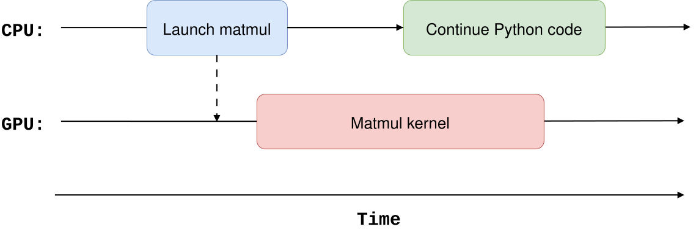
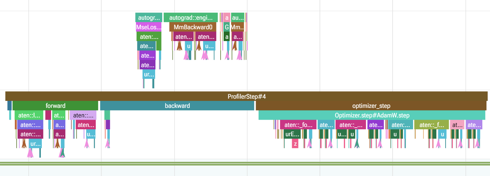
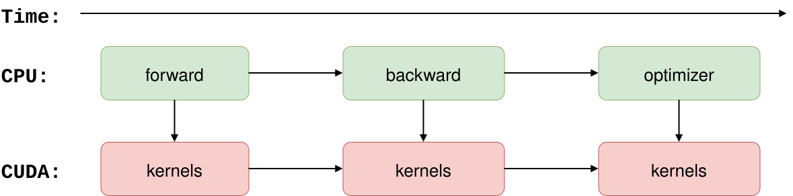

[](https://colab.research.google.com/github/jshn9515/dnnl-notebooks/blob/main/zh/ch19-llm-training-engineering/ch19.3-profiling.ipynb){fig-align="left"}

前面我们已经从 FLOPs、memory 和 Arithmetic Intensity 的角度分析过一个算子为什么可能变慢。但这些分析更多是在回答：

> **理论上，瓶颈可能在哪里？**

真正运行训练代码时，情况往往更加复杂。一次 training step 里同时包含 DataLoader、CPU 调度、Host-to-Device copy、forward、backward、optimizer step 和大量 CUDA kernel。即使我们知道某个矩阵乘法计算量很大，也不能直接说明它就是实际运行时最慢的部分。

因此，性能优化的第一步通常不是修改代码，而是先回答：

> **时间到底花在哪里？**

这就是 **profiling** 要解决的问题。

这一节不会重新分析每个算子的 FLOPs，而是从实际代码出发，学习怎样逐层定位瓶颈：先测完整 step time，再测 GPU 时间，然后用 PyTorch Profiler 继续深入到 operator 和 timeline。

```{python}
import os
import time
from collections.abc import Callable

import dnnlpy
import IPython.display as ipy
import pandas as pd
import torch
import torch.nn as nn
import torch.nn.functional as F
import torch.optim as optim
import torch.profiler as prof
from torch.profiler import ProfilerActivity

print('PyTorch version:', torch.__version__)
```

## 19.3.1 Profiling 先回答什么问题

当我们说“训练很慢”时，这句话本身其实还不够具体。可能是：

- DataLoader 准备 batch 太慢，GPU 经常没有数据可算；
- CPU 不断提交很多很小的 CUDA kernel，GPU 计算本身并不重；
- 某个矩阵乘法、attention 或 normalization 真正占据了大部分 GPU 时间；
- CPU 和 GPU 之间频繁同步，破坏了原本可以异步执行的流水线；
- 数据拷贝和计算没有重叠，GPU 一直在等 Host-to-Device copy；
- 某段代码调用次数很多，每次都不慢，但累计成本很高。

这些问题的优化方式完全不同。

所以 profiling 最重要的作用是把一个完整训练 step 拆开，逐渐回答三个层次的问题：

1. 整个 training step 慢吗？
2. 时间主要在 CPU 还是 GPU？
3. 具体是哪一段代码 / 哪个 operator / 哪个 kernel？

这个顺序很重要。Profiling 工具通常会产生大量信息，如果一开始就直接看几百个 CUDA kernel，很容易陷入细节，却不知道真正应该优化什么。

## 19.3.2 Step Time：最简单的 Benchmark

最简单的性能指标，是一次 training step 花多长时间。

假设我们有一个函数 `step_fn()`，最直接的 benchmark 可以写成：

```python
start = time.perf_counter()
step_fn()
elapsed = time.perf_counter() - start
```

但实际 benchmark 时，不应该只运行一次。第一次执行经常会包含额外开销，例如 CPU context 初始化、memory allocation、library 初始化，以及 `torch.compile` 场景中的 compilation。

因此，更稳妥的做法是先 warmup，再重复测量多个 step：

```{python}
def cpu_benchmark(step_fn: Callable, warmup: int = 5, steps: int = 20) -> float:
    """Do a simple benchmark of step_fn().

    .. note::
        This function is wrong if step_fn() contains GPU operations,
        because it does not synchronize before and after timing.
    """
    for _ in range(warmup):
        step_fn()

    start = time.perf_counter()

    for _ in range(steps):
        step_fn()

    elapsed = time.perf_counter() - start
    return elapsed / steps
```

这里返回的是平均每个 step 的 **wall-clock time**：

$$
T_{\text{step}} = \frac{T_{\text{total}}}{N_{\text{steps}}}
$$

如果每个 step 处理的 token 数为 $N_{\text{token}}$，还可以进一步得到训练吞吐量：

$$
\text{Throughput} = \frac{N_{\text{token}}}{T_{\text{step}}}
$$

例如在语言模型训练里，`tokens / second` 通常比单独看 step time 更方便，因为它可以把 batch size 和 sequence length 一起考虑进去。

不过，这一步只能告诉我们整体有多慢，还不能告诉我们慢在哪里。下一步我们需要先处理 GPU benchmark 中一个非常容易踩到的问题：CUDA 的异步执行。

## 19.3.3 CUDA 是异步的：错误计时可能只测到 Kernel Launch

PyTorch 在 CUDA（或其他 GPU，这里以 CUDA 为例）上执行操作时，CPU 通常不会等待 GPU 把当前操作真正执行完，而是把 CUDA work 提交到 stream 后继续向下运行。

例如：

```python
start = time.perf_counter()
y = x @ x
elapsed = time.perf_counter() - start
```

如果 `x` 在 GPU 上，这里的 `elapsed` 往往不能代表矩阵乘法真正的 GPU 执行时间。CPU 可能只是完成了 kernel launch，而 GPU 还在后面继续计算。

可以把过程粗略理解成：

{width=80%}

因此，如果要用 CPU timer 测 CUDA workload，需要在计时边界进行同步：

```python
accl.synchronize()
start = time.perf_counter()

step_fn()

accl.synchronize()
elapsed = time.perf_counter() - start
```

`accl.synchronize()` 会等待当前 device 上已经提交的 CUDA work 完成。这样，CPU timer 才真正覆盖了这段 GPU 工作。需要注意的是，这种同步本身会阻塞 CPU，造成执行效率下降。所以它适合用来做 benchmark，不应该为了测时间而随意插进正常训练循环，否则我们可能为了 profiling 改变了原本程序的执行方式。

## 19.3.4 torch.Event：单独测 GPU 执行时间

如果我们关心的是某段 CUDA workload 在 GPU 上执行了多久，可以使用 `torch.Event`。

```python
start = torch.Event(enable_timing=True)
end = torch.Event(enable_timing=True)

start.record()
step_fn()
end.record()

end.synchronize()
elapsed = start.elapsed_time(end)
```

这样，CUDA event 会被记录到 CUDA stream 中，因此它更适合测量 GPU 时间。

例如，我们可以写一个简单的 benchmark：

```{python}
def benchmark_cuda(step_fn: Callable, warmup: int = 5, steps: int = 20) -> float:
    for _ in range(warmup):
        step_fn()

    start = torch.Event(enable_timing=True)
    end = torch.Event(enable_timing=True)

    start.record()

    for _ in range(steps):
        step_fn()

    end.record()
    end.synchronize()

    elapsed = start.elapsed_time(end)
    return elapsed / steps
```

这里有一个很重要的区别：

- `time.perf_counter()` 配合同步，更接近我们真正等待一次 workload 完成的 wall-clock time；
- CUDA Event 更接近两个 event 之间经过的 GPU stream 时间。

如果我们怀疑某个 CUDA operator 本身很慢，CUDA Event 很适合做局部 benchmark。但如果问题出在 DataLoader、Python 调度或者 CPU preprocessing，CUDA Event 是看不到这些时间的。

所以，单独计时只是 profiling 的第一层。要继续定位训练 step 内部到底是哪一个 operator 最慢，就需要真正的 profiler。

## 19.3.5 torch.profiler：把一个 Step 拆成 Operator

PyTorch 提供了 `torch.profiler`，可以同时收集 CPU operator 和 CUDA activity。

我们先准备一个小模型，模拟一次最基本的训练 step：

```{python}
device = dnnlpy.get_default_device()

batch_size = 32
in_features = 2048
hidden_size = 8192
out_features = 2048

model = nn.Sequential(
    nn.Linear(in_features, hidden_size, bias=False),
    nn.GELU(),
    nn.Linear(hidden_size, out_features, bias=False),
).to(device)
optimizer = optim.AdamW(model.parameters(), lr=1e-3)

x = torch.randn(batch_size, in_features, device=device)
target = torch.randn_like(x)


def training_step():
    optimizer.zero_grad()
    output = model(x)
    loss = F.mse_loss(output, target)
    loss.backward()
    optimizer.step()
    return loss
```

我们可以用 `prof.schedule()` 来决定如何记录训练 step。常用的参数有：

- `wait`：前几个 step 完全不做 profiling，只是跳过；
- `warmup`：接下来几个 step 启动 profiler 做预热，但不保存为正式 trace；
- `active`：接下来几个 step 正式记录 profiling 数据；
- `repeat`：重复多少次 `wait + warmup + active` 这个周期。

```{python}
activities = prof.supported_activities()
sort_by = f'self_{device.type}_time_total'

schedule = prof.schedule(wait=1, warmup=3, active=5, repeat=1)
with prof.profile(activities=activities, schedule=schedule) as profiler:
    for _ in range(10):
        training_step()
        profiler.step()

event_list = profiler.key_averages()
event_table = event_list.table(sort_by=sort_by, row_limit=15)

df = pd.read_csv('results/ch19.3.5_cpu_result.csv')
df.index = list(range(1, len(df) + 1))
ipy.display(df)

df = pd.read_csv('results/ch19.3.5_xpu_result.csv')
df.index = list(range(1, len(df) + 1))
ipy.display(df)
```

```code
Self CPU time total: 473.303ms
Self XPU time total: 453.482ms
```

`key_averages()` 会把重复出现的 event 按 operator 聚合，然后统计它们的执行时间和调用次数。

如果使用 GPU，可以先按照：

```python
sort_by = f'self_{device.type}_time_total'
```

排序，看看哪些 operator 真正在 GPU 上消耗了最多时间。如果程序主要运行在 CPU，则可以看：

```python
sort_by = 'self_cpu_time_total'
```

这一步通常已经能把“训练很慢”缩小成几个最值得检查的 operator。

需要注意，profiler 本身存在额外开销。所以不要因为训练 10000 个 step，就把 10000 个 step 全部完整记录下来。我们通常只选择少量有代表性的 iteration 进行 profiling。

## 19.3.6 Profiler 表到底怎么看

Profiler 输出的列很多，但刚开始并不需要全部看懂。最重要的是区分 **Self Time** 和 **Total Time**。

假设某个操作 `A` 内部又调用了 `B` 和 `C`，那么：

$$
T_{\text{total}}(A) = T_{\text{self}}(A) + T(B) + T(C)
$$

其中：

- Self CPU Time：这个 event 自己在 CPU 上消耗的时间，不包含子 event；
- CPU Time Total：这个 event 连同内部调用一起消耗的 CPU 时间；
- Self CUDA Time：这个 event 自己在 CUDA 上消耗的时间，不包含子 event；
- CUDA Time Total：这个 event 连同内部调用一起消耗的 CUDA 时间；
- \# of Calls：这个 event 被调用了多少次。

所以，找底层热点 operator 时，`self_*_time_total` 往往更有用，因为它可以避免把子操作的时间重复算到父操作上。调用次数同样值得看。某个 operator 单次只需要几十微秒，看起来不慢，但如果一个 step 调用了几千次，它仍然可能成为明显开销。

因此，一个很常见的分析方式是同时问两个问题：

> **哪个 operator 的 self time 最大？它为什么会被调用这么多次？**

前一个问题帮助我们找大算子，后一个问题帮助我们发现很多小算子造成的开销。

还有一点需要注意：不要把 profiler 表里的百分比直接解释成这个模块理论上应该占这么多 FLOPs。Profiler 测的是实际执行时间，它还会受到 kernel 实现、memory access、launch overhead、输入 shape 和硬件利用率等因素影响。

## 19.3.7 record_function：给训练循环划分区域

只看 operator 名称有时仍然不够。例如，`aten::mm` 可能来自 attention 投影，也可能来自 MLP。我们知道矩阵乘法很慢，却还不知道它属于训练代码的哪一部分。

这时可以用 `record_function()` 给代码加上自定义 region：

```{python}
def train_step_with_regions():
    with prof.record_function('zero_grad'):
        optimizer.zero_grad()

    with prof.record_function('forward'):
        output = model(x)
        loss = F.mse_loss(output, target)

    with prof.record_function('backward'):
        loss.backward()

    with prof.record_function('optimizer_step'):
        optimizer.step()

    return loss
```

然后再次运行 profiler：

```{python}
with prof.profile(activities=activities, schedule=schedule) as profiler:
    for _ in range(10):
        train_step_with_regions()
        profiler.step()

event_list = profiler.key_averages()
event_table = event_list.table(sort_by=sort_by, row_limit=15)
```



这样，我们就可以同时看到两种粒度：

```text
training_step
├── zero_grad
├── forward
│   ├── aten::linear
│   ├── aten::mm
│   └── aten::gelu
├── backward
│   └── ...
└── optimizer_step
    └── ...
```

这是一种很实用的 profiling 方法：

> **先用自己熟悉的程序结构划分区域，再进入最慢的区域检查具体 operator。**

对真正的 Transformer 训练代码，也可以继续把 forward 拆成 `attention`、`mlp`、`embedding` 等 region，而不是一开始就面对完整的 operator 列表。

## 19.3.8 Timeline：CPU 和 GPU 到底谁在等谁

Operator table 适合回答谁累计最慢，但它会把时间聚合起来，因此丢失了执行顺序。而有些性能问题必须看 **Timeline** 才能发现。例如，GPU 为什么每隔一段时间就空下来？Host-to-Device copy 有没有和计算重叠？CPU 是否一直在等待同步？

对于较长的训练，可以使用 profiler schedule，只记录少量 iteration：

```{python}
if not os.path.exists('profiler_traces'):
    os.mkdir('profiler_traces')


def trace_handler(profiler: prof.profile):
    """Profiler trace handler to save timeline to file."""
    event_list = profiler.key_averages()
    event_table = event_list.table(sort_by=sort_by, row_limit=10)
    trace_path = os.path.join('profiler_traces', f'trace_{profiler.step_num}.json')
    profiler.export_chrome_trace(trace_path)


with prof.profile(
    activities=activities,
    schedule=schedule,
    on_trace_ready=trace_handler,
) as profiler:
    for _ in range(10):
        train_step_with_regions()
        profiler.step()
```

最终导出的 trace 会保留事件之间的时间关系。打开 timeline 后，我们通常会看到 CPU thread、CUDA stream、kernel、memory copy 和自己添加的 `record_function` region。

相比一张 operator 排名表，timeline 更像是在看程序真正发生了什么：

{width=80%}

真正需要关注的往往不是某一条 event 的名字，而是**空白区域和等待关系**。如果 GPU timeline 中间出现大段空白，就说明 GPU 在那段时间没有得到足够工作。问题可能根本不在 GPU kernel 本身，而在更上游的 CPU、DataLoader 或数据传输。

## 19.3.9 常见的性能瓶颈长什么样

有了 operator table 和 timeline 以后，可以把常见问题总结成几种模式。

第一种是一个或几个 CUDA operator 占据大部分时间：

```text
GPU:  ────────────────────────────
          one expensive kernel
```

这时瓶颈确实主要在 GPU 计算。下一步应该继续检查这个 operator 的 shape、dtype 和具体 kernel 实现，而不是去优化 Python for-loop。

第二种是大量很短的 CUDA kernel，中间夹着明显 launch gap：

```text
GPU:  ──  ─  ──  ─  ─  ──  ─  ──
```

这通常说明单个 kernel 并不重，但 operator 太碎，kernel launch 和框架调度占比开始变高。此时 kernel fusion、`torch.compile` 或减少不必要的小操作可能比单独优化某一个 kernel 更有效。

第三种是 GPU 出现长时间空白，而 CPU 仍然在工作：

```text
CPU:  ────────────────────────────
GPU:  ───────        ───────
```

这往往说明 GPU 在等 CPU，例如 DataLoader、tokenization、Python preprocessing 或下一批数据准备得太慢。

第四种是 memcpy 和 compute 串行执行：

```text
H2D:  ──────          ──────
GPU:        ────────        ────────
```

如果数据传输本来有机会和计算重叠，却始终完全串行，就需要继续检查 pinned memory、`non_blocking`、prefetch 以及 stream 使用方式。

第五种是频繁出现同步操作。例如代码中反复把 GPU tensor 转回 CPU，或者某些 Python 逻辑依赖 GPU 计算结果，就可能迫使 CPU 等待 GPU：

```text
CPU:  launch ── wait ── launch ── wait ──
GPU:     work ─────       work ─────
```

常见例子包括在 hot path 中频繁调用 `x.item()`、把 GPU tensor 拷回 CPU，或者为了打印和调试不断读取 GPU 上的结果。这里的问题不是某个 kernel 计算太慢，而是原本的异步执行被反复打断。

因此，GPU 利用率不高并不能直接推出模型太小或者 GPU 不够忙。Profiler 的作用正是继续追问：**GPU 为什么会空下来？**

## 19.3.10 本章小结

实际排查性能问题时，可以按照下面的顺序逐层深入：

{height=750px}

这里最后一步非常重要。任何性能优化都应该回到最开始的 benchmark，比较优化前后的同一个指标，而不是因为代码看起来更高效就认为它真的更快。

Profiler 还有 `record_shapes`、`with_stack`、`profile_memory` 等选项，可以继续记录输入 shape、调用栈和内存事件。但这些信息都会增加 profiling overhead，因此通常不应该默认全部打开。只有当我们已经把问题缩小到某几个 operator，需要进一步知道是哪种 shape 或者是哪一行代码调用时，再增加这些信息。

到这里，我们已经有了一套最基本的性能定位方法：

> **先测量，再定位，最后优化。**

下一节，我们进入 mixed precision。它看起来只是把 FP32 换成更低精度，但真正值得关心的是：低精度到底减少了什么，以及它为什么能让现代 GPU 上的大模型训练明显加速。
