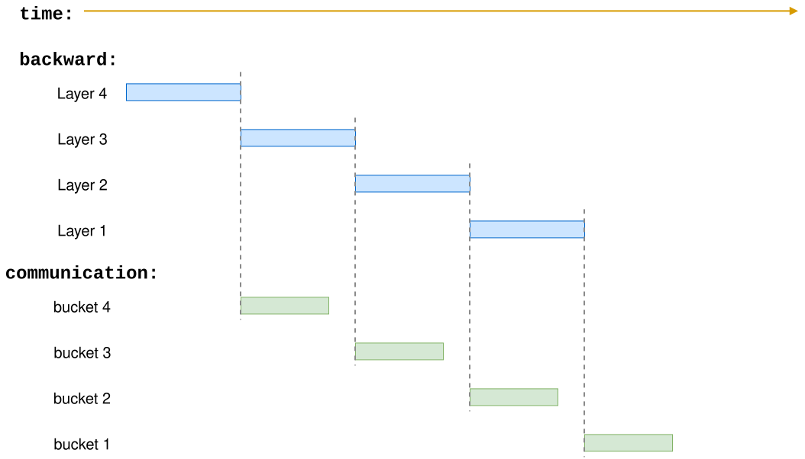

前面几节里，我们一直默认训练发生在一张 GPU 上。Gradient accumulation 可以把大 batch 拆成多个 micro-batch，activation checkpointing 可以用重计算减少 activation memory，mixed precision 也可以降低很多 tensor 的存储和计算成本。

但这些方法都有一个共同点：

> **它们仍然只在使用一张 GPU 的计算和显存。**

当模型继续变大以后，我们通常会遇到两个不同的问题。

第一个问题是**训练太慢**。一张 GPU 每秒只能处理有限数量的 token，如果有 8 张 GPU，我们自然希望它们同时处理不同的数据，提高整体 throughput。

第二个问题是**模型状态本身就放不下**。即使 micro-batch size 已经降到 1、activation checkpointing 也已经打开，parameters、gradients 和 optimizer states 仍然可能超过单张 GPU 的显存。

这两个问题对应了两种不同的思路：

1. 每张 GPU 放一份完整模型，处理不同数据：Data Parallel / DDP；
2. 模型状态本身也拆到不同 GPU：ZeRO / FSDP。

这一节不会完整展开所有并行方式。Tensor Parallel、Pipeline Parallel、Sequence Parallel 都很重要，但它们解决的是另外一类模型切分问题。这里先把最常见的一条路线讲清楚：

> **从 replicated data parallel，走到 sharded data parallel。**

```{python}
import os

import dnnlpy
import torch
import torch.accelerator as accl
import torch.distributed as dist
import torch.distributed.fsdp as fsdp
import torch.nn as nn
import torch.optim as optim
import torch.utils.data as utils
from torch.nn.parallel import DistributedDataParallel

print('PyTorch version:', torch.__version__)
```

```{python}
device = dnnlpy.get_default_device()
print('Using device:', device)
```

## 19.8.1 从单卡训练到 Data Parallel

先考虑最简单的情况。

假设我们有 4 张 GPU，并且模型可以完整放进每一张 GPU。最直接的做法，是让每张 GPU 都保存一份相同的模型：

```text
GPU 0: model copy 0
GPU 1: model copy 1
GPU 2: model copy 2
GPU 3: model copy 3
```

然后把一个 global batch 拆成 4 份：

```text
global batch
    │
    ├── batch 0 → GPU 0
    ├── batch 1 → GPU 1
    ├── batch 2 → GPU 2
    └── batch 3 → GPU 3
```

每张 GPU 都独立完成自己的 forward 和 backward：

```text
GPU 0: x0 → forward → backward → g0
GPU 1: x1 → forward → backward → g1
GPU 2: x2 → forward → backward → g2
GPU 3: x3 → forward → backward → g3
```

但这时候还有一个问题。

因为每张 GPU 看到了不同的数据，所以它们得到的梯度也不同。如果直接各自执行 optimizer step：

```text
θ0 ← update(θ0, g0)
θ1 ← update(θ1, g1)
θ2 ← update(θ2, g2)
θ3 ← update(θ3, g3)
```

四份模型很快就会走向不同的参数。

Data Parallel 的关键就是：

> **在更新参数之前，先把不同 GPU 的梯度同步起来。**

例如 4 个 GPU 分别得到：

$$
g_0,\quad g_1,\quad g_2,\quad g_3
$$

同步后，每张 GPU 使用同一个平均梯度：

$$
\bar g = \frac{1}{4} \left(g_0 + g_1 + g_2 + g_3 \right)
$$

然后每张 GPU 都执行相同的 optimizer update：

$$
\theta_{t+1} = \operatorname{Update}(\theta_t,\bar g)
$$

只要初始模型一致、同步梯度一致、optimizer state 一致，那么各个 GPU 上的模型参数就会一直保持一致。

所以 data parallel 的本质不是单纯地把模型拆开，而是：

> **复制模型，切分数据，最后同步梯度。**

这也解释了 global batch size 怎样计算。假设每张 GPU 的 micro-batch size 是 $B_{\text{micro}}$，总的 GPU 个数是 $N_{\text{dp}}$，gradient accumulation steps 是 $N_{\text{accum}}$，那么：

$$
B_{\text{global}} = B_{\text{micro}} \times N_{\text{dp}} \times N_{\text{accum}}
$$

例如，8 张 GPU、每张 GPU 每次放 4 个样本、累计 16 次 backward 后，一次 optimizer update 实际使用 512 个样本。

## 19.8.2 Rank、World Size 与 Process Group

开始看 DDP 之前，需要先认识几个分布式训练里几乎到处都会出现的词。

假设我们启动 4 个训练进程，每个进程控制一张 GPU：

```text
Process 0 → GPU 0
Process 1 → GPU 1
Process 2 → GPU 2
Process 3 → GPU 3
```

这里每个进程都有一个唯一编号，叫作 **rank**：

```text
rank = 0, 1, 2, 3
```

总进程数叫作 **world size**：

$$
\text{world size} = 4
$$

通常我们还会看到 local rank，它表示当前进程在**本机**上的设备编号。如果只有一台机器，rank 和 local rank 看起来经常一样。但到了多机训练，例如两台机器、每台 4 张 GPU：

```text
Node 0:
    rank 0 → local rank 0
    rank 1 → local rank 1
    rank 2 → local rank 2
    rank 3 → local rank 3

Node 1:
    rank 4 → local rank 0
    rank 5 → local rank 1
    rank 6 → local rank 2
    rank 7 → local rank 3
```

所以：

- **rank**：当前进程在分布式进程组中的全局编号；
- **local rank**：当前进程在本机节点中的编号，通常用于绑定本地 GPU；
- **world size**：当前分布式进程组中的进程总数。

这些进程还需要属于同一个**分布式进程组（Process Group）**，这样才能执行 collective communication，例如：

- `broadcast`：一个 rank 把数据发给所有其他 rank；
- `reduce`：所有 rank 的数据做聚合，结果只放到一个 rank；
- `all_reduce`：所有 rank 的数据做聚合，并且每个 rank 都拿到结果；
- `all_gather`：每个 rank 提供一份数据，最后每个 rank 都收集到所有人的数据；
- `reduce_scatter`：每个 rank 提供一份数据，先做聚合，然后把结果分片给每个 rank；
- `all_to_all`：每个 rank 都向其他 rank 发送不同的数据块。

可以把 process group 理解成：

> **哪些 rank 要一起通信。**

最简单的 data parallel 训练里，通常所有 rank 都属于同一个 group。

PyTorch 一般使用 `torchrun` 启动多个训练进程。例如单机 4 卡：

```bash
torchrun --standalone --nproc-per-node=4 train.py
```

`torchrun` 会为每个进程设置 rank、world size 和 local rank 等环境信息。训练程序再初始化 process group：

```python
local_rank = int(os.environ["LOCAL_RANK"])

accl.set_device_index(local_rank)
dist.init_process_group()

print(
    f'rank: {dist.get_rank()}, '
    f'world_size: {dist.get_world_size()}, '
    f'local_rank: {local_rank}'.
)
```

这里真正重要的不是记住启动命令，而是建立一个基本直觉：

> **通常情况下，每张 GPU 对应一个训练进程，也就是一个 rank。**

后面的 DDP、ZeRO 和 FSDP，很多行为本质上都是在决定：

> **每个 rank 保存什么，以及这些 rank 在什么时候交换什么数据。**

## 19.8.3 DistributedDataParallel：每个 Rank 一份完整模型

PyTorch 里最常见的数据并行实现是 `DistributedDataParallel`，通常简称 **DDP**。

DDP 的基本结构可以画成：

{width=80%}

训练开始时，每个 rank 都有一份完整模型：

```text
Rank 0: θ
Rank 1: θ
Rank 2: θ
Rank 3: θ
```

Forward 时，各个 rank 独立计算，不需要交换 activation。

真正重要的通信发生在 backward。当某些参数的梯度计算完成以后，DDP 会把梯度组织成 bucket，并对 bucket 执行 **all-reduce**。从数学上看，可以把它理解成：

$$
g_{\text{avg}} = \frac{1}{N} \sum_{r=0}^{N-1}g_r
$$

当 all-reduce 结束以后，每个 rank 都拿到相同的 reduced gradient：

```text
Rank 0: g_avg
Rank 1: g_avg
Rank 2: g_avg
Rank 3: g_avg
```

所以每个 rank 都可以在本地执行同一个：

```python
optimizer.step()
```

而不需要再把更新后的参数从 rank 0 broadcast 给其他 rank。

一个最小的 DDP 结构大致是：

```python
local_rank = int(os.environ['LOCAL_RANK'])
backend = dist.get_default_backend_for_device(device)

accl.set_device_index(local_rank)
dist.init_process_group(backend)

model = MyModel().to(device)
model = DistributedDataParallel(model, device_ids=[local_rank])

sampler = utils.DistributedSampler(dataset, shuffle=True)
dataloader = utils.DataLoader(dataset, batch_size=micro_batch_size, sampler=sampler)
optimizer = optim.AdamW(model.parameters(), lr=3e-4)

for batch in dataloader:
    optimizer.zero_grad()
    batch = batch.to(device)
    loss = model(batch)
    loss.backward()
    optimizer.step()
```

这里 `DistributedSampler` 也很重要。DDP 会同步 gradient，但 DDP 本身不会自动把输入 dataset 切成不同部分。如果每个 rank 都遍历完整 dataset，那么 4 张 GPU 很可能在重复计算同样的数据。

所以 data parallel 通常是两件事一起完成：

- `DistributedSampler`：不同 rank 读取不同数据；
- `DistributedDataParallel`：不同 rank 同步梯度。

## 19.8.4 DDP 为什么更快，却没有解决模型状态显存

DDP 最直接的收益是 throughput。

如果 workload 足够大、通信开销控制得好，那么多个 rank 可以同时处理更多数据：

```text
1 GPU:
batch → compute → next batch

4 GPUs:
batch 0 → GPU 0 ┐
batch 1 → GPU 1 ├─ parallel compute
batch 2 → GPU 2 ┤
batch 3 → GPU 3 ┘
```

但 DDP 并不是等 backward 完全结束以后，再一次性同步所有 gradient。因为如果真的这样做，通信时间会完全暴露在挂念关键路径上，从而拖慢整个训练。

实际 DDP 会把 gradients 分成多个 bucket。当某个 bucket 的梯度已经 ready，就可以开始对应的 all-reduce，同时 autograd 继续计算更前面层的 backward：



这就是 **communication / computation overlap**。

不过，DDP 有一个非常明显的限制：每个 rank 仍然保存完整的模型状态。

假设我们暂时只看：

- Parameters；
- Gradients；
- Optimizer states。

把它们分别记作：

$$
M_P, \quad M_G,\quad M_O
$$

那么 DDP 每个 rank 上的 model-state memory 仍然大致是：

$$
M_{\text{DDP}} \approx M_P + M_G + M_O
$$

即使 world size 从 1 增加到 8：

$$
M_{\text{DDP per rank}} \not\approx \frac{M_P + M_G + M_O}{8}
$$

因为这 8 张 GPU 保存的是 8 份复制品：

```text
Rank 0: P + G + O
Rank 1: P + G + O
Rank 2: P + G + O
...
Rank 7: P + G + O
```

所以 DDP 主要解决的是：

> **同一个模型已经能放进一张 GPU，但我希望用更多 GPU 提高训练吞吐量。**

如果一份完整的 parameters + gradients + optimizer states 本身就放不进单卡，单纯增加 DDP rank 并不会解决问题。这就是 ZeRO 出现的背景。

## 19.8.5 ZeRO：为什么每张 GPU 都要保存同样的状态

DDP 中有大量状态是重复保存的。

以 4 个 rank 为例：

```text
Rank 0: Parameters | Gradients | Optimizer States
Rank 1: Parameters | Gradients | Optimizer States
Rank 2: Parameters | Gradients | Optimizer States
Rank 3: Parameters | Gradients | Optimizer States
```

这些副本并不是全部都必须长期存在。例如，在 optimizer step 时，每个参数确实需要对应的 optimizer state。但我们没有必要让每个 rank 都长期保存所有参数的 optimizer state。

这就是 **ZeRO (Zero Redundancy Optimizer)** [@rajbhandari2020ZeRO] 最核心的想法：

> **既然 DDP 本来就在协同训练同一个模型，就把原本重复保存的训练状态分片，让不同 rank 只长期保存其中一部分。**

ZeRO 通常分成三个 stage。

|    Method    | Parameters | Gradients  | Optimizer States |
| :----------: | :--------: | :--------: | :--------------: |
| DDP / ZeRO-0 | Replicated | Replicated |    Replicated    |
|    ZeRO-1    | Replicated | Replicated |     Sharded      |
|    ZeRO-2    | Replicated |  Sharded   |     Sharded      |
|    ZeRO-3    |  Sharded   |  Sharded   |     Sharded      |

: 表 19.8.5 ZeRO 的三个 stage

假设 data parallel world size 是 $N$。如果先忽略 activation、temporary buffers 和通信过程中的临时完整参数，那么 model-state memory 可以粗略写成：

$$
\begin{align}
\text{DDP:} &\quad M \approx M_P + M_G + M_O \\
\text{ZeRO-1:} &\quad M \approx M_P + M_G + \frac{M_O}{N} \\
\text{ZeRO-2:} &\quad M \approx M_P + \frac{M_G + M_O}{N} \\
\text{ZeRO-3:} &\quad M \approx \frac{M_P + M_G + M_O}{N}
\end{align}
$$

这个趋势非常重要：

- **ZeRO-1**：先拆最贵的 optimizer states；
- **ZeRO-2**：再拆 gradients；
- **ZeRO-3**：连 parameters 也拆。

ZeRO 最常见的实现来自 DeepSpeed，所以很多时候我们会把 DeepSpeed ZeRO Stage 1 / 2 / 3 直接简称为 ZeRO-1 / ZeRO-2 / ZeRO-3。不过应该区分两层概念：

- **ZeRO**：训练状态去冗余和分片的算法思想；
- **DeepSpeed**：ZeRO 的一个具体训练系统实现。

PyTorch 的 `ZeroRedundancyOptimizer` 实现了类似 ZeRO-1 的思路，但它并不提供 ZeRO-2 / ZeRO-3。PyTorch 的 FSDP 则是 ZeRO-3 风格的 fully sharded data parallel。

下一步最值得理解的是：如果 ZeRO-3 连 parameter 都拆掉了，forward 到底怎么算？

## 19.8.6 ZeRO-3：参数平时是 Shard，用到时再 Gather

假设一个 layer 的权重 $W$ 被切到 4 个 rank：

```text
Rank 0: W0
Rank 1: W1
Rank 2: W2
Rank 3: W3
```

但普通 Linear forward 需要完整的 $W$：

$$
Y = XW ^ T
$$

如果每个 rank 永远只看到 $W$ 的四分之一，而计算逻辑完全不改，那么这个 layer 自然无法按照普通 data parallel 的方式执行。

ZeRO-3 的基本思路是：

> **参数长期保持 sharded；只有当某一层真正要计算时，再临时把这一层需要的参数 gather 出来。**

可以把一个 layer 的生命周期粗略理解成：

{height=430px}

同时，backward 也有类似过程。

为了计算某一层的 gradient，需要再次拿到这层参数。梯度计算完成以后，不再让所有 rank 都长期保存完整 gradient，而是通过 reduce-scatter 一边完成跨 rank reduction，一边只让每个 rank 保留自己的 gradient shard：

{height=180px}

于是，一整个 block 可以粗略画成：

{height=600px}

这带来了一个非常重要的 trade-off：

$$
\text{less persistent memory} \longleftrightarrow \text{more communication}
$$

DDP 的参数一直都在本地，所以 forward 不需要为参数本身做 all-gather。ZeRO-3 把参数拆掉以后节省了大量 persistent memory，但参数在真正使用之前必须被重新收集。world size 越大、网络越慢、layer 划分越不合适，这部分通信就越可能成为瓶颈。这也是 ZeRO-3 并不保证一定比 DDP 更快的原因。

所以：

> **Sharding 不是免费显存。它是在用 communication 换 memory。**

这和 activation checkpointing 的思路很相似，只不过交换的资源不同。

- Activation checkpointing：用计算换显存；
- ZeRO-3：用通信换显存。

## 19.8.7 FSDP2：PyTorch 里的 Fully Sharded Data Parallel

PyTorch 自己也提供 fully-sharded data parallel。

当前的接口是 **FSDP2**：

```python
from torch.distributed.fsdp import fully_shard
```

它的核心思想和刚才看到的 ZeRO-3 非常接近：

- Parameters are sharded；
- Gradients are sharded；
- Optimizer states follow sharded parameters；
- 计算某个 FSDP unit 之前 all-gather 参数；
- Backward 后 reduce-scatter gradients。

所以从训练状态分片的直觉上，可以把 FSDP 看成 ZeRO-3 风格的 fully sharded data parallel。但不应该简单地说 FSDP 就是 DeepSpeed ZeRO-3。它们属于不同实现，API、内部表示、调度方式、offload 能力和工程生态都可能不同。这里真正应该抓住的是共同的算法结构。

PyTorch FSDP2 的一个重要概念是 **FSDP unit**。

假设 Transformer 有很多 block：

```text
Transformer
├── Block 0
├── Block 1
├── Block 2
├── Block 3
└── ...
```

如果把每个 block 分别 `fully_shard()`：

```python
model = nn.Transformer(...)

for block in model.encoder.layers:
    fsdp.fully_shard(block)

for block in model.decoder.layers:
    fsdp.fully_shard(block)

fsdp.fully_shard(model)
```

那么每个 block 可以形成自己的 communication group。训练时更接近：

```text
model
├── encoder
│   ├── layer 0 ← fully_shard
│   ├── layer 1 ← fully_shard
│   └── ...
│
├── decoder
│   ├── layer 0 ← fully_shard
│   ├── layer 1 ← fully_shard
│   └── ...
│
└── remaining parameters → final fully_shard(model)
```

而不是一开始就把整个模型所有参数 gather 到每张 GPU。

这点非常重要。如果我们只在最外层调用一次 `fully_shard(model)`，那么一个大模型可能会形成一个巨大的 communication group。Forward 开始前，需要一次性 gather 很多参数，既增加 peak memory，也很难让 communication 和 computation 重叠。因此，对于 Transformer，更常见的思路是按照 block 划分 FSDP unit，让后续 layer 的通信有机会和当前 layer 的计算流水化。

另外，FSDP2 应该在 optimizer 创建之前应用：

```python
model = nn.Transformer(...)

for block in model.encoder.layers:
    fsdp.fully_shard(block)

for block in model.decoder.layers:
    fsdp.fully_shard(block)

fsdp.fully_shard(model)

optimizer = optim.AdamW(model.parameters(), lr=3e-4)
```

因为 `fully_shard()` 会把参数转换为 sharded parameter 表示，而 optimizer 应该持有这些已经 sharded 的参数。

这一节不需要深入 FSDP2 的所有配置。现阶段只需要记住：

> **DDP 是 full replica；FSDP 是 full sharding，但计算某一层时会临时恢复它需要的参数。**

## 19.8.8 从 All-Reduce 看 DDP、ZeRO 与 FSDP

DDP、ZeRO 和 FSDP 看起来像三套完全不同的技术，但它们其实可以放在同一张图里理解。

DDP backward 的核心操作是：

{height=230px}

而从 collective 的角度，一个 all-reduce 可以概念性地拆成 `reduce-scatter` + `all-gather`。

先用 `reduce-scatter` 做 reduction，并让每个 rank 只保留其中一个 shard：

```text
Rank 0: G0
Rank 1: G1
Rank 2: G2
Rank 3: G3
```

如果后面还需要每个 rank 都重新得到完整 tensor，再执行 `all-gather`：

```text
G0 + G1 + G2 + G3 → full G on every rank
```

DDP 最终需要每个 rank 都拿到完整 gradient，因此可以把它理解成保持完整 replica 的 data parallel。

Fully sharded training 则会问：

- 既然 reduce-scatter 之后每个 rank 已经有一个正确的 gradient shard，为什么一定要立刻让所有 rank 再保存一份完整 gradient？
- 进一步，如果每个 rank 只负责更新对应的 parameter shard，那么 optimizer state 是不是也只需要保存对应 shard？
- 再进一步，参数本身是不是也可以长期保持 shard，只在 layer 真正需要时 all-gather？

于是就得到：

{height=360px}

可以用下面这张表建立整体直觉：

::: {.list-table}
表 19.8.8 DDP、ZeRO 与 FSDP 的对比

- - 方法
  - 主要目标
  - 每个 Rank 的参数
  - 每个 Rank 的梯度
  - 每个 Rank 的 Optimizer State
  - 主要通信

- - DDP
  - 提高吞吐量
  - Full
  - Full
  - Full
  - Gradient All-Reduce

- - ZeRO-1
  - 省 optimizer memory
  - Full
  - Full
  - Shard
  - Reduce / synchronize updates

- - ZeRO-2
  - 继续省 gradient memory
  - Full
  - Shard
  - Shard
  - Reduce-Scatter 等

- - ZeRO-3
  - 让模型状态整体分片
  - Shard
  - Shard
  - Shard
  - Parameter Gather + Gradient Reduce-Scatter

- - FSDP2
  - PyTorch fully-sharded DP
  - Shard
  - Shard
  - Shard
  - All-Gather + Reduce-Scatter
:::

这里也能看出一个重要事实：

> **FSDP / ZeRO-3 的目标首先是 memory scalability，不保证一定比 DDP 更快。**

如果模型本来就轻松放进每张 GPU，而网络通信反而很慢，那么 DDP 可能更简单，也可能有更好的 throughput；反过来，如果 DDP 已经因为 model states OOM，那么 DDP 理论上通信更少也没有意义，因为它根本跑不起来。

## 19.8.9 和 Gradient Accumulation、Activation Checkpointing 怎么组合

前面几节的技术并不会因为进入分布式训练就消失，它们实际上解决的是不同维度的问题：

- Gradient Accumulation：降低单次 micro-batch memory，同时保持较大的 effective batch；
- Activation Checkpointing：降低 saved activation memory；
- DDP：复制模型，用更多 GPU 提高 data-parallel throughput；
- ZeRO / FSDP：降低每个 rank 的 persistent model-state memory。

所以真实的大模型训练经常是这些技术一起使用，而不是四选一。

例如一个训练配置可能是：

```text
BF16 + micro-batch size = 2 + gradient accumulation = 8 + activation checkpointing + FSDP
```

如果 data parallel world size 是 16，那么 effective batch size 是：

$$
B_{\text{global}} = 2\times 8\times 16 = 256
$$

这里还有一个 gradient accumulation 和 DDP 之间非常实际的细节。

默认情况下，DDP 每次 backward 都会同步 gradient：

```text
micro-batch 1 → backward → all-reduce
micro-batch 2 → backward → all-reduce
micro-batch 3 → backward → all-reduce
micro-batch 4 → backward → all-reduce
```

但如果我们本来就准备累计 4 次 backward，前 3 次的跨 rank 同步其实没有必要，因为 optimizer 要到第 4 次 backward 后才真正更新。因此，DDP 提供了 `no_sync()`：

```python
model = DistributedDataParallel(model, device_ids=[local_rank])

with model.no_sync():
    loss1.backward()
    loss2.backward()
    loss3.backward()

loss4.backward()  # sync gradients here
optimizer.step()
```

于是通信变成：

```text
micro-batch 1 → backward
micro-batch 2 → backward
micro-batch 3 → backward
micro-batch 4 → backward → all-reduce → optimizer.step()
```

这正好和 19.5 的 accumulation window 对齐。

不过，进入 FSDP / ZeRO 以后，通信和内存行为会更复杂。不能简单地把“少同步几次”理解成一定更省显存，因为 sharded gradient、temporary full parameters 和 reshard timing 都可能影响 peak memory。

因此，真正的大模型训练配置仍然应该回到 19.3 的原则：

> **先保证数学和状态正确，再 profile memory、communication 和 step time。**

## 19.8.10 什么时候用 DDP，什么时候需要 FSDP / ZeRO

最后把这一节压缩成一个实际的选择流程。

如果模型完整训练状态可以轻松放进单张 GPU，只是训练太慢，那 DDP 通常是最简单的起点。如果 parameters 能放下，但 Adam optimizer states 已经成为主要显存压力，那应该选择 ZeRO-1。如果 gradients 也开始成为明显问题，那应该选择 ZeRO-2。如果完整 parameters、gradients、optimizer states 已经无法同时放进单卡，那就需要 ZeRO-3 或 FSDP 了。

可以画成：



当然，真实系统不会永远严格按照这个流程选择。例如：

- Activation 很大时，ZeRO-3 也不会自动解决 activation memory，需要继续使用 activation checkpointing；
- Sequence 很长时，可能还需要 sequence parallel 或 context parallel；
- 单层参数本身太大、一次 matrix multiplication 就无法合理放在单卡时，需要 tensor parallel；
- GPU 数量继续扩大以后，通常会组合多种 parallelism，而不是只使用一个超大的 data-parallel group。

但这些都建立在这一节的基础上：

> **Distributed training 最重要的问题，不是有几张 GPU，而是每个 rank 保存什么、计算什么、什么时候通信。**

从这个视角看：

- DDP 是 replicated model states + shard data + synchronize gradients；
- ZeRO / FSDP 是 shard data + shard model states + materialize state only when computation needs it。

这就是从普通 data parallel 走向 large-model distributed training 最核心的一步。同时，这也解释了为什么上一节里的 distributed checkpoint 会比单卡 checkpoint 更复杂：当 parameters、gradients 和 optimizer states 不再完整存在于任何一个 rank 上时，保存和恢复也必须理解这些 shard 的布局。

到这里，我们已经把大模型训练里的 memory、profiling、mixed precision、gradient accumulation、activation checkpointing 和 distributed training 串了起来。下一节会从训练系统回到更底层的执行效率：什么时候 PyTorch 已有 operator 还不够，我们需要自己用 Triton 写一个 kernel。
