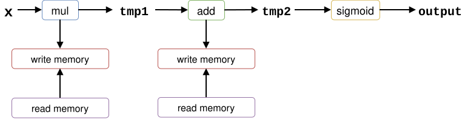

前面我们已经从 FLOPs、Memory 和 Arithmetic Intensity 的角度分析过算子的性能，也学习了怎样用 profiler 找到真正的瓶颈。到这里，一个自然的问题是：

> **如果 profiler 已经告诉我们某一小段 GPU 计算很慢，接下来还能做什么？**

很多时候，我们应该优先使用已经高度优化的 PyTorch、cuBLAS、cuDNN、FlashAttention 等实现。如果只是普通的 matrix multiplication，自己重新写一个 kernel 往往没有意义。

但另外一些计算并不是一个大算子，而是由很多很小的 elementwise operator、reduction 和 reshape 组合出来的。单个 operator 看起来并不慢，可它们会不断启动 CUDA kernel，并把中间结果反复写回显存，再从显存读回来。这时，一个常见的优化方向是 **kernel fusion**：把原本多个 operator 融合成一个 GPU kernel。

**Triton** [@tillet2019Triton] 就是用来做这类事情的重要工具之一。它允许我们使用接近 Python 的方式描述 GPU 上的数据分块、加载、计算和写回，而不需要一开始就直接处理 CUDA thread、shared memory 和大量底层细节。

这一节不会试图完整学习 Triton。我们的目标只有两个：

1. 看懂一个最基本的 Triton kernel 是怎样工作的；
2. 建立判断：什么时候值得自己写 kernel，什么时候不值得。

```{python}
import dnnlpy
import torch
import torch.accelerator as accl
import torch.nn.functional as F
import triton
import triton.language as tl
from torch import Tensor
from torch.testing import assert_close
from triton.testing import do_bench

print('PyTorch version:', torch.__version__)
print('Triton version:', triton.__version__)
```

```{python}
device = dnnlpy.get_default_device()
print('Using device:', device)
```

## 19.8.1 为什么 PyTorch 代码不一定等于一个 kernel

在 PyTorch 里，我们经常会写这样的代码：

```python
y = x * weight
y = y + bias
y = y.sigmoid()
```

从 Python 看，这只是三行简单的 tensor operation。但在 eager mode 下，它们通常对应多个独立的 GPU operator。

可以粗略理解成：



问题不一定出在计算量。`sigmoid` 和 elementwise multiplication 本身都不算复杂，真正浪费的可能是：

- 多次 kernel launch；
- 中间 tensor 的分配；
- 中间结果反复写入 global memory；
- 下一个 kernel 又把同一批数据重新读出来。

如果这些操作能够在一个 kernel 内完成，理想情况下就可以变成：

{height=260px}

这就是 **fusion** 的基本直觉。

不过，这里有一个非常重要的顺序：

> **看到多个 PyTorch operator，不代表我们应该立刻写 Triton。**

PyTorch 自己的 compiler 也可能完成 fusion，例如 `torch.compile` 可以把一段 Python / PyTorch graph 编译成更少的 kernel。因此，一个更合理的优化顺序通常是：

1. 首先使用已有高性能 operator；
2. 如果仍然存在瓶颈，再尝试 `torch.compile`；
3. 如果 `torch.compile` 仍然无法解决问题，并且 profiler 确认瓶颈仍然存在；
4. 最后考虑自己写 Triton kernel。

Triton 更像是最后进一步控制 kernel 行为的工具，而不是所有性能问题的第一答案。

## 19.8.2 Triton 的基本执行模型：一个 Program 处理一块数据

::: {.callout-note}
我们这里假设大家了解基础的 GPU 和 CUDA 编程模型，例如 thread、warp、thread block、grid 等概念。如果不熟悉，可以先参考 [CUDA C++ Programming Guide](https://docs.nvidia.com/cuda/cuda-c-programming-guide/index.html)。
:::

我们知道，CUDA 经常从 thread、warp 和 thread block 的角度描述 GPU 程序。我们通常会显式指定一个 grid 中有多少个 thread block，以及每个 block 中有多少个 thread。例如：

```text
kernel<<<16, 256>>>(...);
```

表示：

```
Grid
├── Block 0
│   ├── Thread 0
│   ├── Thread 1
│   ├── ...
|   └── Thread 255
|
├── Block 1
│   ├── Thread 0
│   ├── Thread 1
│   ├── ...
|   └── Thread 255
├── ...
|
└── Block 15
    ├── Thread 0
    ├── Thread 1
    ├── ...
    └── Thread 255
```
对于一个简单的向量运算，一个 CUDA thread 往往通过：

```cpp
int idx = blockIdx.x * blockDim.x + threadIdx.x;
```

得到自己负责的数据位置。

而 Triton 的抽象层级更高一些。在 Triton 中，我们通常不直接考虑每一个底层 GPU thread，而是先决定：

> **一个 Triton program instance 应该负责哪一块数据。**

我们可以粗略地把一个 Triton program 理解为与一个 CUDA thread block 处于相近的抽象层级，不过两者并不是完全等价的。

假设有一个长度为 1024 的 vector，每个 Triton program 负责 256 个元素：

```text
Program 0 → x[   0: 256]
Program 1 → x[ 256: 512]
Program 2 → x[ 512: 768]
Program 3 → x[ 768: 1024]
```

因此这里只需要启动 4 个 Triton program。

当前 program 的编号可以通过：

```python
pid = tl.program_id(axis=0)
```

获得。这里的 `axis=0` 可以类比 CUDA 中的 `blockIdx.x`，表示当前 program 在 grid 第 0 个维度中的编号。

如果每个 program 负责 `BLOCK_SIZE` 个元素，那么当前 program 的起点就是：

```python
block_start = pid * BLOCK_SIZE
```

例如，`pid=2`，`BLOCK_SIZE=256`，那么：

```text
block_start = 2 * 256 = 512
```

说明 Program 2 从 `x[512]` 开始处理。

接下来使用：

```python
offsets = block_start + tl.arange(0, BLOCK_SIZE)
```

就可以一次得到当前 program 所负责的全部数据位置：

```text
offsets = [512, 513, 514, ..., 767]
```

这里非常值得注意。`tl.arange()` 并不是一个 Python 循环，它生成的是一个 Triton tensor，表示当前 program 内需要处理的一组位置。后续的 `tl.load()` 和 `tl.store()` 会根据这个 offsets 一次性处理整个 block，而不是一个一个元素地循环。

因此，CUDA 和 Triton 大致的对应关系可以理解为：

::: {.list-table}
表 19.8.2 CUDA 与 Triton 的对应关系表

- - CUDA
  - Triton

- - Grid
  - Grid

- - Thread Block
  - Program Instance

- - `blockIdx.x`
  - `tl.program_id(0)`

- - `blockDim.x`
  - `BLOCK_SIZE`

- - `threadIdx.x`
  - 通常不直接暴露

- - 每个 thread 决定自己处理什么
  - 每个 program 决定自己处理什么
:::

所以，Triton kernel 最核心的思考方式是：

> **先决定每个 program 负责的数据块，然后让大量 program 并行处理整个 tensor。**

## 19.8.3 第一个 Triton Kernel：Vector Addition

我们先从最简单的 vector addition 开始：

$$
y_i = a_i + b_i
$$

PyTorch 版本只有一行：

```python
y = a + b
```

对应的 Triton kernel 可以写成：

```{python}
@triton.jit
def add_triton_kernel(
    a_ptr: tl.tensor,
    b_ptr: tl.tensor,
    output_ptr: tl.tensor,
    n_elements: int,
    BLOCK_SIZE: tl.constexpr,
):
    pid = tl.program_id(0)

    block_start = pid * BLOCK_SIZE
    offsets = block_start + tl.arange(0, BLOCK_SIZE)

    mask = offsets < n_elements

    a = tl.load(a_ptr + offsets, mask=mask)
    b = tl.load(b_ptr + offsets, mask=mask)

    output = a + b

    tl.store(output_ptr + offsets, output, mask=mask)
```

第一次看会觉得它比 `a + b` 复杂很多，但真正关键的操作只有几步：

{height=450px}

代码里的 `@triton.jit` 表示这个函数会由 Triton JIT compiler 编译成 GPU kernel；`a_ptr`、`b_ptr` 和 `output_ptr` 是指向输入/输出 tensor 数据的指针参数。`tl.load()` 根据这些指针和 offsets 读取一整个 block，计算完成后，再通过 `tl.store()` 写回结果。

因此，Triton 代码虽然写起来像 Python，但 kernel 内部并不是普通 Python 在逐元素执行。

## 19.8.4 mask 为什么几乎到处都会出现

上面的 kernel 还有一个非常重要的东西：

```python
mask = offsets < n_elements
```

假设 `n_elements=1000`，`BLOCK_SIZE=256`，那么我们需要：

$$
\left\lceil\frac{1000}{256}\right\rceil = 4
$$

个 program。

前三个 program 都会完整处理 256 个元素，但最后一个 program 理论上会得到：

```text
[768, 769, ..., 1023]
```

其中：

```text
1000, 1001, ..., 1023
```

已经超过 tensor 边界。所以我们需要：

```python
mask = offsets < n_elements
```

并在 load / store 时传进去：

```python
tl.load(a_ptr + offsets, mask=mask)
tl.store(y_ptr + offsets, y, mask=mask)
```

我们可以把它理解成一个安全开关：对于落在数组范围内的 `offsets`，正常 load / store；对于超出范围的 `offsets`，则将其 mask 掉，避免访问越界。这也是 GPU kernel 中非常常见的问题：

> **Block size 通常是为了执行效率选择的，并不一定刚好整除 tensor shape。**

因此，`mask` 并不是 Triton 代码里的装饰，而是在处理 block 边界时保证 memory access 正确的重要机制。

## 19.8.5 Grid：到底要启动多少个 Program

写完 kernel 之后，还需要告诉 Triton：整个 tensor 需要启动多少个 program。

我们可以先写一个 Python wrapper：

```{python}
def add_triton(a: Tensor, b: Tensor) -> Tensor:
    if a.is_cpu or b.is_cpu:
        raise AssertionError('Triton kernel only supports GPU tensors.')
    if a.size() != b.size():
        raise AssertionError('Input tensors must have the same shape.')
    if not a.is_contiguous() or not b.is_contiguous():
        raise AssertionError('Triton kernel only supports contiguous tensors.')

    output = torch.empty_like(a)
    n_elements = a.nelement()

    BLOCK_SIZE = 256
    grid = (triton.cdiv(n_elements, BLOCK_SIZE),)

    add_triton_kernel[grid](a, b, output, n_elements, BLOCK_SIZE=BLOCK_SIZE)

    return output
```

这里：

```python
triton.cdiv(n_elements, BLOCK_SIZE)
```

做的是 ceiling division：

$$
N_{\text{programs}} =
\left\lceil \frac{N_{\text{elements}}}{\text{BLOCK\_SIZE}} \right\rceil
$$

然后：

```python
add_kernel[grid](...)
```

会按照这个 grid 启动 kernel。

需要注意的是，Triton 的 `BLOCK_SIZE` 和 CUDA 的 `blockDim.x` 并不完全等价。CUDA 的 `blockDim.x` 描述的是一个 block 里有多少个 thread，而 Triton 的 `BLOCK_SIZE` 描述的是一个 program 里处理多少个元素。Triton 内部会启动多少个 CUDA thread 来处理这些元素，但我们通常不需要关心这个。

此外，如果 `n_elements` 有一百万个元素，且 `BLOCK_SIZE=256`，那么并不是一个 program 处理一百万个元素，而是启动大量 program，每个 program 各自处理一小块数据。这也解释了为什么 `BLOCK_SIZE` 是 Triton kernel 里非常重要的参数：它会影响每个 program 的工作量，进而影响 GPU 的并行度、内存访问和寄存器使用。

当然，入门阶段我们不需要手动推导一个完美的 `BLOCK_SIZE`。先保证 correctness，后面再通过 benchmark 调整。后面如果参数空间变复杂，还可以使用 Triton 的 autotune 机制搜索不同配置。

现在我们来验证一下 correctness。

```{python}
#| eval: false
a = torch.randn(1000, device=device)
b = torch.randn_like(a)

y_actual = add_triton(a, b)
y_expected = a + b

assert_close(y_actual, y_expected)
print('Correctness check passed.')
```

```code
Correctness check passed.
```

## 19.8.6 从多个 Operator 到一个 Kernel：Fused SwiGLU

Vector addition 可以帮助我们理解 Triton 的基本结构，但它本身通常没有必要自己实现。更有意义的场景，是把多个小 operator 融合起来。

例如，很多 LLM 的 MLP 会使用 SwiGLU：

$$
\begin{aligned}
\operatorname{SwiGLU}(x)
&= \operatorname{SiLU}(xW_{\text{gate}})\odot(xW_{\text{up}}) \\
&= (xW_{\text{gate}})\sigma(xW_{\text{gate}})\odot(xW_{\text{up}})
\end{aligned}
$$

我们可以把整个 elementwise 过程放进同一个 Triton kernel：

```{python}
@triton.jit
def swiglu_triton_kernel(
    gate_ptr: tl.tensor,
    up_ptr: tl.tensor,
    output_ptr: tl.tensor,
    n_elements: int,
    BLOCK_SIZE: tl.constexpr,
):
    pid = tl.program_id(0)

    offsets = pid * BLOCK_SIZE + tl.arange(0, BLOCK_SIZE)
    mask = offsets < n_elements

    gate = tl.load(gate_ptr + offsets, mask=mask)
    up = tl.load(up_ptr + offsets, mask=mask)

    silu = gate * tl.sigmoid(gate)
    output = silu * up

    tl.store(output_ptr + offsets, output, mask=mask)
```

Python wrapper 仍然和前面几乎一样：

```{python}
def swiglu_triton(gate: Tensor, up: Tensor) -> Tensor:
    if gate.is_cpu or up.is_cpu:
        raise AssertionError('Triton kernel only supports GPU tensors.')
    if not gate.is_contiguous() or not up.is_contiguous():
        raise AssertionError('Triton kernel only supports contiguous tensors.')

    output = torch.empty_like(gate)
    n_elements = gate.nelement()

    BLOCK_SIZE = 256
    grid = (triton.cdiv(n_elements, BLOCK_SIZE),)

    swiglu_triton_kernel[grid](gate, up, output, n_elements, BLOCK_SIZE=BLOCK_SIZE)

    return output
```

PyTorch eager expression 可以概念性地看成：

{height=550px}

而 Triton fused kernel 可以把中间结果保留在当前 program 的计算过程中：

{height=260px}

虽然我们并没有减少太多数学计算，但减少了 intermediate tensor 和 kernel boundary。这正是 Triton 的价值所在。

不过，如果 `torch.compile` 已经能够把同样的 expression fuse 掉，那么手写 Triton 未必还会更快。因此，fusion opportunity 是写 Triton 的理由，但不是性能提升的保证。

## 19.8.7 先验证 Correctness，再谈性能

自己写 kernel 之后，第一件事不应该是 benchmark，而是和 reference implementation 对比结果。对于上面的 SwiGLU，我们可以用 PyTorch 作为 reference：

```{python}
#| eval: false
gate = torch.randn(4096, 4096, device=device)
up = torch.randn_like(gate)

y_actual = swiglu_triton(gate, up)
y_reference = F.silu(gate) * up

assert_close(y_actual, y_reference)
print('Correctness check passed.')
```

```code
Correctness check passed.
```

这里不能简单追求逐 bit 完全一致。不同实现可能使用不同的计算顺序或近似数学函数，尤其是在 FP16 / BF16 下，会出现正常的 floating-point difference。

验证 custom kernel 时至少要检查：

- 不同 tensor shape；
- 不能被 `BLOCK_SIZE` 整除的 shape；
- 实际训练会使用的 dtype；
- 极大值、极小值等 numerical edge case；
- 如果支持不同 stride，还要测试 non-contiguous tensor。

此外，我们上面的简单实现明确要求 contiguous tensor。这不是 Triton 本身只能处理 contiguous tensor，而是因为当前 kernel 直接把 tensor 当成一维连续内存处理。支持复杂 layout 需要自己正确处理 stride。

所以 custom kernel 的一个现实成本是：

> **原来由 framework 帮我们处理的 shape、stride、dtype 和 edge case，现在都可能变成 kernel 作者自己的责任。**

## 19.8.8 Benchmark：更快必须是测出来的

正确之后，才应该比较性能。

Triton 提供了 `triton.testing.do_bench()`，可以用来重复执行 workload 并统计 kernel runtime。例如：

```{python}
#| eval: false
def swiglu_torch(gate: Tensor, up: Tensor) -> Tensor:
    return F.silu(gate) * up


# Trigger compilation before benchmark.
swiglu_compiled = torch.compile(swiglu_torch)
swiglu_compiled(gate, up)
accl.synchronize()

eager_time = do_bench(lambda: swiglu_torch(gate, up), return_mode='median')
compiled_time = do_bench(lambda: swiglu_compiled(gate, up), return_mode='median')
triton_time = do_bench(lambda: swiglu_triton(gate, up), return_mode='median')

print(f'PyTorch eager: {eager_time:.4f} ms.')
print(f'PyTorch torch.compile: {compiled_time:.4f} ms.')
print(f'Triton: {triton_time:.4f} ms.')
```

```code
PyTorch eager: 5.6221 ms.
PyTorch torch.compile: 3.2689 ms.
Triton: 3.3234 ms.
```

这里特意同时比较三种实现：

- PyTorch eager；
- PyTorch `torch.compile`；
- Custom Triton kernel。

因为真正需要回答的问题不是“Triton 能不能比 PyTorch 快”，而是：

> **手写 Triton 能不能比已经经过 PyTorch 优化的实现更好，而且收益是否值得维护成本？**

另外，benchmark 不能只测试一个 shape。可能一个 kernel 在 `[4096, 4096]` 上表现很好，但不代表在 `[8, 4096]` 上仍然很好。LLM 中的 batch size、sequence length、hidden size 都可能改变 kernel 的工作规模，因此最终应该测试真实 workload 中常见的 shape 分布，而不是只选择一个 benchmark。

## 19.8.9 为什么训练 Kernel 比 Forward Demo 更难

到目前为止，我们只写了 forward kernel。但我们讨论的是 LLM training，因此这里有一个不能忽略的问题：

> **Forward 能跑，不代表这个 custom kernel 已经可以直接替换训练代码。**

普通 PyTorch 代码：

```python
output = F.silu(gate) * up
```

会被 Autograd 记录在计算图中，backward 时 PyTorch 知道怎样计算：

$$
\frac{\partial L}{\partial g}, \quad \frac{\partial L}{\partial u}
$$

但一个独立的 GPU kernel 本质上只是读写 tl.tensor，不能想当然地认为 Autograd 会自动从 kernel 源码推导出 backward。因此，我们需要自己实现 backward kernel，或者至少提供一个 backward 的 reference implementation。

所以，实际训练系统通常需要进一步考虑：

- Backward kernel 怎么实现；
- Forward 需要保存哪些 tensor 给 backward；
- 是否使用 `torch.compile` / `torch.library` 等方式集成；
- Mixed precision 下 accumulation 使用什么 dtype；
- Distributed training、tensor subclass 等 PyTorch 机制是否仍然兼容。

这也是为什么一个几十行的 Triton forward demo，和一个真正可以放进训练框架长期使用的 fused operator，中间还有明显距离。

Triton 官方教程中也包含 LayerNorm、attention 等 forward + backward 更完整的例子。如果以后真的要实现训练 kernel，应该把 forward、backward、correctness 和 benchmark 当成同一个整体，而不是只看 forward。

## 19.8.10 本章小结

学完一个 Triton kernel 之后，很容易产生一种错觉：以后看到 PyTorch operator 就想自己重写。

实际工程里，更合理的判断顺序是：

{height=550px}

比较适合 Triton 的场景通常包括：

- 多个 elementwise / reduction operator 之间存在明显的 fusion 可能性；
- 中间 tensor 带来了不必要的 global memory traffic；
- Workload 的形状比较固定，可以针对真实形状做 specialization；
- Profiler 已经证明这部分占据了可观的训练时间；
- 通用 library 没有提供合适的 fused implementation。

反过来，如果只是普通 GEMM、已有成熟 fused operator，或者这段代码只占整个运行时间的 1%，那么自己维护一个 Triton kernel 很可能得不偿失。Triton 最重要的意义并不是把 PyTorch 改写成更底层的代码，而是让我们在必要的时候获得更细粒度的 GPU 控制。

到这里，我们已经从计算与访存、profiling 和现代 Attention API，逐步走到了自己编写 GPU kernel。看起来工具越来越底层，但它们仍然服务于同一个工程原则：

> **先找到真正受限的资源，再选择对应的优化方法。**

当 profiler 把问题定位到某个具体 kernel，而且成熟算子与 `torch.compile` 仍然无法解决瓶颈时，Triton 才真正进入我们的工具箱。

这也是性能优化里最重要的顺序：**先测性能，再做优化。** 下一节，我们将从单卡内的算子效率转向单机多卡训练，讨论如何用 DDP、ZeRO 与 FSDP 分摊计算和训练状态。
