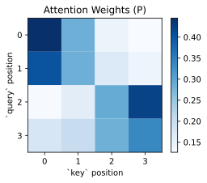
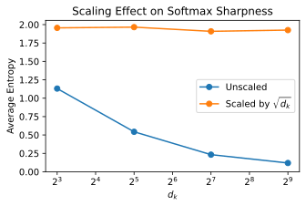
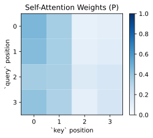

上一节里，我们已经在 attention-based Seq2Seq [@bahdanau2016NeuralMachineTranslation] 的语境里看到了 attention 最初的直觉：解码器在生成当前词时，不应该只依赖同一个固定长度上下文向量，而应该能够动态地回头看输入序列中更相关的位置。

这个想法最早是为了解决机器翻译里的固定长度瓶颈提出的，但它真正厉害的地方在于，它并不只属于翻译任务。我们把外层任务背景先拿掉，attention 背后其实藏着一个更一般的操作：

> **给定当前需求，从一组候选表示中按相关性取回信息。**

一旦从这个角度看，attention 就不再只是翻译时做对齐的技巧，而变成了一种更普遍的表示学习机制。后来的 Query、Key、Value 表述，本质上就是把这个想法抽象和统一了。所以，这一节我们不再把 attention 只放在 encoder-decoder 架构里进行讨论，而是把它进一步抽象成一个更一般的动态信息检索框架。

这一节我们重点回答三个问题：

1. Attention 本质上在做什么；
2. Query、Key、Value 这三个概念到底怎么理解；
3. 为什么后来会发展出 scaled dot-product attention 和 self-attention。

```{python}
import math

import matplotlib.pyplot as plt
import numpy as np
import scipy.stats as stats
import torch

plt.rc('savefig', dpi=300, bbox='tight')
print('PyTorch version:', torch.__version__)
```

## 8.2.1 Attention 本质上是在做加权检索

从直觉上看，attention 做的事情其实很像上网搜索资料。我们在输入框里输入自己想找的内容，搜索引擎会返回一组候选结果。每条结果通常都有一个标题，以及对应的网页内容。我们会先根据自己当前的需求和这些标题，判断哪些结果更值得关注，然后再从这些结果的具体内容里提取真正有用的信息。

把上面这个搜索网页的过程抽象一下，翻译成数学语言就是：

- 我们有一个查询 $q$，它表示我们现在想找什么；
- 我们有一组候选项，每个候选项都有一个键 $k_i$，它表示这个候选项是什么；
- 每个候选项还有一个值 $v_i$，它表示这个候选项真正能提供什么信息。

当模型在当前时刻有一个需求时，它会先拿这个需求去和所有候选项的键进行匹配，计算相关性分数。在现代 attention [@vaswani2023Attention] 里，这个分数通常写成 query 和 key 的点积：

$$ e_i = q \cdot k_i $$

那么，为什么 attention 选择点积来衡量相关性呢？

一个很重要的事实是，attention 并不是先有一个独立存在的相关性，再拿点积去测量它；恰恰相反，在 attention 里，模型就是直接用点积来定义什么叫相关。也就是说，如果某个 key 和当前 query 的方向越对齐，或者 key 在 query 关心的方向上分量越大，那么在这个机制下，这个 key 就被认为和当前 query 更匹配，也更值得被关注。

当然，仅仅有了相关性分数还不够，我们还需要把它们变成权重，表示模型应该把多少注意力分配给每个候选项。通常我们会对这些分数做 softmax：

$$ \alpha_i = \operatorname{softmax}(e_i) $$

这样一来，所有权重都会是非负的，并且总和为 1。分数越高，对应的权重通常也越大，说明当前 query 更关注这个候选项。

最后，模型再用这些权重对所有候选项的值进行加权求和，得到当前时刻的输出：

$$ c = \sum_i \alpha_i v_i $$

也就是说，attention 的核心并不是只找出一个最相关的项，而是根据当前需求，对所有候选信息做一次加权检索，再把检索到的信息综合起来。从本质上说，attention 并不是一个神秘的新结构，而是一个 **基于相似度的软检索机制**。

## 8.2.2 Q、K、V 的设计动机：匹配和传递内容的分离

上一节我们已经把 attention 写成了一个检索过程：

$$ e_i = q \cdot k_i, \quad \alpha_i = \operatorname{softmax}(e_i), \quad c = \sum_i \alpha_i v_i $$

从形式上看，这个过程已经很清楚了：query 负责提出当前需求，key 负责参与匹配，value 负责提供信息。但这时一个更深的问题就来了：为什么 attention 需要把输入拆成 Q、K、V 三种表示？为什么不直接拿原始输入向量自己和自己做匹配，再直接加权求和？

这并不是数学上做不到。真正的原因在于：**用于匹配的表示** 和 **用于传递内容的表示**，往往不是同一回事。

假设我们现在有一组输入向量 $X = \{x_1, x_2, \ldots, x_n\}$。一个最直接的想法当然是：既然 attention 要比较相关性，那就直接用这些向量两两做点积；既然最后还要聚合信息，那就直接对这些向量本身做加权和。也就是说，我们完全可以写成一种更朴素的形式：

$$ e_i = x^\top x_i, \quad \alpha_i = \operatorname{softmax}(e_i), \quad c = \sum_i \alpha_i x_i $$

这种写法并不是完全不行。但它把三件不同的事情，全部压在了同一个表示上：这个向量既要表达“我是什么”，又要表达“我适不适合被关注”，还要表达“如果被关注了，我能提供什么内容”。这就好像我们在上网搜索时，既要用网页标题来判断相关性，又要用同一个标题来提取信息一样。虽然有时候标题确实能同时承担这两种作用，但更多时候，判断相关性和真正提供内容并不是同一件事。

Attention 里一个很重要的设计，就是把两件事分开了。

- 第一件事：谁和我现在最相关？
- 第二件事：如果我关注它，它能提供什么信息？

比如这句话：

> The animal didn’t cross the street because it was too tired.

当模型处理到 it 的时候，它可能要判断：it 指的是 animal，还是 street？

这时，前面这两个词都可以当候选项，但模型在决定“该关注谁”时，更依赖一些适合做匹配的信息，比如句法结构、指代关系、语义上是否合理。换句话说，在这一步里，模型更关心的是哪个位置更适合成为当前要找的对象。但一旦模型判断 it 更可能指向 animal，它真正想取回来的，就不只是“这个词适合做先行词”这样的匹配信号了，而是 animal 这个位置所携带的具体语义内容，比如它表示一个有生命的对象，因而更容易和 tired 这样的描述搭配。

所以这里就能看出两层：

- 在匹配时，更看重的是句法、指代关系、结构兼容性；
- 在取值时，更看重的是这个位置真正携带的语义信息。

这就是为什么我们会说，一个位置值不值得被关注，和它被关注后要提供什么，并不完全一样。也正因为如此，attention 不会强迫同一个向量同时负责查询、匹配、传值三种任务，而是把它们拆成了不同的角色：

- Query 表示当前想找什么；
- Key 表示每个位置如何参与匹配；
- Value 表示每个位置真正提供什么内容。

这样一来，模型就可以用一套表示学习“怎么比较相关”，再用另一套表示学习“怎么传递内容”，从而获得更强的表达能力。

:::{.callout-note}
需要注意的是，attention 里很多具体设计，例如为什么用点积来算相关性、为什么把输入拆成 Q、K、V，并不是从某个理论中必然推出来的。我们现在所作的解释是一种事后解释。更准确地说，它们是一组在实践中被证明有效、便于训练和实现的设计选择。也正因为如此，关于为什么不是 Q、K、V，能不能再加一个 W，打分函数能不能用余弦相似度，往往并不存在标准答案。不同设计通常是在表达能力、计算效率、训练稳定性和实现复杂度之间做权衡。这也是为什么 attention 有很多变体的原因。
:::

## 8.2.3 从单个 query 到矩阵形式

在之前的表述中，我们都假设我们一次性只处理一个 query。如果我们一次只处理一个 query，那么 attention 看起来像是在对一组 $(k_i, v_i)$ 做加权汇总。但在实际实现里，我们通常会把很多 query 放在一起并行处理。

设 $X$ 和 $Y$ 分别是 query 和 key/value 的输入矩阵，那么我们通过线性变换得到：

$$ Q = XW_Q, \quad K = YW_K, \quad V = YW_V $$

其中，Q、K、V 的维度分别是：

$$ Q \in \mathbb{R}^{n_q \times d_k}, \quad K \in \mathbb{R}^{n_k \times d_k}, \quad V \in \mathbb{R}^{n_k \times d_v} $$

那么所有 query 和 key 的匹配分数可以一次性写成：

$$ S = QK^\top $$

然后对每一行做 softmax，得到注意力权重矩阵：

$$ P = \operatorname{softmax}(S) $$

最后再和 $V$ 相乘，得到输出：

$$ O = PV $$

这就是最常见的 attention 矩阵形式。它看起来像是一个矩阵乘法加一个 softmax，但语义上仍然是在做同一件事：对每一行 query，都会对所有 key 分配一组权重，再从所有 value 中取回一个加权结果。

```{python}
X = torch.tensor(
    [
        [1.0, 0.0, 0.0, 0.0],
        [0.8, 0.2, 0.0, 0.0],
        [0.0, 0.2, 1.0, 0.0],
        [0.0, 0.0, 0.8, 0.5],
    ]
)
Y = torch.tensor(
    [
        [1.0, 0.0, 0.0, 0.0],
        [0.7, 0.3, 0.0, 0.0],
        [0.1, 0.2, 1.0, 0.0],
        [0.0, 0.0, 0.8, 0.5],
    ]
)

W_Q = torch.randn(4, 3)
W_K = torch.randn(4, 3)
W_V = torch.randn(4, 2)

Q = X @ W_Q
K = X @ W_K
V = X @ W_V

S = Q @ K.T
P = S.softmax(dim=-1)
O = P @ V  # noqa: E741

fig = plt.figure(1, figsize=(4, 3))
ax = fig.add_subplot(1, 1, 1)
im = ax.pcolormesh(P, cmap='Blues')
xticks = np.arange(K.size(0))
yticks = np.arange(Q.size(0))
ax.set_xticks(xticks + 0.5, xticks)
ax.set_yticks(yticks + 0.5, yticks)
ax.invert_yaxis()
ax.set_xlabel('`key` position')
ax.set_ylabel('`query` position')
ax.set_title('Attention Weights (P)')
ax.set_aspect('equal')
fig.colorbar(im)
fig.savefig('figures/ch8.2-attn-weights-1.svg')
plt.close(fig)
```

<figure class="figure" style="text-align: center;">
  
</figure>

## 8.2.4 为什么要除以 $\sqrt{d_k}$？

在 Transformer 里，最常见的形式是 **SDPA (Scaled Dot-Product Attention)**：

$$ \operatorname{Attention}(Q, K, V) = \operatorname{softmax}\left(\frac{QK^\top}{\sqrt{d_k}}\right)V $$

<figure class="figure" style="text-align: center;">
  
  <figcaption>图 1：SDPA 计算示意图 [@vaswani2023Attention, fig. 2]</figcaption>
</figure>

这里多出来的关键操作，就是把分数除以 $\sqrt{d_k}$。

为什么要这样做？因为当特征维度 $d_k$ 变大时，点积的数值往往也会变大。如果直接把这些很大的分数送进 softmax，那么 softmax 很容易变得特别尖锐，也就是某一个位置的概率接近 1，其他位置几乎接近 0。这样一来，梯度就会变小，训练变得不稳定。所以，除以 $\sqrt{d_k}$ 本质上是在控制分数的尺度，让 softmax 保持在一个更合适的工作区间。

在下面的代码里，我们通过实验来验证这个现象。我们随机生成一些 query 和 key，计算它们的点积分数，然后观察在不同维度下，分数的平均熵（entropy）是如何变化的。

```{python}
def average_entropy(d_k: int, trials: int = 2000) -> tuple[float, float]:
    q = torch.randn(trials, d_k)
    k = torch.randn(trials, 10, d_k)
    raw_scores = torch.einsum('bd,bnd->bn', q, k)
    scaled_scores = raw_scores / math.sqrt(d_k)

    raw_prob = raw_scores.softmax(dim=-1)
    scaled_prob = scaled_scores.softmax(dim=-1)
    raw_entropy = stats.entropy(raw_prob, axis=-1).mean()
    scaled_entropy = stats.entropy(scaled_prob, axis=-1).mean()
    return raw_entropy, scaled_entropy


dims = [8, 32, 128, 512]
raw_entropies = []
scaled_entropies = []

for d in dims:
    raw_h, scaled_h = average_entropy(d)
    raw_entropies.append(raw_h)
    scaled_entropies.append(scaled_h)

fig = plt.figure(2, figsize=(5, 3))
ax = fig.add_subplot(1, 1, 1)
ax.plot(dims, raw_entropies, marker='o')
ax.plot(dims, scaled_entropies, marker='o')
ax.set_xscale('log', base=2)
ax.set_xlabel('$d_k$')
ax.set_ylabel('Average Entropy')
ax.legend(['Unscaled', r'Scaled by $\sqrt{d_k}$'], loc='center right')
ax.set_title('Scaling Effect on Softmax Sharpness')
fig.savefig('figures/ch8.2-attn-normalize.svg')
plt.close(fig)
```

<figure class="figure" style="text-align: center;">
  
</figure>

一般来说，不缩放时，随着 $d_k$ 的增大，softmax 往往会越来越尖锐，熵下降得更明显；而做了缩放之后，分布会稳定很多。这就是 scaled dot-product attention 成为标准配置的重要原因。

## 8.2.5 Self-Attention：自己对自己做 Attention

到目前为止，我们一直把 query 和 key/value 想成来自两个不同的地方。比如在 encoder-decoder attention 里，query 可能来自解码器当前状态，而 key/value 来自编码器输出。我们现在通常把这种情况叫做 cross-attention。

但还有一种更重要的情形：

> **query、key、value 全都来自同一段序列本身。**

这就是 self-attention。

设输入序列表示为 $X \in \mathbb{R}^{n \times d}$，那么我们可以通过三组线性变换得到：

$$ Q = XW_Q, \quad K = XW_K, \quad V = XW_V $$

接着再做：

$$ O = \operatorname{softmax}\left(\frac{QK^\top}{\sqrt{d_k}}\right)V $$

这样一来，序列中的每个位置都可以去看同一序列中的其他位置，并按需聚合信息。于是，一个 token 的表示就不再只是它自己的词向量，而会融合和它最相关的上下文。这直接替代了先前 RNN 和 LSTM 里通时间步来融合上下文的方式，成为了 Transformer 里最核心的表示学习机制。

可能你会觉得奇怪，这三组线性变换的来源不是同一个 $X$ 吗？为什么还要分别乘以三个不同的权重矩阵 $W_Q$、$W_K$、$W_V$ 呢？

其实，这三个矩阵，代表的是对 $X$ 进行三种不同的线性变换。虽然输入相同，但经过不同的权重矩阵后，模型可以把它映射到三种不同的表示空间中。我们可以把这种过程直观地理解成：从三个不同的角度去看同一段文本。

- $W_Q$ 对应的是“当前位置想寻找什么信息”；
- $W_K$ 对应的是“每个位置具备什么特征，是否值得被匹配”；
- $W_V$ 对应的是“每个位置真正能提供什么内容”。

这样一来，attention 就可以先用 Q 和 K 去计算该关注谁，再用对应位置的 V 去提取真正需要汇总的信息。

当然，这三个角度并不是模型自己先想明白的，而是我们事后为了便于理解给出的解释。模型本身并不知道哪个是“找信息”、哪个是“被匹配”、哪个是“提供内容”；它只是不断调整参数，去尽量降低损失。最终，在损失函数和 attention 结构的共同作用下，它学会了把同一个输入变成三种用途不同的表示。

```{python}
X = torch.tensor(
    [
        [1.0, 0.0, 0.0, 0.0],
        [0.8, 0.2, 0.0, 0.0],
        [0.0, 0.2, 1.0, 0.0],
        [0.0, 0.0, 0.8, 0.5],
    ]
)

W_Q = torch.randn(4, 3)
W_K = torch.randn(4, 3)
W_V = torch.randn(4, 2)

Q = X @ W_Q
K = X @ W_K
V = X @ W_V

S = Q @ K.T / math.sqrt(Q.size(-1))
P = S.softmax(dim=-1)
O = P @ V  # noqa: E741

fig = plt.figure(3, figsize=(4, 3))
ax = fig.add_subplot(1, 1, 1)
im = ax.pcolormesh(P, cmap='Blues', vmin=0, vmax=1)
xticks = np.arange(K.size(0))
yticks = np.arange(Q.size(0))
ax.set_xticks(xticks + 0.5, xticks)
ax.set_yticks(yticks + 0.5, yticks)
ax.invert_yaxis()
ax.set_xlabel('`key` position')
ax.set_ylabel('`query` position')
ax.set_aspect('equal')
ax.set_title('Self-Attention Weights (P)')
fig.colorbar(im)
fig.savefig('figures/ch8.2-attn-weights-2.svg')
plt.close(fig)
```

<figure class="figure" style="text-align: center;">
  
</figure>

这张图里的第 $i$ 行，就表示第 $i$ 个 token 在更新自己的表示时，对其他所有位置分配了多少注意力。也正因为 self-attention 允许任意位置之间直接建立联系，它特别擅长建模长距离依赖。这也是 Transformer 不再像 RNN 那样必须按时间步一个一个处理输入的关键原因之一。

## 8.2.6 小结

这一节里，我们先把 Attention 的核心直觉建立起来了。

- 固定长度上下文向量容易成为信息瓶颈；
- Attention 本质上是在做基于相似度的动态加权检索；
- Query、Key、Value 分别对应“想找什么”“怎么匹配”“取回什么”；
- SDPA (Scaled Dot-Product Attention) 通过除以 $\sqrt{d_k}$ 让训练更稳定；
- Self-Attention 则把这套机制应用到序列内部，让每个位置都能直接聚合全局上下文。

到这里，其实 Transformer 最核心的那一步已经出现了：让一个位置不再只依赖固定长度的压缩表示，而是能够按需从整个序列里取信息。

不过，从开篇到现在，我们一直在讨论单个 attention 头。单个 attention 头仍然有一个很自然的局限：它只能用一种方式去看这段序列。可现实里的关系往往不是单一的。有时候模型需要关注局部搭配，有时候要关注长距离依赖，有时候又要关注语法结构、指代关系，或者别的模式。

那么，一个 attention 头不够怎么办？最直接的想法就是：

> **不要只让模型看一次，而是让它同时从多个不同的角度去看同一段输入。**

这就是下一节要讲的内容：**多头注意力（Multi-Head Attention）**。
