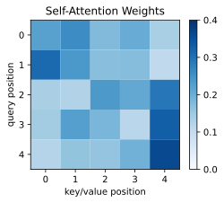
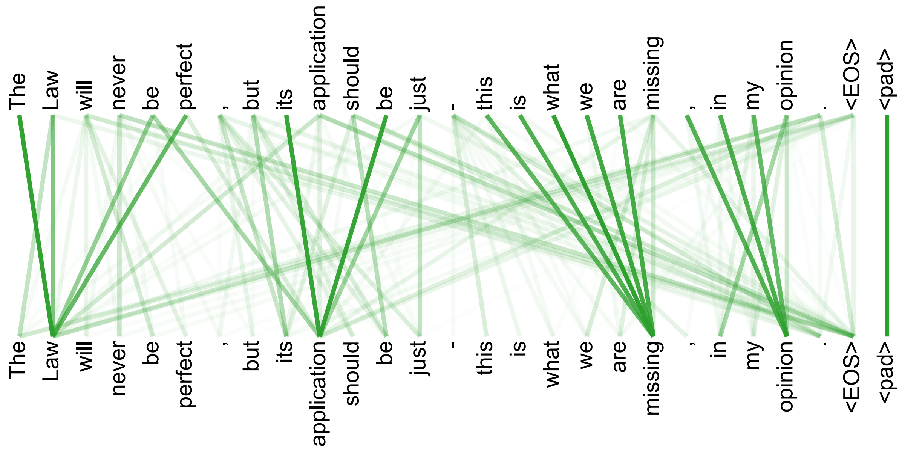

在上一节里，我们已经把 cross-attention 看成了一种跨序列的信息检索机制：一个序列负责提出 query，另一个序列负责提供 key 和 value。这样，目标序列中的某个位置就可以根据当前需求，去源序列中取回相关信息。

这一节我们讨论 **self-attention**。它使用的仍然是上一节介绍过的 scaled dot-product attention，因此我们不会再完整推导一遍公式。我们真正需要关注的是：当 query、key、value 不再来自两个不同序列，而是都来自同一个序列时，attention 的语义会发生什么变化？

简单来说，cross-attention 解决的是一个序列如何查询另一个序列，而 self-attention 解决的是一个序列如何查询自己。这看起来只是输入来源变了，但它带来的影响非常大：序列中的每个 token 都可以直接和其他 token 交互，从而根据上下文更新自己的表示。

这也是 Transformer 能够不用 RNN，也能处理序列信息的关键原因之一。

```{python}
import math

import matplotlib.pyplot as plt
import numpy as np
import torch
import torch.nn as nn
from torch import Tensor

plt.rc('savefig', dpi=300, bbox='tight')
print('PyTorch version:', torch.__version__)
```

## 8.3.1 从 Cross-Attention 到 Self-Attention

先回忆一下 cross-attention 的结构。假设有两个序列：查询序列 $X$ 和被查询序列 $Y$。在 cross-attention 中，query 来自 $X$，key 和 value 来自 $Y$：

$$
Q = XW_Q, \quad K = YW_K, \quad V = YW_V.
$$

也就是说，$X$ 中的每个位置会去查询 $Y$ 中的所有位置。机器翻译里的 Bahdanau attention 就是一个典型例子：decoder 根据当前状态去查询 encoder 的所有输出，也就是从源句中取回对当前生成最有用的信息。

Self-attention 和 cross-attention 的形式非常相似，只是 $Q$、$K$、$V$ 都由同一个输入序列 $X$ 得到：

$$
Q = XW_Q, \quad K = XW_K, \quad V = XW_V.
$$

这就是 self-attention 和 cross-attention 在形式上的核心区别。它的问题不再是目标词应该看源句中的哪些位置，而是一个 token 在理解自己时，应该参考同一句话里的哪些 token。

比如下面这个句子：

> The animal did not cross the street because it was tired.

当模型处理到 `it` 的时候，单看这个词本身几乎没有提供足够的信息。它到底指的是 `animal`，还是 `street`？这个判断必须依赖上下文。模型需要结合 `animal`、`street`、`tired` 等词之间的关系，才能更合理地更新 `it` 的表示。Self-attention 做的事情，就是让 `it` 这个位置直接去看整个句子里的其他位置，然后根据相关性聚合信息。这样，`it` 就不再只是一个孤立的代词，而是一个融合了上下文之后的表示。

所以，简单来说，self-attention 就是把 cross-attention 的动态检索思想搬到了序列内部：每个 token 都在问，为了更新我自己，我应该从这个序列里的哪些位置取回信息？

## 8.3.2 每个 token 如何获得上下文

Self-attention 最重要的作用，是为每个 token 生成一个属于自己的**上下文表示**。

普通词向量通常更像是一个相对固定的词义表示。例如 `bank` 这个词，不管出现在什么句子里，它一开始对应的 embedding 可能是同一个向量。但在真实语言里，`bank` 的含义会随着上下文变化：

> 1. I deposited money in the bank.
> 2. I sat by the river bank.

第一句话里的 `bank` 更接近银行，第二句话里的 `bank` 更接近河岸。如果模型只看 `bank` 自己，很难区分这两种含义。它必须结合周围的 `money`、`deposited`、`river` 等词，才能判断当前语境下应该如何理解这个词。

Self-attention 正是在做这件事。对于序列中的每个位置，它都会用自己的 query 去匹配整个序列中所有位置的 key，然后根据得到的权重聚合对应的 value。上一节已经讲过完整的 attention 公式，这里我们只强调它在 self-attention 中的语义：

- 当前 token 的 query 表示我现在需要什么上下文信息；
- 所有 token 的 key 表示我可以如何被匹配；
- 所有 token 的 value 表示如果我被关注，我能提供什么内容。

经过加权聚合之后，输出表示就会同时包含当前 token 自身的信息和它从上下文中取回的信息。

从这个角度看，self-attention 的输出不是每个 token 的独立表示，而是每个 token 在当前序列中的上下文表示。这也是它能够成为 Transformer 核心模块的原因。

## 8.3.3 Self-Attention 的 PyTorch 实现

由于上一节已经讲过 scaled dot-product attention，这里我们直接从实现角度看 self-attention。代码上，self-attention 和 cross-attention 非常像。真正的区别只有一个：cross-attention 的 `q` 来自一个序列，`k` 和 `v` 来自另一个序列；self-attention 的 `q`、`k`、`v` 都来自同一个输入 `x`。

下面是一个最小版本的 self-attention。这里先不考虑多头注意力，也不考虑 mask，只保留最核心的计算过程。

```{python}
class SelfAttention(nn.Module):
    def __init__(self, d_model: int, d_k: int | None = None, d_v: int | None = None):
        super().__init__()
        d_k = d_model if d_k is None else d_k
        d_v = d_model if d_v is None else d_v

        self.q_proj = nn.Linear(d_model, d_k)
        self.k_proj = nn.Linear(d_model, d_k)
        self.v_proj = nn.Linear(d_model, d_v)
        self.scale = math.sqrt(d_k)

    def forward(self, x: Tensor) -> tuple[Tensor, Tensor]:
        # x: (batch_size, seq_len, d_model)
        q = self.q_proj(x)  # (batch_size, seq_len, d_k)
        k = self.k_proj(x)  # (batch_size, seq_len, d_k)
        v = self.v_proj(x)  # (batch_size, seq_len, d_v)

        # scores: (batch_size, seq_len, seq_len)
        scores = q @ k.transpose(-2, -1) / self.scale

        # attn_weights: (batch_size, seq_len, seq_len)
        attn_weights = scores.softmax(dim=-1)

        # output: (batch_size, seq_len, d_v)
        output = attn_weights @ v

        return output, attn_weights
```

我们可以随便构造一个输入，看一下每个张量的形状：

```{python}
batch_size = 2
seq_len = 5
d_model = 8

x = torch.randn(batch_size, seq_len, d_model)
self_attn = SelfAttention(d_model)

with torch.inference_mode():
  output, attn_weights = self_attn(x)

print('input shape:', x.shape)
print('output shape:', output.shape)
print('attention weights shape:', attn_weights.shape)

fig = plt.figure(1, figsize=(4, 3))
ax = fig.add_subplot(1, 1, 1)
im = ax.pcolormesh(attn_weights[0], cmap='Blues', vmin=0, vmax=1)
ticks = np.arange(x.size(1))
ax.set_xticks(ticks + 0.5, ticks)
ax.set_yticks(ticks + 0.5, ticks)
ax.invert_yaxis()
ax.set_xlabel('key/value position')
ax.set_ylabel('query position')
ax.set_title('Self-Attention Weights')
ax.set_aspect('equal')
fig.colorbar(im)
fig.savefig('figures/ch8.3-self-attn-weights.svg')
plt.close(fig)
```

<figure class="figure" style="text-align: center;">
  
</figure>

这里最值得注意的是 `attention weights` 的形状。对于长度为 5 的序列，注意力权重矩阵是 $5 \times 5$。它的第 $i$ 行表示第 $i$ 个 token 在更新自己时，对整个序列中所有 token 分配的权重。对于 self-attention 来说，权重矩阵都是一个方阵，行列数都等于序列长度。

还有一个值得注意的点是，self-attention 不是只输出一个向量，而是为序列中的每个位置都输出一个新的表示，输入大小和输出大小都是 `(batch_size, seq_len, d_model)`。序列长度没有变，变的是每个位置的表示。每个 token 的向量都被上下文重新改写了。

## 8.3.4 Self-Attention 是一种动态信息图

除了上下文表示之外，理解 self-attention 还有一个很有用的视角：可以把它看成是在序列内部构造一张**动态信息图**。

在这张图里，每个 token 是一个节点。Self-attention 会让每个节点和其他所有节点建立连接，而连接的强弱由 attention 权重决定。对于一个长度为 $n$ 的序列，attention 权重矩阵就是一个 $n \times n$ 的矩阵，可以看成这张图的加权邻接矩阵。

这个视角和 RNN、CNN 的区别很明显。

RNN 的信息流更像一条链。第一个 token 的信息要影响很后面的 token，通常需要沿着隐藏状态一步一步传递；CNN 的信息流更像局部窗口。每一层只能让相邻位置交互，想要建立远距离联系，就需要堆叠多层卷积。

Self-attention 则更像一张完全图。理论上，每个位置在一层里就可以直接访问所有其他位置。不管两个词相隔多远，它们之间的信息路径长度都是 1。

更重要的是，这张图不是固定的，是根据当前输入动态计算出来的。同一个 token，在不同句子中可能会关注不同的位置。比如 `bank` 在金融语境下可能更关注 `money`、`deposited`，在自然环境语境下可能更关注 `river`、`sat`。这说明 self-attention 建立的不是一张静态图，而是一张**输入相关的动态信息图**。

<figure class="figure" style="text-align: center;">
  
  <figcaption>图 1：Self-Attention 动态信息示意图 [@vaswani2023Attention, fig. 5]</figcaption>
</figure>

这个观点可以帮助我们理解 self-attention 为什么灵活：它不是用固定结构去处理所有序列，而是让模型根据每个输入样本，自己决定哪些位置之间应该交换更多信息。

当然，我们可以可视化 attention map，帮助我们观察模型在某一层、某一个注意力头中更关注哪些位置。但是需要注意，attention map 权重并不等同于完整的模型解释，它只是 value 信息被加权聚合的一部分。最终输出还会受到多头注意力、残差连接、前馈网络、层归一化以及多层堆叠的共同影响。Attention map 可以作为理解模型行为的一个窗口，但不能简单地说权重高就一定说明模型是因为这个词才做出判断。关于 attention map 的解释性，我们后面会在 8.10 专门讨论。

## 8.3.5 Self-Attention 为什么适合建模序列

到这里，我们可以更清楚地看到 self-attention 为什么适合序列建模。

首先，它能直接建立长距离依赖。在 RNN 中，如果第 1 个 token 要影响第 100 个 token，信息需要经过很多个时间步传递。虽然 LSTM 和 GRU 通过门控机制缓解了这个问题，但路径仍然比较长。Self-attention 中，第 1 个 token 和第 100 个 token 可以在同一层直接交互，因此信息路径更短。

其次，它更容易并行。RNN 的第 $t$ 个隐藏状态依赖第 $t-1$ 个隐藏状态，所以训练时很难完全并行化。而 self-attention 先对所有 token 同时生成 $Q$、$K$、$V$，再通过矩阵乘法一次性计算所有位置之间的关系。这个过程非常适合 GPU 上的大规模并行计算。

最后，它不局限于局部窗口。CNN 在图像任务中很成功，因为局部结构非常重要。但在语言中，有些关系可能跨越很远的位置。CNN 需要通过多层堆叠逐渐扩大感受野，而 self-attention 一开始就允许任意两个位置交互。

我们可以粗略地对比一下三类结构：

|      结构      |        信息交互方式        |  长距离依赖   |  并行性  |
| :------------: | :-----------------------: | :----------: | :-----: |
|      CNN       | 通过局部窗口逐层扩大感受野  |  需要堆叠多层  |   较好   |
|      RNN       |      沿时间步逐步传递      |    路径较长    |   较差   |
| Self-Attention |    任意两个位置直接交互    |    路径很短    |   较好   |

:表 1：RNN、CNN 和 Self-Attention 的对比

这并不是说 self-attention 在所有方面都绝对优于 RNN 或 CNN，因为不同结构有不同的归纳偏置。RNN 天然适合按时间顺序处理序列，CNN 天然强调局部模式，而 self-attention 更强调全局交互和动态信息聚合。Transformer 的成功，很大程度上来自于 self-attention 的这种组合优势：它既能让所有位置直接交换信息，又能把计算写成适合硬件加速的矩阵运算。

## 8.3.6 Self-Attention 的局限

虽然 self-attention 很强，但它本身并不完美。理解它的局限，反而更容易理解后面 Transformer 为什么还需要其他组件。

第一个局限是它本身没有天然的顺序感。Attention 主要根据向量之间的匹配程度来分配权重。如果不给模型任何位置信息，那么它并不能自然地区分第一个词和第五个词。

比如：

> 1. dog bites man
> 2. man bites dog

这两个句子包含的词完全一样，但意思完全不同。如果模型只知道有哪些词，却不知道这些词的顺序，就很难正确理解句子。因此，Transformer 通常需要加入位置编码或位置嵌入，让模型知道每个 token 位于序列中的什么位置。

第二个局限是计算和显存开销。对于长度为 $n$ 的序列，self-attention 需要计算一个 $n \times n$ 的注意力矩阵。也就是说，序列越长，attention 的计算量和显存占用增长得越快。这对于普通长度的句子通常还可以接受，但对于长文档、高分辨率图像、视频或者多模态输入，$n^2$ 的开销会变得非常明显。后面很多高效的 attention 方法，比如 linear attention、sparse attention、sliding-window attention，以及我们后面会单独讨论的 flash attention，本质上都是在尝试缓解这个问题。

第三个局限是单个 attention 头的表达能力有限。一次 self-attention 只在一组 query、key、value 投影空间里计算相关性。可是，一个 token 和其他 token 的关系可能有很多种：有些关系偏语法，有些关系偏语义，有些关系和位置有关，有些关系和指代有关。如果只用一个注意力头，模型可能很难同时捕捉这些不同类型的关系。因此，Transformer 通常不会只使用单个 self-attention，而是使用**多头注意力（Multi-Head Attention, MHA）**。多头注意力可以让模型在多个子空间里并行地做 attention，每个头都有机会关注不同类型的信息。

这三个局限也提示我们：self-attention 虽然提供了序列内部信息交互的核心机制，但它还需要和其他设计配合，才能构成完整的 Transformer。位置编码会补充顺序信息，高效 attention 方法会尝试缓解长序列开销，而多头注意力则会让模型不只从一个角度观察序列。

## 8.3.7 本章小结

这一节里，我们把上一节介绍的 attention 机制应用到了同一个序列内部。和 cross-attention 不同，self-attention 中的 query、key 和 value 都来自同一个输入序列。因此，每个 token 不再只是孤立地表示自己，而是可以根据整段上下文重新更新自己的表示。

从这个角度看，self-attention 的核心作用不是简单地算一个加权和，而是在序列内部建立一种动态的信息交互机制。每个 token 都可以根据当前输入，决定自己应该从哪些位置获取信息，以及获取多少信息。正因为这种全局交互，self-attention 能够比 RNN 更直接地建模长距离依赖，也比普通 CNN 更容易让远距离位置发生联系。

不过，self-attention 本身仍然有局限。它没有天然的顺序感，需要位置编码来补充位置信息；它需要计算 $n \times n$ 的注意力矩阵，因此长序列下计算和显存开销较大；同时，单个 attention 头只能在一种投影空间里观察序列，表达能力也有限。下一节我们会沿着最后一点继续往前走，介绍**多头注意力**，看看模型如何从多个不同角度同时理解同一个序列。
