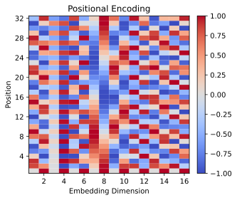
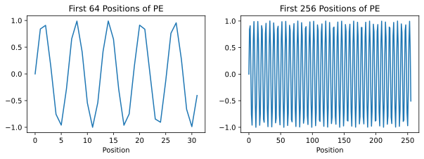

上一节里，我们已经看到 multi-head attention 为什么重要了。它让模型可以在多个不同的子空间里，同时学习多种不同的关注模式。但是，我们还有一个问题没有解决：

> **Attention 会看所有位置，那它怎么知道哪个 token 在前，哪个 token 在后？**

因为 self-attention 本身只关心 token 之间的相似度和加权汇总，它天然并不带有顺序这个概念。换句话说，如果我们只把一堆 token embedding 丢给 self-attention，而完全不告诉它位置，那么对模型来说，输入更像一个集合，而不是一个有先后顺序的序列。可语言显然不是无序集合：

- `dog bites man` 和 `man bites dog` 用的是同样的词，但意思完全不同；
- 在翻译里，词序常常直接影响语法关系；
- 在代码里，顺序更是决定程序语义的核心因素。

所以，如果 Transformer 想建模序列，它就必须显式地把位置信息注入进去。

这一节我们就来回答三个问题：

1. 为什么 self-attention 天然不感知顺序；
2. 位置编码到底在做什么；
3. 为什么原始 Transformer 会使用正弦位置编码。

```{python}
import matplotlib.pyplot as plt
import numpy as np
import torch
import torch.nn.functional as F
from torch import Tensor

plt.rc('savefig', dpi=300, bbox='tight')
print('PyTorch version:', torch.__version__)
```

## 8.4.1 Self-Attention：不带位置信息的编码

我们先看最基本的 self-attention 公式：

$$ Q = XW_Q, \quad K = XW_K, \quad V = XW_V $$

$$ O = \operatorname{softmax}\left(\frac{QK^\top}{\sqrt{d_k}}\right)V $$

这里的输入 $X$ 可以看成一串 token embedding 组成的矩阵。注意，在这个公式里，模型真正使用的只是每个位置的向量内容，以及它们之间的点积关系。公式里并没有任何一项显式表示“这是第 1 个 token”“这是第 5 个 token”。

这意味着，如果我们把输入序列整体打乱，同时把输出也按同样方式重新排列，那么 self-attention 的计算逻辑依然成立。也就是说，它对位置重排并没有天然的敏感性。这就是为什么很多人会说 self-attention 是 permutation-equivariant 的。

你可以先不用记这个术语，但要抓住背后的直觉：

> **如果不给位置编码，self-attention 看到的只是“有哪些 token”，而不是“这些 token 以什么顺序出现”。**

```{python}
def self_attention(X: Tensor, W_Q: Tensor, W_K: Tensor, W_V: Tensor):
    out = F.scaled_dot_product_attention(X @ W_Q, X @ W_K, X @ W_V)
    return out


X = torch.randn(4, 6)
W_Q = torch.randn(6, 4)
W_K = torch.randn(6, 4)
W_V = torch.randn(6, 4)

perm = torch.tensor([2, 0, 3, 1], dtype=torch.long)
X_perm = X[perm]

O = self_attention(X, W_Q, W_K, W_V)  # noqa: E741
O_perm = self_attention(X_perm, W_Q, W_K, W_V)

inv_perm = perm.argsort()
O_perm_back = O_perm[inv_perm]

fro_norm = torch.linalg.matrix_norm(O - O_perm_back, ord='fro')
max_err = (O - O_perm_back).abs().max()

print('After shuffling and restoring order:')
print('Frobenius error:', fro_norm.item())
print('Maximum absolute error:', max_err.item())
```

这个实验说明了一件很重要的事：如果输入只是 embedding 本身，那么 self-attention 不会自动学会第一个词和最后一个词之间的区别。对它来说，这些向量只是一些可以互相匹配的内容。所以，位置信息不是 Transformer 自带的属性，而是我们必须额外注入进去的。

## 8.4.2 位置编码的目的：提供顺序线索

既然 self-attention 本身不感知顺序，一个最直接的思路就是：

> **给每个位置配一个表示位置的向量，然后把它加到 token embedding 上。**

也就是说，如果第 $pos$ 个位置的 token embedding 是 $x_{pos}$，位置编码是 $p_{pos}$，那么真正送入 Transformer 的输入就是：

$$ z_{pos} = x_{pos} + p_{pos} $$

这样一来，即使两个位置上恰好出现了同一个词，它们进入模型后的表示也不再完全一样，因为附加的位置向量不同。

从这个角度看，位置编码做的事情并不复杂，它只是把“内容信息”和“位置信息”混合到同一个表示里。之后 self-attention 在做 Query、Key、Value 投影时，就可以同时利用这两类信息。

可能你会有疑问，为什么是加呢？不是拼接吗？或者其他什么操作？

这是因为，加法是一种在同一表示空间中融合内容信息与位置信息的简单而有效的方式。它不会改变向量维度，因此可以直接与后续 Transformer 结构兼容。

相比之下，如果使用乘法，位置编码会对原始 embedding 的各个维度进行缩放，可能造成某些信息被过度放大或抑制，从而干扰原本的语义表示；如果使用拼接，虽然也能保留位置信息，但会使输入维度增大，进而增加后续线性变换的参数量和计算开销，使模型结构变得更复杂。而且，根据分配律：

$$ W (x_{pos} + p_{pos}) = W x_{pos} + W p_{pos} $$

也就是说，即使表面上是加在一起，线性变换后依然可以分别处理“内容部分”和“位置部分”。所以加法已经足够表达了，没有必要为了分开存而付出额外维度和参数代价。

## 8.4.3 正弦位置编码：用多频率波形表示位置

在最初的 Transformer 论文 [@vaswani2023Attention] 里，位置编码并不是作为可学习参数直接训练出来的，而是使用了一组固定的正弦和余弦函数：

$$ PE_{(pos, 2i)} = \sin\left(\frac{pos}{10000^{2i / d_{model}}}\right) $$
$$ PE_{(pos, 2i + 1)} = \cos\left(\frac{pos}{10000^{2i / d_{model}}}\right) $$

第一次看到这个公式时，很多人都会觉得它有点“凭空出现”。为什么偏偏是正弦和余弦？为什么要用不同频率？

其实这里背后有两个很直观的考虑：

- 不同维度使用不同频率后，每个位置都会对应一组独特的波形组合。也就是说，不同位置可以被编码成彼此不同的向量。
- 正弦和余弦具有很强的平移结构。位置从 $pos$ 变成 $pos + k$ 时，新的编码可以由旧编码通过线性关系表达出来。也就是说，位置的相对偏移在编码空间中具有很强的规律性，这使模型更容易学习“两个 token 相距多远”这样的相对位置信息。

所以，正弦位置编码并不是随便拍脑袋选的，它本质上是在用一组多频率波形，把“位置”映射成一个连续、平滑、而且具有可外推性的向量表示。

```{python}
def positional_encoding(max_len: int, d_model: int) -> Tensor:
    emb = torch.zeros(max_len, d_model)
    position = torch.arange(max_len).unsqueeze(1)
    div_term = torch.arange(0, d_model, 2)
    div_term = torch.pow(10000.0, div_term / d_model)

    emb[:, 0::2] = torch.sin(position * div_term)
    emb[:, 1::2] = torch.cos(position * div_term)
    return emb


emb = positional_encoding(max_len=32, d_model=16)
fig = plt.figure(1, figsize=(5, 4))
ax = fig.add_subplot(1, 1, 1)
im = ax.pcolormesh(emb, vmin=-1, vmax=1, cmap='coolwarm')
xticks = np.arange(1, 16, 2)
yticks = np.arange(3, 32, 4)
ax.set_xticks(xticks + 0.5, xticks + 1)
ax.set_yticks(yticks + 0.5, yticks + 1)
ax.set_xlabel('Embedding Dimension')
ax.set_ylabel('Position')
ax.set_title('Positional Encoding')
fig.colorbar(im, pad=0.04)
fig.savefig('figures/ch8.4-positional-encoding.svg')
plt.close(fig)
```

<figure class="figure" style="text-align: center;">
  
</figure>

从这张图里我们可以直观看到，不同维度对应不同频率的波形：

- 低维变化得更快，能区分更细粒度的位置差异；
- 高维变化得更慢，能表示更大尺度的位置结构。

它们叠加在一起，就形成了一种多尺度的位置表示。

## 8.4.4 正弦位置编码的外推能力

正弦位置编码还有一个经典优点，就是它不是查表得到的离散参数，而是一个显式函数。这意味着，只要给定一个新的位置 $pos$，我们就可以直接把它的编码算出来，而不需要训练集中事先见过这个位置。

比如模型训练时只见过长度 128 的序列，但推理时遇到长度 256 的序列，只要编码公式还在，我们就依然能为位置 129 到 256 生成位置向量。这就是它常被提到的“外推性”。

当然，这里要注意一个现实问题：能算出位置编码，不代表模型一定真的能很好泛化到更长序列。因为泛化能力还取决于训练分布、模型容量和注意力模式本身。但至少从表示形式上讲，正弦位置编码没有被训练长度硬性截断。

```{python}
emb_long = positional_encoding(max_len=256, d_model=32)

fig = plt.figure(1, figsize=(10, 3))
ax = fig.add_subplot(1, 2, 1)
ax.plot(emb[:, 0])
ax.set_xlabel('Position')
ax.set_title('First 64 Positions of PE')
ax = fig.add_subplot(1, 2, 2)
ax.plot(emb_long[:, 0])
ax.set_xlabel('Position')
ax.set_title('First 256 Positions of PE')
fig.savefig('figures/ch8.4-pe-first64-vs-first256.svg')
plt.close(fig)
```

<figure class="figure" style="text-align: center;">
  
</figure>

从图上看，位置更长时编码并没有断掉，而是继续沿着函数规律延展。这正是显式函数编码和纯学习式查表编码之间一个很重要的区别。

## 8.4.5 后来的位置编码都一样吗？

也不是。原始 Transformer 的正弦位置编码只是最早、最经典的一种方案。后面还出现了很多不同做法，例如：

- 直接学习一张位置 embedding 表；
- 使用相对位置编码（Relative Positional Encoding）；
- 使用旋转位置编码（RoPE）；
- 针对长序列专门设计的位置偏置方案。

这些方法的共同目标都一样：让 attention 在匹配内容时，同时知道位置信息；但它们在“位置信息应该如何注入”这件事上，采用了不同设计。

所以，位置编码不是一个已经彻底固定死的模块，而是 Transformer 演化过程中非常活跃的一块。

## 8.4.6 本章小结

这一节里，我们把位置编码的动机和原理理顺了。

1. Self-attention 本身只建模内容间的匹配关系，不天然感知顺序；
2. 如果不给位置编码，Transformer 看到的更像是无序 token 集合；
3. 位置编码的作用，是把顺序信息显式注入输入表示；
4. 正弦位置编码用多频率正弦/余弦函数来表示位置，既平滑又具有一定外推性；
5. 把位置编码和词向量直接相加，是一种简单而高效的设计。

到这里，Transformer 输入端最关键的两个问题其实都解决了：

- 如何聚合上下文？靠 self-attention；
- 如何保留顺序信息？靠 positional encoding。

接下来，自然就可以继续往完整 Transformer 结构走了，比如残差连接、LayerNorm、前馈网络，以及整个 encoder/decoder block 是怎么串起来的。
